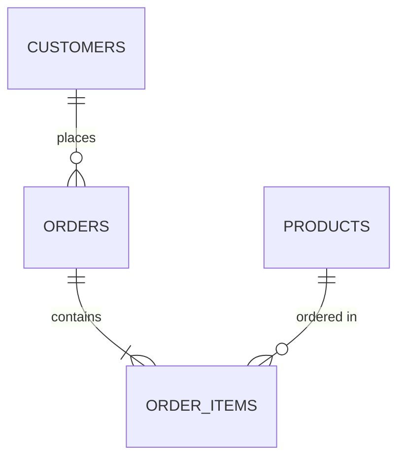

# MySQL Foreign Keys

## Introduction

In relational databases like MySQL, data is organized into multiple tables to minimize redundancy. However, these tables often need to work together to represent complex relationships. **Foreign keys** are the mechanism that allows you to establish and enforce relationships between tables in MySQL.

A foreign key is a column or group of columns in a table that refers to the primary key of another table. Foreign keys create what we call "referential integrity" - ensuring that relationships between tables remain consistent.

In this tutorial, we'll explore:
- What foreign keys are and why they're important
- How to create tables with foreign keys
- How to add foreign keys to existing tables
- Managing foreign key constraints
- Practical examples showing real-world applications

## Understanding Foreign Keys

### The Concept of Relationships

Before diving into foreign keys, let's understand why we need relationships between tables:



In this diagram:
- A customer can place multiple orders (one-to-many)
- An order can contain multiple order items (one-to-many)
- A product can appear in multiple order items (one-to-many)

Foreign keys allow us to implement these relationships in MySQL.

### Benefits of Foreign Keys

- **Data Integrity**: Prevents orphaned records (records with references to non-existent data)
- **Cascading Operations**: Automatic updates or deletions across related tables
- **Clear Structure**: Makes database relationships explicit and easier to understand
- **Optimization**: Helps the database engine optimize queries involving multiple tables

## Creating Tables with Foreign Keys

### Basic Syntax

The basic syntax for creating a foreign key when creating a new table is:

```sql
CREATE TABLE child_table (
    column_name data_type,
    ...
    FOREIGN KEY (column_name) REFERENCES parent_table(column_name)
);
```

### Example: Creating Related Tables

Let's create a simple database for an online bookstore with authors and books:

```sql
-- Create the authors table (parent table)
CREATE TABLE authors (
    author_id INT PRIMARY KEY AUTO_INCREMENT,
    first_name VARCHAR(50) NOT NULL,
    last_name VARCHAR(50) NOT NULL,
    birth_year INT
);

-- Create the books table (child table) with a foreign key
CREATE TABLE books (
    book_id INT PRIMARY KEY AUTO_INCREMENT,
    title VARCHAR(100) NOT NULL,
    publication_year INT,
    author_id INT,
    FOREIGN KEY (author_id) REFERENCES authors(author_id)
);
```

In this example, `author_id` in the `books` table is a foreign key that references the `author_id` column in the `authors` table.

## Adding Foreign Keys to Existing Tables

### Using ALTER TABLE

If you already have tables and want to add a foreign key relationship between them:

```sql
ALTER TABLE child_table
ADD FOREIGN KEY (column_name) REFERENCES parent_table(column_name);
```

### Example: Adding a Foreign Key to an Existing Table

Imagine we have separate `categories` and `books` tables, and we want to establish a relationship between them:

```sql
-- First, we create the categories table
CREATE TABLE categories (
    category_id INT PRIMARY KEY AUTO_INCREMENT,
    category_name VARCHAR(50) NOT NULL
);

-- Now add a category_id column to the books table
ALTER TABLE books
ADD COLUMN category_id INT;

-- Finally, create the foreign key relationship
ALTER TABLE books
ADD FOREIGN KEY (category_id) REFERENCES categories(category_id);
```

## Managing Foreign Key Constraints

### ON DELETE and ON UPDATE Clauses

When you create a foreign key, you can specify what happens when the parent record is updated or deleted:

```sql
FOREIGN KEY (column_name) 
REFERENCES parent_table(column_name)
ON DELETE action
ON UPDATE action
```

The possible actions are:

- `CASCADE`: Automatically delete or update the child records
- `SET NULL`: Set the foreign key column values to NULL
- `RESTRICT`: Prevent the deletion or update (default behavior)
- `NO ACTION`: Similar to RESTRICT
- `SET DEFAULT`: Set the foreign key column to its default value

### Example with Different Constraints

```sql
-- Create a publishers table
CREATE TABLE publishers (
    publisher_id INT PRIMARY KEY AUTO_INCREMENT,
    name VARCHAR(100) NOT NULL,
    founded_year INT
);

-- Add publisher relationship to books with cascading update
-- but prevent deletion if books exist
ALTER TABLE books
ADD COLUMN publisher_id INT,
ADD FOREIGN KEY (publisher_id) 
REFERENCES publishers(publisher_id)
ON UPDATE CASCADE
ON DELETE RESTRICT;
```

In this example:
- If a publisher's ID is updated, the change will cascade to all related books
- If someone tries to delete a publisher that has associated books, the operation will be prevented

## Practical Examples

### Example 1: Building an E-commerce Database

Let's build a simplified e-commerce database structure:

```sql
-- Customers table
CREATE TABLE customers (
    customer_id INT PRIMARY KEY AUTO_INCREMENT,
    first_name VARCHAR(50) NOT NULL,
    last_name VARCHAR(50) NOT NULL,
    email VARCHAR(100) UNIQUE NOT NULL
);

-- Orders table with foreign key to customers
CREATE TABLE orders (
    order_id INT PRIMARY KEY AUTO_INCREMENT,
    order_date TIMESTAMP DEFAULT CURRENT_TIMESTAMP,
    customer_id INT,
    total_amount DECIMAL(10, 2) NOT NULL,
    FOREIGN KEY (customer_id) 
    REFERENCES customers(customer_id)
    ON DELETE SET NULL
);

-- Products table
CREATE TABLE products (
    product_id INT PRIMARY KEY AUTO_INCREMENT,
    product_name VARCHAR(100) NOT NULL,
    price DECIMAL(10, 2) NOT NULL,
    stock_quantity INT NOT NULL DEFAULT 0
);

-- Order_items junction table with composite foreign keys
CREATE TABLE order_items (
    order_id INT,
    product_id INT,
    quantity INT NOT NULL,
    price_each DECIMAL(10, 2) NOT NULL,
    PRIMARY KEY (order_id, product_id),
    FOREIGN KEY (order_id) 
    REFERENCES orders(order_id)
    ON DELETE CASCADE,
    FOREIGN KEY (product_id) 
    REFERENCES products(product_id)
    ON DELETE RESTRICT
);
```

This structure establishes:
1. A customer can have multiple orders (one-to-many)
2. An order contains multiple products (many-to-many through order_items)
3. If a customer is deleted, their orders remain but with NULL customer_id
4. If an order is deleted, all associated order_items are deleted (CASCADE)
5. A product cannot be deleted if it exists in any order (RESTRICT)

### Example 2: Testing Foreign Key Constraints

Let's test our constraints with some data:

```sql
-- Insert sample data
INSERT INTO customers (first_name, last_name, email) 
VALUES ('John', 'Doe', 'john@example.com'),
       ('Jane', 'Smith', 'jane@example.com');

INSERT INTO products (product_name, price, stock_quantity)
VALUES ('Smartphone', 799.99, 20),
       ('Laptop', 1299.99, 15),
       ('Headphones', 99.99, 50);

-- Create an order for John
INSERT INTO orders (customer_id, total_amount) 
VALUES (1, 899.98);

-- Add items to John's order
INSERT INTO order_items (order_id, product_id, quantity, price_each)
VALUES (1, 1, 1, 799.99),  -- One smartphone
       (1, 3, 1, 99.99);   -- One headphones

-- Try to delete the smartphone product (should fail)
DELETE FROM products WHERE product_id = 1;
-- MySQL will return an error because the product is referenced in an order

-- Try to delete an order (should delete related order items)
DELETE FROM orders WHERE order_id = 1;
-- This will succeed and also delete the related records in order_items
```

## Common Issues and Solutions

### Foreign Key Errors

1. **Cannot add or update a child row**: This error occurs when you try to insert a value in the child table that doesn't exist in the parent table.

   **Solution**: Ensure the referenced value exists in the parent table first.

2. **Cannot delete or update a parent row**: This error occurs when you try to delete or update a row in the parent table that has dependent rows in the child table.

   **Solution**: Either delete the child rows first or use ON DELETE CASCADE if appropriate.

### Disabling Foreign Key Checks

Sometimes during data loading or testing, you might want to temporarily disable foreign key checks:

```sql
-- Disable foreign key checks
SET FOREIGN_KEY_CHECKS = 0;

-- Perform operations that might violate constraints
-- ...

-- Re-enable foreign key checks
SET FOREIGN_KEY_CHECKS = 1;
```

**Warning**: Use this with caution as it can lead to data integrity issues!

## Best Practices for Foreign Keys

1. **Always index foreign key columns**: This improves join performance.

   ```sql
   CREATE INDEX idx_books_author_id ON books(author_id);
   ```

2. **Use consistent data types**: The foreign key and the referenced primary key should have identical data types.

3. **Choose the right ON DELETE and ON UPDATE actions**: Consider carefully what should happen when parent records are modified.

4. **Name your constraints**: This makes troubleshooting easier.

   ```sql
   ALTER TABLE books
   ADD CONSTRAINT fk_books_authors 
   FOREIGN KEY (author_id) REFERENCES authors(author_id);
   ```

5. **Plan your database schema carefully**: Changing relationships in a production database is challenging.

## Summary

Foreign keys are essential for maintaining relationships between MySQL tables and ensuring data integrity. They allow you to:

- Connect related data across multiple tables
- Enforce referential integrity constraints
- Define what happens when parent records are updated or deleted
- Create a clear structure that represents real-world relationships

By properly implementing foreign keys, your database becomes more reliable, easier to maintain, and better reflects the entities and relationships of your business domain.

## Additional Resources and Exercises

### Exercises

1. Create a simple database for a school with tables for students, courses, and enrollments. Define appropriate foreign key relationships.

2. Experiment with different ON DELETE and ON UPDATE behaviors to see how they affect your data.

3. Try to create a circular reference between tables and understand why MySQL prevents this.

### Further Reading

- MySQL Documentation on [Foreign Key Constraints](https://dev.mysql.com/doc/refman/8.0/en/create-table-foreign-keys.html)
- Learn about database normalization to understand better table design
- Explore advanced topics like indexes on foreign keys for performance optimization

By mastering foreign keys, you're well on your way to creating robust, relational database designs that accurately model complex real-world data.