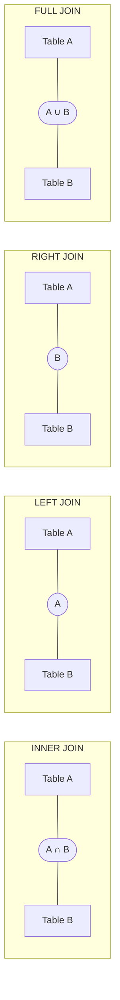

# MySQL Join Types

In relational databases like MySQL, joins are critical operations that allow you to combine data from multiple tables based on related columns. Understanding join types is fundamental to writing effective database queries and extracting meaningful information from your database.

## Introduction to Joins

Joins create a connection between two or more tables in a database, allowing you to retrieve data from these tables as if they were one. This is a fundamental concept in relational database design, where data is organized in separate tables to minimize redundancy.

Before diving into join types, let's create two sample tables that we'll use throughout this tutorial:

```sql
CREATE TABLE employees (
    employee_id INT PRIMARY KEY,
    first_name VARCHAR(50),
    last_name VARCHAR(50),
    department_id INT
);

CREATE TABLE departments (
    department_id INT PRIMARY KEY,
    department_name VARCHAR(50),
    location VARCHAR(50)
);

INSERT INTO employees VALUES 
(1, 'John', 'Doe', 1),
(2, 'Jane', 'Smith', 2),
(3, 'Michael', 'Johnson', 1),
(4, 'Sarah', 'Williams', 3),
(5, 'David', 'Brown', NULL);

INSERT INTO departments VALUES 
(1, 'IT', 'New York'),
(2, 'HR', 'Chicago'),
(3, 'Finance', 'Boston'),
(4, 'Marketing', 'San Francisco');
```

## Types of Joins in MySQL

MySQL supports several types of joins, each with its own use cases and behavior:

### 1. INNER JOIN

INNER JOIN returns records that have matching values in both tables. It only includes rows where the join condition is met.

#### Syntax:

```sql
SELECT columns
FROM table1
INNER JOIN table2
ON table1.column = table2.column;
```

#### Example:

```sql
SELECT e.employee_id, e.first_name, e.last_name, d.department_name
FROM employees e
INNER JOIN departments d ON e.department_id = d.department_id;
```

#### Output:

```
+-------------+------------+-----------+-----------------+
| employee_id | first_name | last_name | department_name |
+-------------+------------+-----------+-----------------+
| 1           | John       | Doe       | IT              |
| 2           | Jane       | Smith     | HR              |
| 3           | Michael    | Johnson   | IT              |
| 4           | Sarah      | Williams  | Finance         |
+-------------+------------+-----------+-----------------+
```

Notice that David Brown, who has a NULL department_id, is not included in the result set. Similarly, the Marketing department, which has no employees, is also not included.

### 2. LEFT JOIN (LEFT OUTER JOIN)

LEFT JOIN returns all records from the left table and the matched records from the right table. If no match is found, NULL values are returned for columns from the right table.

#### Syntax:

```sql
SELECT columns
FROM table1
LEFT JOIN table2
ON table1.column = table2.column;
```

#### Example:

```sql
SELECT e.employee_id, e.first_name, e.last_name, d.department_name
FROM employees e
LEFT JOIN departments d ON e.department_id = d.department_id;
```

#### Output:

```
+-------------+------------+-----------+-----------------+
| employee_id | first_name | last_name | department_name |
+-------------+------------+-----------+-----------------+
| 1           | John       | Doe       | IT              |
| 2           | Jane       | Smith     | HR              |
| 3           | Michael    | Johnson   | IT              |
| 4           | Sarah      | Williams  | Finance         |
| 5           | David      | Brown     | NULL            |
+-------------+------------+-----------+-----------------+
```

In this result, David Brown is included even though he doesn't have a matching department.

### 3. RIGHT JOIN (RIGHT OUTER JOIN)

RIGHT JOIN returns all records from the right table and the matched records from the left table. If no match is found, NULL values are returned for columns from the left table.

#### Syntax:

```sql
SELECT columns
FROM table1
RIGHT JOIN table2
ON table1.column = table2.column;
```

#### Example:

```sql
SELECT e.employee_id, e.first_name, e.last_name, d.department_name
FROM employees e
RIGHT JOIN departments d ON e.department_id = d.department_id;
```

#### Output:

```
+-------------+------------+-----------+-----------------+
| employee_id | first_name | last_name | department_name |
+-------------+------------+-----------+-----------------+
| 1           | John       | Doe       | IT              |
| 3           | Michael    | Johnson   | IT              |
| 2           | Jane       | Smith     | HR              |
| 4           | Sarah      | Williams  | Finance         |
| NULL        | NULL       | NULL      | Marketing       |
+-------------+------------+-----------+-----------------+
```

Here, the Marketing department is included even though it has no employees.

### 4. FULL JOIN (FULL OUTER JOIN)

MySQL doesn't directly support FULL JOIN, but you can simulate it using a combination of LEFT JOIN, UNION, and RIGHT JOIN.

#### Simulation:

```sql
SELECT e.employee_id, e.first_name, e.last_name, d.department_name
FROM employees e
LEFT JOIN departments d ON e.department_id = d.department_id
UNION
SELECT e.employee_id, e.first_name, e.last_name, d.department_name
FROM employees e
RIGHT JOIN departments d ON e.department_id = d.department_id
WHERE e.employee_id IS NULL;
```

#### Output:

```
+-------------+------------+-----------+-----------------+
| employee_id | first_name | last_name | department_name |
+-------------+------------+-----------+-----------------+
| 1           | John       | Doe       | IT              |
| 2           | Jane       | Smith     | HR              |
| 3           | Michael    | Johnson   | IT              |
| 4           | Sarah      | Williams  | Finance         |
| 5           | David      | Brown     | NULL            |
| NULL        | NULL       | NULL      | Marketing       |
+-------------+------------+-----------+-----------------+
```

This result includes all employees and all departments, regardless of whether there's a match.

### 5. CROSS JOIN

CROSS JOIN returns the Cartesian product of both tables, meaning every row from the first table is combined with every row from the second table.

#### Syntax:

```sql
SELECT columns
FROM table1
CROSS JOIN table2;
```

#### Example:

```sql
SELECT e.first_name, d.department_name
FROM employees e
CROSS JOIN departments d
LIMIT 10;  -- Limiting results for readability
```

#### Output (first 10 rows):

```
+------------+-----------------+
| first_name | department_name |
+------------+-----------------+
| John       | IT              |
| John       | HR              |
| John       | Finance         |
| John       | Marketing       |
| Jane       | IT              |
| Jane       | HR              |
| Jane       | Finance         |
| Jane       | Marketing       |
| Michael    | IT              |
| Michael    | HR              |
+------------+-----------------+
```

CROSS JOINs should be used carefully as they can produce very large result sets.

### 6. SELF JOIN

A SELF JOIN is not a distinct join type but a special case where a table is joined with itself.

#### Example:

Let's create an example with employees and their managers:

```sql
CREATE TABLE employees_with_managers (
    employee_id INT PRIMARY KEY,
    first_name VARCHAR(50),
    last_name VARCHAR(50),
    manager_id INT
);

INSERT INTO employees_with_managers VALUES 
(1, 'John', 'Doe', 3),
(2, 'Jane', 'Smith', 3),
(3, 'Michael', 'Johnson', 4),
(4, 'Sarah', 'Williams', NULL),
(5, 'David', 'Brown', 4);

SELECT e.first_name AS employee, m.first_name AS manager
FROM employees_with_managers e
LEFT JOIN employees_with_managers m ON e.manager_id = m.employee_id;
```

#### Output:

```
+-----------+-----------+
| employee  | manager   |
+-----------+-----------+
| John      | Michael   |
| Jane      | Michael   |
| Michael   | Sarah     |
| Sarah     | NULL      |
| David     | Sarah     |
+-----------+-----------+
```

## Practical Applications

### 1. Retrieving Customer Orders

```sql
SELECT c.customer_name, o.order_id, o.order_date, o.total_amount
FROM customers c
LEFT JOIN orders o ON c.customer_id = o.customer_id
ORDER BY c.customer_name;
```

This query returns all customers and their orders, including customers who haven't placed any orders yet.

### 2. Finding Products Without Categories

```sql
SELECT p.product_name, c.category_name
FROM products p
LEFT JOIN categories c ON p.category_id = c.category_id
WHERE c.category_id IS NULL;
```

This query identifies products that haven't been assigned to any category.

### 3. Department Performance Report

```sql
SELECT d.department_name,
       COUNT(e.employee_id) AS employee_count,
       AVG(e.salary) AS avg_salary
FROM departments d
LEFT JOIN employees e ON d.department_id = e.department_id
GROUP BY d.department_name;
```

This query creates a report showing each department, including those with no employees, along with employee counts and average salaries.

### 4. Finding Matching Records in Two Tables

```sql
SELECT p1.product_name, p2.product_name, p1.price
FROM products p1
INNER JOIN products p2 ON p1.price = p2.price AND p1.product_id != p2.product_id;
```

This self-join finds different products that have the same price.

## Visual Representation of Join Types

Here's a visual representation of how different joins work:



## Summary

In this tutorial, we've explored the various types of joins in MySQL:

- **INNER JOIN**: Returns records where there are matches in both tables
- **LEFT JOIN**: Returns all records from the left table and matched records from the right table
- **RIGHT JOIN**: Returns all records from the right table and matched records from the left table
- **FULL JOIN**: Returns all records when there is a match in either table (simulated in MySQL)
- **CROSS JOIN**: Returns the Cartesian product of both tables
- **SELF JOIN**: Joins a table to itself

Understanding these join types is essential for effectively querying relational databases and extracting meaningful information from multiple tables.

## Additional Exercises

1. Create tables for students, courses, and enrollments. Write queries to:
   - List all students and the courses they're enrolled in
   - Find students not enrolled in any course
   - Find courses with no enrolled students

2. Create tables for authors, books, and a junction table connecting them. Write a query to:
   - List all books with their authors
   - Find authors who haven't written any books
   - Find the author who has written the most books

3. Using the employees and departments tables, write a query to:
   - Find departments with more than 3 employees
   - List employees with their department names, sorted by department and then by last name
   - Count how many employees have no assigned department

## Additional Resources

- [MySQL Official Documentation on JOIN Syntax](https://dev.mysql.com/doc/refman/8.0/en/join.html)
- [MySQL Tutorial: Joins](https://www.mysqltutorial.org/mysql-joins/)
- [SQL Joins Visualizer](https://sql-joins.leopard.in.ua/)
- [W3Schools SQL JOIN Tutorial](https://www.w3schools.com/sql/sql_join.asp)

Understanding joins is a fundamental skill for working with relational databases, and mastering the different join types will greatly enhance your ability to extract meaningful information from your data.