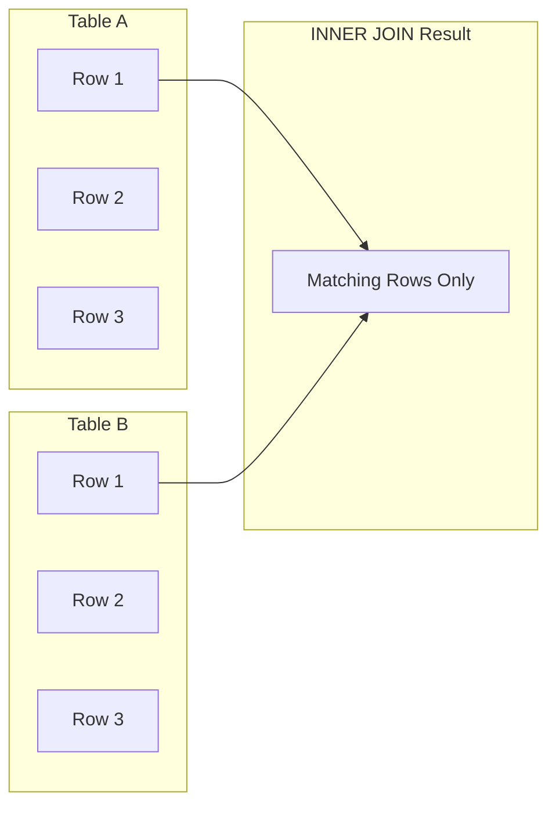

# MySQL INNER JOIN

## Introduction

When working with relational databases like MySQL, data is often distributed across multiple tables. This design minimizes data redundancy and improves data integrity. However, to retrieve meaningful information, you'll frequently need to combine data from multiple tables. This is where MySQL JOINs come in, with INNER JOIN being the most commonly used type.

An INNER JOIN combines rows from two or more tables when there is a match between the specified columns. If there's no match, the rows are excluded from the result set. It's like finding the intersection between two sets of data.

## Basic Syntax

The basic syntax for an INNER JOIN in MySQL is:

```sql
SELECT column_list
FROM table1
INNER JOIN table2 ON table1.column_name = table2.column_name;
```

You can also use the shorter form without the "INNER" keyword:

```sql
SELECT column_list
FROM table1
JOIN table2 ON table1.column_name = table2.column_name;
```

## How INNER JOIN Works

Let's understand how INNER JOIN works with a simple visualization:



An INNER JOIN returns only the rows where there's a match in both tables according to the specified join condition. If a row in the first table doesn't have a match in the second table (or vice versa), that row won't appear in the result set.

## Basic Example

Let's create two simple tables for our examples:

```sql
CREATE TABLE customers (
    customer_id INT PRIMARY KEY,
    customer_name VARCHAR(100),
    city VARCHAR(50)
);

CREATE TABLE orders (
    order_id INT PRIMARY KEY,
    customer_id INT,
    order_date DATE,
    amount DECIMAL(10,2)
);

INSERT INTO customers VALUES
(1, 'John Smith', 'New York'),
(2, 'Jane Doe', 'Los Angeles'),
(3, 'Bob Johnson', 'Chicago'),
(4, 'Alice Brown', 'Houston');

INSERT INTO orders VALUES
(101, 1, '2023-01-15', 150.50),
(102, 2, '2023-01-16', 275.25),
(103, 2, '2023-01-20', 120.75),
(104, 1, '2023-01-25', 500.00),
(105, 3, '2023-01-30', 225.50);
```

Now, let's write an INNER JOIN query to get a list of customers and their orders:

```sql
SELECT c.customer_name, o.order_id, o.order_date, o.amount
FROM customers c
INNER JOIN orders o ON c.customer_id = o.customer_id;
```

The result would be:

```
+--------------+---------+------------+--------+
| customer_name| order_id| order_date | amount |
+--------------+---------+------------+--------+
| John Smith   | 101     | 2023-01-15 | 150.50 |
| John Smith   | 104     | 2023-01-25 | 500.00 |
| Jane Doe     | 102     | 2023-01-16 | 275.25 |
| Jane Doe     | 103     | 2023-01-20 | 120.75 |
| Bob Johnson  | 105     | 2023-01-30 | 225.50 |
+--------------+---------+------------+--------+
```

Notice that `Alice Brown` (customer_id 4) doesn't appear in the result because she hasn't placed any orders yet. Similarly, if there was an order with a customer_id that didn't exist in the customers table, that order wouldn't appear in the results either.

## Multi-Table Joins

You can join more than two tables in a single query. Let's add a third table:

```sql
CREATE TABLE products (
    product_id INT PRIMARY KEY,
    product_name VARCHAR(100),
    unit_price DECIMAL(10,2)
);

CREATE TABLE order_items (
    order_id INT,
    product_id INT,
    quantity INT,
    PRIMARY KEY (order_id, product_id)
);

INSERT INTO products VALUES
(1, 'Laptop', 1200.00),
(2, 'Smartphone', 800.00),
(3, 'Headphones', 150.00),
(4, 'Tablet', 450.00);

INSERT INTO order_items VALUES
(101, 3, 2),
(101, 4, 1),
(102, 2, 1),
(103, 1, 1),
(104, 2, 2),
(104, 3, 3),
(105, 4, 1);
```

Now, let's write a query to get a list of customers, their orders, and the products they ordered:

```sql
SELECT 
    c.customer_name, 
    o.order_id, 
    o.order_date, 
    p.product_name, 
    oi.quantity,
    p.unit_price,
    (oi.quantity * p.unit_price) AS item_total
FROM 
    customers c
INNER JOIN 
    orders o ON c.customer_id = o.customer_id
INNER JOIN 
    order_items oi ON o.order_id = oi.order_id
INNER JOIN 
    products p ON oi.product_id = p.product_id
ORDER BY 
    c.customer_name, o.order_id;
```

The result might look like:

```
+--------------+---------+------------+-------------+----------+-----------+------------+
| customer_name| order_id| order_date | product_name| quantity | unit_price| item_total |
+--------------+---------+------------+-------------+----------+-----------+------------+
| Bob Johnson  | 105     | 2023-01-30 | Tablet      | 1        | 450.00    | 450.00     |
| Jane Doe     | 102     | 2023-01-16 | Smartphone  | 1        | 800.00    | 800.00     |
| Jane Doe     | 103     | 2023-01-20 | Laptop      | 1        | 1200.00   | 1200.00    |
| John Smith   | 101     | 2023-01-15 | Headphones  | 2        | 150.00    | 300.00     |
| John Smith   | 101     | 2023-01-15 | Tablet      | 1        | 450.00    | 450.00     |
| John Smith   | 104     | 2023-01-25 | Smartphone  | 2        | 800.00    | 1600.00    |
| John Smith   | 104     | 2023-01-25 | Headphones  | 3        | 150.00    | 450.00     |
+--------------+---------+------------+-------------+----------+-----------+------------+
```

## Using INNER JOIN with Aggregate Functions

INNER JOIN is often used with aggregate functions to summarize data. For example, to find the total amount spent by each customer:

```sql
SELECT 
    c.customer_id, 
    c.customer_name, 
    SUM(o.amount) AS total_spent
FROM 
    customers c
INNER JOIN 
    orders o ON c.customer_id = o.customer_id
GROUP BY 
    c.customer_id, c.customer_name
ORDER BY 
    total_spent DESC;
```

Result:

```
+------------+--------------+------------+
| customer_id| customer_name| total_spent|
+------------+--------------+------------+
| 1          | John Smith   | 650.50     |
| 2          | Jane Doe     | 396.00     |
| 3          | Bob Johnson  | 225.50     |
+------------+--------------+------------+
```

## Real-World Applications

### E-commerce Order Management

In an e-commerce application, you might need to generate an order summary report:

```sql
SELECT 
    o.order_id,
    o.order_date,
    c.customer_name,
    c.city,
    SUM(p.unit_price * oi.quantity) AS order_total,
    COUNT(DISTINCT oi.product_id) AS number_of_items
FROM 
    orders o
INNER JOIN 
    customers c ON o.customer_id = c.customer_id
INNER JOIN 
    order_items oi ON o.order_id = oi.order_id
INNER JOIN 
    products p ON oi.product_id = p.product_id
GROUP BY 
    o.order_id, o.order_date, c.customer_name, c.city
ORDER BY 
    o.order_date DESC;
```

### Human Resources Management

In an HR system, you might want to see which departments employees belong to:

```sql
SELECT 
    e.employee_id,
    e.first_name,
    e.last_name,
    d.department_name,
    l.city,
    l.country
FROM 
    employees e
INNER JOIN 
    departments d ON e.department_id = d.department_id
INNER JOIN 
    locations l ON d.location_id = l.location_id
ORDER BY 
    d.department_name, e.last_name, e.first_name;
```

### Financial Analysis

For financial analysis, you might join transaction data with account information:

```sql
SELECT 
    a.account_number,
    a.account_name,
    t.transaction_date,
    t.amount,
    t.transaction_type
FROM 
    accounts a
INNER JOIN 
    transactions t ON a.account_id = t.account_id
WHERE 
    t.transaction_date BETWEEN '2023-01-01' AND '2023-01-31'
ORDER BY 
    a.account_number, t.transaction_date;
```

## Common Mistakes and Troubleshooting

### 1. Missing Join Condition

If you forget to add the join condition, you'll get a Cartesian product (cross join), which returns every possible combination of rows from both tables.

```sql
-- Incorrect (missing ON clause)
SELECT c.customer_name, o.order_id
FROM customers c
INNER JOIN orders o;

-- Correct
SELECT c.customer_name, o.order_id
FROM customers c
INNER JOIN orders o ON c.customer_id = o.customer_id;
```

### 2. Column Ambiguity

When joining tables that have columns with the same name, you need to qualify which table you're referring to.

```sql
-- This will cause an ambiguous column error
SELECT customer_id, customer_name, order_date
FROM customers
INNER JOIN orders ON customers.customer_id = orders.customer_id;

-- Correct way
SELECT customers.customer_id, customer_name, order_date
FROM customers
INNER JOIN orders ON customers.customer_id = orders.customer_id;

-- Even better with table aliases
SELECT c.customer_id, c.customer_name, o.order_date
FROM customers c
INNER JOIN orders o ON c.customer_id = o.customer_id;
```

### 3. No Matching Data

If your INNER JOIN returns no rows, it means there are no matching rows between the tables based on your join condition. You might want to check:
- If your join condition is correct
- If there is actually matching data in both tables
- If you need to use a LEFT JOIN or RIGHT JOIN instead

## Performance Considerations

1. **Use indexes on join columns**: Make sure the columns used in the join condition are indexed for better performance.

2. **Join order matters**: In complex queries with multiple joins, the order of joins can affect performance. Generally, start with the most restrictive joins to reduce the intermediate result set.

3. **Avoid unnecessary columns**: Only select the columns you need, especially in queries with large tables.

4. **Consider query optimization**: For complex queries, use EXPLAIN to analyze and optimize your query execution plan.

## Summary

INNER JOIN is a fundamental SQL operation that combines rows from two or more tables based on a common column. Key points to remember:

- INNER JOIN returns only the rows where there's a match in both tables
- The join condition is specified in the ON clause
- Table aliases improve readability in complex queries
- You can join multiple tables in a single query
- INNER JOIN is often used with aggregate functions for data analysis

By mastering INNER JOIN, you'll be able to extract meaningful information from related tables in your database, which is essential for building data-driven applications.

## Practice Exercises

1. Create three tables: `students`, `courses`, and `enrollments`. Write an INNER JOIN query to find all students and the courses they're enrolled in.

2. Using the customers and orders tables from our examples, find the customers who have placed more than one order.

3. Write a query to find the most popular product (the product that appears in the most orders).

4. Write a multi-table join that includes four tables to generate a comprehensive order report.

## Additional Resources

- [MySQL Documentation on JOIN](https://dev.mysql.com/doc/refman/8.0/en/join.html)
- [Different Types of MySQL Joins](https://www.mysqltutorial.org/mysql-join/)
- [SQL Joins Visualization](https://sql-joins.leopard.in.ua/)

Practice is key to mastering INNER JOINs, so work through the exercises and experiment with your own data to solidify your understanding!