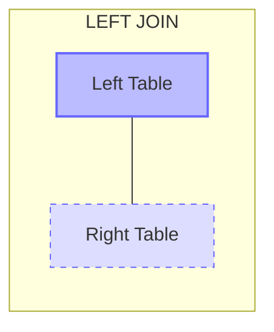

# MySQL LEFT JOIN

## Introduction

When working with relational databases, we often need to retrieve data from multiple tables simultaneously. MySQL provides several join types to accomplish this, and one of the most useful is the `LEFT JOIN`.

A `LEFT JOIN` allows you to combine rows from two or more tables based on a related column, but with an important distinction: it returns **all** records from the left table and only matching records from the right table. If there's no match in the right table, the result will contain `NULL` values for the right table's columns.

This join type is particularly useful when you need to include all records from one table regardless of whether they have corresponding matches in another table.

## LEFT JOIN Syntax

The basic syntax for a MySQL LEFT JOIN is:

```sql
SELECT columns
FROM table1
LEFT JOIN table2
ON table1.column = table2.column;
```

You can also use the explicit `LEFT OUTER JOIN` syntax, which is functionally identical:

```sql
SELECT columns
FROM table1
LEFT OUTER JOIN table2
ON table1.column = table2.column;
```

## Visual Representation of LEFT JOIN

Here's a visual representation of how LEFT JOIN works:



The solid circle represents all records returned from the left table, while the intersection with the dashed circle represents matches with the right table.

## Understanding LEFT JOIN with Examples

Let's explore LEFT JOIN with some practical examples. First, we'll create two simple tables:

```sql
CREATE TABLE customers (
    customer_id INT PRIMARY KEY,
    name VARCHAR(100),
    email VARCHAR(100)
);

CREATE TABLE orders (
    order_id INT PRIMARY KEY,
    customer_id INT,
    order_date DATE,
    amount DECIMAL(10, 2),
    FOREIGN KEY (customer_id) REFERENCES customers(customer_id)
);

-- Insert data into customers
INSERT INTO customers (customer_id, name, email) VALUES
(1, 'John Smith', 'john@example.com'),
(2, 'Jane Doe', 'jane@example.com'),
(3, 'Mike Johnson', 'mike@example.com'),
(4, 'Lisa Brown', 'lisa@example.com');

-- Insert data into orders
INSERT INTO orders (order_id, customer_id, order_date, amount) VALUES
(101, 1, '2023-01-10', 120.50),
(102, 3, '2023-01-15', 75.20),
(103, 1, '2023-01-20', 35.00),
(104, 2, '2023-01-25', 200.75);
```

### Basic LEFT JOIN Example

Let's retrieve all customers and their orders (if any):

```sql
SELECT c.customer_id, c.name, o.order_id, o.order_date, o.amount
FROM customers c
LEFT JOIN orders o
ON c.customer_id = o.customer_id;
```

Result:

```
customer_id | name          | order_id | order_date | amount
------------+---------------+----------+------------+--------
1           | John Smith    | 101      | 2023-01-10 | 120.50
1           | John Smith    | 103      | 2023-01-20 | 35.00
2           | Jane Doe      | 104      | 2023-01-25 | 200.75
3           | Mike Johnson  | 102      | 2023-01-15 | 75.20
4           | Lisa Brown    | NULL     | NULL       | NULL
```

Notice that Lisa Brown (customer_id = 4) appears in the result with NULL values for the order fields because she has no matching orders.

### Finding Customers Without Orders

One common use case for LEFT JOIN is identifying records in the left table that don't have corresponding records in the right table. This can be done by filtering for NULL values in the right table's columns:

```sql
SELECT c.customer_id, c.name, c.email
FROM customers c
LEFT JOIN orders o
ON c.customer_id = o.customer_id
WHERE o.order_id IS NULL;
```

Result:

```
customer_id | name        | email
------------+-------------+----------------
4           | Lisa Brown  | lisa@example.com
```

This query finds all customers who haven't placed any orders.

## Using LEFT JOIN with Multiple Tables

LEFT JOIN can be extended to work with multiple tables:

```sql
CREATE TABLE shipping (
    shipping_id INT PRIMARY KEY,
    order_id INT,
    shipping_date DATE,
    status VARCHAR(50),
    FOREIGN KEY (order_id) REFERENCES orders(order_id)
);

INSERT INTO shipping (shipping_id, order_id, shipping_date, status) VALUES
(501, 101, '2023-01-11', 'Delivered'),
(502, 102, '2023-01-16', 'In Transit'),
(503, 104, '2023-01-26', 'Processing');
```

Now let's join all three tables:

```sql
SELECT c.name, o.order_id, o.order_date, o.amount, 
       s.shipping_id, s.shipping_date, s.status
FROM customers c
LEFT JOIN orders o ON c.customer_id = o.customer_id
LEFT JOIN shipping s ON o.order_id = s.order_id;
```

Result:

```
name          | order_id | order_date | amount  | shipping_id | shipping_date | status
--------------+----------+------------+---------+-------------+---------------+----------
John Smith    | 101      | 2023-01-10 | 120.50  | 501         | 2023-01-11    | Delivered
John Smith    | 103      | 2023-01-20 | 35.00   | NULL        | NULL          | NULL
Jane Doe      | 104      | 2023-01-25 | 200.75  | 503         | 2023-01-26    | Processing
Mike Johnson  | 102      | 2023-01-15 | 75.20   | 502         | 2023-01-16    | In Transit
Lisa Brown    | NULL     | NULL       | NULL    | NULL        | NULL          | NULL
```

## Practical Real-World Examples

### Example 1: Customer Purchase Report

Generate a report showing all customers and their total purchase amounts, including customers who haven't made any purchases:

```sql
SELECT c.customer_id, c.name, 
       COUNT(o.order_id) AS total_orders, 
       COALESCE(SUM(o.amount), 0) AS total_spent
FROM customers c
LEFT JOIN orders o ON c.customer_id = o.customer_id
GROUP BY c.customer_id, c.name
ORDER BY total_spent DESC;
```

Result:

```
customer_id | name         | total_orders | total_spent
------------+--------------+--------------+------------
2           | Jane Doe     | 1            | 200.75
1           | John Smith   | 2            | 155.50
3           | Mike Johnson | 1            | 75.20
4           | Lisa Brown   | 0            | 0.00
```

### Example 2: Identifying Undelivered Orders

Find all orders and their shipping status, including orders that haven't been shipped:

```sql
SELECT o.order_id, o.order_date, c.name AS customer,
       o.amount, s.shipping_id, s.status
FROM orders o
JOIN customers c ON o.customer_id = c.customer_id
LEFT JOIN shipping s ON o.order_id = s.order_id
ORDER BY o.order_date;
```

Result:

```
order_id | order_date | customer      | amount  | shipping_id | status
---------+------------+---------------+---------+-------------+------------
101      | 2023-01-10 | John Smith    | 120.50  | 501         | Delivered
102      | 2023-01-15 | Mike Johnson  | 75.20   | 502         | In Transit
103      | 2023-01-20 | John Smith    | 35.00   | NULL        | NULL
104      | 2023-01-25 | Jane Doe      | 200.75  | 503         | Processing
```

Order #103 appears with NULL shipping information because it hasn't been shipped yet.

## LEFT JOIN vs. INNER JOIN

It's important to understand the difference between LEFT JOIN and INNER JOIN:

- **INNER JOIN**: Returns records that have matching values in both tables.
- **LEFT JOIN**: Returns all records from the left table and matched records from the right table.

Here's a comparison:

```sql
-- INNER JOIN (only matching records)
SELECT c.name, o.order_id
FROM customers c
INNER JOIN orders o ON c.customer_id = o.customer_id;

-- LEFT JOIN (all customers, even those without orders)
SELECT c.name, o.order_id
FROM customers c
LEFT JOIN orders o ON c.customer_id = o.customer_id;
```

The INNER JOIN will not include Lisa Brown because she has no orders, while the LEFT JOIN will include her with NULL for order_id.

## Common Pitfalls and Best Practices

### 1. Column Ambiguity

When columns in different tables have the same name, always use table aliases:

```sql
-- Good practice: qualified column names
SELECT c.customer_id, c.name, o.order_date
FROM customers c
LEFT JOIN orders o ON c.customer_id = o.customer_id;

-- Bad practice: ambiguous column names
SELECT customer_id, name, order_date  -- Which customer_id?
FROM customers
LEFT JOIN orders ON customers.customer_id = orders.customer_id;
```

### 2. Performance Considerations

LEFT JOINs can be resource-intensive, especially with large tables. Consider:

- Adding appropriate indexes on join columns
- Filtering data before joining when possible
- Using WHERE clauses efficiently

### 3. Handling NULL Values

When working with LEFT JOINs, properly handling NULL values is important:

```sql
-- Using COALESCE to replace NULL with a default value
SELECT c.name, COALESCE(o.order_id, 'No orders') AS order_info
FROM customers c
LEFT JOIN orders o ON c.customer_id = o.customer_id;
```

## Summary

MySQL's LEFT JOIN is a powerful tool for combining data from multiple tables while ensuring that all records from the left table are included in the results. Key points to remember:

1. LEFT JOIN returns all records from the left table and matching records from the right table
2. When there's no match in the right table, NULL values are used
3. It's useful for finding records in one table that don't have corresponding records in another
4. Multiple LEFT JOINs can be chained to connect several tables
5. Using proper table aliases helps avoid column ambiguity

## Practice Exercises

1. Create a query to list all customers and the total number of orders they've placed, ordered from most to least orders.
2. Write a query that finds all orders that haven't been shipped yet.
3. Create a report showing the total revenue per customer, including those who haven't made purchases.
4. Write a query that shows customers who placed orders in January but not in February.

## Additional Resources

- [MySQL Documentation on JOIN Syntax](https://dev.mysql.com/doc/refman/8.0/en/join.html)
- [Database Indexing for Join Performance](https://dev.mysql.com/doc/refman/8.0/en/optimization-indexes.html)
- [Understanding MySQL Query Execution Plans](https://dev.mysql.com/doc/refman/8.0/en/execution-plan-information.html)

By mastering LEFT JOIN, you've gained a crucial skill for database querying that will allow you to create more comprehensive and insightful reports from your data.