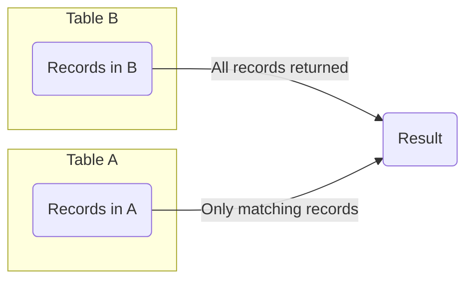

# MySQL RIGHT JOIN

## Introduction

In relational databases, data is often distributed across multiple tables to minimize redundancy and improve data integrity. However, to retrieve meaningful information, we frequently need to combine data from these tables. MySQL provides several types of JOIN operations to accomplish this, and in this tutorial, we'll focus on the **RIGHT JOIN** operation.

A **RIGHT JOIN** returns all records from the right table (the second table in the JOIN statement), and the matching records from the left table (the first table). If there is no match in the left table, the result will contain NULL values for columns from the left table.

## Understanding RIGHT JOIN Syntax

The basic syntax for a RIGHT JOIN in MySQL is:

```sql
SELECT column_list
FROM table1
RIGHT JOIN table2
ON table1.column = table2.column;
```

Let's break down this syntax:

- `SELECT column_list`: Specifies the columns you want to retrieve
- `FROM table1`: The first or "left" table in the JOIN
- `RIGHT JOIN table2`: The second or "right" table in the JOIN
- `ON table1.column = table2.column`: The condition that defines the relationship between the tables

## Visual Representation of RIGHT JOIN

The following diagram illustrates how a RIGHT JOIN works:



## Basic RIGHT JOIN Example

To understand RIGHT JOIN better, let's create two simple tables:

```sql
CREATE TABLE departments (
    department_id INT PRIMARY KEY,
    department_name VARCHAR(100)
);

CREATE TABLE employees (
    employee_id INT PRIMARY KEY,
    employee_name VARCHAR(100),
    department_id INT
);

-- Insert data into departments
INSERT INTO departments VALUES 
(1, 'HR'),
(2, 'IT'),
(3, 'Finance');

-- Insert data into employees
INSERT INTO employees VALUES 
(101, 'John Doe', 1),
(102, 'Jane Smith', 2),
(103, 'Michael Johnson', NULL),
(104, 'Emily Brown', 2);
```

Now, let's use a RIGHT JOIN to list all departments and the employees who work in them:

```sql
SELECT e.employee_id, e.employee_name, d.department_id, d.department_name
FROM employees e
RIGHT JOIN departments d ON e.department_id = d.department_id;
```

The result would be:

```
employee_id | employee_name   | department_id | department_name
-----------+----------------+--------------+----------------
101        | John Doe        | 1            | HR
102        | Jane Smith      | 2            | IT
104        | Emily Brown     | 2            | IT
NULL       | NULL            | 3            | Finance
```

Notice that Finance department appears in the result even though no employee is assigned to it (NULL values in employee columns). This is the key characteristic of a RIGHT JOIN - it includes ALL records from the right table regardless of matches in the left table.

## RIGHT JOIN vs LEFT JOIN

A RIGHT JOIN is essentially the reverse of a LEFT JOIN. In fact, any RIGHT JOIN can be rewritten as a LEFT JOIN by simply swapping the order of the tables:

```sql
-- Using RIGHT JOIN
SELECT e.employee_name, d.department_name
FROM employees e
RIGHT JOIN departments d ON e.department_id = d.department_id;

-- Equivalent query using LEFT JOIN
SELECT e.employee_name, d.department_name
FROM departments d
LEFT JOIN employees e ON d.department_id = e.department_id;
```

Both queries will produce the same result. Many SQL developers prefer to consistently use LEFT JOINs for readability and consistency, but understanding RIGHT JOINs is still important.

## Multiple Table RIGHT JOIN

RIGHT JOINs can be used with more than two tables. Let's add a third table to our example:

```sql
CREATE TABLE projects (
    project_id INT PRIMARY KEY,
    project_name VARCHAR(100),
    department_id INT
);

INSERT INTO projects VALUES 
(1001, 'Website Redesign', 2),
(1002, 'Employee Database', 1),
(1003, 'Budget Planning', 3),
(1004, 'Mobile App', NULL);
```

Now we can use RIGHT JOIN to get all projects and their associated departments and employees:

```sql
SELECT p.project_name, d.department_name, e.employee_name
FROM employees e
RIGHT JOIN departments d ON e.department_id = d.department_id
RIGHT JOIN projects p ON d.department_id = p.department_id;
```

This query will return all projects, with department and employee information where available.

## Real-world Applications of RIGHT JOIN

### 1. Inventory Management

Suppose you have a products table and a sales table, and you want to identify products that haven't been sold:

```sql
SELECT p.product_id, p.product_name, s.sale_id
FROM sales s
RIGHT JOIN products p ON s.product_id = p.product_id
WHERE s.sale_id IS NULL;
```

This query returns all products that don't have corresponding entries in the sales table.

### 2. Customer Order Analysis

To find all customers and their orders, including customers who haven't placed any orders:

```sql
SELECT c.customer_id, c.customer_name, o.order_id, o.order_date
FROM orders o
RIGHT JOIN customers c ON o.customer_id = c.customer_id;
```

This shows all customers, with order details for those who have placed orders and NULL values for those who haven't.

### 3. Employee Skills Database

To identify skills that aren't associated with any employee:

```sql
SELECT s.skill_name, e.employee_name
FROM employee_skills es
JOIN employees e ON es.employee_id = e.employee_id
RIGHT JOIN skills s ON es.skill_id = s.skill_id
WHERE e.employee_id IS NULL;
```

## Common Issues and Best Practices

### 1. NULL Values

RIGHT JOIN produces NULL values for the left table when there's no match. Always consider how your application will handle these NULL values.

```sql
-- Add a COALESCE function to replace NULL with a default value
SELECT 
    p.product_name, 
    COALESCE(s.sale_date, 'Not Sold Yet') AS sale_status
FROM sales s
RIGHT JOIN products p ON s.product_id = p.product_id;
```

### 2. Performance Considerations

JOINs, including RIGHT JOINs, can be resource-intensive, especially with large tables. Consider:

- Adding appropriate indexes on JOIN columns
- Limiting the result set when possible
- Using WHERE clauses before JOIN operations when applicable

### 3. Readability

For better readability in complex queries:

- Use table aliases consistently
- Format your SQL with proper indentation
- Add comments for complex JOIN logic
- Consider converting RIGHT JOINs to LEFT JOINs for consistency

## Summary

The MySQL RIGHT JOIN is a powerful tool for combining data from multiple tables with a focus on preserving all records from the right (second) table. While it functions as a mirror image of the more commonly used LEFT JOIN, it has specific use cases where it provides a clear and intuitive way to express queries.

Key points to remember:

1. RIGHT JOIN returns all records from the right table and matching records from the left table
2. When there's no match, NULL values appear for columns from the left table
3. Any RIGHT JOIN can be rewritten as a LEFT JOIN by swapping table order
4. RIGHT JOINs are particularly useful for finding records in one table that don't have corresponding matches in another table

## Practice Exercises

To reinforce your understanding of RIGHT JOIN, try these exercises:

1. Create tables for students, courses, and enrollments, then use RIGHT JOIN to find courses with no enrolled students
2. Use RIGHT JOIN to compare budget versus actual expenses across different departments
3. Implement a query that uses RIGHT JOIN to identify products that haven't been reviewed by customers
4. Convert a complex RIGHT JOIN query to an equivalent LEFT JOIN query

## Additional Resources

- [MySQL Documentation on JOIN Operations](https://dev.mysql.com/doc/refman/8.0/en/join.html)
- [SQL JOINs Visualizer](https://joins.spathon.com/)
- Practice MySQL JOIN operations on platforms like [SQLZoo](https://sqlzoo.net/) or [LeetCode](https://leetcode.com/)

By mastering RIGHT JOIN and other JOIN types, you'll be able to write more sophisticated and powerful queries to extract exactly the data you need from your MySQL database.