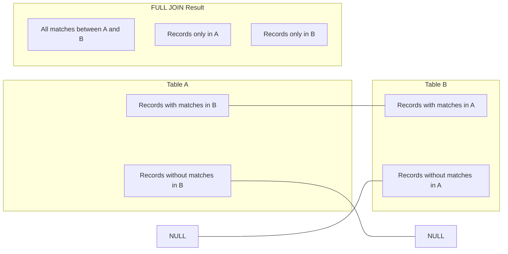

# MySQL FULL JOIN

## Introduction

In relational database management, joins are essential operations that allow you to combine data from multiple tables. While MySQL supports several types of joins like INNER JOIN, LEFT JOIN, and RIGHT JOIN, it does not directly support the FULL JOIN syntax that is available in some other database management systems like PostgreSQL or SQL Server.

A **FULL JOIN** (also called a FULL OUTER JOIN) returns all records from both tables, regardless of whether there are matching values. If there's no match, NULL values are returned for the columns from the table that doesn't have a matching row.

In this tutorial, we'll explore how to simulate a FULL JOIN in MySQL using alternative approaches, since MySQL doesn't natively support this operation.

## Understanding FULL JOIN

Before diving into the MySQL implementation, let's understand what a FULL JOIN is supposed to do:



A FULL JOIN returns:
1. All matching records from both tables
2. Records from the left table that have no match in the right table
3. Records from the right table that have no match in the left table

## Simulating FULL JOIN in MySQL

Since MySQL doesn't support FULL JOIN directly, we can simulate it using a combination of LEFT JOIN, RIGHT JOIN, and UNION:

```sql
SELECT a.*, b.*
FROM table_a a
LEFT JOIN table_b b ON a.key = b.key

UNION

SELECT a.*, b.*
FROM table_a a
RIGHT JOIN table_b b ON a.key = b.key
WHERE a.key IS NULL;
```

This approach:
1. Uses LEFT JOIN to get all records from table_a along with matching records from table_b
2. Uses RIGHT JOIN to get all records from table_b that don't have a match in table_a
3. Combines both results with UNION to eliminate duplicate rows

## Practical Example

Let's create two tables to demonstrate how to simulate a FULL JOIN in MySQL:

```sql
-- Create and populate the employees table
CREATE TABLE employees (
    employee_id INT PRIMARY KEY,
    employee_name VARCHAR(100),
    department_id INT
);

INSERT INTO employees VALUES
(1, 'John Smith', 101),
(2, 'Jane Doe', 102),
(3, 'Mike Johnson', 103),
(4, 'Sarah Williams', NULL);

-- Create and populate the departments table
CREATE TABLE departments (
    department_id INT PRIMARY KEY,
    department_name VARCHAR(100)
);

INSERT INTO departments VALUES
(101, 'HR'),
(102, 'Engineering'),
(104, 'Finance'),
(105, 'Marketing');
```

Now, let's simulate a FULL JOIN between these two tables:

```sql
-- Simulate FULL JOIN with UNION
SELECT e.employee_id, e.employee_name, e.department_id, d.department_name
FROM employees e
LEFT JOIN departments d ON e.department_id = d.department_id

UNION

SELECT e.employee_id, e.employee_name, d.department_id, d.department_name
FROM employees e
RIGHT JOIN departments d ON e.department_id = d.department_id
WHERE e.employee_id IS NULL;
```

### Output:

```
employee_id | employee_name   | department_id | department_name
---------------------------------------------------------------------------
1           | John Smith      | 101           | HR
2           | Jane Doe        | 102           | Engineering
3           | Mike Johnson    | 103           | NULL
4           | Sarah Williams  | NULL          | NULL
NULL        | NULL            | 104           | Finance
NULL        | NULL            | 105           | Marketing
```

### Explanation of the results:

1. **John Smith** and **Jane Doe** have matching department records
2. **Mike Johnson** has a department_id (103) that doesn't exist in the departments table
3. **Sarah Williams** has no department assigned (NULL)
4. The **Finance** and **Marketing** departments exist in the departments table but have no associated employees

## Using UNION ALL Instead of UNION

If you expect your data to have no overlapping rows between the LEFT JOIN and RIGHT JOIN parts, you can use `UNION ALL` instead of `UNION` for better performance:

```sql
SELECT e.employee_id, e.employee_name, e.department_id, d.department_name
FROM employees e
LEFT JOIN departments d ON e.department_id = d.department_id
WHERE d.department_id IS NULL

UNION ALL

SELECT e.employee_id, e.employee_name, d.department_id, d.department_name
FROM employees e
RIGHT JOIN departments d ON e.department_id = d.department_id;
```

However, this specific implementation will produce different results than a standard FULL JOIN. To get the exact behavior of a FULL JOIN with UNION ALL, you need a more complex query:

```sql
-- Get records only in the left table
SELECT e.*, d.*
FROM employees e
LEFT JOIN departments d ON e.department_id = d.department_id
WHERE d.department_id IS NULL

UNION ALL

-- Get matching records from both tables
SELECT e.*, d.*
FROM employees e
INNER JOIN departments d ON e.department_id = d.department_id

UNION ALL

-- Get records only in the right table
SELECT e.*, d.*
FROM employees e
RIGHT JOIN departments d ON e.department_id = d.department_id
WHERE e.employee_id IS NULL;
```

## Real-World Application: Order Analysis

Let's consider a real-world example where a FULL JOIN would be useful - analyzing orders and customers.

```sql
-- Create and populate the customers table
CREATE TABLE customers (
    customer_id INT PRIMARY KEY,
    customer_name VARCHAR(100),
    signup_date DATE
);

INSERT INTO customers VALUES
(1, 'Alex Brown', '2022-01-15'),
(2, 'Maria Garcia', '2022-02-20'),
(3, 'Robert Chen', '2022-03-10');

-- Create and populate the orders table
CREATE TABLE orders (
    order_id INT PRIMARY KEY,
    customer_id INT,
    order_date DATE,
    amount DECIMAL(10, 2)
);

INSERT INTO orders VALUES
(101, 1, '2022-04-05', 150.75),
(102, 4, '2022-04-10', 89.99),  -- Customer ID 4 doesn't exist
(103, 2, '2022-05-12', 245.50);
```

We can use our FULL JOIN simulation to find:
1. Active customers who have placed orders
2. Customers who haven't placed any orders yet
3. Orders that were placed by unregistered customers (data anomaly)

```sql
-- Simulate a FULL JOIN between customers and orders
SELECT c.customer_id, c.customer_name, c.signup_date, 
       o.order_id, o.order_date, o.amount
FROM customers c
LEFT JOIN orders o ON c.customer_id = o.customer_id

UNION

SELECT c.customer_id, c.customer_name, c.signup_date, 
       o.order_id, o.order_date, o.amount
FROM customers c
RIGHT JOIN orders o ON c.customer_id = o.customer_id
WHERE c.customer_id IS NULL;
```

### Output:

```
customer_id | customer_name | signup_date | order_id | order_date | amount
-------------------------------------------------------------------------
1           | Alex Brown    | 2022-01-15  | 101      | 2022-04-05 | 150.75
2           | Maria Garcia  | 2022-02-20  | 103      | 2022-05-12 | 245.50
3           | Robert Chen   | 2022-03-10  | NULL     | NULL       | NULL
NULL        | NULL          | NULL        | 102      | 2022-04-10 | 89.99
```

This output tells us:
- Alex and Maria are active customers who have placed orders
- Robert has signed up but hasn't placed any orders yet
- There's an order (ID 102) from a customer ID that doesn't exist in our customer table

This kind of analysis is invaluable for identifying data issues and understanding customer behavior.

## Performance Considerations

When simulating a FULL JOIN in MySQL:

- **UNION** eliminates duplicates, which requires additional sorting and comparison operations
- **UNION ALL** is faster but doesn't remove duplicates
- For large datasets, consider adding appropriate indexes on the join columns
- Test your queries on realistic data volumes to ensure acceptable performance

## Summary

While MySQL doesn't have a native FULL JOIN operation, we can effectively simulate it using a combination of LEFT JOIN, RIGHT JOIN, and UNION. This approach allows us to return all records from both tables, regardless of whether there are matching values.

The core pattern for simulating a FULL JOIN in MySQL is:

```sql
SELECT * FROM table_a a
LEFT JOIN table_b b ON a.key = b.key

UNION

SELECT * FROM table_a a
RIGHT JOIN table_b b ON a.key = b.key
WHERE a.key IS NULL;
```

Remember that FULL JOINs are useful when you need to see all possible combinations of rows from two tables, including those without matches on either side.

## Exercises

1. Create two tables representing `products` and `categories`, where some products might not belong to any category and some categories might not have any products. Write a query to simulate a FULL JOIN between these tables.

2. Modify the FULL JOIN simulation to include only non-matching rows from both tables (this is known as a "FULL OUTER JOIN EXCLUDING INNER JOIN" or sometimes as a "symmetric difference").

3. Create a query that counts how many records from each table in a simulated FULL JOIN have no matching records in the other table.

## Additional Resources

- [MySQL Documentation on JOIN Operations](https://dev.mysql.com/doc/refman/8.0/en/join.html)
- [MySQL UNION vs UNION ALL](https://dev.mysql.com/doc/refman/8.0/en/union.html)
- [Optimizing SQL Joins](https://dev.mysql.com/doc/refman/8.0/en/optimization-joins.html)

By understanding how to simulate a FULL JOIN, you've expanded your MySQL toolkit to handle more comprehensive data analysis scenarios, even with MySQL's native limitations.