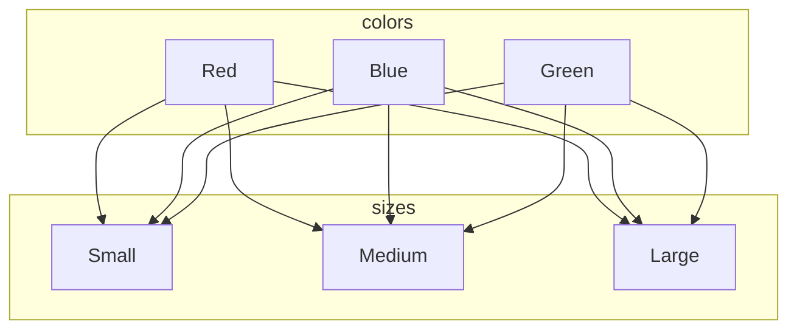

# MySQL CROSS JOIN

## Introduction

A **CROSS JOIN** in MySQL is a type of join that creates a Cartesian product of rows from the tables involved in the join. In simpler terms, it combines each row from the first table with every row from the second table, resulting in a table that has the number of rows equal to the product of the number of rows in the two tables.

While other joins like INNER JOIN or LEFT JOIN match rows based on common columns, a CROSS JOIN doesn't require a joining condition. It simply combines all rows from one table with all rows from another table.

## Syntax

The syntax for a CROSS JOIN in MySQL is straightforward:

```sql
SELECT columns
FROM table1
CROSS JOIN table2;
```

Alternatively, you can also use the following equivalent syntax:

```sql
SELECT columns
FROM table1, table2;
```

## How CROSS JOIN Works

Let's understand how CROSS JOIN works with a simple example:

Imagine we have two tables:

**Table: `colors`**
```
| color_id | color_name |
|----------|------------|
| 1        | Red        |
| 2        | Blue       |
| 3        | Green      |
```

**Table: `sizes`**
```
| size_id | size_name |
|---------|-----------|
| 1       | Small     |
| 2       | Medium    |
| 3       | Large     |
```

When we perform a CROSS JOIN between these tables:

```sql
SELECT * FROM colors CROSS JOIN sizes;
```

The result would be:

```
| color_id | color_name | size_id | size_name |
|----------|------------|---------|-----------|
| 1        | Red        | 1       | Small     |
| 1        | Red        | 2       | Medium    |
| 1        | Red        | 3       | Large     |
| 2        | Blue       | 1       | Small     |
| 2        | Blue       | 2       | Medium    |
| 2        | Blue       | 3       | Large     |
| 3        | Green      | 1       | Small     |
| 3        | Green      | 2       | Medium    |
| 3        | Green      | 3       | Large     |
```

As you can see, each row from the `colors` table is combined with every row from the `sizes` table, resulting in a total of 9 rows (3 colors × 3 sizes).

This can be visualized as follows:



## Common Use Cases

While CROSS JOIN might seem limited in practical applications due to the potentially large number of resulting rows, there are several scenarios where it proves useful:

### 1. Product Combinations

CROSS JOIN is perfect for generating all possible combinations of products. For instance, if you have a clothing store selling shirts in different colors and sizes, CROSS JOIN can help generate all possible combinations.

```sql
SELECT p.product_name, c.color_name, s.size_name
FROM products p
CROSS JOIN colors c
CROSS JOIN sizes s
WHERE p.product_type = 'shirt';
```

### 2. Date Ranges

When you need to generate a range of dates or create a calendar table:

```sql
SELECT 
    MAKEDATE(year.y, DAYOFYEAR(month.m) + day.d - 1) as generated_date
FROM 
    (SELECT 2023 as y) year
CROSS JOIN 
    (SELECT 1 as m UNION SELECT 2 UNION SELECT 3 UNION SELECT 4 
     UNION SELECT 5 UNION SELECT 6 UNION SELECT 7 UNION SELECT 8 
     UNION SELECT 9 UNION SELECT 10 UNION SELECT 11 UNION SELECT 12) month
CROSS JOIN 
    (SELECT 1 as d UNION SELECT 2 UNION SELECT 3 UNION SELECT 4 
     UNION SELECT 5 UNION SELECT 6 UNION SELECT 7 UNION SELECT 8 
     UNION SELECT 9 UNION SELECT 10 UNION SELECT 11 UNION SELECT 12 
     UNION SELECT 13 UNION SELECT 14 UNION SELECT 15 UNION SELECT 16 
     UNION SELECT 17 UNION SELECT 18 UNION SELECT 19 UNION SELECT 20 
     UNION SELECT 21 UNION SELECT 22 UNION SELECT 23 UNION SELECT 24 
     UNION SELECT 25 UNION SELECT 26 UNION SELECT 27 UNION SELECT 28 
     UNION SELECT 29 UNION SELECT 30 UNION SELECT 31) day
WHERE 
    MAKEDATE(year.y, DAYOFYEAR(month.m) + day.d - 1) BETWEEN '2023-01-01' AND '2023-12-31';
```

### 3. Multiplication Tables

Creating a multiplication table is a simple yet illustrative example of CROSS JOIN:

```sql
SELECT 
    a.number as multiplicand, 
    b.number as multiplier, 
    a.number * b.number as product
FROM 
    (SELECT 1 as number UNION SELECT 2 UNION SELECT 3 UNION SELECT 4 UNION SELECT 5) a
CROSS JOIN 
    (SELECT 1 as number UNION SELECT 2 UNION SELECT 3 UNION SELECT 4 UNION SELECT 5) b
ORDER BY 
    a.number, b.number;
```

This will generate a 5×5 multiplication table.

## Practical Example: Creating a Product Catalog

Let's create a more complex example that simulates a real-world scenario. Imagine we're building a product catalog for a furniture store.

First, let's create our sample tables:

```sql
-- Create tables
CREATE TABLE categories (
    category_id INT PRIMARY KEY,
    category_name VARCHAR(50)
);

CREATE TABLE materials (
    material_id INT PRIMARY KEY,
    material_name VARCHAR(50)
);

CREATE TABLE colors (
    color_id INT PRIMARY KEY,
    color_name VARCHAR(50)
);

-- Insert sample data
INSERT INTO categories VALUES (1, 'Chair'), (2, 'Table'), (3, 'Shelf');
INSERT INTO materials VALUES (1, 'Wood'), (2, 'Metal'), (3, 'Glass');
INSERT INTO colors VALUES (1, 'Natural'), (2, 'Black'), (3, 'White');
```

Now, we want to generate a comprehensive product catalog with all possible combinations:

```sql
SELECT 
    CONCAT(c.category_name, ' - ', m.material_name, ' - ', col.color_name) AS product_name,
    CASE 
        WHEN c.category_name = 'Chair' THEN 150
        WHEN c.category_name = 'Table' THEN 300
        WHEN c.category_name = 'Shelf' THEN 200
    END * CASE
        WHEN m.material_name = 'Wood' THEN 1.0
        WHEN m.material_name = 'Metal' THEN 1.2
        WHEN m.material_name = 'Glass' THEN 1.5
    END AS base_price,
    c.category_name, m.material_name, col.color_name
FROM 
    categories c
CROSS JOIN 
    materials m
CROSS JOIN 
    colors col
ORDER BY 
    c.category_name, m.material_name, col.color_name;
```

This query will generate all possible combinations of furniture types, materials, and colors, along with a calculated price based on the category and material type.

The result would be 27 rows (3 categories × 3 materials × 3 colors) representing all possible product variations in our catalog.

## Performance Considerations

Since a CROSS JOIN can generate a very large result set (especially with larger tables), there are some important performance considerations:

1. **Result Set Size**: Be careful when cross-joining large tables. The resulting table will have rows equal to the product of rows in each table.

2. **WHERE Clause**: Add appropriate WHERE clauses after the CROSS JOIN to limit the result set if you don't need all combinations.

3. **Memory Usage**: Large result sets can consume significant memory. Monitor your MySQL server's memory usage when executing complex CROSS JOIN queries.

4. **Indexes**: Indexes won't help improve the performance of the actual CROSS JOIN operation, but they can help with filtering in WHERE clauses applied after the join.

## CROSS JOIN vs. INNER JOIN with TRUE Condition

You might sometimes see developers using an INNER JOIN with a TRUE condition (like `1=1`) instead of a CROSS JOIN:

```sql
SELECT * FROM table1 INNER JOIN table2 ON 1=1;
```

While this achieves the same result as a CROSS JOIN, using the explicit CROSS JOIN syntax is preferred for clarity and readability.

## Summary

A MySQL CROSS JOIN creates a Cartesian product between two tables, combining each row from the first table with every row from the second table. While this can result in large datasets, CROSS JOINs are valuable in specific scenarios like generating product variations, date ranges, or other combinatorial data.

Key points to remember:
- CROSS JOIN doesn't require a joining condition
- The result set size is the product of rows in both tables
- Use it wisely as it can generate large result sets
- Consider performance implications when working with larger tables

## Practice Exercises

1. Create two tables: `fruits` (with names of 5 fruits) and `vitamins` (with names of 3 vitamins). Write a query to generate all possible combinations of fruits and vitamins.

2. Write a query to generate a calendar for the month of October 2023 using CROSS JOIN.

3. Create tables for a clothing store with shirts, pants, and accessories. Generate all possible outfit combinations using CROSS JOIN.

## Additional Resources

- [MySQL Documentation on JOINS](https://dev.mysql.com/doc/refman/8.0/en/join.html)
- [Understanding Cartesian Products in Database Theory](https://en.wikipedia.org/wiki/Cartesian_product)
- [Optimizing JOIN Performance in MySQL](https://dev.mysql.com/doc/refman/8.0/en/join-optimization.html)

Understanding CROSS JOIN gives you a powerful tool in your MySQL toolkit, especially when you need to generate combinations or work with multidimensional data. While it should be used carefully due to performance considerations, its applications in product catalogs, calendars, and combinatorial data make it an essential join type to master.