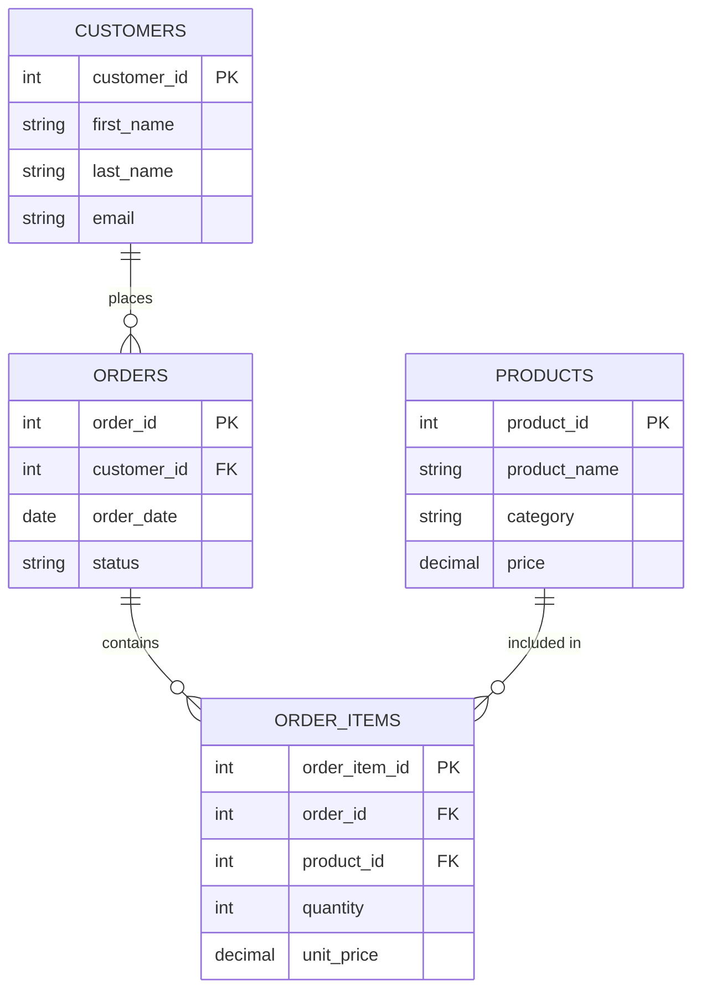
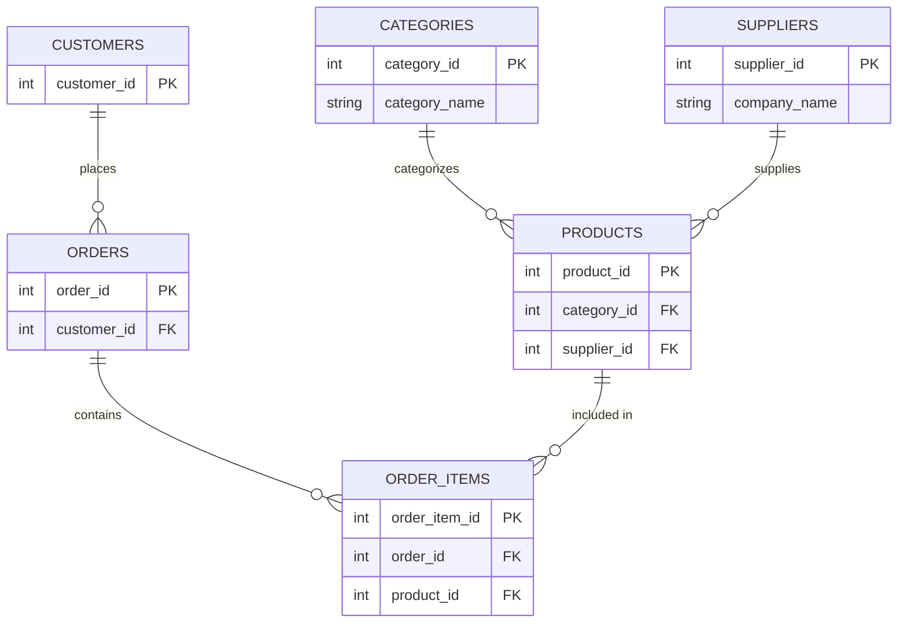

# MySQL Multiple Joins

In real-world database scenarios, you often need to retrieve data from more than just two tables. MySQL multiple joins allow you to combine three or more tables in a single query, enabling more complex data retrieval and analysis.

## Introduction to Multiple Joins

Multiple joins extend the concept of a simple join by connecting several tables together based on relationships between them. This is particularly useful in relational databases where data is distributed across multiple tables to minimize redundancy and improve data integrity.

A multiple join query follows this general structure:

```sql
SELECT columns
FROM table1
JOIN table2 ON table1.column = table2.column
JOIN table3 ON table2.column = table3.column
[JOIN additional_tables...]
WHERE conditions;
```

## Understanding the Need for Multiple Joins

Imagine a database for an online store with these tables:
- `customers` - customer details
- `orders` - order information
- `products` - product details
- `order_items` - links orders and products

To generate a report showing customer name, order date, product name, and quantity ordered, you would need to join all four tables.

## Types of Multiple Joins

You can combine different types of joins in a single query:

- Multiple INNER JOINs
- Combining INNER and OUTER JOINs (LEFT, RIGHT, FULL)
- Self-joins with other joins

Let's explore each of these with examples.

## Multiple INNER JOINs

The most common scenario is using multiple INNER JOINs to connect related tables.

### Example: Online Store Database

Consider our online store database schema:



To get a complete list of orders with customer and product details:

```sql
SELECT 
    c.first_name, 
    c.last_name, 
    o.order_id, 
    o.order_date,
    p.product_name,
    oi.quantity
FROM 
    customers c
INNER JOIN 
    orders o ON c.customer_id = o.customer_id
INNER JOIN 
    order_items oi ON o.order_id = oi.order_id
INNER JOIN 
    products p ON oi.product_id = p.product_id
ORDER BY 
    o.order_date DESC;
```

**Sample Output:**

```
first_name | last_name | order_id | order_date | product_name   | quantity
-----------|-----------|----------|------------|----------------|----------
John       | Doe       | 1001     | 2023-06-15 | Laptop         | 1
John       | Doe       | 1001     | 2023-06-15 | Mouse          | 2
Mary       | Smith     | 1002     | 2023-06-16 | Keyboard       | 1
Robert     | Johnson   | 1003     | 2023-06-17 | Monitor        | 2
Robert     | Johnson   | 1003     | 2023-06-17 | HDMI Cable     | 3
```

## Combining INNER and OUTER Joins

Sometimes you need to use different types of joins in the same query to handle missing matches appropriately.

### Example: Including Customers without Orders

If we want to list all customers including those who haven't placed any orders:

```sql
SELECT 
    c.customer_id, 
    c.first_name, 
    c.last_name, 
    o.order_id, 
    p.product_name
FROM 
    customers c
LEFT JOIN 
    orders o ON c.customer_id = o.customer_id
LEFT JOIN 
    order_items oi ON o.order_id = oi.order_id
LEFT JOIN 
    products p ON oi.product_id = p.product_id
ORDER BY 
    c.customer_id;
```

**Sample Output:**

```
customer_id | first_name | last_name | order_id | product_name
------------|------------|-----------|----------|-------------
1           | John       | Doe       | 1001     | Laptop
1           | John       | Doe       | 1001     | Mouse
2           | Mary       | Smith     | 1002     | Keyboard
3           | Robert     | Johnson   | 1003     | Monitor
3           | Robert     | Johnson   | 1003     | HDMI Cable
4           | Jane       | Williams  | NULL     | NULL
```

## Complex Multiple Join Example

Let's consider a more complex example involving an e-commerce database that includes categories and suppliers for a detailed product report.

### Extended Schema:



Here's a comprehensive query using multiple joins to get a complete product sales report:

```sql
SELECT 
    c.first_name, 
    c.last_name,
    o.order_id, 
    o.order_date,
    p.product_name,
    cat.category_name,
    s.company_name AS supplier,
    oi.quantity,
    oi.unit_price,
    (oi.quantity * oi.unit_price) AS total_amount
FROM 
    customers c
INNER JOIN 
    orders o ON c.customer_id = o.customer_id
INNER JOIN 
    order_items oi ON o.order_id = oi.order_id
INNER JOIN 
    products p ON oi.product_id = p.product_id
INNER JOIN 
    categories cat ON p.category_id = cat.category_id
INNER JOIN 
    suppliers s ON p.supplier_id = s.supplier_id
WHERE 
    o.order_date BETWEEN '2023-01-01' AND '2023-12-31'
ORDER BY 
    o.order_date, c.last_name;
```

## Best Practices for Multiple Joins

When working with multiple joins, follow these best practices:

1. **Use table aliases** - Short, meaningful aliases make queries easier to read
2. **Join order matters** - Start with the main table and join related tables logically
3. **Be mindful of performance** - Multiple joins can be resource-intensive
4. **Use appropriate join types** - Choose the right join type for your data requirements
5. **Limit the number of joins** - Try to keep joins to a reasonable number (usually under 5-6)

## Common Challenges with Multiple Joins

### 1. Cartesian Products

Be careful to specify correct join conditions to avoid inadvertent cartesian products, which multiply rows exponentially:

```sql
-- Problematic query that might create a cartesian product
SELECT * FROM table1, table2, table3; -- Missing JOIN conditions
```

### 2. Ambiguous Column Names

When tables share column names, always qualify them with table aliases:

```sql
SELECT 
    c.customer_id,  -- Qualified with table alias
    o.order_date
FROM 
    customers c
JOIN 
    orders o ON c.customer_id = o.customer_id;
```

### 3. Performance Considerations

Multiple joins can affect query performance. Consider:

- Using indexes on join columns
- Limiting the result set with WHERE clauses before joining
- Using EXPLAIN to analyze query execution plans

## Practical Real-World Example: Sales Analysis

Let's create a comprehensive sales analysis report that combines multiple tables:

```sql
SELECT 
    DATE_FORMAT(o.order_date, '%Y-%m') AS month,
    cat.category_name,
    SUM(oi.quantity * oi.unit_price) AS total_sales,
    COUNT(DISTINCT o.order_id) AS order_count,
    COUNT(DISTINCT c.customer_id) AS customer_count
FROM 
    orders o
INNER JOIN 
    customers c ON o.customer_id = c.customer_id
INNER JOIN 
    order_items oi ON o.order_id = oi.order_id
INNER JOIN 
    products p ON oi.product_id = p.product_id
INNER JOIN 
    categories cat ON p.category_id = cat.category_id
WHERE 
    o.order_date BETWEEN '2023-01-01' AND '2023-12-31'
GROUP BY 
    month, cat.category_name
ORDER BY 
    month, total_sales DESC;
```

This query provides monthly sales by product category, helping business analysts identify trends and make data-driven decisions.

## Self-Join Combined with Other Joins

Sometimes you need to combine a self-join with other joins. For example, to find employees and their managers along with department info:

```sql
SELECT 
    e.employee_name AS employee,
    m.employee_name AS manager,
    d.department_name
FROM 
    employees e
LEFT JOIN 
    employees m ON e.manager_id = m.employee_id
INNER JOIN 
    departments d ON e.department_id = d.department_id
ORDER BY 
    d.department_name, e.employee_name;
```

## Summary

Multiple joins are a powerful feature in MySQL that allow you to:

- Combine data from three or more tables in a single query
- Create complex reports drawing from various related tables
- Analyze relationships across your database schema
- Mix different join types to handle complex data requirements

By mastering multiple joins, you can write sophisticated queries that unlock insights from your relational database without having to perform multiple separate queries or post-processing.

## Practice Exercises

To solidify your understanding of multiple joins, try these exercises:

1. Write a query to list all customers, their orders, and the products they ordered, including customers who haven't placed any orders.

2. Create a report showing the total quantity and value of each product sold, including product category and supplier information.

3. Generate a monthly sales report for the past year, broken down by product category and customer region.

## Additional Resources

- [MySQL Documentation on JOINs](https://dev.mysql.com/doc/refman/8.0/en/join.html)
- [MySQL Query Optimization Guide](https://dev.mysql.com/doc/refman/8.0/en/optimization.html)
- [Database Normalization and Joins](https://www.mysqltutorial.org/mysql-database-design/)

By practicing multiple joins and studying these concepts, you'll be well-equipped to handle complex data requirements in your database applications.