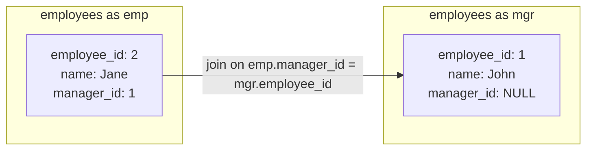

# MySQL Self Joins

## Introduction

A self join is a regular join operation where a table is joined with itself. This type of join is useful when you need to compare rows within the same table or when working with hierarchical data structures stored in a single table.

Self joins can be confusing initially, but they're powerful for solving specific problems like finding relationships between items in the same table (e.g., employees and their managers, categories and subcategories, etc.).

In this tutorial, we'll explore:
- What self joins are and why they're useful
- How to write self join queries
- Common use cases for self joins
- Tips for writing efficient self join queries

## Understanding Self Joins

### What is a Self Join?

A self join is when you join a table to itself. To perform a self join, you need to:

1. Reference the same table twice using different aliases
2. Specify the join condition that relates rows within the table to each other

Here's the basic syntax:

```sql
SELECT column_list
FROM table_name t1
JOIN table_name t2
ON t1.common_field = t2.common_field;
```

In this syntax:
- `table_name t1` and `table_name t2` are the same table with different aliases
- `t1` and `t2` are table aliases to distinguish between the two instances of the table
- The join condition relates rows within the same table to each other

## Basic Self Join Example

Let's create a simple `employees` table to demonstrate self joins:

```sql
CREATE TABLE employees (
    employee_id INT PRIMARY KEY,
    name VARCHAR(100),
    manager_id INT,
    job_title VARCHAR(100)
);

INSERT INTO employees VALUES
(1, 'John Smith', NULL, 'CEO'),
(2, 'Jane Doe', 1, 'CTO'),
(3, 'Michael Johnson', 1, 'CFO'),
(4, 'Emily Brown', 2, 'Tech Lead'),
(5, 'David Wilson', 2, 'Senior Developer'),
(6, 'Sarah Miller', 4, 'Developer'),
(7, 'Robert Taylor', 4, 'Developer');
```

Now, let's perform a self join to find each employee and their manager:

```sql
SELECT 
    emp.employee_id,
    emp.name AS employee_name,
    emp.job_title AS employee_title,
    mgr.name AS manager_name,
    mgr.job_title AS manager_title
FROM 
    employees emp
LEFT JOIN 
    employees mgr ON emp.manager_id = mgr.employee_id
ORDER BY 
    emp.employee_id;
```

**Output:**

```
employee_id | employee_name   | employee_title    | manager_name  | manager_title
------------|-----------------|-------------------|---------------|---------------
1           | John Smith      | CEO               | NULL          | NULL
2           | Jane Doe        | CTO               | John Smith    | CEO
3           | Michael Johnson | CFO               | John Smith    | CEO
4           | Emily Brown     | Tech Lead         | Jane Doe      | CTO
5           | David Wilson    | Senior Developer  | Jane Doe      | CTO
6           | Sarah Miller    | Developer         | Emily Brown   | Tech Lead
7           | Robert Taylor   | Developer         | Emily Brown   | Tech Lead
```

### How This Query Works

1. We aliased the `employees` table as `emp` for employee data and `mgr` for manager data
2. We joined the table to itself using `LEFT JOIN` because the CEO has no manager (`NULL` manager_id)
3. The join condition `emp.manager_id = mgr.employee_id` connects employees to their managers
4. Each row now shows both employee details and their corresponding manager's details

## Self Join with INNER JOIN

If we only want to see employees that have managers (excluding the CEO), we can use an INNER JOIN:

```sql
SELECT 
    emp.employee_id,
    emp.name AS employee_name,
    mgr.name AS manager_name
FROM 
    employees emp
INNER JOIN 
    employees mgr ON emp.manager_id = mgr.employee_id
ORDER BY 
    emp.employee_id;
```

**Output:**

```
employee_id | employee_name   | manager_name
------------|-----------------|-------------
2           | Jane Doe        | John Smith
3           | Michael Johnson | John Smith
4           | Emily Brown     | Jane Doe
5           | David Wilson    | Jane Doe
6           | Sarah Miller    | Emily Brown
7           | Robert Taylor   | Emily Brown
```

## Practical Use Cases for Self Joins

### 1. Finding Employees Who Report to the Same Manager

Let's find colleagues who share the same manager:

```sql
SELECT 
    e1.name AS employee_1,
    e2.name AS employee_2,
    m.name AS manager_name
FROM 
    employees e1
JOIN 
    employees e2 ON e1.manager_id = e2.manager_id AND e1.employee_id < e2.employee_id
JOIN 
    employees m ON e1.manager_id = m.employee_id
ORDER BY 
    manager_name, employee_1, employee_2;
```

**Output:**

```
employee_1     | employee_2    | manager_name
---------------|---------------|-------------
Jane Doe       | Michael Johnson | John Smith
David Wilson   | Emily Brown   | Jane Doe
Sarah Miller   | Robert Taylor | Emily Brown
```

Note: We use `e1.employee_id < e2.employee_id` to avoid duplicate pairs (e.g., to prevent showing both "Jane and Michael" and "Michael and Jane" as pairs).

### 2. Finding Hierarchical Paths

Let's create a query to find all employees under a specific manager at any level in the organization:

```sql
WITH RECURSIVE employee_hierarchy AS (
    -- Base case: the starting manager
    SELECT employee_id, name, manager_id, 1 AS level
    FROM employees
    WHERE name = 'Jane Doe'
    
    UNION ALL
    
    -- Recursive case: find employees who report to someone in our result set
    SELECT e.employee_id, e.name, e.manager_id, eh.level + 1
    FROM employees e
    JOIN employee_hierarchy eh ON e.manager_id = eh.employee_id
)
SELECT 
    employee_id,
    name,
    level
FROM 
    employee_hierarchy
ORDER BY 
    level, name;
```

**Output:**

```
employee_id | name          | level
------------|---------------|------
2           | Jane Doe      | 1
4           | Emily Brown   | 2
5           | David Wilson  | 2
6           | Sarah Miller  | 3
7           | Robert Taylor | 3
```

This query uses a Common Table Expression (CTE) with recursion to traverse the employee hierarchy starting from Jane Doe.

### 3. Product Recommendations

Self joins are also useful for product recommendations. Let's create a table with product data:

```sql
CREATE TABLE products (
    product_id INT PRIMARY KEY,
    name VARCHAR(100),
    category VARCHAR(50)
);

CREATE TABLE product_pairs (
    product1_id INT,
    product2_id INT,
    pair_count INT, -- how many times these products were purchased together
    PRIMARY KEY (product1_id, product2_id)
);

INSERT INTO products VALUES
(1, 'Laptop', 'Electronics'),
(2, 'Mouse', 'Electronics'),
(3, 'Keyboard', 'Electronics'),
(4, 'Monitor', 'Electronics'),
(5, 'Desk', 'Furniture'),
(6, 'Chair', 'Furniture');

INSERT INTO product_pairs VALUES
(1, 2, 100), -- Laptop and Mouse purchased together 100 times
(1, 3, 85),  -- Laptop and Keyboard purchased together 85 times
(2, 3, 50),  -- Mouse and Keyboard purchased together 50 times
(1, 4, 70),  -- Laptop and Monitor purchased together 70 times
(5, 6, 90);  -- Desk and Chair purchased together 90 times
```

Now, let's find product recommendations for a laptop:

```sql
SELECT 
    p1.name AS primary_product,
    p2.name AS recommended_product,
    pp.pair_count
FROM 
    products p1
JOIN 
    product_pairs pp ON p1.product_id = pp.product1_id
JOIN 
    products p2 ON pp.product2_id = p2.product_id
WHERE 
    p1.name = 'Laptop'
ORDER BY 
    pp.pair_count DESC;
```

**Output:**

```
primary_product | recommended_product | pair_count
----------------|---------------------|------------
Laptop          | Mouse               | 100
Laptop          | Keyboard            | 85
Laptop          | Monitor             | 70
```

## Common Use Cases for Self Joins

Self joins are particularly useful for:

1. **Hierarchical data**: Employee-manager relationships, category-subcategory structures
2. **Network data**: Friend connections in social networks, flight routes between airports
3. **Comparison within records**: Finding products with similar attributes
4. **Sequential data**: Tracking state changes, finding consecutive events
5. **Recursive relationships**: Family trees, organizational charts

## Tips for Efficient Self Joins

1. **Always use table aliases**: They're required to distinguish between the two instances of the same table
2. **Be mindful of join conditions**: Incorrect join conditions can lead to Cartesian products (full table cross joins)
3. **Use appropriate join types**: Choose INNER JOIN, LEFT JOIN, etc. based on your specific requirements
4. **Index the join columns**: Ensure the columns used in join conditions are properly indexed
5. **Consider using CTEs for complex hierarchical queries**: As shown in the employee hierarchy example

## Visualizing Self Joins

Here's a simple diagram showing how a self join works with our employees example:



## Summary

Self joins are a powerful SQL technique that allow you to relate rows within the same table. They're particularly useful for:

- Working with hierarchical data like organizational structures
- Finding relationships between items in the same dataset
- Comparing different records within the same table

Key points to remember:
- Use different aliases for the same table in self joins
- Choose the appropriate join type based on your needs
- Be careful with join conditions to avoid unwanted results
- Self joins are great for representing recursive relationships

## Practice Exercises

1. Modify the employee-manager query to show the number of employees each manager supervises.
2. Write a query to find all employees who are at the same organizational level (same distance from the CEO).
3. Create a query that displays the full hierarchical path from CEO to each employee (e.g., "John Smith > Jane Doe > Emily Brown").
4. Write a query to find products that are frequently purchased together with a specific product.
5. Create a hierarchical display of employees showing their level using indentation.

## Additional Resources

- [MySQL Documentation on Joins](https://dev.mysql.com/doc/refman/8.0/en/join.html)
- [Hierarchical Queries in MySQL](https://dev.mysql.com/doc/refman/8.0/en/with.html#common-table-expressions-recursive)
- Practice regularly with real-world scenarios to become comfortable with self joins

By mastering self joins, you've added a powerful technique to your SQL toolkit that helps solve complex data relationship problems elegantly.