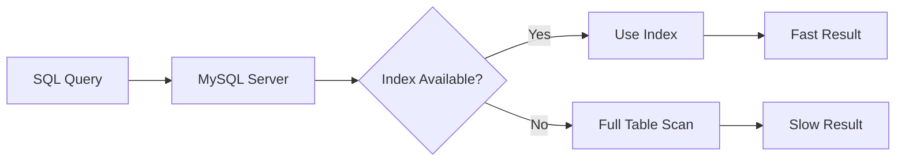
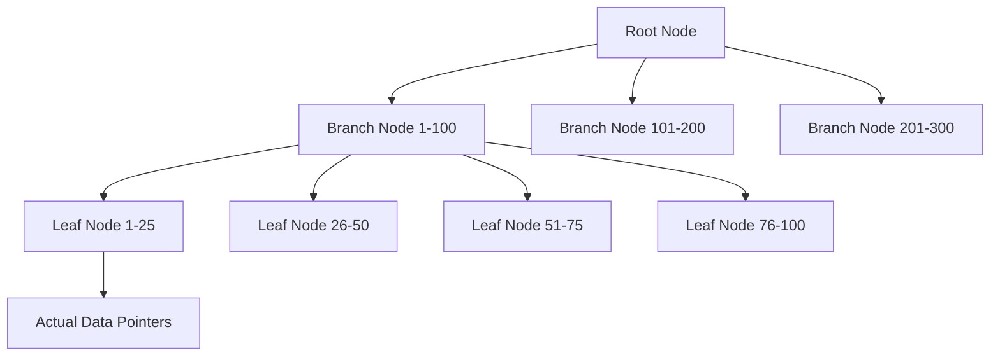

# MySQL Index Basics

Database performance is crucial for application responsiveness, and one of the most powerful tools you have to improve MySQL performance is **indexing**. In this guide, you'll learn what indexes are, how they work, and how to use them effectively.

## What Are MySQL Indexes?

Indexes in MySQL are special data structures that store a small portion of the table's data in a form that is easy to search. Think of them like the index at the back of a book—rather than scanning every page to find information, you can quickly look up specific content locations.



Without indexes, MySQL must perform a **full table scan**, examining every row in a table to find matching records. This becomes extremely inefficient as your tables grow.

## How MySQL Indexes Work

An index contains keys built from one or more columns in a table. These keys are stored in a structure (typically a B-tree) that allows MySQL to find rows quickly.

Consider this simple analogy: 

- **Without an index**: Finding someone's phone number by reading through every page of a phone book
- **With an index**: Finding someone's phone number using alphabetical tabs in a phone book

### B-Tree Structure

Most MySQL indexes use a B-tree (balanced tree) structure:



This structure allows MySQL to quickly navigate to the right section of data without examining every row.

## Types of MySQL Indexes

MySQL supports several index types:

1. **PRIMARY KEY**: A unique index that identifies each record in a table
2. **UNIQUE**: Ensures all values in the indexed column are distinct
3. **INDEX/KEY**: General purpose index that allows duplicate values
4. **FULLTEXT**: Special index for text searching
5. **SPATIAL**: Special index for spatial data types

## Creating Your First Index

Let's look at how to create indexes with practical examples:

### Creating a Table with a PRIMARY KEY

```sql
CREATE TABLE customers (
    customer_id INT AUTO_INCREMENT PRIMARY KEY,
    first_name VARCHAR(50),
    last_name VARCHAR(50),
    email VARCHAR(100)
);
```

The `PRIMARY KEY` automatically creates an index on the `customer_id` column.

### Adding an Index to an Existing Table

```sql
-- Creating a basic index on last name
CREATE INDEX idx_lastname ON customers(last_name);

-- Creating a unique index on email
CREATE UNIQUE INDEX idx_email ON customers(email);

-- Creating a composite index on multiple columns
CREATE INDEX idx_name ON customers(last_name, first_name);
```

### Viewing Existing Indexes

```sql
SHOW INDEX FROM customers;
```

Output would look something like:

```
+-----------+------------+-------------+--------------+-------------+-----------+-------------+----------+--------+------+------------+---------+---------------+---------+------------+
| Table     | Non_unique | Key_name    | Seq_in_index | Column_name | Collation | Cardinality | Sub_part | Packed | Null | Index_type | Comment | Index_comment | Visible | Expression |
+-----------+------------+-------------+--------------+-------------+-----------+-------------+----------+--------+------+------------+---------+---------------+---------+------------+
| customers |          0 | PRIMARY     |            1 | customer_id | A         |           0 |     NULL |   NULL |      | BTREE      |         |               | YES     | NULL       |
| customers |          1 | idx_lastname|            1 | last_name   | A         |           0 |     NULL |   NULL | YES  | BTREE      |         |               | YES     | NULL       |
| customers |          0 | idx_email   |            1 | email       | A         |           0 |     NULL |   NULL | YES  | BTREE      |         |               | YES     | NULL       |
| customers |          1 | idx_name    |            1 | last_name   | A         |           0 |     NULL |   NULL | YES  | BTREE      |         |               | YES     | NULL       |
| customers |          1 | idx_name    |            2 | first_name  | A         |           0 |     NULL |   NULL | YES  | BTREE      |         |               | YES     | NULL       |
+-----------+------------+-------------+--------------+-------------+-----------+-------------+----------+--------+------+------------+---------+---------------+---------+------------+
```

## When Indexes Make a Difference

Let's see the performance difference with and without an index using a realistic example:

### Example Table and Data

Imagine we have a table with a million customer records:

```sql
CREATE TABLE large_customer_table (
    id INT AUTO_INCREMENT PRIMARY KEY,
    first_name VARCHAR(50),
    last_name VARCHAR(50),
    email VARCHAR(100),
    registration_date DATE
);

-- Insert a million sample records (in reality, you would have actual data)
```

### Query Without an Index

```sql
-- This will be slow if last_name isn't indexed
SELECT * FROM large_customer_table WHERE last_name = 'Smith';
```

### Adding an Index and Performance Impact

```sql
-- Add the index
CREATE INDEX idx_last_name ON large_customer_table(last_name);

-- Now run the same query
SELECT * FROM large_customer_table WHERE last_name = 'Smith';
```

You can measure the difference using the `EXPLAIN` statement:

```sql
EXPLAIN SELECT * FROM large_customer_table WHERE last_name = 'Smith';
```

Before indexing, the output might show:
```
+----+-------------+---------------------+------------+------+---------------+------+---------+------+--------+----------+-------------+
| id | select_type | table               | partitions | type | possible_keys | key  | key_len | ref  | rows   | filtered | Extra       |
+----+-------------+---------------------+------------+------+---------------+------+---------+------+--------+----------+-------------+
|  1 | SIMPLE      | large_customer_table| NULL       | ALL  | NULL          | NULL | NULL    | NULL | 1000000| 10.00    | Using where |
+----+-------------+---------------------+------------+------+---------------+------+---------+------+--------+----------+-------------+
```

After indexing:
```
+----+-------------+---------------------+------------+------+---------------+--------------+---------+-------+------+----------+-------+
| id | select_type | table               | partitions | type | possible_keys | key          | key_len | ref   | rows | filtered | Extra |
+----+-------------+---------------------+------------+------+---------------+--------------+---------+-------+------+----------+-------+
|  1 | SIMPLE      | large_customer_table| NULL       | ref  | idx_last_name | idx_last_name| 153     | const | 103  | 100.00   | NULL  |
+----+-------------+---------------------+------------+------+---------------+--------------+---------+-------+------+----------+-------+
```

Notice the `type` changed from `ALL` (full table scan) to `ref` (using index), and the number of examined rows reduced dramatically.

## Best Practices for MySQL Indexes

1. **Index columns used in WHERE clauses frequently**
   ```sql
   -- If you often search by email
   CREATE INDEX idx_email ON customers(email);
   ```

2. **Index columns used in JOIN conditions**
   ```sql
   CREATE INDEX idx_customer_id ON orders(customer_id);
   ```

3. **Index columns used in ORDER BY or GROUP BY**
   ```sql
   CREATE INDEX idx_registration_date ON customers(registration_date);
   ```

4. **Consider composite indexes for multi-column conditions**
   ```sql
   -- For queries that filter on both columns
   CREATE INDEX idx_name_email ON customers(last_name, email);
   ```

5. **Don't over-index**
   - Each index takes up disk space
   - Indexes slow down INSERT, UPDATE, and DELETE operations

## When NOT to Use Indexes

Indexes aren't always beneficial:

- On small tables (full scan might be faster)
- On columns with low selectivity (like boolean fields)
- On tables that are frequently updated but rarely queried
- When most queries already return a large percentage of the table

## The EXPLAIN Statement: Your Best Friend

The `EXPLAIN` statement helps you understand how MySQL executes your queries and whether it's using indexes effectively:

```sql
EXPLAIN SELECT * FROM customers WHERE last_name = 'Johnson';
```

Look for these key items in the output:
- **type**: The join type. Values like "const" or "ref" are good, "ALL" means a full table scan
- **possible_keys**: Indexes that could be used
- **key**: The index actually used (if any)
- **rows**: Estimated number of rows examined

## Real-World Example: User Login System

Let's apply indexing to a real-world scenario – a user login system:

```sql
CREATE TABLE users (
    user_id INT AUTO_INCREMENT PRIMARY KEY,
    username VARCHAR(50),
    email VARCHAR(100),
    password_hash VARCHAR(256),
    last_login DATETIME,
    account_status ENUM('active', 'suspended', 'inactive'),
    created_at TIMESTAMP DEFAULT CURRENT_TIMESTAMP
);

-- Add appropriate indexes for login functionality
CREATE UNIQUE INDEX idx_username ON users(username);
CREATE UNIQUE INDEX idx_email ON users(email);
CREATE INDEX idx_status_login ON users(account_status, last_login);
```

When a user tries to log in, the application would run:

```sql
-- Without indexes, this would be slow with many users
SELECT user_id, password_hash, account_status 
FROM users 
WHERE username = 'johndoe';
```

With the `idx_username` index, this query becomes extremely fast even with millions of users.

## Summary

In this guide, you've learned:

- **What indexes are**: Special data structures that speed up data retrieval
- **How they work**: Using B-tree structures to efficiently locate data
- **Types of indexes**: PRIMARY KEY, UNIQUE, INDEX, FULLTEXT, and SPATIAL
- **How to create indexes**: Using CREATE INDEX statements
- **When to use indexes**: For WHERE clauses, JOINs, and sorting operations
- **Best practices**: Creating the right indexes for your queries
- **How to analyze queries**: Using the EXPLAIN statement

Remember that indexing is both an art and a science. The right indexes can dramatically improve performance, but too many can hurt write operations. Always test your queries with realistic data volumes to find the optimal indexing strategy.

## Exercises for Practice

1. Create a table for a blog system with posts, categories, and tags, and add appropriate indexes.
2. Write a query that would benefit from an index and use EXPLAIN to see the difference before and after adding the index.
3. Create a composite index and demonstrate a query that uses it effectively.
4. Find an existing table in your database and analyze if its indexes are appropriate for your common queries.

## Additional Resources

- [MySQL Documentation on Optimization and Indexes](https://dev.mysql.com/doc/refman/8.0/en/optimization-indexes.html)
- [Using EXPLAIN to Optimize Queries](https://dev.mysql.com/doc/refman/8.0/en/using-explain.html)
- The book "High Performance MySQL" by Baron Schwartz, Peter Zaitsev, and Vadim Tkachenko

As you continue working with MySQL, remember that good indexing strategy is fundamental to database performance, especially as your data grows.