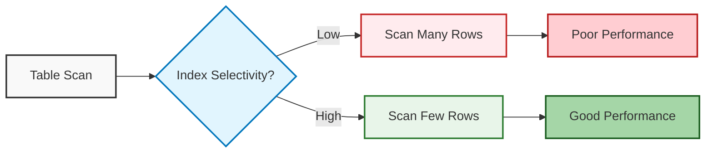

# MySQL Index Selectivity

In your journey to master MySQL performance optimization, understanding **index selectivity** is crucial. This concept can dramatically impact how efficiently your queries run and ultimately determine whether your database performs like a sports car or crawls like a turtle in rush hour traffic.

## What is Index Selectivity?

Index selectivity (or cardinality) refers to the ratio of unique values in an indexed column to the total number of rows in the table. It's expressed as a number between 0 and 1, where:

- **High selectivity (closer to 1)**: Many unique values relative to total rows
- **Low selectivity (closer to 0)**: Few unique values relative to total rows

The formula for calculating index selectivity is:

```
Selectivity = Number of Unique Values / Total Number of Rows
```

## Why Index Selectivity Matters

MySQL's query optimizer uses selectivity to determine whether to use an index for a query. Indexes with higher selectivity are generally more efficient because they narrow down the result set more effectively.

Consider this analogy: Finding a person by their unique national ID number (high selectivity) versus finding all people with brown hair (low selectivity). The first search is much more targeted!

## Measuring Index Selectivity in MySQL

Let's look at how to check the selectivity of your indexes:

```sql
SELECT 
    COUNT(DISTINCT column_name) / COUNT(*) AS selectivity 
FROM 
    table_name;
```

For example, to check the selectivity of an email column:

```sql
SELECT 
    COUNT(DISTINCT email) / COUNT(*) AS email_selectivity 
FROM 
    customers;
```

Output example:

```
+-----------------+
| email_selectivity |
+-----------------+
| 0.9973          |
+-----------------+
```

This result (0.9973) indicates very high selectivity, making it an excellent candidate for indexing.

## High vs. Low Selectivity Examples

### High Selectivity Columns

Columns with high selectivity typically include:

1. **Primary keys** - Always unique, so selectivity = 1
2. **Email addresses** - Usually unique for each user
3. **Username** - Often unique by design
4. **Phone numbers** - Generally unique per customer

Creating indexes on these columns is very effective:

```sql
CREATE INDEX idx_customer_email ON customers(email);
```

### Low Selectivity Columns

Columns with low selectivity include:

1. **Status flags** (active/inactive) - Usually just 2 values
2. **Gender** - Typically few distinct values
3. **Category types** - Often limited set of values
4. **Boolean fields** - Only true/false values

For example, a `gender` column might have a selectivity like this:

```sql
SELECT 
    COUNT(DISTINCT gender) / COUNT(*) AS gender_selectivity 
FROM 
    users;
```

Output example:

```
+------------------+
| gender_selectivity |
+------------------+
| 0.0003           |
+------------------+
```

With such low selectivity, an index on this column alone would be inefficient in most cases.

## Composite Index Selectivity

Sometimes combining low selectivity columns can create a more selective index:

```sql
CREATE INDEX idx_category_status ON products(category_id, status);
```

To measure composite index selectivity:

```sql
SELECT 
    COUNT(DISTINCT CONCAT(category_id, ':', status)) / COUNT(*) AS composite_selectivity
FROM 
    products;
```

## Practical Example: Improving Query Performance

Let's examine how selectivity affects performance through a real-world example.

### Scenario: E-commerce Product Search

Consider a `products` table with 1 million rows:

```sql
CREATE TABLE products (
    id INT PRIMARY KEY,
    name VARCHAR(255),
    category_id INT,
    brand_id INT,
    price DECIMAL(10,2),
    status ENUM('active', 'inactive', 'discontinued')
);
```

Let's analyze the selectivity of different columns:

```sql
-- Primary key selectivity
SELECT COUNT(DISTINCT id) / COUNT(*) AS id_selectivity FROM products;

-- Brand selectivity (assuming 500 brands)
SELECT COUNT(DISTINCT brand_id) / COUNT(*) AS brand_selectivity FROM products;

-- Status selectivity (only 3 possible values)
SELECT COUNT(DISTINCT status) / COUNT(*) AS status_selectivity FROM products;
```

Typical results might be:

```
+--------------+
| id_selectivity |
+--------------+
| 1.0000       |
+--------------+

+----------------+
| brand_selectivity |
+----------------+
| 0.0005         |
+----------------+

+----------------+
| status_selectivity |
+----------------+
| 0.0000030      |
+----------------+
```

### Query Performance Comparison

Now let's compare how queries perform with different indexes:

```sql
-- Query using low-selectivity index (poor performance)
EXPLAIN SELECT * FROM products WHERE status = 'active';

-- Query using medium-selectivity index (better)
EXPLAIN SELECT * FROM products WHERE brand_id = 123;

-- Query using high-selectivity index (best)
EXPLAIN SELECT * FROM products WHERE id = 45678;
```

### Optimizing with Composite Indexes

When you need to filter on low-selectivity columns, composite indexes can help:

```sql
CREATE INDEX idx_status_brand ON products(status, brand_id);
```

Now a query filtering on both columns can use this index effectively:

```sql
EXPLAIN SELECT * FROM products WHERE status = 'active' AND brand_id = 123;
```

## Best Practices for Index Selectivity

1. **Index high-selectivity columns first** - They provide the most significant performance benefits.

2. **Be cautious with low-selectivity indexes** - They might be ignored by the optimizer or, worse, slow down performance.

3. **Consider composite indexes** - Combine columns to increase overall selectivity.

4. **Place higher selectivity columns first in composite indexes** - This maximizes the index's effectiveness.

5. **Analyze query patterns** - Index based on how your application actually queries the database.

6. **Monitor and maintain indexes** - Selectivity can change as data grows.

## Visualizing Index Selectivity

Let's visualize how selectivity impacts index usage:



## Real-World Optimization Example

### Before Optimization

Consider an online store with a slow search function:

```sql
-- Original query (slow)
SELECT * FROM orders WHERE customer_state = 'CA' AND order_date > '2023-01-01';
```

Examining the table:

```sql
-- Check selectivity
SELECT COUNT(DISTINCT customer_state) / COUNT(*) AS state_selectivity FROM orders;
SELECT COUNT(DISTINCT DATE(order_date)) / COUNT(*) AS date_selectivity FROM orders;
```

Results:
```
+----------------+
| state_selectivity |
+----------------+
| 0.0196         | -- Only 50 states, low selectivity
+----------------+

+---------------+
| date_selectivity |
+---------------+
| 0.1370        | -- 365 days in a year, medium selectivity
+---------------+
```

### After Optimization

Based on selectivity analysis:

```sql
-- Create a composite index with the more selective column first
CREATE INDEX idx_order_date_state ON orders(order_date, customer_state);
```

Now the query runs much faster, as it can efficiently filter orders by the more selective date range first.

## Dealing with Low Selectivity Columns

If you must query on low-selectivity columns:

1. **Add additional filtering conditions** to reduce the result set
2. **Use composite indexes** as discussed earlier
3. **Consider filtered indexes** (MySQL 8.0+ with invisible indexes)

```sql
-- Instead of this:
SELECT * FROM users WHERE gender = 'F';

-- Try this:
SELECT * FROM users WHERE gender = 'F' AND last_active_date > '2023-01-01';

-- With this index:
CREATE INDEX idx_gender_active ON users(gender, last_active_date);
```

## Summary

Index selectivity is a fundamental concept for optimizing MySQL database performance:

- **High selectivity indexes** (many unique values) are excellent candidates for indexing
- **Low selectivity indexes** (few unique values) may not be helpful on their own
- **Composite indexes** can improve selectivity when combining columns
- **Measure selectivity** to make informed indexing decisions
- **Put higher selectivity columns first** in composite indexes

By understanding and applying these principles, you'll be able to create more efficient indexes that truly enhance your query performance instead of just taking up space.

## Exercises to Practice

1. Calculate the selectivity of various columns in your database.
2. Identify columns with high and low selectivity in your tables.
3. Create a composite index for a low-selectivity column paired with a high-selectivity column.
4. Compare query performance with and without your new index.
5. Use `EXPLAIN` to analyze how MySQL uses your indexes based on their selectivity.

## Additional Resources

- [MySQL 8.0 Reference Manual: Optimization and Indexes](https://dev.mysql.com/doc/refman/8.0/en/optimization-indexes.html)
- [Understanding the MySQL Query Optimizer](https://dev.mysql.com/doc/refman/8.0/en/optimizer-overview.html)
- [High Performance MySQL](https://www.oreilly.com/library/view/high-performance-mysql/9781492080503/) (Book by Baron Schwartz, Peter Zaitsev, and Vadim Tkachenko)

Understanding index selectivity will help you create more thoughtful, efficient database designs that scale well as your application grows. Happy optimizing!