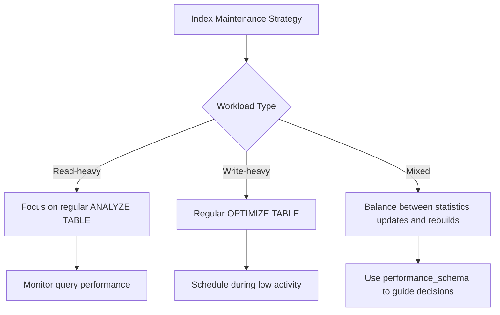

# MySQL Index Maintenance

## Introduction

Indexes in MySQL significantly improve query performance, but they don't maintain themselves. Over time, as data is modified, indexes can become fragmented and less efficient. Proper index maintenance is crucial to ensure your database continues to perform optimally.

In this guide, we'll explore how to maintain MySQL indexes effectively, helping you understand when and how to perform maintenance operations, monitor index usage, and implement best practices that keep your database running smoothly.

## Why Index Maintenance Matters

Indexes, like any other database structure, require regular maintenance for several reasons:

1. **Performance degradation** - Fragmented indexes lead to slower queries
2. **Storage inefficiency** - Poorly maintained indexes waste disk space
3. **Query optimization** - Unused indexes consume resources without providing benefits

Let's explore how to maintain your indexes effectively.

## Monitoring Index Usage

Before performing any maintenance, you need to know which indexes are being used and which aren't.

### Identifying Used and Unused Indexes

MySQL provides tools to track index usage statistics. The `performance_schema` database, available in MySQL 5.5 and later, contains tables that track index usage.

```sql
-- Enable index statistics collection (if not already enabled)
UPDATE performance_schema.setup_consumers 
SET enabled = 'YES' 
WHERE name = 'events_statements_history_long';

UPDATE performance_schema.setup_instruments 
SET enabled = 'YES', timed = 'YES' 
WHERE name LIKE 'statement/%';

-- Query to find unused indexes
SELECT object_schema AS database_name,
       object_name AS table_name,
       index_name,
       COUNT_STAR AS uses
FROM performance_schema.table_io_waits_summary_by_index_usage
WHERE index_name IS NOT NULL
  AND count_star = 0
  AND object_schema NOT IN ('mysql', 'performance_schema')
ORDER BY object_schema, object_name;
```

Expected output:

```
+---------------+--------------+----------------+------+
| database_name | table_name   | index_name     | uses |
+---------------+--------------+----------------+------+
| myapp         | users        | idx_last_login | 0    |
| myapp         | products     | idx_created_at | 0    |
| myapp         | transactions | idx_status     | 0    |
+---------------+--------------+----------------+------+
```

This query identifies indexes that haven't been used since the server started.

### Using EXPLAIN to Check Index Usage

The `EXPLAIN` statement helps you understand how MySQL executes queries and which indexes it uses:

```sql
EXPLAIN SELECT * FROM customers WHERE city = 'New York';
```

Example output:

```
+----+-------------+-----------+------------+------+---------------+------+---------+------+------+----------+-------------+
| id | select_type | table     | partitions | type | possible_keys | key  | key_len | ref  | rows | filtered | Extra       |
+----+-------------+-----------+------------+------+---------------+------+---------+------+------+----------+-------------+
| 1  | SIMPLE      | customers | NULL       | ALL  | NULL          | NULL | NULL    | NULL | 1000 | 10.00    | Using where |
+----+-------------+-----------+------------+------+---------------+------+---------+------+------+----------+-------------+
```

If you see `type: ALL` and `key: NULL`, it means a full table scan is being performed because no suitable index exists.

## Analyzing Index Health

### Using ANALYZE TABLE

The `ANALYZE TABLE` command updates index statistics, which helps the query optimizer make better decisions:

```sql
ANALYZE TABLE customers;
```

Output:

```
+--------------------+---------+----------+----------+
| Table              | Op      | Msg_type | Msg_text |
+--------------------+---------+----------+----------+
| mydb.customers     | analyze | status   | OK       |
+--------------------+---------+----------+----------+
```

This command should be run periodically, especially after large data changes.

### Checking Index Fragmentation

Index fragmentation occurs when indexes have gaps due to deletions and updates. You can check fragmentation with:

```sql
SHOW TABLE STATUS LIKE 'customers';
```

Example output:

```
+-----------+--------+---------+------------+------+----------------+-------------+-----------------+-------------+------------+-------------------+-------------+-------------+------------+-----------------+----------+----------------+---------+
| Name      | Engine | Version | Row_format | Rows | Avg_row_length | Data_length | Max_data_length | Index_length | Data_free  | Auto_increment   | Create_time | Update_time | Check_time | Collation       | Checksum | Create_options | Comment |
+-----------+--------+---------+------------+------+----------------+-------------+-----------------+-------------+------------+-------------------+-------------+-------------+------------+-----------------+----------+----------------+---------+
| customers | InnoDB | 10      | Dynamic    | 9754 | 120            | 1170432     | 0               | 1032192      | 4194304    | 9755             | 2023-01-01  | 2023-06-01  | NULL       | utf8mb4_general | NULL     |                |         |
+-----------+--------+---------+------------+------+----------------+-------------+-----------------+-------------+------------+-------------------+-------------+-------------+------------+-----------------+----------+----------------+---------+
```

Pay attention to the `Data_free` column. A large value compared to the `Data_length` indicates fragmentation.

## Index Maintenance Operations

### Rebuilding Indexes

When indexes become fragmented, rebuilding them can improve performance.

#### Using OPTIMIZE TABLE

The easiest way to rebuild indexes is with the `OPTIMIZE TABLE` command:

```sql
OPTIMIZE TABLE customers;
```

Output:

```
+--------------------+----------+----------+----------+
| Table              | Op       | Msg_type | Msg_text |
+--------------------+----------+----------+----------+
| mydb.customers     | optimize | status   | OK       |
+--------------------+----------+----------+----------+
```

This command rebuilds both the table and its indexes, reclaiming unused space.

:::caution
`OPTIMIZE TABLE` locks the table during execution, which can cause downtime in production environments. Consider scheduling this operation during off-peak hours.
:::

#### Using ALTER TABLE

For InnoDB tables, you can also use `ALTER TABLE` to rebuild indexes:

```sql
ALTER TABLE customers ENGINE=InnoDB;
```

This rebuilds the entire table and all its indexes.

### Dropping Unused Indexes

If you've identified unused indexes, consider dropping them to reduce overhead:

```sql
ALTER TABLE customers DROP INDEX idx_unused;
```

:::warning
Before dropping an index, ensure it's truly unused. Some indexes might only be used for periodic reports or specific operations.
:::

## Automating Index Maintenance

### Creating a Maintenance Schedule

Regular maintenance is key to keeping your database performing well. Here's a simple script you can schedule to run weekly:

```sql
-- Example maintenance script
BEGIN;

-- Update statistics
ANALYZE TABLE customers;
ANALYZE TABLE orders;
ANALYZE TABLE products;

-- Optimize tables (rebuild indexes)
OPTIMIZE TABLE customers;
OPTIMIZE TABLE orders;
OPTIMIZE TABLE products;

COMMIT;
```

You can schedule this using your server's cron jobs or a MySQL Event:

```sql
-- Create an event that runs weekly
CREATE EVENT weekly_index_maintenance
ON SCHEDULE EVERY 1 WEEK
DO
BEGIN
  ANALYZE TABLE customers;
  ANALYZE TABLE orders;
  ANALYZE TABLE products;
  -- Add OPTIMIZE TABLE if run during low-traffic periods
END;

-- Make sure the event scheduler is running
SET GLOBAL event_scheduler = ON;
```

## Best Practices for Index Maintenance

### Regular Monitoring

1. **Track query performance** - Use the slow query log to identify queries that might benefit from index adjustments.

```sql
-- Enable slow query logging
SET GLOBAL slow_query_log = 'ON';
SET GLOBAL long_query_time = 1; -- Log queries taking more than 1 second
```

2. **Review index usage statistics** - Regularly check which indexes are being used and which aren't.

### Maintenance Timing

1. **Perform heavy maintenance during off-hours** - Operations like `OPTIMIZE TABLE` can lock tables.
2. **Update statistics more frequently** - `ANALYZE TABLE` is lightweight and can be run more often.

### Size Considerations

1. **Large tables** - For very large tables, consider rebuilding indexes incrementally or using tools like pt-online-schema-change from Percona Toolkit.

### Optimizing Specific Workloads

Different workloads benefit from different maintenance approaches:



## Real-World Maintenance Scenarios

### Scenario 1: E-commerce Database

An e-commerce site experiences slow product searches after six months in production:

```sql
-- Check index fragmentation
SHOW TABLE STATUS LIKE 'products';

-- Analyze current index usage
SELECT index_name, count_star AS uses
FROM performance_schema.table_io_waits_summary_by_index_usage
WHERE object_schema = 'ecommerce'
  AND object_name = 'products'
ORDER BY uses DESC;

-- Rebuild indexes for the products table
OPTIMIZE TABLE products;
```

After rebuilding the indexes, product search queries that previously took 2-3 seconds now complete in under 200ms.

### Scenario 2: Identifying and Removing Redundant Indexes

A financial application has accumulated many indexes over time:

```sql
-- Find potentially redundant indexes
SELECT t.table_schema, 
       t.table_name,
       group_concat(DISTINCT s.index_name) AS indexes,
       group_concat(DISTINCT s.column_name ORDER BY s.seq_in_index) AS columns
FROM information_schema.statistics s
JOIN information_schema.tables t 
  ON s.table_schema = t.table_schema 
 AND s.table_name = t.table_name
WHERE t.table_schema NOT IN ('information_schema', 'mysql', 
                           'performance_schema', 'sys')
GROUP BY t.table_schema, t.table_name, s.column_name
HAVING COUNT(DISTINCT s.index_name) > 1;
```

This query identifies columns that have multiple indexes. After careful review, redundant indexes can be removed:

```sql
ALTER TABLE transactions DROP INDEX idx_date_redundant;
```

Removing redundant indexes resulted in 15% faster write operations and reduced storage requirements.

## Summary

Effective MySQL index maintenance is essential for maintaining optimal database performance. Key points to remember:

- **Monitor your indexes** to understand usage patterns
- **Analyze table statistics** regularly to help the query optimizer
- **Rebuild fragmented indexes** when necessary
- **Remove unused or redundant indexes** to improve write performance
- **Schedule maintenance** during off-peak hours
- **Automate routine tasks** to ensure consistency

By implementing a regular maintenance schedule and following the best practices outlined in this guide, you can ensure your MySQL database continues to perform optimally as it grows and evolves.

## Further Learning

### Exercises

1. Write a script that identifies all unused indexes in your database and reports how much space they consume.
2. Create a maintenance plan for a database with tables of varying sizes, specifying different maintenance frequencies based on table size and update frequency.
3. Use `EXPLAIN` to analyze your slowest queries and determine if index maintenance would help improve their performance.

### Additional Resources

- MySQL Documentation on [ANALYZE TABLE](https://dev.mysql.com/doc/refman/8.0/en/analyze-table.html)
- MySQL Documentation on [OPTIMIZE TABLE](https://dev.mysql.com/doc/refman/8.0/en/optimize-table.html)
- MySQL Documentation on [Using the Performance Schema](https://dev.mysql.com/doc/refman/8.0/en/performance-schema.html)