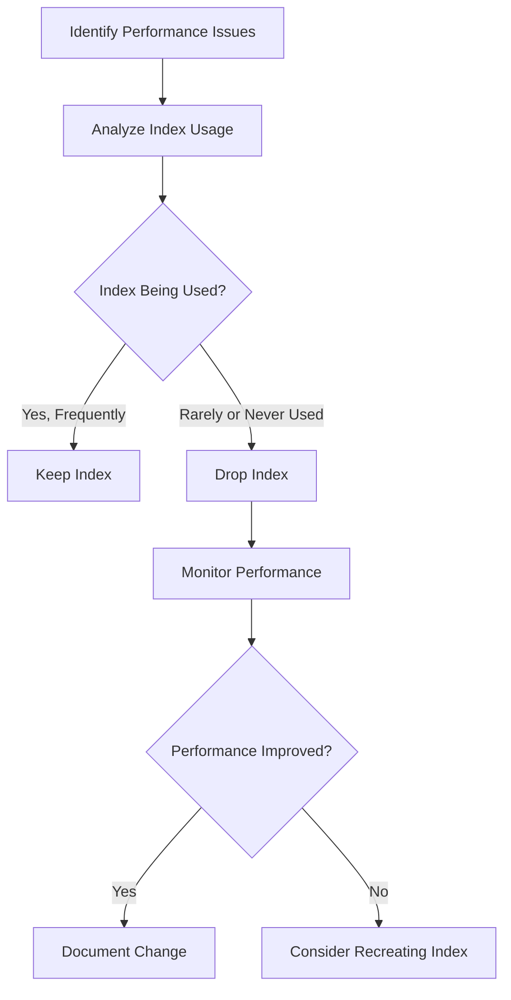

# MySQL DROP INDEX

## Introduction

Indexes are crucial for optimizing MySQL database performance by speeding up data retrieval operations. However, maintaining unnecessary indexes can negatively impact your database by slowing down data modification operations and consuming extra storage space. In this tutorial, we'll explore how to remove indexes using the `DROP INDEX` statement in MySQL.

## What is DROP INDEX?

`DROP INDEX` is a MySQL statement used to remove existing indexes from database tables. When you drop an index, you're telling MySQL to delete the data structure that was created to speed up searches on specific columns. This operation can be important for:

- Improving performance of INSERT, UPDATE, and DELETE operations
- Freeing up storage space
- Simplifying database maintenance
- Restructuring your database optimization strategy

## Syntax of DROP INDEX

The basic syntax for dropping an index in MySQL is:

```sql
DROP INDEX index_name ON table_name;
```

Alternatively, you can use the `ALTER TABLE` syntax:

```sql
ALTER TABLE table_name DROP INDEX index_name;
```

Both statements achieve the same result - they remove the specified index from the table.

## Prerequisites Before Dropping Indexes

Before you drop an index, it's important to:

1. Identify the indexes that exist on your table
2. Understand the purpose of each index
3. Evaluate the potential impact of removing the index
4. Make sure you have appropriate privileges

Let's see how to check existing indexes:

```sql
SHOW INDEXES FROM table_name;
```

This will display all indexes on the specified table, including their names and properties.

## Examples of Using DROP INDEX

### Example 1: Basic Index Removal

Let's start with a simple example. Imagine we have a `customers` table with an index on the `email` column:

```sql
-- First, let's see the existing indexes
SHOW INDEXES FROM customers;

-- Output might look like:
-- +----------+------------+------------+--------------+-------------+-----------+-------------+----------+--------+------+------------+---------+---------------+---------+------------+
-- | Table    | Non_unique | Key_name   | Seq_in_index | Column_name | Collation | Cardinality | Sub_part | Packed | Null | Index_type | Comment | Index_comment | Visible | Expression |
-- +----------+------------+------------+--------------+-------------+-----------+-------------+----------+--------+------+------------+---------+---------------+---------+------------+
-- | customers|          0 | PRIMARY    |            1 | id          | A         |         100 |     NULL |   NULL |      | BTREE      |         |               | YES     | NULL       |
-- | customers|          1 | email_idx  |            1 | email       | A         |          95 |     NULL |   NULL | YES  | BTREE      |         |               | YES     | NULL       |
-- +----------+------------+------------+--------------+-------------+-----------+-------------+----------+--------+------+------------+---------+---------------+---------+------------+

-- Now drop the email index
DROP INDEX email_idx ON customers;

-- Verify that the index was dropped
SHOW INDEXES FROM customers;

-- Output should now only show the PRIMARY key
-- +----------+------------+------------+--------------+-------------+-----------+-------------+----------+--------+------+------------+---------+---------------+---------+------------+
-- | Table    | Non_unique | Key_name   | Seq_in_index | Column_name | Collation | Cardinality | Sub_part | Packed | Null | Index_type | Comment | Index_comment | Visible | Expression |
-- +----------+------------+------------+--------------+-------------+-----------+-------------+----------+--------+------+------------+---------+---------------+---------+------------+
-- | customers|          0 | PRIMARY    |            1 | id          | A         |         100 |     NULL |   NULL |      | BTREE      |         |               | YES     | NULL       |
-- +----------+------------+------------+--------------+-------------+-----------+-------------+----------+--------+------+------------+---------+---------------+---------+------------+
```

### Example 2: Using ALTER TABLE Syntax

Some developers prefer using the `ALTER TABLE` syntax for consistency with other schema modification operations:

```sql
-- Create a sample table with indexes
CREATE TABLE products (
    id INT PRIMARY KEY,
    product_name VARCHAR(100),
    category VARCHAR(50),
    price DECIMAL(10,2),
    stock INT,
    INDEX name_idx (product_name),
    INDEX price_idx (price)
);

-- Drop the price index using ALTER TABLE syntax
ALTER TABLE products DROP INDEX price_idx;

-- Verify the index was removed
SHOW INDEXES FROM products;
```

### Example 3: Dropping Multiple Indexes

If you need to drop multiple indexes, you'll need to use separate statements for each:

```sql
-- Drop multiple indexes
DROP INDEX category_idx ON products;
ALTER TABLE products DROP INDEX stock_idx;
```

### Example 4: Dropping Indexes in a Transaction (InnoDB)

For InnoDB tables, you can drop indexes within a transaction if you need to coordinate index changes with other operations:

```sql
START TRANSACTION;

-- Drop an index
DROP INDEX name_idx ON products;

-- Make other schema changes or data modifications
ALTER TABLE products ADD COLUMN discontinued BOOLEAN DEFAULT FALSE;

-- Commit the changes when everything is ready
COMMIT;
```

## Special Cases and Considerations

### Primary Keys

Dropping a primary key requires special syntax because primary keys also enforce the `NOT NULL` constraint and uniqueness:

```sql
ALTER TABLE table_name DROP PRIMARY KEY;
```

Be extremely careful when dropping primary keys, as they often have foreign key relationships with other tables.

### Foreign Key Constraints

If an index is used by a foreign key constraint, MySQL won't allow you to drop it directly:

```sql
-- This will fail if the index is used by a foreign key
DROP INDEX department_id_idx ON employees;

-- Error: Cannot drop index 'department_id_idx': needed in a foreign key constraint
```

You would need to drop the foreign key constraint first:

```sql
-- First, find the foreign key name
SHOW CREATE TABLE employees;

-- Then drop the foreign key
ALTER TABLE employees DROP FOREIGN KEY fk_department;

-- Now you can drop the index
DROP INDEX department_id_idx ON employees;
```

### Performance Impact

Dropping an index is usually a quick operation, but on large tables, it might impact performance temporarily. Consider dropping indexes during off-peak hours:

```sql
-- Best to run during maintenance windows
DROP INDEX rarely_used_idx ON large_transactions_table;
```

## Real-World Applications

### Scenario 1: Optimizing Database Performance



When analyzing database performance, you might discover redundant or rarely used indexes:

```sql
-- Check index usage statistics (MySQL 8.0+)
SELECT * FROM sys.schema_index_statistics 
WHERE table_schema = 'your_database' 
AND table_name = 'your_table'
ORDER BY rows_inserted DESC;

-- Drop indexes with low usage but high maintenance overhead
DROP INDEX low_usage_idx ON your_table;
```

### Scenario 2: Database Refactoring

When refactoring database schema, you might need to drop indexes before making structural changes:

```sql
-- Begin refactoring process
START TRANSACTION;

-- Drop existing indexes
DROP INDEX old_pattern_idx ON customer_data;

-- Change column types or structure
ALTER TABLE customer_data MODIFY COLUMN customer_info JSON;

-- Create new, more appropriate indexes
CREATE INDEX json_info_idx ON customer_data ((CAST(customer_info->>'$.zipcode' AS CHAR(10))));

COMMIT;
```

### Scenario 3: Fixing Duplicate or Redundant Indexes

Sometimes database evolution leads to redundant indexes that serve similar purposes:

```sql
-- Find potentially redundant indexes
SELECT table_schema, table_name, 
       GROUP_CONCAT(index_name) as redundant_indexes,
       GROUP_CONCAT(column_name) as indexed_columns
FROM information_schema.statistics
WHERE table_schema = 'your_database'
GROUP BY table_schema, table_name, column_name
HAVING COUNT(*) > 1;

-- After analysis, drop the redundant indexes
DROP INDEX redundant_idx1 ON orders;
```

## Best Practices for Dropping Indexes

1. **Always backup your database** before dropping indexes on production systems.

2. **Test in development environments first** to understand the impact.

3. **Use performance monitoring tools** to validate the need for dropping an index:
   ```sql
   -- For MySQL 8.0+
   SELECT * FROM performance_schema.table_io_waits_summary_by_index_usage
   WHERE object_schema = 'your_database'
   AND object_name = 'your_table'
   AND count_star = 0
   AND index_name IS NOT NULL;
   ```

4. **Consider temporarily disabling indexes** if you need to bring them back:
   ```sql
   -- In MySQL 8.0+, you can make an index invisible rather than dropping it
   ALTER TABLE your_table ALTER INDEX index_name INVISIBLE;
   
   -- Later, if needed, make it visible again
   ALTER TABLE your_table ALTER INDEX index_name VISIBLE;
   ```

5. **Schedule index maintenance** during low-traffic periods.

6. **Document all index changes** for future reference.

## Common Errors and Troubleshooting

### Error: Index Does Not Exist

```sql
DROP INDEX non_existent_idx ON customers;
-- Error: Can't DROP 'non_existent_idx'; check that column/key exists
```

**Solution**: Verify the index name first using `SHOW INDEXES FROM customers;`

### Error: Cannot Drop Index Used in Foreign Key

```sql
DROP INDEX department_id_idx ON employees;
-- Error: Cannot drop index 'department_id_idx': needed in a foreign key constraint
```

**Solution**: Drop the foreign key constraint first, then drop the index.

### Error: Insufficient Privileges

```sql
DROP INDEX email_idx ON customers;
-- Error: Access denied for user 'app_user'@'localhost' to database 'company'
```

**Solution**: Ensure your user has the appropriate privileges (INDEX or ALTER permissions).

## Summary

The MySQL `DROP INDEX` statement is a powerful tool for managing and optimizing your database structure. By removing unnecessary indexes, you can improve write performance and reduce storage requirements. However, dropping indexes requires careful consideration of the potential impact on query performance.

Key points to remember:
- Use `DROP INDEX index_name ON table_name;` or `ALTER TABLE table_name DROP INDEX index_name;`
- Always check existing indexes before dropping them
- Be cautious with indexes used in constraints, especially foreign keys
- Monitor database performance before and after dropping indexes
- Consider making indexes invisible (in MySQL 8.0+) as a safer alternative to dropping them outright

## Additional Resources and Exercises

### Exercises

1. Create a sample table with 5 columns and add 3 different indexes to it. Then practice dropping each index using different methods.

2. Write a script that identifies potentially unused indexes in your database based on query patterns.

3. Experiment with making indexes invisible rather than dropping them and measure the performance difference.

4. Create a foreign key constraint that depends on an index, then try to drop the index. Document the errors and the correct sequence of operations.

### Further Learning

- Explore the `sys.schema_unused_indexes` view in MySQL 8.0+ to identify unused indexes
- Learn about index statistics and how to interpret them
- Study the relationship between indexes and query plans using `EXPLAIN`
- Investigate database monitoring tools that can help identify problematic indexes

By mastering the `DROP INDEX` statement and understanding when to use it, you'll be better equipped to maintain efficient, well-performing MySQL databases.