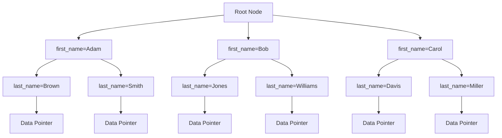

# MySQL Composite Indexes

## Introduction

In MySQL databases, performance optimization is crucial for applications to run efficiently, especially as data grows. While single-column indexes are helpful, many real-world queries filter or sort by multiple columns. This is where **composite indexes** (also called multi-column or compound indexes) become essential.

A composite index is an index created on two or more columns of a table. Rather than creating separate indexes for each column, composite indexes allow the database engine to find records based on the combination of values in those columns, offering significant performance improvements for certain types of queries.

Let's dive into how composite indexes work, when to use them, and how to implement them effectively.

## Understanding Composite Indexes

### What is a Composite Index?

A composite index is simply an index that includes multiple columns. Instead of creating separate indexes on each column:

```sql
CREATE INDEX idx_firstname ON customers(first_name);
CREATE INDEX idx_lastname ON customers(last_name);
```

You can create a single composite index:

```sql
CREATE INDEX idx_name ON customers(first_name, last_name);
```

### Key Concept: Column Order Matters

One of the most important aspects of composite indexes is that **the order of columns matters significantly**. MySQL reads the index from left to right, so the leftmost column(s) can be used independently, but not the other way around.

For example, with an index on `(first_name, last_name, email)`:
- Queries filtering by `first_name` will use the index
- Queries filtering by `first_name AND last_name` will use the index
- Queries filtering by `first_name AND last_name AND email` will use the index
- Queries filtering by only `last_name` or only `email` **won't** use the index
- Queries filtering by `last_name AND email` **won't** use the index

This concept is known as the "leftmost prefix rule" and is crucial for designing effective composite indexes.

## Creating Composite Indexes in MySQL

### Basic Syntax

The syntax for creating a composite index is straightforward:

```sql
CREATE INDEX index_name ON table_name(column1, column2, ...);
```

You can also create them when defining your table:

```sql
CREATE TABLE products (
    product_id INT PRIMARY KEY,
    category_id INT,
    supplier_id INT,
    product_name VARCHAR(100),
    price DECIMAL(10,2),
    INDEX idx_category_supplier (category_id, supplier_id)
);
```

### Using ALTER TABLE

You can add a composite index to an existing table using ALTER TABLE:

```sql
ALTER TABLE orders 
ADD INDEX idx_customer_date (customer_id, order_date);
```

### Unique Composite Indexes

You can create unique composite indexes to enforce uniqueness across multiple columns:

```sql
CREATE UNIQUE INDEX idx_unique_order ON order_items (order_id, product_id);
```

This ensures no duplicate combinations of `order_id` and `product_id` can exist in the table, which is useful for preventing duplicate order items.

## Practical Examples

Let's explore some practical scenarios where composite indexes are useful.

### Example 1: E-commerce Order System

Consider an `orders` table in an e-commerce system:

```sql
CREATE TABLE orders (
    order_id INT PRIMARY KEY AUTO_INCREMENT,
    customer_id INT NOT NULL,
    order_date DATE NOT NULL,
    status VARCHAR(20) NOT NULL,
    total DECIMAL(10,2) NOT NULL
);
```

#### Scenario Analysis

Suppose these are common queries:

1. Find all orders for a specific customer
2. Report on orders by date range
3. Find orders for a specific customer within a date range
4. Get all orders with a specific status

For the third query, a composite index works well:

```sql
CREATE INDEX idx_customer_date ON orders (customer_id, order_date);
```

Now the following query can use the index:

```sql
SELECT * FROM orders 
WHERE customer_id = 123 
AND order_date BETWEEN '2023-01-01' AND '2023-01-31';
```

### Example 2: User Activity Tracking

Imagine a `user_activities` table tracking user actions:

```sql
CREATE TABLE user_activities (
    activity_id INT PRIMARY KEY AUTO_INCREMENT,
    user_id INT NOT NULL,
    activity_type VARCHAR(50) NOT NULL,
    timestamp DATETIME NOT NULL,
    details JSON
);
```

For analyzing user behavior, you might frequently query:

```sql
SELECT * FROM user_activities
WHERE user_id = 45
AND activity_type = 'login'
ORDER BY timestamp DESC
LIMIT 10;
```

A composite index would be optimal:

```sql
CREATE INDEX idx_user_activity_time ON user_activities(user_id, activity_type, timestamp);
```

## When to Use Composite Indexes vs. Multiple Single-Column Indexes

### Use Composite Indexes When:

1. You frequently query with conditions on multiple columns together
2. Your queries use `AND` conditions on the indexed columns
3. You need to enforce uniqueness across a combination of columns
4. Your queries sort on the combination of columns in the same order as the index

### Use Multiple Single-Column Indexes When:

1. Different queries filter on different individual columns
2. Your queries use `OR` conditions between columns
3. Queries rarely use the columns together

## Analyzing Composite Index Usage

To determine if your composite indexes are being used effectively, use the `EXPLAIN` statement:

```sql
EXPLAIN SELECT * FROM orders 
WHERE customer_id = 123 
AND order_date > '2023-01-01';
```

The output might look like:

```
+----+-------------+--------+------------+------+-------------------+-------------------+---------+-------+------+----------+-------------+
| id | select_type | table  | partitions | type | possible_keys     | key               | key_len | ref   | rows | filtered | Extra       |
+----+-------------+--------+------------+------+-------------------+-------------------+---------+-------+------+----------+-------------+
|  1 | SIMPLE      | orders | NULL       | ref  | idx_customer_date | idx_customer_date | 4       | const |   12 |    33.33 | Using where |
+----+-------------+--------+------------+------+-------------------+-------------------+---------+-------+------+----------+-------------+
```

If you see your composite index in the `key` column, the query is using it.

## Best Practices for Composite Indexes

1. **Column Order**: Place the most selective columns (those with more unique values) first, unless query patterns dictate otherwise.

2. **Index Size**: Limit the number of columns in a composite index—generally 3-4 at most—to avoid performance overhead.

3. **Consider Covering Indexes**: Include all columns referenced in a query to create a "covering index" that can satisfy the query entirely from the index.

4. **Avoid Redundancy**: Don't create composite indexes that duplicate the functionality of existing indexes. For example, if you have an index on `(A, B, C)`, you don't need a separate index on `(A, B)`.

5. **Balance with Writes**: Remember that every index speeds up reads but slows down writes. Only create indexes that noticeably improve query performance.

## Common Mistakes to Avoid

1. **Incorrect Column Order**: Creating an index with columns in an order that doesn't match your query patterns.

2. **Indexing Low-Cardinality Columns First**: Placing columns with few distinct values (like status, boolean flags) at the beginning of a composite index.

3. **Over-Indexing**: Creating too many indexes that provide minimal benefit but slow down write operations.

4. **Not Considering Column Usage**: Creating composite indexes without analyzing how columns are actually used together in queries.

## Example: Optimizing a Report Query

Consider a scenario where you need to generate sales reports by region and date:

```sql
CREATE TABLE sales (
    sale_id INT PRIMARY KEY AUTO_INCREMENT,
    product_id INT NOT NULL,
    region_id INT NOT NULL,
    sale_date DATE NOT NULL,
    quantity INT NOT NULL,
    revenue DECIMAL(10,2) NOT NULL
);
```

For a query that analyzes sales by region and date:

```sql
SELECT 
    region_id,
    sale_date,
    SUM(quantity) AS total_items,
    SUM(revenue) AS total_revenue
FROM sales
WHERE region_id = 5
AND sale_date BETWEEN '2023-01-01' AND '2023-03-31'
GROUP BY region_id, sale_date;
```

A well-designed composite index would be:

```sql
CREATE INDEX idx_region_date ON sales(region_id, sale_date);
```

After creating this index, you can verify its usage with EXPLAIN:

```sql
EXPLAIN SELECT 
    region_id,
    sale_date,
    SUM(quantity) AS total_items,
    SUM(revenue) AS total_revenue
FROM sales
WHERE region_id = 5
AND sale_date BETWEEN '2023-01-01' AND '2023-03-31'
GROUP BY region_id, sale_date;
```

## Visualizing How Composite Indexes Work

To understand how composite indexes are structured, consider this visualization:



This tree structure demonstrates how a composite index on `(first_name, last_name)` organizes data, allowing efficient traversal for queries filtering on these columns.

## Summary

Composite indexes are powerful tools for optimizing MySQL database performance when queries filter or sort on multiple columns. Key points to remember:

- Column order in composite indexes is crucial due to the leftmost prefix rule
- Create composite indexes based on your actual query patterns
- Use EXPLAIN to verify if your indexes are being used properly
- Keep the number of columns in a composite index reasonable
- Balance the benefits of faster reads against the cost of slower writes

By applying the principles and best practices discussed in this guide, you can significantly improve the performance of your MySQL database queries that involve multiple columns.

## Additional Resources

- [MySQL Documentation on Multiple-Column Indexes](https://dev.mysql.com/doc/refman/8.0/en/multiple-column-indexes.html)
- [Using EXPLAIN to Optimize Queries](https://dev.mysql.com/doc/refman/8.0/en/using-explain.html)

## Practice Exercises

1. Create a composite index to optimize a query that finds products by category and price range.
2. Analyze an existing database to identify queries that would benefit from composite indexes.
3. Use EXPLAIN to compare the performance of a query before and after adding a composite index.
4. Create a composite index that includes all columns used in a query to serve as a covering index.
5. Design optimal composite indexes for a blog application that frequently searches posts by author and publication date.