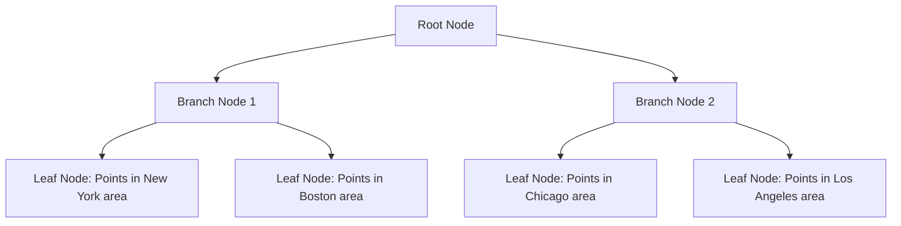

# MySQL Spatial Indexes

## Introduction

Spatial data represents objects defined in a geometric space, such as points, lines, and polygons that correspond to physical locations. MySQL provides robust support for spatial data through its implementation of the OpenGIS geometry types. However, to efficiently query spatial data, we need specialized indexing mechanisms - this is where spatial indexes come into play.

Spatial indexes optimize queries that search for data based on location and proximity rather than traditional alphanumeric comparisons. They're essential for applications like maps, location-based services, and GIS (Geographic Information Systems).

In this tutorial, we'll explore how spatial indexes work in MySQL, when to use them, and how they can dramatically improve the performance of spatial queries.

## Understanding Spatial Data in MySQL

Before diving into spatial indexes, let's understand the types of spatial data MySQL can handle:

- **POINT**: Represents a single location
- **LINESTRING**: A series of connected points forming a line
- **POLYGON**: A closed shape with an area
- **MULTIPOINT**: A collection of points
- **MULTILINESTRING**: A collection of linestrings
- **MULTIPOLYGON**: A collection of polygons
- **GEOMETRYCOLLECTION**: A collection of any geometry types

These data types conform to the OpenGIS standard and are stored in MySQL's `GEOMETRY` data type.

## How Spatial Indexes Work

Unlike traditional B-tree indexes that work well for one-dimensional data, spatial indexes use R-tree data structures (implemented as B-trees in MySQL) to organize multi-dimensional data efficiently.



R-trees group nearby objects and represent them with minimum bounding rectangles (MBRs) in the next higher level of the tree. This hierarchical structure allows the database to quickly eliminate large portions of data and focus only on potentially matching results.

## Creating Spatial Indexes in MySQL

### Prerequisites

To use spatial indexes effectively, make sure:

1. Your MySQL version supports spatial indexes (5.7+ recommended)
2. You're using the InnoDB storage engine (which supports spatial indexes since MySQL 5.7)
3. Your table contains at least one spatial column

### Creating a Table with a Spatial Index

Let's create a table to store locations of interest:

```sql
CREATE TABLE locations (
    id INT AUTO_INCREMENT PRIMARY KEY,
    name VARCHAR(100),
    location POINT NOT NULL,
    SPATIAL INDEX(location)
) ENGINE=InnoDB;
```

### Adding a Spatial Index to an Existing Table

If you already have a table with spatial data, you can add a spatial index:

```sql
ALTER TABLE locations
ADD SPATIAL INDEX(location);
```

## Working with Spatial Data and Indexes

### Inserting Spatial Data

To insert a point into our locations table:

```sql
INSERT INTO locations (name, location) 
VALUES ('Central Park', ST_GeomFromText('POINT(-73.965355 40.782865)'));
```

### Basic Spatial Queries

Let's see how spatial indexes can optimize queries. Here's a query to find locations within a specific radius:

```sql
SELECT name, 
       ST_AsText(location) AS coordinates,
       ST_Distance_Sphere(location, ST_GeomFromText('POINT(-73.9857 40.7484)')) AS distance_meters
FROM locations
WHERE ST_Distance_Sphere(location, ST_GeomFromText('POINT(-73.9857 40.7484)')) <= 5000
ORDER BY distance_meters;
```

This query finds all locations within 5 kilometers of Times Square in New York City.

### Index Usage Analysis

To verify that MySQL is using the spatial index, you can use the `EXPLAIN` statement:

```sql
EXPLAIN SELECT * 
FROM locations 
WHERE ST_Contains(
    ST_GeomFromText('POLYGON((-74.0 40.7, -73.9 40.7, -73.9 40.8, -74.0 40.8, -74.0 40.7))'),
    location
);
```

Output:
```
+----+-------------+-----------+------------+------+---------------+----------+---------+------+------+----------+-------------+
| id | select_type | table     | partitions | type | possible_keys | key      | key_len | ref  | rows | filtered | Extra       |
+----+-------------+-----------+------------+------+---------------+----------+---------+------+------+----------+-------------+
|  1 | SIMPLE      | locations | NULL       | range| location      | location | 34      | NULL | 20   | 100.00   | Using where |
+----+-------------+-----------+------------+------+---------------+----------+---------+------+------+----------+-------------+
```

## Practical Real-world Examples

### Example 1: Finding Nearby Restaurants

Let's say we have a table of restaurants with their locations:

```sql
CREATE TABLE restaurants (
    id INT AUTO_INCREMENT PRIMARY KEY,
    name VARCHAR(100),
    cuisine VARCHAR(50),
    location POINT NOT NULL,
    rating DECIMAL(3,1),
    SPATIAL INDEX(location)
) ENGINE=InnoDB;

-- Insert some sample data
INSERT INTO restaurants (name, cuisine, location, rating)
VALUES 
('Pizza Place', 'Italian', ST_GeomFromText('POINT(-73.9857 40.7484)'), 4.5),
('Burger Joint', 'American', ST_GeomFromText('POINT(-73.9862 40.7502)'), 4.2),
('Sushi Bar', 'Japanese', ST_GeomFromText('POINT(-73.9808 40.7464)'), 4.8),
('Taco Spot', 'Mexican', ST_GeomFromText('POINT(-73.9872 40.7522)'), 3.9);
```

Now, let's find all restaurants within 500 meters of our current location, sorted by distance:

```sql
SET @current_location = ST_GeomFromText('POINT(-73.9845 40.7492)');

SELECT 
    name, 
    cuisine, 
    rating,
    ST_Distance_Sphere(location, @current_location) AS distance_meters
FROM 
    restaurants
WHERE 
    ST_Distance_Sphere(location, @current_location) <= 500
ORDER BY 
    distance_meters;
```

### Example 2: Finding Properties Within a Boundary

For a real estate application, find all properties within a specific neighborhood boundary:

```sql
CREATE TABLE properties (
    id INT AUTO_INCREMENT PRIMARY KEY,
    address VARCHAR(200),
    price INT,
    bedrooms INT,
    location POINT NOT NULL,
    SPATIAL INDEX(location)
) ENGINE=InnoDB;

-- Insert some sample properties
INSERT INTO properties (address, price, bedrooms, location)
VALUES 
('123 Main St', 500000, 2, ST_GeomFromText('POINT(-73.9800 40.7450)')),
('456 Broadway', 750000, 3, ST_GeomFromText('POINT(-73.9850 40.7400)')),
('789 Park Ave', 1200000, 4, ST_GeomFromText('POINT(-73.9650 40.7700)'));

-- Define neighborhood boundary (Chelsea in NYC)
SET @chelsea = ST_GeomFromText('POLYGON((-74.00 40.74, -73.99 40.74, -73.99 40.75, -74.00 40.75, -74.00 40.74))');

-- Find properties in Chelsea
SELECT 
    address, 
    price, 
    bedrooms
FROM 
    properties
WHERE 
    ST_Contains(@chelsea, location);
```

## Performance Considerations

### When to Use Spatial Indexes

Spatial indexes are most beneficial when:

1. You frequently query data based on spatial relationships
2. Your dataset is large
3. You need to perform complex spatial queries like:
   - Finding points within a radius
   - Finding intersections between geometries
   - Finding containment relationships

### Limitations and Considerations

1. **Storage Overhead**: Spatial indexes can be larger than traditional indexes
2. **Update Performance**: Inserting/updating spatial data can be slower due to index maintenance
3. **Functional Indexes**: Some spatial queries might not use the index if they use functions that modify the indexed column

## Common Spatial Functions

Here are some commonly used spatial functions in MySQL:

| Function | Description |
|----------|-------------|
| `ST_Distance_Sphere()` | Returns the distance between two points on Earth |
| `ST_Contains()` | Returns 1 if the second geometry is completely inside the first |
| `ST_Within()` | Returns 1 if the first geometry is completely inside the second |
| `ST_Intersects()` | Returns 1 if the two geometries intersect |
| `ST_Buffer()` | Returns a geometry that represents all points at a given distance |
| `ST_GeomFromText()` | Converts a WKT string to a geometry |
| `ST_AsText()` | Converts a geometry to its WKT representation |

## Summary

MySQL spatial indexes are powerful tools for optimizing location-based queries. They organize multi-dimensional data efficiently, allowing you to quickly perform complex spatial operations like finding nearby points, checking if points fall within polygons, or calculating intersections.

Key takeaways:
- Spatial indexes use R-tree structures to organize multi-dimensional data
- They're essential for applications with location-based features
- They work best with InnoDB engine in MySQL 5.7 and later
- They significantly improve performance for spatial relationship queries
- Proper index usage can be verified with the `EXPLAIN` statement

## Additional Resources and Exercises

### Resources
- [MySQL Spatial Function Reference](https://dev.mysql.com/doc/refman/8.0/en/spatial-function-reference.html)
- [OpenGIS Specification](https://www.ogc.org/standards/sfs)

### Exercises

1. Create a table of cities with their locations and populations, then find all cities within 100km of a specific point.
2. Set up a table of delivery zones (as polygons) and determine which delivery zone a specific address falls into.
3. Create a table of hiking trails (as linestrings) and find all trails that intersect with a specific geographic area.
4. Benchmark the performance difference between a query using a spatial index and the same query without the index.

By mastering spatial indexes, you'll be well equipped to build efficient location-based applications using MySQL.