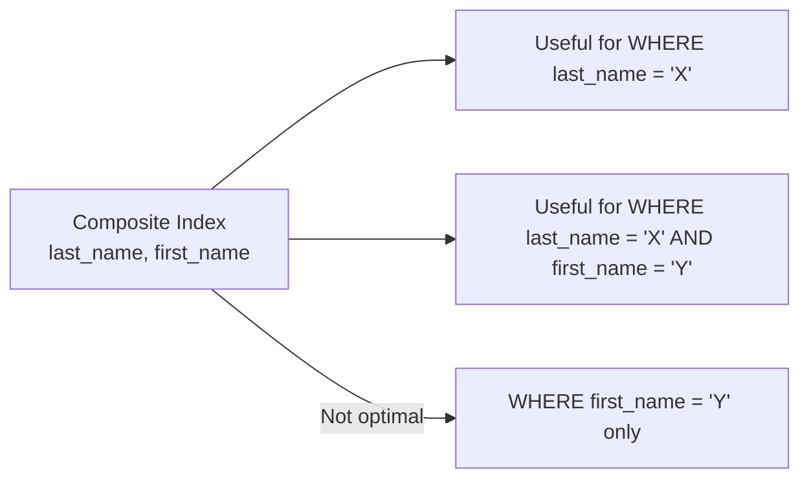

# MySQL Index Usage

## Introduction

Indexes are one of the most powerful tools for optimizing database performance in MySQL. Think of them as the table of contents in a book — instead of reading every page to find specific information, you can quickly jump to the right section. In database terms, indexes help MySQL locate data without scanning the entire table, dramatically speeding up your queries.

In this tutorial, we'll explore how to effectively use MySQL indexes to optimize your database queries. We'll cover when and how to use indexes, how to analyze query performance, and best practices for index usage in real-world applications.

## Understanding Index Usage in MySQL

### How MySQL Uses Indexes

When you execute a query, MySQL's query optimizer decides whether to use available indexes. This decision is based on:

1. The query conditions
2. The available indexes
3. The estimated cost of different execution plans

Let's examine how MySQL uses indexes in different scenarios:

```sql
-- Assuming we have a users table with an index on email
SELECT * FROM users WHERE email = 'user@example.com';
```

For this query, MySQL would use the index on the `email` column to quickly locate the matching row(s).

### Checking If Your Query Uses Indexes

The `EXPLAIN` statement is your best friend for understanding index usage. It reveals the execution plan MySQL chooses for your query:

```sql
EXPLAIN SELECT * FROM users WHERE email = 'user@example.com';
```

Sample output:

```
+----+-------------+-------+------------+------+---------------+------+---------+-------+------+----------+-------+
| id | select_type | table | partitions | type | possible_keys | key  | key_len | ref   | rows | filtered | Extra |
+----+-------------+-------+------------+------+---------------+------+---------+-------+------+----------+-------+
|  1 | SIMPLE      | users | NULL       | ref  | idx_email     | idx_email | 768   | const |    1 |   100.00 | NULL  |
+----+-------------+-------+------------+------+---------------+------+---------+-------+------+----------+-------+
```

The important columns to check are:

- `type`: Indicates how MySQL joins the tables. Values like `ref`, `range`, `index` indicate index usage, while `ALL` indicates a full table scan.
- `key`: Shows which index is actually being used.
- `rows`: Estimates how many rows MySQL will examine.

## When Indexes Are Used

Indexes are typically used in the following scenarios:

### 1. WHERE Clauses

```sql
-- Index on last_name will be used
SELECT * FROM employees WHERE last_name = 'Smith';
```

### 2. ORDER BY Clauses

```sql
-- Index on hire_date will help avoid sorting
SELECT * FROM employees ORDER BY hire_date DESC;
```

### 3. JOIN Operations

```sql
-- Indexes on department_id in both tables will optimize the join
SELECT e.name, d.department_name 
FROM employees e 
JOIN departments d ON e.department_id = d.id;
```

### 4. GROUP BY Clauses

```sql
-- Index on department_id helps with grouping
SELECT department_id, COUNT(*) 
FROM employees 
GROUP BY department_id;
```

## When Indexes Are Not Used

Understanding when indexes aren't used is just as important:

### 1. When Using Functions on Indexed Columns

```sql
-- Index on last_name WON'T be used
SELECT * FROM employees WHERE LOWER(last_name) = 'smith';
```

### 2. Using OR with Non-Indexed Columns

```sql
-- If only last_name is indexed, this query might not use the index
SELECT * FROM employees WHERE last_name = 'Smith' OR first_name = 'John';
```

### 3. Wildcard at the Beginning of LIKE

```sql
-- Index on email WON'T be used due to leading wildcard
SELECT * FROM users WHERE email LIKE '%@example.com';
```

### 4. Very Small Tables

For very small tables, MySQL might determine that a full table scan is actually faster than using an index.

## Optimizing Index Usage

Let's explore some techniques to ensure your indexes are used effectively:

### Covering Indexes

A covering index contains all the columns needed by a query, allowing MySQL to retrieve data directly from the index without accessing the table.

```sql
-- If we have an index on (last_name, first_name, email)
SELECT last_name, first_name, email FROM employees WHERE last_name = 'Smith';
```

This query can be satisfied entirely from the index, making it extremely fast.

### Composite Indexes and Column Order

The order of columns in a composite index matters significantly:

```sql
-- Creating a composite index
CREATE INDEX idx_lastname_firstname ON employees (last_name, first_name);
```

This index will be used for:
- Queries filtering on `last_name` only
- Queries filtering on both `last_name` AND `first_name`

But it won't be effectively used for:
- Queries filtering on `first_name` only

Let's visualize this concept:



### Using FORCE INDEX Hint

Sometimes you may want to override MySQL's decision about which index to use:

```sql
-- Force MySQL to use a specific index
SELECT * FROM employees FORCE INDEX (idx_lastname) WHERE last_name = 'Smith';
```

Be cautious with this approach, as the query optimizer usually makes good decisions. Only use hints when you're certain they'll improve performance.

## Real-World Examples

### Example 1: E-commerce Product Search

Consider an e-commerce website with a products table containing millions of products:

```sql
CREATE TABLE products (
    id INT PRIMARY KEY,
    name VARCHAR(255),
    category_id INT,
    price DECIMAL(10, 2),
    stock INT,
    created_at TIMESTAMP,
    is_active BOOLEAN
);

-- Create indexes for common queries
CREATE INDEX idx_category ON products(category_id);
CREATE INDEX idx_price ON products(price);
CREATE INDEX idx_active_category_price ON products(is_active, category_id, price);
```

Now, let's analyze a common query pattern:

```sql
-- Without proper indexes
EXPLAIN SELECT * FROM products 
WHERE is_active = 1 
AND category_id = 5 
ORDER BY price ASC 
LIMIT 20;
```

With our composite index `idx_active_category_price`, MySQL can:
1. Filter records where `is_active = 1`
2. Further filter for `category_id = 5`
3. Use the index for sorting by price (avoiding a separate sort operation)
4. Apply the LIMIT efficiently

### Example 2: User Authentication System

For a user authentication system:

```sql
CREATE TABLE users (
    id INT PRIMARY KEY,
    username VARCHAR(50),
    email VARCHAR(100),
    password_hash VARCHAR(255),
    last_login TIMESTAMP,
    status ENUM('active', 'inactive', 'banned')
);

-- Create indexes for common operations
CREATE UNIQUE INDEX idx_username ON users(username);
CREATE UNIQUE INDEX idx_email ON users(email);
CREATE INDEX idx_status_lastlogin ON users(status, last_login);
```

For login functionality:

```sql
-- Very efficient with idx_username index
EXPLAIN SELECT id, password_hash, status 
FROM users 
WHERE username = 'johndoe' AND status = 'active';
```

For an admin dashboard that shows recently active users:

```sql
-- Uses idx_status_lastlogin index
EXPLAIN SELECT username, email, last_login 
FROM users 
WHERE status = 'active' 
ORDER BY last_login DESC 
LIMIT 10;
```

## Measuring and Monitoring Index Usage

### Using Performance Schema

MySQL's Performance Schema helps you monitor index usage:

```sql
-- Enable Performance Schema if not already enabled
SET GLOBAL performance_schema = ON;

-- After running your application, check index usage
SELECT OBJECT_SCHEMA, OBJECT_NAME, INDEX_NAME, COUNT_FETCH 
FROM performance_schema.table_io_waits_summary_by_index_usage 
WHERE OBJECT_SCHEMA = 'your_database' 
ORDER BY COUNT_FETCH DESC;
```

This shows how often each index is used for retrieving data. Indexes with zero counts might be candidates for removal.

### Using the slow query log

The slow query log captures queries that exceed a specified execution time:

```sql
-- Enable the slow query log
SET GLOBAL slow_query_log = 'ON';
SET GLOBAL long_query_time = 1; -- Log queries taking more than 1 second

-- Check the log file location
SHOW VARIABLES LIKE 'slow_query_log_file';
```

Analyzing the slow query log can help identify queries that need index optimization.

## Best Practices for Index Usage

1. **Only index what you need**: Every index has maintenance overhead for inserts, updates, and deletes.

2. **Consider selectivity**: Indexes work best on columns with high cardinality (many unique values).

3. **Keep indexes narrow**: Include only the necessary columns in composite indexes.

4. **Mind the order**: In composite indexes, put the most selective columns first.

5. **Watch for unused indexes**: Periodically review and remove unused indexes.

6. **Be aware of write-heavy vs. read-heavy tables**: For write-heavy tables, minimize indexes to reduce overhead.

7. **Use EXPLAIN regularly**: Make it a habit to analyze your queries with EXPLAIN.

8. **Consider covering indexes** for frequently run queries.

9. **Remember that PRIMARY KEY is an index too**: Design your primary keys thoughtfully.

10. **Watch index size**: Very large indexes might not fit in memory, reducing their effectiveness.

## Summary

Effective index usage is essential for MySQL database performance. In this tutorial, you've learned:

- How MySQL uses indexes to optimize queries
- How to check if indexes are being used with EXPLAIN
- When indexes are and aren't used
- How to optimize your queries for better index usage
- Real-world examples of index strategies
- How to monitor index usage in production

By applying these principles, you can significantly improve your database performance and application response times.

## Additional Resources

- **MySQL Documentation**: The [official MySQL documentation on optimization](https://dev.mysql.com/doc/refman/8.0/en/optimization.html)
- **Books**: "High Performance MySQL" is an excellent resource for deeper understanding
- **Tools**: Consider using tools like MySQL Workbench or Percona Toolkit for advanced index analysis

## Practice Exercises

1. Create a sample database with at least 10,000 records and experiment with different index strategies.
2. Take a slow query from your application and optimize it using appropriate indexes.
3. Use EXPLAIN to analyze the execution plan before and after adding indexes.
4. Find unused indexes in your database and consider removing them.
5. Practice creating covering indexes for your most common queries.

Remember that index optimization is both an art and a science. The best approach is to understand the principles, test your changes, and measure the results.