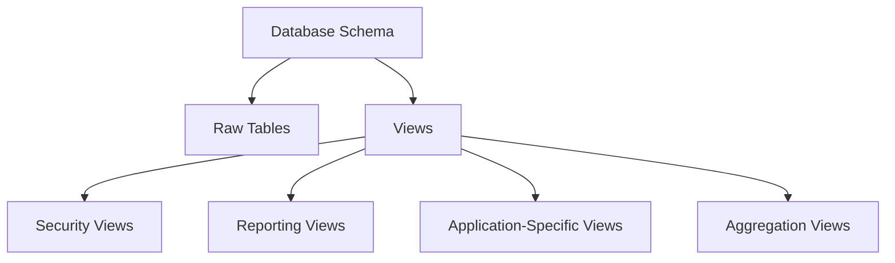

# MySQL CREATE VIEW

## Introduction

A view in MySQL is a virtual table based on the result of a SQL statement. Unlike actual tables that store data, views are dynamic queries that retrieve data from one or more tables when accessed. In this tutorial, we'll explore how to create views using the `CREATE VIEW` statement in MySQL, understand their benefits, and see practical examples of how they can simplify your database operations.

## What is a MySQL VIEW?

A view acts as a virtual table that doesn't store data physically. Instead, it presents data stored in other tables through a predefined query. Think of a view as a saved SQL query that you can reference like a regular table.

### Key Benefits of Views

- **Simplification**: Complex queries can be encapsulated into a single, easy-to-reference view
- **Security**: Limit access to specific columns or rows without exposing the entire table
- **Consistency**: Ensure consistent query results across applications
- **Data abstraction**: Hide the complexity of the database schema from end users

## CREATE VIEW Syntax

The basic syntax for creating a view in MySQL is:

```sql
CREATE 
    [OR REPLACE]
    [ALGORITHM = {UNDEFINED | MERGE | TEMPTABLE}]
    [DEFINER = user]
    [SQL SECURITY {DEFINER | INVOKER}]
VIEW view_name [(column_list)]
AS select_statement
[WITH [CASCADED | LOCAL] CHECK OPTION];
```

Let's break down these components:

- **OR REPLACE**: Optionally replaces an existing view with the same name
- **ALGORITHM**: Specifies how MySQL processes the view
- **DEFINER**: Sets which user's privileges are checked when the view is accessed
- **SQL SECURITY**: Determines whether the view is executed with the privileges of the DEFINER or INVOKER
- **view_name**: The name you give to your view
- **column_list**: Optional list of column names for the view
- **select_statement**: The SELECT query that defines what data the view will show
- **CHECK OPTION**: Ensures that any updates to the view comply with the view's defining WHERE clause

## Creating a Simple View

Let's start with a basic example. Suppose we have a `customers` table with customer information:

```sql
CREATE TABLE customers (
    customer_id INT PRIMARY KEY AUTO_INCREMENT,
    first_name VARCHAR(50),
    last_name VARCHAR(50),
    email VARCHAR(100),
    phone VARCHAR(20),
    city VARCHAR(50),
    country VARCHAR(50),
    created_at TIMESTAMP DEFAULT CURRENT_TIMESTAMP
);
```

Now, we can create a simple view to show just the customer names and contact information:

```sql
CREATE VIEW customer_contacts AS
SELECT customer_id, first_name, last_name, email, phone
FROM customers;
```

### Using the View

Once created, you can query the view just like a regular table:

```sql
SELECT * FROM customer_contacts;
```

Output:
```
+-------------+------------+-----------+-----------------------+---------------+
| customer_id | first_name | last_name | email                 | phone         |
+-------------+------------+-----------+-----------------------+---------------+
| 1           | John       | Smith     | john.smith@email.com  | 555-123-4567  |
| 2           | Mary       | Johnson   | mary.j@email.com      | 555-234-5678  |
| 3           | Robert     | Williams  | robert.w@email.com    | 555-345-6789  |
+-------------+------------+-----------+-----------------------+---------------+
```

## Creating Views with Multiple Tables

Views become particularly useful when working with complex joins across multiple tables. Let's add an `orders` table to our example:

```sql
CREATE TABLE orders (
    order_id INT PRIMARY KEY AUTO_INCREMENT,
    customer_id INT,
    order_date DATE,
    total_amount DECIMAL(10, 2),
    FOREIGN KEY (customer_id) REFERENCES customers(customer_id)
);
```

Now we can create a view that combines customer and order information:

```sql
CREATE VIEW customer_orders AS
SELECT 
    c.customer_id,
    CONCAT(c.first_name, ' ', c.last_name) AS customer_name,
    o.order_id,
    o.order_date,
    o.total_amount
FROM 
    customers c
JOIN 
    orders o ON c.customer_id = o.customer_id;
```

This view simplifies retrieving customer order information without having to write the join each time.

## Creating Views with Calculated Columns

Views can include calculations and aggregations:

```sql
CREATE VIEW customer_order_summary AS
SELECT 
    c.customer_id,
    CONCAT(c.first_name, ' ', c.last_name) AS customer_name,
    COUNT(o.order_id) AS total_orders,
    SUM(o.total_amount) AS total_spent,
    AVG(o.total_amount) AS average_order_value
FROM 
    customers c
LEFT JOIN 
    orders o ON c.customer_id = o.customer_id
GROUP BY 
    c.customer_id;
```

This view provides a summary of each customer's ordering activity.

## Using OR REPLACE Option

If you need to modify an existing view, you can use the `OR REPLACE` option:

```sql
CREATE OR REPLACE VIEW customer_contacts AS
SELECT customer_id, first_name, last_name, email, phone, city
FROM customers;
```

This updates our earlier `customer_contacts` view to include the `city` column.

## Creating Views with Custom Column Names

You can specify custom names for the columns in your view:

```sql
CREATE VIEW customer_locations (id, customer, location) AS
SELECT customer_id, CONCAT(first_name, ' ', last_name), CONCAT(city, ', ', country)
FROM customers;
```

When querying this view, the columns will use the names specified:

```sql
SELECT * FROM customer_locations;
```

Output:
```
+----+---------------+-------------------+
| id | customer      | location          |
+----+---------------+-------------------+
| 1  | John Smith    | New York, USA     |
| 2  | Mary Johnson  | London, UK        |
| 3  | Robert Williams| Paris, France    |
+----+---------------+-------------------+
```

## Using WITH CHECK OPTION

The `WITH CHECK OPTION` clause prevents updates through the view that would cause rows to no longer be included in the view. Let's create a view with this option:

```sql
CREATE VIEW us_customers AS
SELECT *
FROM customers
WHERE country = 'USA'
WITH CHECK OPTION;
```

Now, if we try to update a customer's country to something other than 'USA' through this view:

```sql
UPDATE us_customers 
SET country = 'Canada' 
WHERE customer_id = 1;
```

MySQL will reject the update with an error because it would cause the row to no longer be visible through the view.

## Practical Use Cases

### 1. Data Security

Views can limit access to sensitive data:

```sql
CREATE VIEW safe_customer_data AS
SELECT customer_id, first_name, last_name, city, country
FROM customers;
```

This view excludes private information like email and phone number.

### 2. Simplifying Complex Reports

```sql
CREATE VIEW sales_by_country AS
SELECT 
    c.country,
    COUNT(DISTINCT c.customer_id) AS number_of_customers,
    COUNT(o.order_id) AS number_of_orders,
    SUM(o.total_amount) AS total_sales
FROM 
    customers c
LEFT JOIN 
    orders o ON c.customer_id = o.customer_id
GROUP BY 
    c.country;
```

This view provides instant access to sales metrics by country without needing to recreate the complex query.

### 3. Data Consistency Across Applications

```sql
CREATE VIEW active_customers AS
SELECT * 
FROM customers
WHERE customer_id IN (
    SELECT DISTINCT customer_id 
    FROM orders 
    WHERE order_date >= DATE_SUB(CURRENT_DATE(), INTERVAL 1 YEAR)
);
```

This ensures all applications access the same definition of "active customers."

## View Limitations

While views are powerful, they do have some limitations:

1. **Performance**: Complex views with multiple joins may not perform as well as direct table queries
2. **Indexing**: You cannot create indexes directly on views
3. **Constraints**: You cannot define constraints on views
4. **Triggers**: You cannot create triggers on views
5. **Temporary Tables**: You cannot create temporary views

## Viewing Information About Views

To see information about your views, you can query the `INFORMATION_SCHEMA`:

```sql
SELECT * 
FROM INFORMATION_SCHEMA.VIEWS
WHERE TABLE_SCHEMA = 'your_database_name';
```

To see the definition of a specific view:

```sql
SHOW CREATE VIEW view_name;
```

## Organizing Your Database with Views

As your database grows, consider organizing your views by purpose:



## Summary

MySQL views provide a powerful way to simplify complex queries, enhance security, and maintain consistent data access across applications. By creating virtual tables based on SELECT statements, views help abstract the underlying database structure and make data more accessible to users with different needs.

Key points to remember:
- Views are virtual tables based on SQL queries
- They're useful for simplification, security, and consistency
- The `CREATE VIEW` statement defines the view structure and underlying query
- Views can join multiple tables, include calculations, and filter data
- The `WITH CHECK OPTION` ensures data integrity when updating through views

## Practice Exercises

1. Create a view that shows customers who have placed more than 3 orders
2. Create a view that displays the top 10 customers by total spending
3. Create a view with custom column names that joins customers with their latest order
4. Modify an existing view using `OR REPLACE`
5. Create a view that includes aggregated data by month or quarter

## Additional Resources

- [MySQL Documentation on Views](https://dev.mysql.com/doc/refman/8.0/en/views.html)
- [MySQL CREATE VIEW Reference](https://dev.mysql.com/doc/refman/8.0/en/create-view.html)
- [MySQL UPDATE VIEW Reference](https://dev.mysql.com/doc/refman/8.0/en/view-updatability.html)

With MySQL views, you can create elegant solutions for complex data access patterns while maintaining security and simplicity for your users.