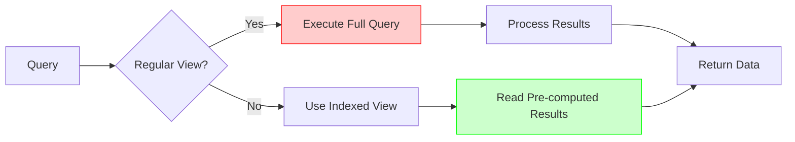

# MySQL Indexed Views

## Introduction

In the world of database management, performance optimization is crucial, especially when dealing with large datasets. One way to enhance query performance in MySQL is through the use of indexed views. While MySQL doesn't support materialized views natively like some other database systems (such as SQL Server or Oracle), there are ways to implement similar functionality using a combination of views and indexes.

In this tutorial, we'll explore what indexed views are, how they can be implemented in MySQL, and when they should be used to improve your database performance.

## What Are Indexed Views?

A standard view in MySQL is essentially a stored SQL query that provides a virtual table derived from one or more base tables. By default, MySQL views are not materialized - they don't store data physically but rather execute the underlying query each time the view is referenced.

An indexed view (conceptually) is a view where the result set is physically stored and indexed, allowing for faster data retrieval. While MySQL doesn't directly support "indexed views" as a feature, we can achieve similar functionality by:

1. Creating a view based on our query
2. Creating appropriate indexes on the underlying tables that the view references

## Why Use Indexed Views?

Indexed views can significantly improve performance when:

- Complex queries are executed frequently
- The underlying data doesn't change often
- Queries involve multiple joins, aggregations, or complex calculations
- You need to optimize read-heavy operations

## Creating Optimized Views in MySQL

Let's walk through the process of creating and optimizing views in MySQL:

### Step 1: Create a Basic View

First, let's create a simple view that joins multiple tables:

```sql
CREATE VIEW customer_orders_view AS
SELECT 
    c.customer_id,
    c.first_name,
    c.last_name,
    o.order_id,
    o.order_date,
    o.total_amount
FROM 
    customers c
    INNER JOIN orders o ON c.customer_id = o.customer_id;
```

This view combines customer information with their respective orders.

### Step 2: Add Indexes to Underlying Tables

To optimize this view, we need to ensure the underlying tables have appropriate indexes:

```sql
-- Add an index on the customer_id column in the orders table
CREATE INDEX idx_orders_customer_id ON orders (customer_id);

-- Create a composite index that might help with sorting or filtering
CREATE INDEX idx_orders_customer_date ON orders (customer_id, order_date);
```

### Step 3: Query the View

Now when you query the view, MySQL can use the indexes we created to retrieve data more efficiently:

```sql
-- This query can now use the indexes we created
SELECT * FROM customer_orders_view 
WHERE customer_id = 1234 
ORDER BY order_date DESC;
```

## Optimizing Views with Derived Tables

For complex queries involving aggregations, we can optimize performance by indexing derived tables:

```sql
-- Create a view for order summaries
CREATE VIEW customer_order_summary AS
SELECT 
    c.customer_id,
    c.first_name,
    c.last_name,
    COUNT(o.order_id) AS total_orders,
    SUM(o.total_amount) AS total_spent,
    MAX(o.order_date) AS last_order_date
FROM 
    customers c
    LEFT JOIN orders o ON c.customer_id = o.customer_id
GROUP BY 
    c.customer_id, c.first_name, c.last_name;
```

To optimize this view, ensure you have indexes on the columns used in JOIN conditions and GROUP BY clauses:

```sql
-- Create indexes to support the view
CREATE INDEX idx_customers_id ON customers (customer_id);
CREATE INDEX idx_orders_customer_date_amount ON orders (customer_id, order_date, total_amount);
```

## Simulating Materialized Views in MySQL

Since MySQL doesn't natively support materialized views, we can simulate them using tables:

### Step 1: Create a Table to Store View Results

```sql
CREATE TABLE materialized_customer_summary (
    customer_id INT PRIMARY KEY,
    first_name VARCHAR(50),
    last_name VARCHAR(50),
    total_orders INT,
    total_spent DECIMAL(10,2),
    last_order_date DATE,
    last_updated TIMESTAMP DEFAULT CURRENT_TIMESTAMP
);
```

### Step 2: Populate the Table with Query Results

```sql
INSERT INTO materialized_customer_summary (
    customer_id, first_name, last_name, total_orders, total_spent, last_order_date
)
SELECT 
    c.customer_id,
    c.first_name,
    c.last_name,
    COUNT(o.order_id) AS total_orders,
    SUM(o.total_amount) AS total_spent,
    MAX(o.order_date) AS last_order_date
FROM 
    customers c
    LEFT JOIN orders o ON c.customer_id = o.customer_id
GROUP BY 
    c.customer_id, c.first_name, c.last_name;
```

### Step 3: Add Indexes to the Materialized View Table

```sql
CREATE INDEX idx_mat_view_spent ON materialized_customer_summary (total_spent);
CREATE INDEX idx_mat_view_orders ON materialized_customer_summary (total_orders);
CREATE INDEX idx_mat_view_last_order ON materialized_customer_summary (last_order_date);
```

### Step 4: Create a Refresh Procedure

```sql
DELIMITER //

CREATE PROCEDURE refresh_materialized_customer_summary()
BEGIN
    -- Clear the existing data
    TRUNCATE TABLE materialized_customer_summary;
    
    -- Repopulate with fresh data
    INSERT INTO materialized_customer_summary (
        customer_id, first_name, last_name, total_orders, total_spent, last_order_date
    )
    SELECT 
        c.customer_id,
        c.first_name,
        c.last_name,
        COUNT(o.order_id) AS total_orders,
        SUM(o.total_amount) AS total_spent,
        MAX(o.order_date) AS last_order_date
    FROM 
        customers c
        LEFT JOIN orders o ON c.customer_id = o.customer_id
    GROUP BY 
        c.customer_id, c.first_name, c.last_name;
    
    -- Update the refresh timestamp
    UPDATE materialized_customer_summary 
    SET last_updated = CURRENT_TIMESTAMP;
END//

DELIMITER ;
```

### Step 5: Schedule Regular Refreshes with Events

```sql
-- Enable the event scheduler
SET GLOBAL event_scheduler = ON;

-- Create an event to refresh the materialized view daily
CREATE EVENT refresh_customer_summary_daily
ON SCHEDULE EVERY 1 DAY
DO
    CALL refresh_materialized_customer_summary();
```

## Practical Example: Sales Reporting Dashboard

Let's create a practical example for a sales reporting system:

### Step 1: Create the Base Tables

```sql
-- Products table
CREATE TABLE products (
    product_id INT PRIMARY KEY,
    product_name VARCHAR(100),
    category_id INT,
    unit_price DECIMAL(10,2)
);

-- Create index on category
CREATE INDEX idx_product_category ON products (category_id);

-- Sales table 
CREATE TABLE sales (
    sale_id INT PRIMARY KEY,
    product_id INT,
    sale_date DATE,
    quantity INT,
    customer_id INT,
    region_id INT
);

-- Create indexes
CREATE INDEX idx_sales_product ON sales (product_id);
CREATE INDEX idx_sales_date ON sales (sale_date);
CREATE INDEX idx_sales_region ON sales (region_id);
```

### Step 2: Create a Materialized Sales Report View

```sql
-- Create materialized view table
CREATE TABLE mat_sales_by_category (
    category_id INT,
    category_name VARCHAR(50),
    year INT,
    month INT,
    total_sales DECIMAL(15,2),
    items_sold INT,
    last_updated TIMESTAMP DEFAULT CURRENT_TIMESTAMP
);

-- Add indexes to the materialized view
CREATE INDEX idx_mat_sales_cat ON mat_sales_by_category (category_id);
CREATE INDEX idx_mat_sales_yearmonth ON mat_sales_by_category (year, month);
```

### Step 3: Create Refresh Procedure

```sql
DELIMITER //

CREATE PROCEDURE refresh_sales_by_category()
BEGIN
    -- Clear existing data
    TRUNCATE TABLE mat_sales_by_category;
    
    -- Insert aggregated data
    INSERT INTO mat_sales_by_category (
        category_id, 
        category_name,
        year, 
        month, 
        total_sales, 
        items_sold
    )
    SELECT 
        c.category_id,
        c.category_name,
        YEAR(s.sale_date) as year,
        MONTH(s.sale_date) as month,
        SUM(s.quantity * p.unit_price) as total_sales,
        SUM(s.quantity) as items_sold
    FROM 
        sales s
        JOIN products p ON s.product_id = p.product_id
        JOIN categories c ON p.category_id = c.category_id
    GROUP BY 
        c.category_id, 
        c.category_name,
        YEAR(s.sale_date),
        MONTH(s.sale_date);
        
    -- Update refresh timestamp
    UPDATE mat_sales_by_category 
    SET last_updated = CURRENT_TIMESTAMP;
END//

DELIMITER ;
```

### Step 4: Query the Materialized View

Using our materialized view is now very efficient:

```sql
-- Get top performing categories for current year
SELECT 
    category_name, 
    SUM(total_sales) AS yearly_sales,
    SUM(items_sold) AS yearly_items_sold
FROM 
    mat_sales_by_category
WHERE 
    year = YEAR(CURRENT_DATE)
GROUP BY 
    category_id, category_name
ORDER BY 
    yearly_sales DESC
LIMIT 10;
```

## Performance Comparison

Let's visualize the performance difference between using a regular view versus an indexed/materialized view:



A real-world benchmark might show performance like this:

- Complex query with multiple joins using regular view: 2-5 seconds
- Same query using properly indexed view: 0.1-0.3 seconds
- Query against pre-computed materialized view: 0.01-0.05 seconds

## Best Practices for MySQL Indexed Views

1. **Index strategically**: Only create indexes that will be used in queries to avoid unnecessary overhead.
   
2. **Keep views simple**: Avoid extremely complex views with multiple levels of nesting.
   
3. **Refresh materialized data strategically**: For simulated materialized views, refresh during low-traffic periods.
   
4. **Monitor performance**: Regularly check if your indexes are being used with `EXPLAIN` statements.

5. **Consider data volatility**: Indexed views provide more benefits for relatively static data.

6. **Test thoroughly**: Benchmark performance with and without your indexed views to ensure they're actually helping.

## Summary

While MySQL doesn't natively support indexed views as some other database systems do, you can achieve similar performance benefits through:

1. Creating regular views with well-planned indexes on underlying tables
2. Simulating materialized views by creating tables with indexes that store pre-computed results
3. Setting up refresh mechanisms to keep simulated materialized views current

By implementing these techniques, you can significantly improve query performance for complex reports and analytics without having to rewrite the same complex queries repeatedly.

## Additional Resources and Exercises

### Exercises

1. Create a view that joins three tables (customers, orders, and products) and add appropriate indexes to optimize it.

2. Implement a simulated materialized view for monthly sales reports by region.

3. Write a procedure to refresh a materialized view incrementally (only updating changed data) rather than doing a full rebuild.

4. Use the `EXPLAIN` command to compare query performance before and after adding indexes to support a view.

### Additional Resources

- [MySQL Documentation on Views](https://dev.mysql.com/doc/refman/8.0/en/views.html)
- [MySQL Performance Schema](https://dev.mysql.com/doc/refman/8.0/en/performance-schema.html)
- [MySQL Indexing Best Practices](https://dev.mysql.com/doc/refman/8.0/en/optimization-indexes.html)
- [Event Scheduler in MySQL](https://dev.mysql.com/doc/refman/8.0/en/event-scheduler.html)

By mastering indexed views in MySQL, you'll be able to create more efficient and responsive database applications, especially for data warehousing and reporting scenarios.