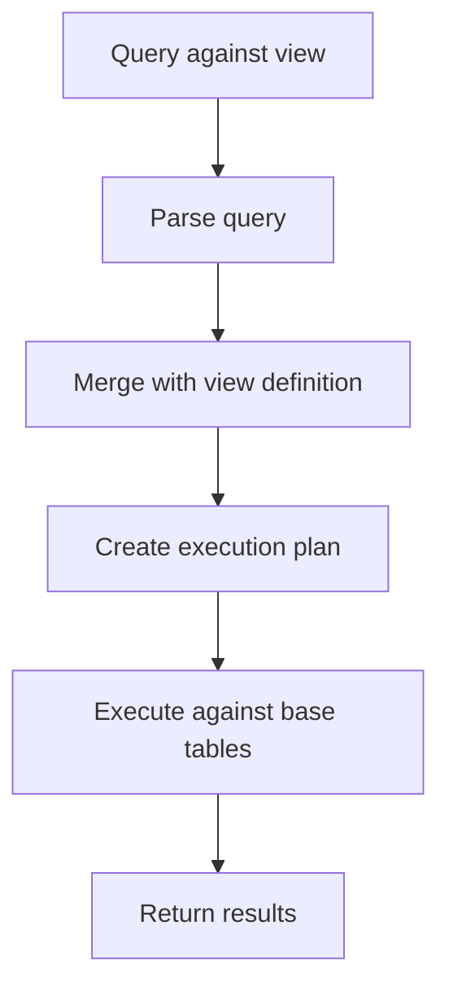

# MySQL View Performance

## Introduction

Views in MySQL provide a powerful abstraction layer that can simplify complex queries and enhance database security. However, like any database feature, they come with performance implications that developers should understand. This guide explores how views affect database performance, when to use them, and how to optimize them for better efficiency.

## Understanding View Performance Basics

Views in MySQL are essentially stored queries that act as virtual tables. When you query a view, MySQL processes the underlying query that defines the view and then applies any additional conditions from your main query.

### How MySQL Processes Views

When you query a view, MySQL generally follows these steps:

1. Parse the query against the view
2. Merge the view definition with the outer query
3. Execute the combined query against the base tables
4. Return the results

This process can have performance implications, especially with complex views.



## View Performance Factors

Several factors affect the performance of MySQL views:

### 1. Complexity of the View Definition

Views that contain complex joins, subqueries, or aggregations will naturally be slower than simpler views.

```sql
-- Simple view (faster)
CREATE VIEW simple_customers AS
SELECT customer_id, name, email FROM customers;

-- Complex view (slower)
CREATE VIEW complex_orders AS
SELECT c.name, o.order_date, SUM(oi.quantity * p.price) as total
FROM customers c
JOIN orders o ON c.customer_id = o.customer_id
JOIN order_items oi ON o.order_id = oi.order_id
JOIN products p ON oi.product_id = p.product_id
GROUP BY c.name, o.order_date;
```

### 2. Merge Algorithm

MySQL uses different algorithms to process views:

- **MERGE**: The view's query is merged with the outer query before execution
- **TEMPTABLE**: A temporary table is created to store the view results
- **UNDEFINED**: MySQL decides which algorithm to use

The MERGE algorithm is generally more efficient, but not all views can use it.

```sql
-- Explicitly specify the MERGE algorithm
CREATE ALGORITHM = MERGE VIEW customer_orders AS
SELECT c.customer_id, c.name, o.order_id, o.order_date
FROM customers c
JOIN orders o ON c.customer_id = o.customer_id;
```

### 3. Indexing on Base Tables

Views perform better when the columns used in joins, filtering, and sorting have appropriate indexes on the base tables.

## Performance Optimization Techniques

### 1. Use the EXPLAIN Statement

The `EXPLAIN` statement helps you understand how MySQL executes a view query:

```sql
-- Create a view
CREATE VIEW high_value_orders AS
SELECT customer_id, order_id, total_amount
FROM orders
WHERE total_amount > 1000;

-- Analyze the execution plan when querying the view
EXPLAIN SELECT * FROM high_value_orders WHERE customer_id = 123;
```

Example output:

```
+----+-------------+--------+------------+------+---------------+------+---------+------+------+----------+-------------+
| id | select_type | table  | partitions | type | possible_keys | key  | key_len | ref  | rows | filtered | Extra       |
+----+-------------+--------+------------+------+---------------+------+---------+------+------+----------+-------------+
|  1 | SIMPLE      | orders | NULL       | ALL  | NULL          | NULL | NULL    | NULL | 1000 |    10.00 | Using where |
+----+-------------+--------+------------+------+---------------+------+---------+------+------+----------+-------------+
```

This output indicates that MySQL is doing a full table scan, which is inefficient.

### 2. Add Appropriate Indexes

Based on the EXPLAIN results, add indexes to improve performance:

```sql
-- Add an index to improve the previous query
CREATE INDEX idx_customer_total ON orders (customer_id, total_amount);

-- Now the EXPLAIN will show a more efficient execution plan
EXPLAIN SELECT * FROM high_value_orders WHERE customer_id = 123;
```

Updated output with index:

```
+----+-------------+--------+------------+------+----------------+----------------+---------+-------+------+----------+-------------+
| id | select_type | table  | partitions | type | possible_keys  | key            | key_len | ref   | rows | filtered | Extra       |
+----+-------------+--------+------------+------+----------------+----------------+---------+-------+------+----------+-------------+
|  1 | SIMPLE      | orders | NULL       | ref  | idx_customer_total | idx_customer_total | 4       | const |   10 |    50.00 | Using where |
+----+-------------+--------+------------+------+----------------+----------------+---------+-------+------+----------+-------------+
```

### 3. Choose the Right Algorithm

For views that involve aggregations or `DISTINCT`, MySQL must use the `TEMPTABLE` algorithm, which is slower. Try to design views that can use the `MERGE` algorithm when possible:

```sql
-- This view can use the MERGE algorithm
CREATE ALGORITHM = MERGE VIEW active_customers AS
SELECT * FROM customers WHERE status = 'active';

-- This view must use the TEMPTABLE algorithm
CREATE ALGORITHM = TEMPTABLE VIEW customer_order_counts AS
SELECT customer_id, COUNT(*) as total_orders
FROM orders
GROUP BY customer_id;
```

### 4. Avoid Nested Views

Querying views that reference other views can lead to performance issues:

```sql
-- Base view
CREATE VIEW active_customers AS
SELECT * FROM customers WHERE status = 'active';

-- Nested view (can lead to performance issues)
CREATE VIEW premium_active_customers AS
SELECT * FROM active_customers WHERE membership_level = 'premium';
```

Instead, consider creating a single view or using the base tables directly.

## Real-World Example: Customer Dashboard

Let's look at a practical example for an e-commerce customer dashboard:

### Initial Approach with Complex Views

```sql
-- View for customer order statistics
CREATE VIEW customer_stats AS
SELECT 
    c.customer_id,
    c.name,
    COUNT(o.order_id) AS total_orders,
    SUM(o.total_amount) AS total_spent,
    MAX(o.order_date) AS last_order_date
FROM customers c
LEFT JOIN orders o ON c.customer_id = o.customer_id
GROUP BY c.customer_id, c.name;

-- View for recent orders
CREATE VIEW recent_customer_orders AS
SELECT 
    c.customer_id,
    o.order_id,
    o.order_date,
    o.total_amount,
    COUNT(oi.item_id) AS item_count
FROM customers c
JOIN orders o ON c.customer_id = o.customer_id
JOIN order_items oi ON o.order_id = oi.order_id
WHERE o.order_date > DATE_SUB(CURRENT_DATE, INTERVAL 30 DAY)
GROUP BY c.customer_id, o.order_id, o.order_date, o.total_amount;

-- Dashboard query (potentially slow)
SELECT 
    cs.*,
    rco.order_id,
    rco.order_date,
    rco.total_amount,
    rco.item_count
FROM customer_stats cs
LEFT JOIN recent_customer_orders rco ON cs.customer_id = rco.customer_id
WHERE cs.total_orders > 0
ORDER BY cs.total_spent DESC;
```

### Optimized Approach

```sql
-- Add appropriate indexes
CREATE INDEX idx_customer_id ON orders (customer_id);
CREATE INDEX idx_order_date ON orders (order_date);
CREATE INDEX idx_order_id ON order_items (order_id);

-- Simplified view structure
CREATE ALGORITHM = MERGE VIEW customer_dashboard AS
SELECT 
    c.customer_id,
    c.name,
    COUNT(DISTINCT o.order_id) AS total_orders,
    SUM(o.total_amount) AS total_spent,
    MAX(o.order_date) AS last_order_date,
    SUM(CASE WHEN o.order_date > DATE_SUB(CURRENT_DATE, INTERVAL 30 DAY) THEN 1 ELSE 0 END) AS recent_orders
FROM customers c
LEFT JOIN orders o ON c.customer_id = o.customer_id
GROUP BY c.customer_id, c.name;

-- More efficient query
SELECT * FROM customer_dashboard ORDER BY total_spent DESC;
```

## Performance Testing Views

Always benchmark view performance with real-world data volumes:

```sql
-- Set profiling on to measure query execution time
SET profiling = 1;

-- Execute your query
SELECT * FROM your_view WHERE some_condition;

-- Check the execution time
SHOW PROFILES;
```

## Best Practices for View Performance

1. **Keep view definitions simple** - Complex views are harder to optimize
2. **Use appropriate indexes** on underlying tables
3. **Prefer the MERGE algorithm** when possible
4. **Avoid too many nested views**
5. **Regularly analyze and optimize** tables that views depend on
6. **Use the EXPLAIN statement** to understand query execution
7. **Consider materialized views** for complex, frequently-accessed data (using triggers or scheduled events)

## Implementing a Simple Materialized View

MySQL doesn't natively support materialized views, but you can simulate them:

```sql
-- Create a table to store the materialized view data
CREATE TABLE mv_daily_sales (
    sale_date DATE PRIMARY KEY,
    total_sales DECIMAL(10,2),
    order_count INT,
    last_updated TIMESTAMP
);

-- Create a procedure to refresh the materialized view
DELIMITER //
CREATE PROCEDURE refresh_daily_sales()
BEGIN
    -- Clear existing data
    TRUNCATE TABLE mv_daily_sales;
    
    -- Insert fresh data
    INSERT INTO mv_daily_sales (sale_date, total_sales, order_count, last_updated)
    SELECT 
        DATE(order_date) AS sale_date,
        SUM(total_amount) AS total_sales,
        COUNT(*) AS order_count,
        NOW() AS last_updated
    FROM orders
    GROUP BY DATE(order_date);
END //
DELIMITER ;

-- Create an event to refresh the materialized view daily
CREATE EVENT refresh_daily_sales_event
ON SCHEDULE EVERY 1 DAY
DO CALL refresh_daily_sales();
```

## Summary

MySQL views provide a valuable abstraction layer but can impact performance if not implemented carefully. Key takeaways include:

- Views with simpler definitions perform better
- The MERGE algorithm is generally faster than TEMPTABLE
- Proper indexing of base tables is crucial for view performance
- Use EXPLAIN to analyze and optimize view queries
- Consider simulating materialized views for complex, frequently-accessed data
- Test view performance with realistic data volumes

By understanding these performance considerations, you can leverage the benefits of MySQL views while maintaining efficient database operations.

## Exercises

1. Create a view for a blog application that shows each author's post count and average comment count per post. Then use EXPLAIN to analyze its performance.

2. Take an existing complex view in your application and try to optimize it using the techniques discussed in this guide.

3. Implement a simulated materialized view for a report that aggregates daily sales data, and compare its performance to a regular view.

## Additional Resources

- [MySQL Official Documentation on View Processing Algorithms](https://dev.mysql.com/doc/refman/8.0/en/view-algorithms.html)
- [MySQL EXPLAIN Output Format](https://dev.mysql.com/doc/refman/8.0/en/explain-output.html)
- [MySQL Indexing Strategies](https://dev.mysql.com/doc/refman/8.0/en/optimization-indexes.html)