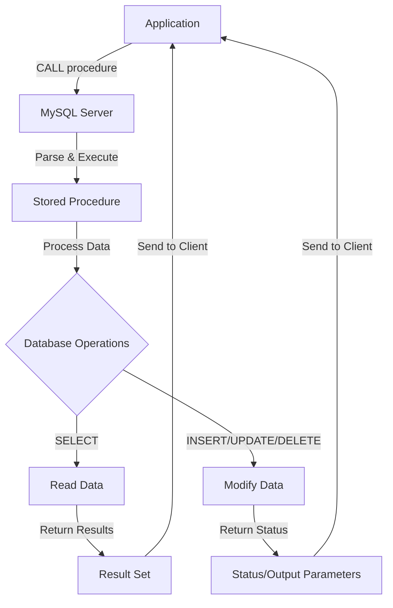

# MySQL Stored Procedure Basics

## Introduction

Stored procedures are a powerful feature in MySQL that allows you to save SQL statements in the database server for later reuse. Think of stored procedures as functions or methods in programming languages, but for your database. They can accept parameters, perform operations, and return results.

In this tutorial, you'll learn the basic concepts of MySQL stored procedures, how to create them, and how to execute them. By the end, you'll have a solid foundation to build upon for more advanced database programming.

## What is a Stored Procedure?

A stored procedure is a prepared SQL code that you can save and reuse. Instead of writing the same SQL statements over and over again, you can call a stored procedure with different parameters.

Key benefits of stored procedures include:

- **Improved Performance**: Stored procedures are compiled once and stored in executable form, so they generally run faster.
- **Reduced Network Traffic**: Multiple SQL statements can be executed as a single unit.
- **Enhanced Security**: You can grant users permission to execute procedures without giving them direct access to underlying tables.
- **Code Reusability**: Write once, use many times.
- **Maintainability**: Centralized business logic makes updates easier.

## Basic Syntax

The basic syntax for creating a stored procedure in MySQL is:

```sql
DELIMITER //

CREATE PROCEDURE procedure_name(parameters)
BEGIN
    -- SQL statements
END //

DELIMITER ;
```

Let's break down this syntax:

- `DELIMITER //`: Changes the standard delimiter (;) to a different character (//), allowing us to write multiple statements within the procedure.
- `CREATE PROCEDURE procedure_name`: Defines the name of the stored procedure.
- `parameters`: Optional input or output parameters.
- `BEGIN...END`: Contains the SQL statements to execute.
- `DELIMITER ;`: Changes the delimiter back to the standard semicolon.

## Creating Your First Stored Procedure

Let's create a simple stored procedure that returns all employees from a department:

```sql
DELIMITER //

CREATE PROCEDURE GetEmployeesByDepartment(IN deptName VARCHAR(50))
BEGIN
    SELECT employee_id, first_name, last_name, email
    FROM employees
    WHERE department = deptName;
END //

DELIMITER ;
```

This procedure accepts one parameter: `deptName`, which is the department name to filter by.

## Executing a Stored Procedure

To execute a stored procedure in MySQL, use the `CALL` statement:

```sql
CALL GetEmployeesByDepartment('Engineering');
```

**Example Output:**
```
+--------------+------------+-----------+------------------------+
| employee_id  | first_name | last_name | email                  |
+--------------+------------+-----------+------------------------+
| 101          | John       | Doe       | john.doe@example.com   |
| 102          | Jane       | Smith     | jane.smith@example.com |
| 103          | Robert     | Johnson   | robert.j@example.com   |
+--------------+------------+-----------+------------------------+
```

## Parameter Types

MySQL stored procedures support three types of parameters:

1. **IN parameters**: Values passed into the procedure (input only).
2. **OUT parameters**: Values returned from the procedure (output only).
3. **INOUT parameters**: Values that are both passed in and returned (input and output).

Let's see examples of each:

### IN Parameter Example (We've already seen this)

```sql
CREATE PROCEDURE GetEmployeesByDepartment(IN deptName VARCHAR(50))
BEGIN
    SELECT * FROM employees WHERE department = deptName;
END //
```

### OUT Parameter Example

```sql
DELIMITER //

CREATE PROCEDURE CountEmployees(IN deptName VARCHAR(50), OUT total INT)
BEGIN
    SELECT COUNT(*) INTO total
    FROM employees
    WHERE department = deptName;
END //

DELIMITER ;
```

To call this procedure and get the result:

```sql
SET @total = 0;
CALL CountEmployees('Engineering', @total);
SELECT @total AS 'Number of Employees';
```

**Example Output:**
```
+---------------------+
| Number of Employees |
+---------------------+
| 3                   |
+---------------------+
```

### INOUT Parameter Example

```sql
DELIMITER //

CREATE PROCEDURE DoubleValue(INOUT num INT)
BEGIN
    SET num = num * 2;
END //

DELIMITER ;
```

To call this procedure:

```sql
SET @value = 5;
CALL DoubleValue(@value);
SELECT @value AS 'Result';
```

**Example Output:**
```
+--------+
| Result |
+--------+
| 10     |
+--------+
```

## Variables in Stored Procedures

You can declare and use variables within stored procedures to hold temporary data:

```sql
DELIMITER //

CREATE PROCEDURE CalculateAverageSalary(IN deptName VARCHAR(50))
BEGIN
    DECLARE avgSalary DECIMAL(10,2);
    
    SELECT AVG(salary) INTO avgSalary
    FROM employees
    WHERE department = deptName;
    
    SELECT CONCAT('Average salary in ', deptName, ' is $', avgSalary) AS Info;
END //

DELIMITER ;
```

Calling this procedure:

```sql
CALL CalculateAverageSalary('Engineering');
```

**Example Output:**
```
+------------------------------------------+
| Info                                     |
+------------------------------------------+
| Average salary in Engineering is $85000  |
+------------------------------------------+
```

## Control Flow Statements

MySQL stored procedures support various control flow statements:

### IF-ELSE Statement

```sql
DELIMITER //

CREATE PROCEDURE CheckSalaryRange(IN employeeId INT)
BEGIN
    DECLARE empSalary DECIMAL(10,2);
    
    SELECT salary INTO empSalary
    FROM employees
    WHERE employee_id = employeeId;
    
    IF empSalary > 80000 THEN
        SELECT 'High Salary Range' AS Status;
    ELSEIF empSalary > 50000 THEN
        SELECT 'Medium Salary Range' AS Status;
    ELSE
        SELECT 'Low Salary Range' AS Status;
    END IF;
END //

DELIMITER ;
```

### CASE Statement

```sql
DELIMITER //

CREATE PROCEDURE GetDepartmentCategory(IN deptName VARCHAR(50))
BEGIN
    CASE deptName
        WHEN 'Engineering' THEN 
            SELECT 'Technical' AS Category;
        WHEN 'Marketing' THEN 
            SELECT 'Business' AS Category;
        WHEN 'Human Resources' THEN 
            SELECT 'Administrative' AS Category;
        ELSE
            SELECT 'Other' AS Category;
    END CASE;
END //

DELIMITER ;
```

## Loops in Stored Procedures

MySQL provides several types of loops for repetitive tasks:

### WHILE Loop

```sql
DELIMITER //

CREATE PROCEDURE GenerateSeries(IN start INT, IN end INT)
BEGIN
    DECLARE counter INT;
    DECLARE result VARCHAR(500) DEFAULT '';
    
    SET counter = start;
    
    WHILE counter <= end DO
        SET result = CONCAT(result, counter, ',');
        SET counter = counter + 1;
    END WHILE;
    
    -- Remove trailing comma
    SET result = SUBSTRING(result, 1, LENGTH(result) - 1);
    
    SELECT result AS Series;
END //

DELIMITER ;
```

### REPEAT Loop

```sql
DELIMITER //

CREATE PROCEDURE CountDown(IN start INT)
BEGIN
    DECLARE counter INT;
    DECLARE result VARCHAR(500) DEFAULT '';
    
    SET counter = start;
    
    REPEAT
        SET result = CONCAT(result, counter, ',');
        SET counter = counter - 1;
    UNTIL counter < 1 END REPEAT;
    
    -- Remove trailing comma
    SET result = SUBSTRING(result, 1, LENGTH(result) - 1);
    
    SELECT result AS Countdown;
END //

DELIMITER ;
```

## Real-World Example: Order Processing System

Let's create a practical example for an e-commerce system where we need to process orders:

```sql
DELIMITER //

CREATE PROCEDURE ProcessOrder(
    IN customerId INT,
    IN productId INT,
    IN quantity INT,
    OUT orderSuccess BOOLEAN,
    OUT message VARCHAR(255)
)
BEGIN
    DECLARE productPrice DECIMAL(10,2);
    DECLARE productStock INT;
    DECLARE totalAmount DECIMAL(10,2);
    DECLARE orderID INT;
    
    -- Check product availability
    SELECT price, stock INTO productPrice, productStock
    FROM products
    WHERE id = productId;
    
    -- Validate product exists
    IF productPrice IS NULL THEN
        SET orderSuccess = FALSE;
        SET message = CONCAT('Product ID ', productId, ' does not exist');
    -- Check sufficient stock
    ELSEIF productStock < quantity THEN
        SET orderSuccess = FALSE;
        SET message = CONCAT('Insufficient stock. Available: ', productStock);
    -- Process order
    ELSE
        START TRANSACTION;
        
        -- Calculate total
        SET totalAmount = productPrice * quantity;
        
        -- Create order record
        INSERT INTO orders (customer_id, order_date, total_amount)
        VALUES (customerId, NOW(), totalAmount);
        
        SET orderID = LAST_INSERT_ID();
        
        -- Add order details
        INSERT INTO order_details (order_id, product_id, quantity, unit_price)
        VALUES (orderID, productId, quantity, productPrice);
        
        -- Update product stock
        UPDATE products 
        SET stock = stock - quantity
        WHERE id = productId;
        
        COMMIT;
        
        SET orderSuccess = TRUE;
        SET message = CONCAT('Order successfully created. Order ID: ', orderID);
    END IF;
END //

DELIMITER ;
```

To use this procedure:

```sql
SET @success = FALSE;
SET @message = '';
CALL ProcessOrder(101, 5, 2, @success, @message);
SELECT @success AS Success, @message AS Message;
```

**Example Output (Successful Order):**
```
+---------+--------------------------------------+
| Success | Message                              |
+---------+--------------------------------------+
| 1       | Order successfully created. Order ID: 257 |
+---------+--------------------------------------+
```

**Example Output (Failed Order):**
```
+---------+--------------------------------------+
| Success | Message                              |
+---------+--------------------------------------+
| 0       | Insufficient stock. Available: 1     |
+---------+--------------------------------------+
```

## Managing Stored Procedures

### Viewing Stored Procedures

To see all stored procedures in your database:

```sql
SHOW PROCEDURE STATUS WHERE db = 'your_database_name';
```

To view the code of a specific procedure:

```sql
SHOW CREATE PROCEDURE procedure_name;
```

### Modifying a Stored Procedure

To modify a stored procedure, you need to drop and recreate it:

```sql
DROP PROCEDURE IF EXISTS procedure_name;
-- Then recreate with the new definition
```

### Dropping a Stored Procedure

To delete a stored procedure:

```sql
DROP PROCEDURE IF EXISTS procedure_name;
```

## Error Handling in Stored Procedures

MySQL provides error handling capabilities through the `DECLARE HANDLER` syntax:

```sql
DELIMITER //

CREATE PROCEDURE SafeDivide(IN numerator DECIMAL(10,2), IN denominator DECIMAL(10,2))
BEGIN
    DECLARE result DECIMAL(10,2);
    DECLARE division_error BOOL DEFAULT FALSE;
    
    -- Declare error handler
    DECLARE CONTINUE HANDLER FOR SQLEXCEPTION
    SET division_error = TRUE;
    
    IF denominator = 0 THEN
        SELECT 'Error: Cannot divide by zero' AS Message;
    ELSE
        SET result = numerator / denominator;
        SELECT result AS Result;
    END IF;
END //

DELIMITER ;
```

## Workflow Diagram for Stored Procedures

Here's a visual representation of the stored procedure workflow:



## Summary

In this tutorial, you've learned the fundamentals of MySQL stored procedures including:

- The basic syntax for creating stored procedures
- How to declare and use parameters (IN, OUT, INOUT)
- Working with variables within stored procedures
- Control flow statements like IF-ELSE and CASE
- Loop structures for repetitive tasks
- Real-world examples of how stored procedures can be applied
- Managing stored procedures in your database

Stored procedures are an essential tool in your MySQL toolkit that can help make your database applications more efficient, secure, and maintainable. They provide a way to encapsulate complex logic directly within the database server.

## Exercises

To practice what you've learned:

1. Create a stored procedure that accepts a customer ID and returns their total purchases.
2. Write a procedure that updates employee salary by a percentage based on their performance rating.
3. Develop a stored procedure to archive old records from a transaction table to a history table.
4. Create a procedure that generates a sales report for a given date range.
5. Write an error-handling procedure that validates user input before performing database operations.

## Additional Resources

- [MySQL Official Documentation on Stored Procedures](https://dev.mysql.com/doc/refman/8.0/en/stored-procedures.html)
- [MySQL Stored Procedure Best Practices](https://dev.mysql.com/doc/refman/8.0/en/stored-program-restrictions.html)
- [Advanced Stored Procedures and Triggers](https://dev.mysql.com/doc/refman/8.0/en/trigger-syntax.html)

Now that you understand the basics of MySQL stored procedures, you're ready to implement them in your own projects to improve performance and maintainability of your database applications.