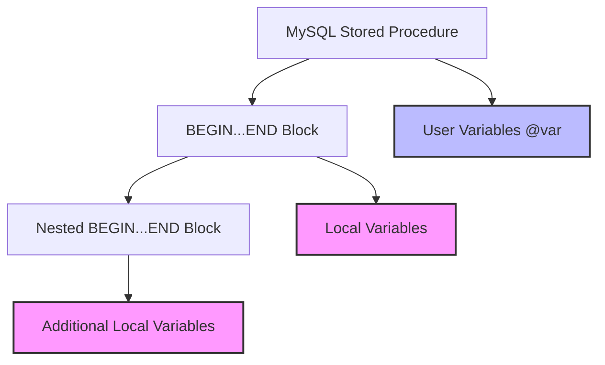

# MySQL Local Variables

In MySQL stored procedures, local variables are essential tools that allow you to temporarily store and manipulate data within the procedure's scope. These variables help you create more dynamic and flexible stored procedures by storing intermediate results, controlling program flow, and improving code readability.

## What Are Local Variables?

Local variables in MySQL:

- Exist only within the context of a stored procedure or function
- Must be declared before use
- Have a specific data type
- Are accessible only within the block where they are declared
- Are automatically destroyed when the procedure execution ends

## Declaring Local Variables

To use local variables in your stored procedures, you must first declare them using the `DECLARE` statement. The basic syntax is:

```sql
DECLARE variable_name data_type [DEFAULT default_value];
```

Where:
- `variable_name`: The name of your variable (should follow MySQL naming conventions)
- `data_type`: Any valid MySQL data type (INT, VARCHAR, DECIMAL, etc.)
- `default_value`: Optional initial value for the variable

### Basic Declaration Examples

```sql
-- Declaring an integer variable
DECLARE counter INT;

-- Declaring a variable with a default value
DECLARE customer_name VARCHAR(100) DEFAULT 'Unknown';

-- Declaring multiple variables of the same type
DECLARE total_amount, discount_amount DECIMAL(10,2);

-- Declaring a date variable with current date as default
DECLARE today_date DATE DEFAULT CURRENT_DATE();
```

## Setting Values to Variables

After declaration, you can assign values to local variables using the `SET` statement or within a `SELECT ... INTO` statement.

### Using SET Statement

```sql
SET variable_name = value;
```

### Using SELECT INTO Statement

```sql
SELECT column_name INTO variable_name FROM table_name WHERE condition;
```

## Complete Working Example

Let's create a stored procedure that calculates the total price with tax:

```sql
DELIMITER //

CREATE PROCEDURE CalculateTotalWithTax(
    IN product_price DECIMAL(10,2),
    IN tax_rate DECIMAL(5,2),
    OUT total_price DECIMAL(10,2)
)
BEGIN
    -- Declare a local variable
    DECLARE tax_amount DECIMAL(10,2);
    
    -- Calculate tax amount
    SET tax_amount = product_price * (tax_rate / 100);
    
    -- Calculate total price
    SET total_price = product_price + tax_amount;
    
    -- Display information (for demonstration)
    SELECT CONCAT('Product Price: $', product_price) AS 'Information';
    SELECT CONCAT('Tax Amount: $', tax_amount) AS 'Information';
    SELECT CONCAT('Total Price: $', total_price) AS 'Information';
END //

DELIMITER ;
```

### How to Use the Procedure

```sql
-- Create a variable to store the result
SET @total = 0;

-- Call the procedure
CALL CalculateTotalWithTax(100, 7.5, @total);

-- Display the result
SELECT @total AS 'Total Price with Tax';
```

### Output

```
Information
Product Price: $100.00

Information
Tax Amount: $7.50

Information
Total Price: $107.50

Total Price with Tax
107.50
```

## Variable Scope in MySQL

Understanding variable scope is crucial when working with local variables:



- **Local variables** are only accessible within the block where they're declared
- If you declare a variable inside a nested block, it's only accessible within that nested block
- Variables with the same name in different scopes are treated as different variables

## Local Variables vs. User Variables

| Feature | Local Variables | User Variables |
|---------|----------------|---------------|
| Prefix  | None           | @ symbol      |
| Scope   | Procedure-level | Session-level |
| Declaration | Requires DECLARE | No declaration needed |
| Lifetime | Until procedure ends | Until session ends |

## Practical Examples

### Example 1: Loop with Counter Variable

```sql
DELIMITER //

CREATE PROCEDURE GenerateFibonacci(IN n INT)
BEGIN
    DECLARE i INT DEFAULT 2;
    DECLARE fib1 INT DEFAULT 0;
    DECLARE fib2 INT DEFAULT 1;
    DECLARE fib INT;
    
    -- Create a temporary table to store results
    DROP TEMPORARY TABLE IF EXISTS fibonacci_sequence;
    CREATE TEMPORARY TABLE fibonacci_sequence (position INT, value INT);
    
    -- Insert initial values
    INSERT INTO fibonacci_sequence VALUES (1, fib1);
    INSERT INTO fibonacci_sequence VALUES (2, fib2);
    
    -- Generate Fibonacci sequence
    WHILE i < n DO
        SET i = i + 1;
        SET fib = fib1 + fib2;
        INSERT INTO fibonacci_sequence VALUES (i, fib);
        SET fib1 = fib2;
        SET fib2 = fib;
    END WHILE;
    
    -- Display the sequence
    SELECT * FROM fibonacci_sequence;
    
    -- Clean up
    DROP TEMPORARY TABLE fibonacci_sequence;
END//

DELIMITER ;
```

Using the procedure:

```sql
CALL GenerateFibonacci(10);
```

Output:
```
position    value
1           0
2           1
3           1
4           2
5           3
6           5
7           8
8           13
9           21
10          34
```

### Example 2: Working with Date Variables

```sql
DELIMITER //

CREATE PROCEDURE CalculateDaysBetweenDates(
    IN start_date DATE,
    IN end_date DATE
)
BEGIN
    DECLARE days_difference INT;
    DECLARE is_leap_year BOOLEAN;
    DECLARE year_to_check INT;
    
    -- Calculate days between dates
    SET days_difference = DATEDIFF(end_date, start_date);
    
    -- Check if the end year is a leap year
    SET year_to_check = YEAR(end_date);
    SET is_leap_year = (year_to_check % 4 = 0 AND year_to_check % 100 <> 0) OR (year_to_check % 400 = 0);
    
    -- Display results
    SELECT 
        start_date AS 'Start Date',
        end_date AS 'End Date',
        days_difference AS 'Days Between',
        IF(is_leap_year, 'Yes', 'No') AS 'End Year Is Leap Year';
END //

DELIMITER ;
```

Using the procedure:

```sql
CALL CalculateDaysBetweenDates('2023-01-01', '2024-03-15');
```

Output:
```
Start Date    End Date      Days Between    End Year Is Leap Year
2023-01-01    2024-03-15    439             Yes
```

## Best Practices for Local Variables

1. **Use meaningful names** - Choose descriptive names that explain the purpose of the variable
2. **Initialize variables** - Always provide default values when possible
3. **Use appropriate data types** - Select the most suitable data type for your variables
4. **Limit variable scope** - Declare variables in the smallest scope necessary
5. **Comment your variables** - Add comments to explain complex variables
6. **Use consistent naming conventions** - Follow standard naming conventions like snake_case or camelCase

## Common Issues and Solutions

### Issue: Variable Not Declared

```sql
-- This will cause an error
CREATE PROCEDURE BadProcedure()
BEGIN
    SET counter = 1; -- Error: Variable 'counter' not declared
END
```

**Solution**: Always declare variables before using them.

```sql
CREATE PROCEDURE GoodProcedure()
BEGIN
    DECLARE counter INT;
    SET counter = 1; -- This works correctly
END
```

### Issue: Incorrect Data Type

```sql
-- This might cause unexpected results
DECLARE price DECIMAL(5,2);
SET price = 1234.56; -- Will be truncated to 999.99
```

**Solution**: Use appropriate data type sizes.

```sql
DECLARE price DECIMAL(8,2); -- Can handle larger numbers
SET price = 1234.56; -- Works as expected
```

## Summary

Local variables in MySQL stored procedures provide a way to temporarily store and manipulate data. They help create more dynamic, flexible, and readable code. To use local variables effectively:

1. Declare them with the appropriate data type using the `DECLARE` statement
2. Assign values using `SET` or `SELECT INTO` statements
3. Use them within their scope (typically a BEGIN...END block)
4. Understand their differences from user variables (which use @ prefix)

Local variables are essential building blocks for creating complex stored procedures that handle data manipulation, loop control, conditional logic, and more.

## Exercises

1. Create a stored procedure that takes a product name and price as input, then calculates and displays the price after a 15% discount.

2. Write a stored procedure that accepts a string and counts the number of vowels in it using local variables.

3. Create a procedure that calculates the compound interest on a principal amount over a period of time using the formula A = P(1 + r/n)^(nt), where all parameters are inputs and the result is stored in a local variable.

4. Write a stored procedure that generates a random password of a specified length using local variables to track the password construction.

## Additional Resources

- [MySQL Official Documentation on Variables](https://dev.mysql.com/doc/refman/8.0/en/local-variable-scope.html)
- [MySQL Control Flow Functions](https://dev.mysql.com/doc/refman/8.0/en/flow-control-functions.html)
- [MySQL Data Types](https://dev.mysql.com/doc/refman/8.0/en/data-types.html)