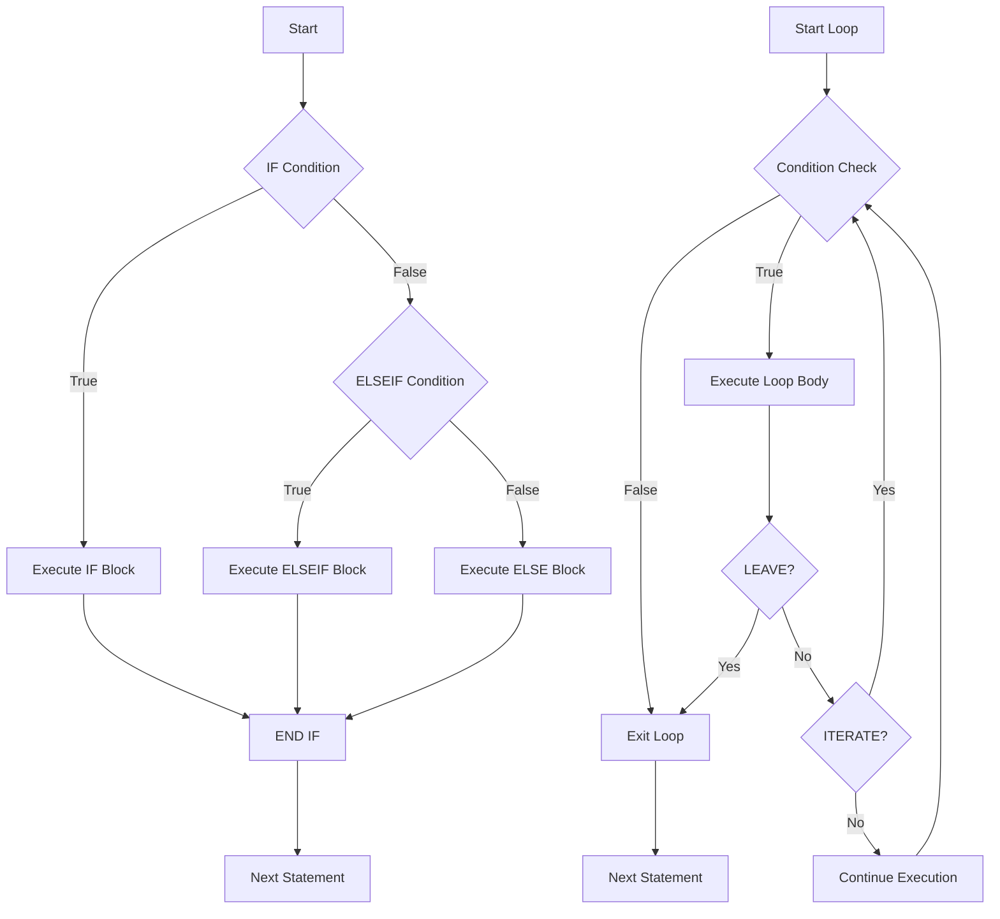

# MySQL Control Flow

In the world of MySQL stored procedures, control flow statements allow you to create dynamic and intelligent database logic. Control flow determines which blocks of code execute based on certain conditions, enabling you to build sophisticated database procedures that can make decisions and repeat operations as needed.

## Introduction to Control Flow in MySQL

Control flow statements let you control the execution path of your stored procedures. They provide the crucial ability to implement business logic within your database layer. MySQL supports various control flow constructs including:

- Conditional statements (`IF`, `CASE`)
- Loop statements (`WHILE`, `REPEAT`, `LOOP`)
- Flow control statements (`LEAVE`, `ITERATE`)

Understanding these control flow mechanisms is essential for developing effective stored procedures that can handle complex business rules and data processing requirements.

## Conditional Statements

### IF Statement

The `IF` statement allows you to execute code blocks conditionally based on specified expressions.

#### Basic Syntax

```sql
IF condition THEN
    -- statements executed when condition is TRUE
ELSEIF another_condition THEN
    -- statements executed when another_condition is TRUE
ELSE
    -- statements executed when all conditions are FALSE
END IF;
```

#### Example: Customer Classification

Let's create a stored procedure that classifies customers based on their purchase amount:

```sql
DELIMITER //

CREATE PROCEDURE ClassifyCustomer(
    IN customerTotalPurchase DECIMAL(10,2),
    OUT customerCategory VARCHAR(20)
)
BEGIN
    IF customerTotalPurchase >= 10000 THEN
        SET customerCategory = 'Premium';
    ELSEIF customerTotalPurchase >= 5000 THEN
        SET customerCategory = 'Gold';
    ELSEIF customerTotalPurchase >= 1000 THEN
        SET customerCategory = 'Silver';
    ELSE
        SET customerCategory = 'Regular';
    END IF;
END //

DELIMITER ;
```

To call this procedure:

```sql
CALL ClassifyCustomer(7500, @category);
SELECT @category AS CustomerCategory;
```

Output:
```
+------------------+
| CustomerCategory |
+------------------+
| Gold             |
+------------------+
```

### CASE Statement

The `CASE` statement provides another way to implement conditional logic, often resulting in more readable code when dealing with multiple conditions.

#### Basic Syntax

```sql
CASE 
    WHEN condition1 THEN result1
    WHEN condition2 THEN result2
    ...
    ELSE resultN
END CASE;
```

Or the simple form:

```sql
CASE expression
    WHEN value1 THEN result1
    WHEN value2 THEN result2
    ...
    ELSE resultN
END CASE;
```

#### Example: Order Status Description

Let's create a procedure that returns a status description based on a numeric status code:

```sql
DELIMITER //

CREATE PROCEDURE GetOrderStatusDescription(
    IN statusCode INT,
    OUT statusDescription VARCHAR(50)
)
BEGIN
    CASE statusCode
        WHEN 1 THEN SET statusDescription = 'Processing';
        WHEN 2 THEN SET statusDescription = 'Shipped';
        WHEN 3 THEN SET statusDescription = 'Delivered';
        WHEN 4 THEN SET statusDescription = 'Cancelled';
        WHEN 5 THEN SET statusDescription = 'Returned';
        ELSE SET statusDescription = 'Unknown Status';
    END CASE;
END //

DELIMITER ;
```

To call this procedure:

```sql
CALL GetOrderStatusDescription(3, @description);
SELECT @description AS OrderStatus;
```

Output:
```
+-------------+
| OrderStatus |
+-------------+
| Delivered   |
+-------------+
```

## Loop Statements

Loops allow you to execute a block of code repeatedly until a certain condition is met. MySQL provides three types of loops: `WHILE`, `REPEAT`, and `LOOP`.

### WHILE Loop

The `WHILE` loop executes a block of code as long as the specified condition is true.

#### Basic Syntax

```sql
WHILE condition DO
    -- statements to execute
END WHILE;
```

#### Example: Calculating Factorial

```sql
DELIMITER //

CREATE PROCEDURE CalculateFactorial(
    IN n INT,
    OUT result BIGINT
)
BEGIN
    DECLARE i INT DEFAULT 1;
    SET result = 1;
    
    WHILE i <= n DO
        SET result = result * i;
        SET i = i + 1;
    END WHILE;
END //

DELIMITER ;
```

To call this procedure:

```sql
CALL CalculateFactorial(5, @factorial);
SELECT @factorial AS Factorial;
```

Output:
```
+-----------+
| Factorial |
+-----------+
| 120       |
+-----------+
```

### REPEAT Loop

The `REPEAT` loop executes a block of code at least once and then repeatedly as long as the specified condition is FALSE (it checks the condition at the end of each iteration).

#### Basic Syntax

```sql
REPEAT
    -- statements to execute
UNTIL condition
END REPEAT;
```

#### Example: Finding the First Power of 2 Greater Than a Number

```sql
DELIMITER //

CREATE PROCEDURE FindNextPowerOfTwo(
    IN startNumber INT,
    OUT result INT
)
BEGIN
    SET result = 1;
    
    REPEAT
        SET result = result * 2;
    UNTIL result > startNumber
    END REPEAT;
END //

DELIMITER ;
```

To call this procedure:

```sql
CALL FindNextPowerOfTwo(100, @nextPower);
SELECT @nextPower AS NextPowerOfTwo;
```

Output:
```
+---------------+
| NextPowerOfTwo|
+---------------+
| 128           |
+---------------+
```

### LOOP Statement

The `LOOP` statement provides a way to create an infinite loop which must be exited explicitly using a `LEAVE` statement.

#### Basic Syntax

```sql
[label:] LOOP
    -- statements to execute
    IF condition THEN
        LEAVE [label];
    END IF;
END LOOP [label];
```

#### Example: Generating a Fibonacci Sequence

```sql
DELIMITER //

CREATE PROCEDURE GenerateFibonacci(
    IN n INT
)
BEGIN
    DECLARE i INT DEFAULT 2;
    DECLARE fib1 INT DEFAULT 0;
    DECLARE fib2 INT DEFAULT 1;
    DECLARE fib3 INT;
    
    -- Print first two Fibonacci numbers
    SELECT fib1 AS 'Fibonacci_0';
    SELECT fib2 AS 'Fibonacci_1';
    
    fibonacci_loop: LOOP
        IF i >= n THEN
            LEAVE fibonacci_loop;
        END IF;
        
        SET fib3 = fib1 + fib2;
        SELECT fib3 AS CONCAT('Fibonacci_', i);
        
        SET fib1 = fib2;
        SET fib2 = fib3;
        SET i = i + 1;
    END LOOP fibonacci_loop;
END //

DELIMITER ;
```

To call this procedure:

```sql
CALL GenerateFibonacci(8);
```

Output:
```
+-------------+
| Fibonacci_0 |
+-------------+
| 0           |
+-------------+

+-------------+
| Fibonacci_1 |
+-------------+
| 1           |
+-------------+

+-------------+
| Fibonacci_2 |
+-------------+
| 1           |
+-------------+

... and so on until Fibonacci_7
```

## Flow Control Statements

### LEAVE Statement

The `LEAVE` statement is used to exit a flow control construct such as a loop or begin-end block.

```sql
LEAVE label;
```

### ITERATE Statement

The `ITERATE` statement skips the remaining statements in the current iteration and starts a new iteration of the loop.

```sql
ITERATE label;
```

#### Example: Generate Even Numbers

```sql
DELIMITER //

CREATE PROCEDURE GenerateEvenNumbers(
    IN maxNumber INT
)
BEGIN
    DECLARE counter INT DEFAULT 0;
    
    numbers_loop: LOOP
        SET counter = counter + 1;
        
        -- If counter exceeds maxNumber, exit the loop
        IF counter > maxNumber THEN
            LEAVE numbers_loop;
        END IF;
        
        -- Skip odd numbers
        IF counter % 2 != 0 THEN
            ITERATE numbers_loop;
        END IF;
        
        -- Print even numbers
        SELECT counter AS EvenNumber;
    END LOOP numbers_loop;
END //

DELIMITER ;
```

To call this procedure:

```sql
CALL GenerateEvenNumbers(10);
```

Output:
```
+------------+
| EvenNumber |
+------------+
| 2          |
+------------+

+------------+
| EvenNumber |
+------------+
| 4          |
+------------+

... and so on until 10
```

## Real-World Applications

### Example 1: Processing Orders with Status Updates

This example demonstrates how to process orders with different statuses using control flow statements:

```sql
DELIMITER //

CREATE PROCEDURE ProcessPendingOrders()
BEGIN
    DECLARE done INT DEFAULT 0;
    DECLARE orderID INT;
    DECLARE orderStatus VARCHAR(20);
    DECLARE orderTotal DECIMAL(10,2);
    
    -- Declare cursor for pending orders
    DECLARE orderCursor CURSOR FOR
        SELECT id, status, total FROM orders WHERE status = 'pending';
    
    -- Declare handler for when no more rows exist
    DECLARE CONTINUE HANDLER FOR NOT FOUND SET done = 1;
    
    -- Open the cursor
    OPEN orderCursor;
    
    -- Start processing orders
    order_loop: LOOP
        -- Fetch the next order
        FETCH orderCursor INTO orderID, orderStatus, orderTotal;
        
        -- Exit when no more orders
        IF done = 1 THEN
            LEAVE order_loop;
        END IF;
        
        -- Process based on order total
        IF orderTotal > 1000 THEN
            -- Update order status to prioritized
            UPDATE orders SET status = 'prioritized' WHERE id = orderID;
            INSERT INTO order_logs (order_id, message) 
                VALUES (orderID, 'Order prioritized due to high value');
        ELSE
            -- Update order status to processing
            UPDATE orders SET status = 'processing' WHERE id = orderID;
            INSERT INTO order_logs (order_id, message) 
                VALUES (orderID, 'Order moved to processing');
        END IF;
    END LOOP order_loop;
    
    -- Close the cursor
    CLOSE orderCursor;
    
    SELECT 'Orders processed successfully' AS Message;
END //

DELIMITER ;
```

### Example 2: Customer Account Maintenance

This example shows a procedure that performs annual account maintenance with different actions based on account activity:

```sql
DELIMITER //

CREATE PROCEDURE AnnualAccountMaintenance()
BEGIN
    DECLARE done INT DEFAULT 0;
    DECLARE accountID INT;
    DECLARE lastActivityDate DATE;
    DECLARE accountBalance DECIMAL(10,2);
    DECLARE accountStatus VARCHAR(20);
    
    -- Declare cursor for customer accounts
    DECLARE accountCursor CURSOR FOR
        SELECT id, last_activity_date, balance, status FROM customer_accounts;
    
    -- Declare handler for when no more rows exist
    DECLARE CONTINUE HANDLER FOR NOT FOUND SET done = 1;
    
    -- Open the cursor
    OPEN accountCursor;
    
    -- Start processing accounts
    account_loop: LOOP
        -- Fetch the next account
        FETCH accountCursor INTO accountID, lastActivityDate, accountBalance, accountStatus;
        
        -- Exit when no more accounts
        IF done = 1 THEN
            LEAVE account_loop;
        END IF;
        
        -- Skip accounts that are already closed
        IF accountStatus = 'closed' THEN
            ITERATE account_loop;
        END IF;
        
        -- Check for inactive accounts (no activity in 2 years)
        IF DATEDIFF(CURRENT_DATE, lastActivityDate) > 730 THEN
            IF accountBalance <= 0 THEN
                -- Close inactive accounts with zero or negative balance
                UPDATE customer_accounts 
                SET status = 'closed', close_reason = 'Inactivity', close_date = CURRENT_DATE
                WHERE id = accountID;
                
                INSERT INTO account_logs (account_id, action, message)
                VALUES (accountID, 'CLOSE', 'Account closed due to inactivity and zero balance');
            ELSE
                -- Mark inactive accounts with positive balance
                UPDATE customer_accounts 
                SET status = 'dormant'
                WHERE id = accountID AND status != 'dormant';
                
                -- Send notification
                INSERT INTO notifications (account_id, type, message)
                VALUES (accountID, 'DORMANT', 'Your account has been marked as dormant due to inactivity');
            END IF;
        ELSE
            -- For active accounts, check if annual fee applies
            CASE
                WHEN accountBalance < 1000 THEN
                    -- Apply annual fee for low-balance accounts
                    UPDATE customer_accounts 
                    SET balance = balance - 25, 
                        last_fee_date = CURRENT_DATE
                    WHERE id = accountID;
                    
                    INSERT INTO transactions (account_id, type, amount, description)
                    VALUES (accountID, 'FEE', 25, 'Annual maintenance fee');
                
                WHEN accountBalance >= 10000 THEN
                    -- Apply bonus for high-balance accounts
                    UPDATE customer_accounts 
                    SET balance = balance * 1.005, 
                        last_bonus_date = CURRENT_DATE
                    WHERE id = accountID;
                    
                    INSERT INTO transactions (account_id, type, amount, description)
                    VALUES (accountID, 'BONUS', accountBalance * 0.005, 'Annual loyalty bonus');
            END CASE;
        END IF;
    END LOOP account_loop;
    
    -- Close the cursor
    CLOSE accountCursor;
    
    SELECT 'Annual account maintenance completed' AS Message;
END //

DELIMITER ;
```

## Flow Control Visualization

Here's a visual representation of how different control flow statements work in MySQL:



## Best Practices for Control Flow

1. **Use meaningful labels**: When using loops, provide meaningful labels to make your code more readable and maintainable.

2. **Avoid infinite loops**: Always ensure there is a valid exit condition for your loops.

3. **Handle exceptions**: Use handlers to catch exceptions and handle them gracefully.

4. **Choose the appropriate construct**: Select the most appropriate control flow construct for your task:
   - Use `IF` for simple conditional logic
   - Use `CASE` for multi-value conditions
   - Use `WHILE` when you need to check the condition before entering the loop
   - Use `REPEAT` when you need to execute the loop at least once
   - Use `LOOP` with `LEAVE` for more complex loop conditions

5. **Limit nesting**: Excessive nesting of control flow statements can make code hard to read and debug.

## Summary

MySQL control flow statements provide powerful tools for creating dynamic and intelligent database logic within stored procedures. We've covered:

- Conditional statements (`IF` and `CASE`) for decision making
- Loop statements (`WHILE`, `REPEAT`, and `LOOP`) for iterative operations
- Flow control statements (`LEAVE` and `ITERATE`) for managing execution flow
- Real-world examples demonstrating practical applications

By mastering these control flow constructs, you can create sophisticated stored procedures that handle complex business rules and automate database operations efficiently.

## Exercises

To reinforce your understanding of MySQL control flow statements, try these exercises:

1. Create a stored procedure that calculates the sum of all integers from 1 to n using a WHILE loop.

2. Write a procedure that takes a string and returns it with all vowels removed using a loop and the ITERATE statement.

3. Implement a procedure that classifies products into price categories (Budget, Mid-range, Premium) using IF-ELSE statements.

4. Create a procedure that simulates a simple interest calculation for different account types using CASE statements.

5. Design a procedure that processes a batch of records and handles errors using appropriate control flow constructs.

## Additional Resources

- [MySQL Official Documentation on Flow Control Statements](https://dev.mysql.com/doc/refman/8.0/en/flow-control-statements.html)
- [MySQL Stored Procedures Tutorial](https://www.mysqltutorial.org/mysql-stored-procedure-tutorial.aspx)
- [MySQL Error Handling in Stored Procedures](https://dev.mysql.com/doc/refman/8.0/en/declare-handler.html)

Remember that mastering control flow in MySQL stored procedures comes with practice. Start with simple examples and gradually build more complex logic as you become more comfortable with the syntax and behavior of different control flow constructs.