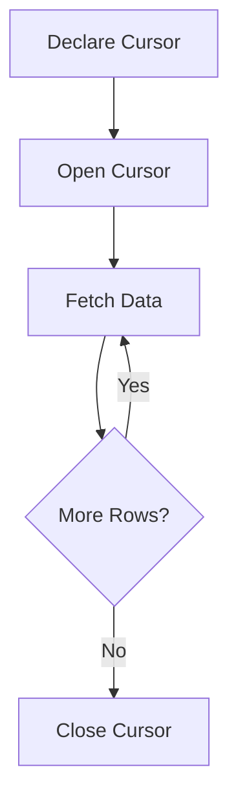

# MySQL Cursors

## Introduction

In MySQL stored procedures, there are times when you need to process each row of a result set individually, applying specific logic to each record. This is where cursors come into play. A cursor is a database object that allows you to traverse through the rows of a result set one by one, enabling row-by-row processing within stored procedures.

While MySQL's set-based operations are generally more efficient, cursors provide a way to perform operations that require individual row processing. This tutorial will guide you through understanding and implementing cursors in MySQL stored procedures.

## What is a Cursor?

A cursor is essentially a pointer to a single row in a result set. It enables you to:

1. Process rows individually in a result set
2. Examine and potentially modify data in each row
3. Control the flow of row processing with custom logic



## Cursor Lifecycle

Working with cursors in MySQL involves four main steps:

1. **Declare** - Define the cursor and associate it with a SELECT statement
2. **Open** - Execute the SELECT statement and prepare the result set
3. **Fetch** - Retrieve data from the result set one row at a time
4. **Close** - Release the resources associated with the cursor

Let's look at each step in detail.

## Declaring a Cursor

To declare a cursor in a stored procedure, you use the `DECLARE CURSOR` statement:

```sql
DECLARE cursor_name CURSOR FOR 
    SELECT column1, column2, ... 
    FROM table_name 
    WHERE condition;
```

The SELECT statement can be any valid query, including joins, conditions, and sorting.

## Opening a Cursor

To start working with a cursor, you must open it using:

```sql
OPEN cursor_name;
```

This executes the SELECT statement defined in the cursor declaration and prepares the result set for row-by-row traversal.

## Fetching Data from a Cursor

To retrieve data from a cursor, you use the `FETCH` statement:

```sql
FETCH cursor_name INTO variable1, variable2, ...;
```

The variables must be previously declared and match the number and type of columns in the cursor's SELECT statement.

## Handling End of Data

Since cursors process data row by row, you need a way to know when you've reached the end of the result set. MySQL provides a special condition handler for this:

```sql
DECLARE CONTINUE HANDLER FOR NOT FOUND SET done = TRUE;
```

This handler sets a boolean variable (which you must declare) to TRUE when there are no more rows to fetch.

## Closing a Cursor

When you're done with a cursor, you should close it to free up resources:

```sql
CLOSE cursor_name;
```

## Complete Cursor Example

Let's put it all together with a simple example of a stored procedure that uses a cursor:

```sql
DELIMITER //

CREATE PROCEDURE GetCustomerOrders()
BEGIN
    -- Declare variables
    DECLARE done INT DEFAULT FALSE;
    DECLARE cust_id INT;
    DECLARE cust_name VARCHAR(100);
    DECLARE order_count INT;
    
    -- Declare the cursor
    DECLARE customer_cursor CURSOR FOR 
        SELECT id, name, (SELECT COUNT(*) FROM orders WHERE customer_id = c.id) as order_count
        FROM customers c
        ORDER BY name;
    
    -- Declare handler for end of result set
    DECLARE CONTINUE HANDLER FOR NOT FOUND SET done = TRUE;
    
    -- Create a temporary table to store results
    DROP TEMPORARY TABLE IF EXISTS customer_order_summary;
    CREATE TEMPORARY TABLE customer_order_summary (
        customer_id INT,
        customer_name VARCHAR(100),
        total_orders INT
    );
    
    -- Open the cursor
    OPEN customer_cursor;
    
    -- Start the reading loop
    read_loop: LOOP
        -- Fetch the data into variables
        FETCH customer_cursor INTO cust_id, cust_name, order_count;
        
        -- Exit the loop if no more rows
        IF done THEN
            LEAVE read_loop;
        END IF;
        
        -- Process the current row (insert into temporary table)
        INSERT INTO customer_order_summary 
        VALUES (cust_id, cust_name, order_count);
        
    END LOOP;
    
    -- Close the cursor
    CLOSE customer_cursor;
    
    -- Return the results
    SELECT * FROM customer_order_summary;
    DROP TEMPORARY TABLE IF EXISTS customer_order_summary;
END //

DELIMITER ;
```

This stored procedure:
1. Declares a cursor for a query that gets customer information and their order count
2. Creates a temporary table to store processed results
3. Loops through each customer, storing their information in the temporary table
4. Returns the final result set

To call this procedure:

```sql
CALL GetCustomerOrders();
```

Example output:

```
+-------------+---------------+--------------+
| customer_id | customer_name | total_orders |
+-------------+---------------+--------------+
|           1 | John Smith    |            3 |
|           2 | Jane Doe      |            1 |
|           3 | Bob Johnson   |            5 |
|           4 | Alice Brown   |            0 |
+-------------+---------------+--------------+
4 rows in set (0.02 sec)
```

## Real-World Application: Batch Processing

Cursors are particularly useful for batch processing operations. Let's create an example where we need to adjust product prices based on different rules for each category:

```sql
DELIMITER //

CREATE PROCEDURE AdjustProductPrices()
BEGIN
    -- Declare variables
    DECLARE done INT DEFAULT FALSE;
    DECLARE prod_id INT;
    DECLARE prod_category VARCHAR(50);
    DECLARE prod_price DECIMAL(10,2);
    DECLARE new_price DECIMAL(10,2);
    
    -- Declare cursor for products
    DECLARE product_cursor CURSOR FOR 
        SELECT id, category, price FROM products
        WHERE active = TRUE;
    
    -- Declare handler
    DECLARE CONTINUE HANDLER FOR NOT FOUND SET done = TRUE;
    
    -- Create log table if it doesn't exist
    CREATE TABLE IF NOT EXISTS price_adjustment_log (
        product_id INT,
        old_price DECIMAL(10,2),
        new_price DECIMAL(10,2),
        adjustment_date DATETIME
    );
    
    -- Open cursor
    OPEN product_cursor;
    
    -- Process each product
    process_loop: LOOP
        FETCH product_cursor INTO prod_id, prod_category, prod_price;
        
        IF done THEN
            LEAVE process_loop;
        END IF;
        
        -- Apply different rules based on category
        CASE prod_category
            WHEN 'Electronics' THEN
                SET new_price = prod_price * 0.95; -- 5% discount
            WHEN 'Clothing' THEN
                SET new_price = prod_price * 0.90; -- 10% discount
            WHEN 'Premium' THEN
                SET new_price = prod_price * 1.10; -- 10% increase
            ELSE
                SET new_price = prod_price; -- No change
        END CASE;
        
        -- Update the product price if changed
        IF new_price != prod_price THEN
            UPDATE products SET price = new_price WHERE id = prod_id;
            
            -- Log the change
            INSERT INTO price_adjustment_log 
            VALUES (prod_id, prod_price, new_price, NOW());
        END IF;
        
    END LOOP;
    
    -- Close cursor
    CLOSE product_cursor;
    
    -- Return summary of adjustments
    SELECT COUNT(*) AS 'Products Updated',
           ROUND(SUM(old_price - new_price), 2) AS 'Total Price Difference'
    FROM price_adjustment_log
    WHERE adjustment_date >= CURDATE();
    
END //

DELIMITER ;
```

In this example, the cursor processes each product individually, applies category-specific pricing rules, and logs any changes made.

## When to Use (and When Not to Use) Cursors

### Good Use Cases for Cursors

1. **Complex row-by-row operations** - When you need to apply different logic to each row
2. **Batch processing** - Processing large datasets in manageable chunks
3. **Importing/exporting data** - When rows need individual transformation or validation
4. **Generating reports** - When building complex summary reports with conditional logic

### When to Avoid Cursors

1. **Simple updates** - Use standard UPDATE statements for bulk operations
2. **Performance-critical code** - Cursors are generally slower than set-based operations
3. **Large datasets without batching** - Processing millions of rows with a cursor can be inefficient

## Best Practices for MySQL Cursors

1. **Use sparingly** - Consider if set-based operations can achieve the same result more efficiently
2. **Handle errors properly** - Implement appropriate error handling
3. **Always close cursors** - Don't leave cursors open after use
4. **Use appropriate FETCH clauses** - Match the number of variables with columns in the SELECT
5. **Consider batching** - When processing large datasets, consider batch processing

## Advanced Cursor Features

### Cursor Attributes

MySQL cursors have associated attributes that provide status information:

- `%FOUND` - Returns 1 if the most recent FETCH found a row
- `%NOTFOUND` - Returns 1 if the most recent FETCH did not find a row
- `%ROWCOUNT` - Returns the number of rows fetched so far

However, these attributes are not directly supported in MySQL as they are in some other database systems. Instead, MySQL uses handlers to detect the NOT FOUND condition.

### Cursor Sensitivity

MySQL cursors are ASENSITIVE by default, meaning they may or may not reflect changes made to the underlying tables after the cursor is opened. You cannot currently specify SENSITIVE or INSENSITIVE cursors in MySQL.

## Summary

MySQL cursors provide a way to process result sets row by row in stored procedures when set-based operations aren't suitable. While they have performance implications, they're invaluable for complex row-by-row processing.

We've covered:
- The cursor lifecycle: declare, open, fetch, and close
- How to handle the end of result sets
- Real-world applications of cursors
- Best practices and when to use (or avoid) cursors

Remember that while cursors are powerful, they should be used judiciously as set-based operations are typically more efficient in MySQL.

## Exercises

1. Create a stored procedure that uses a cursor to generate a report of products that haven't been ordered in the last 30 days.
2. Modify the `AdjustProductPrices` procedure to include a transaction that can be rolled back if any errors occur.
3. Create a stored procedure that uses a cursor to identify and flag inactive customers (those who haven't placed orders in 90 days).
4. Implement a batch processing procedure that uses a cursor to process records in chunks of 100 rows at a time.
5. Create a procedure that uses multiple cursors to compare data between two similar tables.

## Additional Resources

- [MySQL Official Documentation on Cursors](https://dev.mysql.com/doc/refman/8.0/en/cursors.html)
- [MySQL Stored Procedures](https://dev.mysql.com/doc/refman/8.0/en/stored-programs-defining.html)

By understanding how to use cursors effectively, you'll be better equipped to handle complex data processing requirements in your MySQL stored procedures.