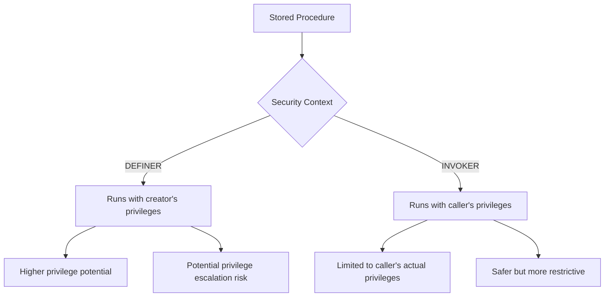

# MySQL Procedure Security

When working with stored procedures in MySQL, understanding security considerations is crucial. Proper security practices help protect your database from unauthorized access and potential malicious attacks. In this article, we'll explore the security aspects of MySQL stored procedures and how to implement them effectively.

## Understanding Procedure Security

MySQL stored procedures operate under specific security contexts that determine who can execute them and what privileges they have during execution. Two primary aspects of procedure security are:

1. **Execution Privileges**: Who can call the procedure
2. **Security Context**: Under whose privileges the procedure runs

Let's dive into these concepts in detail.

## Procedure Execution Privileges

Before a user can execute a stored procedure, they must have the `EXECUTE` privilege for that procedure. This privilege controls access to the procedure itself.

### Granting Execute Privileges

Here's how to grant execution privileges to users:

```sql
-- Grant execute privilege on a specific procedure
GRANT EXECUTE ON PROCEDURE database_name.procedure_name TO 'username'@'host';

-- Grant execute privilege on all procedures in a database
GRANT EXECUTE ON database_name.* TO 'username'@'host';
```

### Example: Setting Up User Execution Rights

```sql
-- Create a procedure for inventory management
DELIMITER //
CREATE PROCEDURE inventory.update_stock(IN product_id INT, IN quantity INT)
BEGIN
    UPDATE products SET stock = stock + quantity WHERE id = product_id;
END //
DELIMITER ;

-- Grant a warehouse user execute rights to this procedure
GRANT EXECUTE ON PROCEDURE inventory.update_stock TO 'warehouse_user'@'localhost';
```

With this setup, `warehouse_user` can update product stock levels through the procedure without having direct UPDATE privileges on the products table.

## SQL Security Context: DEFINER vs. INVOKER

One of the most important security concepts for stored procedures is the SQL SECURITY attribute, which determines under whose privileges the procedure executes.

### DEFINER Security

By default, procedures use DEFINER security context, which means they execute with the privileges of the user who created the procedure.

```sql
DELIMITER //
CREATE PROCEDURE get_customer_details(IN customer_id INT)
SQL SECURITY DEFINER
BEGIN
    SELECT * FROM customers WHERE id = customer_id;
END //
DELIMITER ;
```

In this example, no matter who calls the procedure, it will run with the privileges of its creator (the DEFINER).

### INVOKER Security

Alternatively, you can specify that a procedure should run with the privileges of the user who calls it (the INVOKER):

```sql
DELIMITER //
CREATE PROCEDURE get_public_products()
SQL SECURITY INVOKER
BEGIN
    SELECT id, name, price FROM products WHERE is_public = TRUE;
END //
DELIMITER ;
```

With INVOKER security, the procedure will run with the calling user's privileges, requiring them to have the necessary permissions on the underlying tables.

## Security Context Implications

The choice between DEFINER and INVOKER has significant security implications:



### When to Use DEFINER Security

DEFINER security is useful when:
- You want to provide controlled access to sensitive data
- You want to implement operations that require privileges the end user shouldn't have directly

### When to Use INVOKER Security

INVOKER security is preferable when:
- The procedure should respect the caller's access limitations
- You want to prevent privilege escalation attacks
- You're implementing row-level security that depends on the current user

## Practical Security Examples

Let's explore some practical examples of secure procedure implementation.

### Example 1: Controlled Data Access with DEFINER Context

In this example, we create a procedure that allows users to access customer data without giving them direct SELECT privileges on the customers table:

```sql
-- Create the procedure
DELIMITER //
CREATE PROCEDURE get_customer_contact(IN customer_id INT)
SQL SECURITY DEFINER
BEGIN
    -- Only return non-sensitive contact information
    SELECT name, email, phone 
    FROM customers 
    WHERE id = customer_id;
END //
DELIMITER ;

-- Create user with execute privileges only
CREATE USER 'support_agent'@'localhost' IDENTIFIED BY 'password';
GRANT EXECUTE ON PROCEDURE crm.get_customer_contact TO 'support_agent'@'localhost';
```

The support agent can now retrieve customer contact details without having direct access to the full customers table or other sensitive information.

### Example 2: Implementing Row-Level Security with INVOKER Context

This example demonstrates how to implement row-level security for a multi-tenant application:

```sql
-- Create the procedure
DELIMITER //
CREATE PROCEDURE get_my_company_data()
SQL SECURITY INVOKER
BEGIN
    DECLARE current_company_id INT;
    
    -- Get the company ID for the current user
    SELECT company_id INTO current_company_id 
    FROM user_profiles 
    WHERE username = CURRENT_USER();
    
    -- Return only data for the user's company
    SELECT * FROM company_data 
    WHERE company_id = current_company_id;
END //
DELIMITER ;
```

When users call this procedure, they only see data for their own company.

## Best Practices for Procedure Security

To ensure your stored procedures remain secure, follow these best practices:

### 1. Principle of Least Privilege

Grant only the necessary privileges to each procedure and user.

```sql
-- Instead of granting all privileges
-- GRANT ALL ON database.* TO 'user'@'host'; -- Too permissive!

-- Grant only what's needed
GRANT SELECT ON database.customers TO 'procedure_user'@'localhost';
GRANT INSERT ON database.audit_log TO 'procedure_user'@'localhost';
```

### 2. Validate Input Parameters

Always validate input parameters to prevent SQL injection:

```sql
DELIMITER //
CREATE PROCEDURE safe_user_search(IN search_term VARCHAR(50))
SQL SECURITY DEFINER
BEGIN
    -- Validate input length
    IF LENGTH(search_term) < 3 THEN
        SIGNAL SQLSTATE '45000' SET MESSAGE_TEXT = 'Search term too short';
    END IF;
    
    -- Use prepared statement instead of dynamic SQL
    SET @query = CONCAT('%', search_term, '%');
    
    -- Use the prepared statement parameter
    SELECT * FROM users WHERE username LIKE @query;
END //
DELIMITER ;
```

### 3. Audit Procedure Usage

Implement auditing to track who executes sensitive procedures:

```sql
DELIMITER //
CREATE PROCEDURE update_salary(IN emp_id INT, IN new_salary DECIMAL(10,2))
SQL SECURITY DEFINER
BEGIN
    -- Log the action before executing it
    INSERT INTO audit_log (action_type, performed_by, affected_table, timestamp)
    VALUES ('UPDATE_SALARY', CURRENT_USER(), 'employees', NOW());
    
    -- Perform the actual update
    UPDATE employees SET salary = new_salary WHERE id = emp_id;
END //
DELIMITER ;
```

### 4. Regularly Review DEFINER Accounts

Procedures with SQL SECURITY DEFINER are particularly important to review:

```sql
-- Query to find all DEFINER procedures and their security context
SELECT 
    ROUTINE_SCHEMA, 
    ROUTINE_NAME, 
    ROUTINE_TYPE,
    DEFINER,
    SECURITY_TYPE
FROM 
    INFORMATION_SCHEMA.ROUTINES
WHERE 
    ROUTINE_TYPE = 'PROCEDURE';
```

Regularly check if the DEFINER accounts still exist and if their privileges are appropriate.

## Managing Procedure Security

### Viewing Security Attributes

You can view a procedure's security attributes using the SHOW CREATE statement:

```sql
SHOW CREATE PROCEDURE database_name.procedure_name;
```

The output will include the SQL SECURITY setting and the DEFINER.

### Altering Procedure Security

To change a procedure's security settings, you need to recreate it:

```sql
-- Get the procedure definition first
SHOW CREATE PROCEDURE database_name.procedure_name;

-- Drop and recreate with new security context
DROP PROCEDURE database_name.procedure_name;

-- Recreate with the new security context
CREATE PROCEDURE procedure_name ...
SQL SECURITY INVOKER
...
```

## Common Security Pitfalls

### Excessive Privileges

Avoid creating procedures with DEFINER accounts that have excessive privileges:

```sql
-- Problematic: Procedure defined by 'root'@'localhost'
CREATE DEFINER='root'@'localhost' PROCEDURE dangerous_proc()
SQL SECURITY DEFINER
BEGIN
    -- Any user with EXECUTE privileges gets root-level access here!
END;
```

### Dynamic SQL Risks

Be extremely careful with dynamic SQL in procedures, as it can lead to SQL injection:

```sql
-- DON'T DO THIS: Unsafe dynamic SQL
DELIMITER //
CREATE PROCEDURE unsafe_search(IN table_name VARCHAR(64), IN search_col VARCHAR(64), IN search_term VARCHAR(64))
SQL SECURITY DEFINER
BEGIN
    SET @sql = CONCAT('SELECT * FROM ', table_name, 
                      ' WHERE ', search_col, ' LIKE "%', search_term, '%"');
    PREPARE stmt FROM @sql;
    EXECUTE stmt;
    DEALLOCATE PREPARE stmt;
END //
DELIMITER ;
```

A safer approach uses prepared statements with parameters:

```sql
-- Better approach with parameter validation
DELIMITER //
CREATE PROCEDURE safer_search(IN table_name VARCHAR(64), IN search_col VARCHAR(64), IN search_term VARCHAR(64))
SQL SECURITY DEFINER
BEGIN
    -- Validate inputs against allowed values
    IF table_name NOT IN ('products', 'categories') THEN
        SIGNAL SQLSTATE '45000' SET MESSAGE_TEXT = 'Invalid table name';
    END IF;
    
    IF search_col NOT IN ('name', 'description') THEN
        SIGNAL SQLSTATE '45000' SET MESSAGE_TEXT = 'Invalid column name';
    END IF;
    
    SET @sql = CONCAT('SELECT * FROM ', table_name, ' WHERE ', search_col, ' LIKE ?');
    SET @search_pattern = CONCAT('%', search_term, '%');
    
    PREPARE stmt FROM @sql;
    EXECUTE stmt USING @search_pattern;
    DEALLOCATE PREPARE stmt;
END //
DELIMITER ;
```

## Summary

MySQL procedure security involves managing both who can execute procedures and in what security context they run. Key points to remember:

- Use `GRANT EXECUTE` to control who can call a procedure
- Choose between `SQL SECURITY DEFINER` and `SQL SECURITY INVOKER` based on your security needs
- Always validate input parameters and be careful with dynamic SQL
- Implement the principle of least privilege throughout your database
- Regularly audit and review procedure security settings

By following these security practices, you can build stored procedures that provide the functionality you need while keeping your database secure from unauthorized access and potential attacks.

## Additional Resources

For further learning about MySQL procedure security, consider exploring:

- MySQL official documentation on [Stored Program Security](https://dev.mysql.com/doc/refman/8.0/en/stored-programs-security.html)
- The `mysql.proc` table (MySQL 5.7 and earlier) or `information_schema.routines` (MySQL 8.0+) to view procedure metadata
- Database security best practices for your specific MySQL version

## Exercises

1. Create a procedure that allows users to update their own profile information using INVOKER security context.
2. Implement a logging system that records all calls to critical procedures in your database.
3. Audit an existing database for procedures using DEFINER security and evaluate if they follow best practices.
4. Create a procedure that safely implements dynamic SQL with proper input validation and prepared statements.
5. Design a row-level security system using stored procedures for a multi-tenant application.