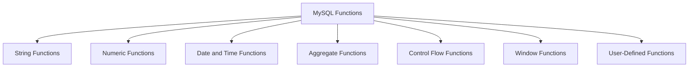

# MySQL Function Types

In MySQL databases, functions are predefined operations that allow you to transform, calculate, or manipulate data. Understanding the different types of functions available in MySQL is essential for writing efficient queries and effectively working with your data.

## Introduction to MySQL Functions

MySQL functions are operations that take input parameters, perform specific calculations or data manipulations, and return a result. They help simplify complex operations and make your SQL code more readable and maintainable.

Functions in MySQL can be broadly categorized into several types:



Let's explore each type in detail.

## 1. String Functions

String functions in MySQL are used to manipulate character and string data.

### Common String Functions

| Function | Description | Example |
|----------|-------------|---------|
| `CONCAT()` | Combines strings | `CONCAT('Hello', ' ', 'World')` |
| `LENGTH()` | Returns string length | `LENGTH('MySQL')` |
| `UPPER()` | Converts to uppercase | `UPPER('hello')` |
| `LOWER()` | Converts to lowercase | `LOWER('HELLO')` |
| `SUBSTRING()` | Extracts part of a string | `SUBSTRING('MySQL', 1, 2)` |
| `TRIM()` | Removes leading/trailing spaces | `TRIM('  MySQL  ')` |

### Practical Example

```sql
SELECT 
    first_name,
    last_name,
    CONCAT(first_name, ' ', last_name) AS full_name,
    UPPER(last_name) AS last_name_upper,
    LENGTH(first_name) AS name_length
FROM employees
LIMIT 5;
```

**Output:**
```
+-----------+-----------+---------------+----------------+-------------+
| first_name| last_name | full_name     | last_name_upper| name_length |
+-----------+-----------+---------------+----------------+-------------+
| John      | Doe       | John Doe      | DOE            | 4           |
| Jane      | Smith     | Jane Smith    | SMITH          | 4           |
| Mark      | Johnson   | Mark Johnson  | JOHNSON        | 4           |
| Sarah     | Williams  | Sarah Williams| WILLIAMS       | 5           |
| Michael   | Brown     | Michael Brown | BROWN          | 7           |
+-----------+-----------+---------------+----------------+-------------+
```

## 2. Numeric Functions

Numeric functions perform mathematical operations on numeric data.

### Common Numeric Functions

| Function | Description | Example |
|----------|-------------|---------|
| `ABS()` | Returns absolute value | `ABS(-15)` |
| `ROUND()` | Rounds a number | `ROUND(10.56, 1)` |
| `CEILING()` | Rounds up to nearest integer | `CEILING(15.2)` |
| `FLOOR()` | Rounds down to nearest integer | `FLOOR(15.9)` |
| `RAND()` | Random value between 0 and 1 | `RAND()` |
| `POW()` | Value raised to the power | `POW(2, 3)` |

### Practical Example

```sql
SELECT 
    product_id,
    price,
    ROUND(price, 1) AS rounded_price,
    CEILING(price) AS ceiling_price,
    FLOOR(price) AS floor_price,
    ABS(price - 50) AS price_diff_from_50
FROM products
LIMIT 5;
```

**Output:**
```
+------------+-------+---------------+--------------+-------------+------------------+
| product_id | price | rounded_price | ceiling_price| floor_price | price_diff_from_50 |
+------------+-------+---------------+--------------+-------------+------------------+
| 1          | 45.75 | 45.8          | 46           | 45          | 4.25            |
| 2          | 29.99 | 30.0          | 30           | 29          | 20.01           |
| 3          | 99.50 | 99.5          | 100          | 99          | 49.50           |
| 4          | 15.25 | 15.3          | 16           | 15          | 34.75           |
| 5          | 50.00 | 50.0          | 50           | 50          | 0.00            |
+------------+-------+---------------+--------------+-------------+------------------+
```

## 3. Date and Time Functions

Date and time functions help manipulate and format date and time values.

### Common Date and Time Functions

| Function | Description | Example |
|----------|-------------|---------|
| `NOW()` | Current date and time | `NOW()` |
| `CURDATE()` | Current date | `CURDATE()` |
| `CURTIME()` | Current time | `CURTIME()` |
| `DATE_FORMAT()` | Formats date | `DATE_FORMAT(NOW(), '%Y-%m-%d')` |
| `DATEDIFF()` | Difference between dates | `DATEDIFF('2023-12-31', '2023-01-01')` |
| `DATE_ADD()` | Add interval to date | `DATE_ADD(NOW(), INTERVAL 1 DAY)` |

### Practical Example

```sql
SELECT 
    order_id,
    order_date,
    DATE_FORMAT(order_date, '%M %d, %Y') AS formatted_date,
    DATEDIFF(CURDATE(), order_date) AS days_ago,
    DATE_ADD(order_date, INTERVAL 14 DAY) AS delivery_deadline
FROM orders
LIMIT 5;
```

**Output:**
```
+----------+------------+------------------+---------+-------------------+
| order_id | order_date | formatted_date   | days_ago| delivery_deadline |
+----------+------------+------------------+---------+-------------------+
| 1001     | 2023-09-10 | September 10, 2023| 21      | 2023-09-24        |
| 1002     | 2023-09-15 | September 15, 2023| 16      | 2023-09-29        |
| 1003     | 2023-09-20 | September 20, 2023| 11      | 2023-10-04        |
| 1004     | 2023-09-25 | September 25, 2023| 6       | 2023-10-09        |
| 1005     | 2023-09-30 | September 30, 2023| 1       | 2023-10-14        |
+----------+------------+------------------+---------+-------------------+
```

## 4. Aggregate Functions

Aggregate functions perform calculations on sets of values and return a single value. They are commonly used with `GROUP BY` clauses.

### Common Aggregate Functions

| Function | Description | Example |
|----------|-------------|---------|
| `COUNT()` | Count rows | `COUNT(employee_id)` |
| `SUM()` | Sum of values | `SUM(salary)` |
| `AVG()` | Average of values | `AVG(price)` |
| `MIN()` | Minimum value | `MIN(age)` |
| `MAX()` | Maximum value | `MAX(score)` |
| `GROUP_CONCAT()` | Concatenates values from group | `GROUP_CONCAT(name)` |

### Practical Example

```sql
SELECT 
    department_id,
    COUNT(*) AS employee_count,
    AVG(salary) AS avg_salary,
    MIN(salary) AS min_salary,
    MAX(salary) AS max_salary,
    SUM(salary) AS total_salary
FROM employees
GROUP BY department_id
LIMIT 5;
```

**Output:**
```
+--------------+----------------+------------+------------+------------+--------------+
| department_id| employee_count | avg_salary | min_salary | max_salary | total_salary |
+--------------+----------------+------------+------------+------------+--------------+
| 1            | 15             | 65000.00   | 45000.00   | 95000.00   | 975000.00    |
| 2            | 12             | 72000.00   | 52000.00   | 110000.00  | 864000.00    |
| 3            | 8              | 58000.00   | 48000.00   | 78000.00   | 464000.00    |
| 4            | 20             | 61500.00   | 42000.00   | 88000.00   | 1230000.00   |
| 5            | 6              | 81000.00   | 65000.00   | 125000.00  | 486000.00    |
+--------------+----------------+------------+------------+------------+--------------+
```

## 5. Control Flow Functions

Control flow functions help implement conditional logic in your SQL queries.

### Common Control Flow Functions

| Function | Description | Example |
|----------|-------------|---------|
| `IF()` | Simple if/else | `IF(score > 60, 'Pass', 'Fail')` |
| `CASE` | Multiple conditions | Complex case expressions |
| `IFNULL()` | Replace NULL with value | `IFNULL(phone, 'N/A')` |
| `NULLIF()` | Return NULL if equal | `NULLIF(a, b)` |
| `COALESCE()` | First non-NULL value | `COALESCE(val1, val2, val3)` |

### Practical Example

```sql
SELECT 
    product_name,
    stock_quantity,
    IF(stock_quantity > 0, 'In Stock', 'Out of Stock') AS stock_status,
    CASE 
        WHEN stock_quantity > 100 THEN 'High Stock'
        WHEN stock_quantity BETWEEN 20 AND 100 THEN 'Medium Stock'
        WHEN stock_quantity > 0 THEN 'Low Stock'
        ELSE 'Out of Stock'
    END AS stock_level,
    IFNULL(discount, 0) AS discount_value
FROM products
LIMIT 5;
```

**Output:**
```
+--------------+----------------+-------------+-------------+---------------+
| product_name | stock_quantity | stock_status| stock_level | discount_value|
+--------------+----------------+-------------+-------------+---------------+
| Laptop       | 45             | In Stock    | Medium Stock| 5.00          |
| Smartphone   | 120            | In Stock    | High Stock  | 10.00         |
| Tablet       | 0              | Out of Stock| Out of Stock| 0.00          |
| Headphones   | 15             | In Stock    | Low Stock   | 2.50          |
| Monitor      | 75             | In Stock    | Medium Stock| 0.00          |
+--------------+----------------+-------------+-------------+---------------+
```

## 6. Window Functions

Window functions (available in MySQL 8.0+) perform calculations across rows related to the current row.

### Common Window Functions

| Function | Description | Example |
|----------|-------------|---------|
| `ROW_NUMBER()` | Sequential row number | `ROW_NUMBER() OVER(PARTITION BY dept)` |
| `RANK()` | Rank with gaps | `RANK() OVER(ORDER BY salary DESC)` |
| `DENSE_RANK()` | Rank without gaps | `DENSE_RANK() OVER(ORDER BY score)` |
| `NTILE()` | Divide into buckets | `NTILE(4) OVER(ORDER BY value)` |
| `LAG()` | Value from previous row | `LAG(salary) OVER(ORDER BY hire_date)` |
| `LEAD()` | Value from next row | `LEAD(salary) OVER(ORDER BY hire_date)` |

### Practical Example

```sql
SELECT 
    employee_id,
    department_id,
    salary,
    ROW_NUMBER() OVER(PARTITION BY department_id ORDER BY salary DESC) AS dept_salary_rank,
    RANK() OVER(ORDER BY salary DESC) AS overall_salary_rank,
    LAG(salary) OVER(PARTITION BY department_id ORDER BY salary DESC) AS next_lower_salary,
    LEAD(salary) OVER(PARTITION BY department_id ORDER BY salary DESC) AS next_higher_salary
FROM employees
WHERE department_id IN (1, 2)
LIMIT 10;
```

**Output:**
```
+-------------+---------------+--------+----------------+-------------------+------------------+-------------------+
| employee_id | department_id | salary | dept_salary_rank | overall_salary_rank | next_lower_salary | next_higher_salary |
+-------------+---------------+--------+----------------+-------------------+------------------+-------------------+
| 105         | 1             | 95000  | 1              | 3                 | NULL             | 82000             |
| 101         | 1             | 82000  | 2              | 6                 | 95000            | 76000             |
| 103         | 1             | 76000  | 3              | 9                 | 82000            | 58000             |
| 102         | 1             | 58000  | 4              | 15                | 76000            | 45000             |
| 104         | 1             | 45000  | 5              | 20                | 58000            | NULL              |
| 206         | 2             | 110000 | 1              | 1                 | NULL             | 96000             |
| 203         | 2             | 96000  | 2              | 2                 | 110000           | 78000             |
| 201         | 2             | 78000  | 3              | 7                 | 96000            | 68000             |
| 204         | 2             | 68000  | 4              | 12                | 78000            | 52000             |
| 202         | 2             | 52000  | 5              | 18                | 68000            | NULL              |
+-------------+---------------+--------+----------------+-------------------+------------------+-------------------+
```

## 7. User-Defined Functions (UDFs)

User-Defined Functions allow you to create your own custom functions in MySQL.

### Types of User-Defined Functions

1. **Scalar UDFs**: Return a single value
2. **Table UDFs**: Return a table (MySQL 8.0+)

### Creating a Scalar UDF

```sql
DELIMITER //

CREATE FUNCTION calculate_tax(price DECIMAL(10,2)) 
RETURNS DECIMAL(10,2)
DETERMINISTIC
BEGIN
    DECLARE tax_amount DECIMAL(10,2);
    SET tax_amount = price * 0.08; -- 8% tax rate
    RETURN tax_amount;
END//

DELIMITER ;
```

### Using Your User-Defined Function

```sql
SELECT 
    product_id,
    product_name, 
    price,
    calculate_tax(price) AS tax_amount,
    price + calculate_tax(price) AS total_price
FROM products
LIMIT 5;
```

**Output:**
```
+------------+--------------+--------+------------+-------------+
| product_id | product_name | price  | tax_amount | total_price |
+------------+--------------+--------+------------+-------------+
| 1          | Laptop       | 899.99 | 72.00      | 971.99      |
| 2          | Smartphone   | 599.99 | 48.00      | 647.99      |
| 3          | Tablet       | 399.99 | 32.00      | 431.99      |
| 4          | Headphones   | 149.99 | 12.00      | 161.99      |
| 5          | Monitor      | 249.99 | 20.00      | 269.99      |
+------------+--------------+--------+------------+-------------+
```

## Real-World Application: Sales Data Analysis

Let's combine several types of functions to analyze a sales database:

```sql
SELECT 
    YEAR(order_date) AS year,
    MONTH(order_date) AS month,
    DATE_FORMAT(order_date, '%M') AS month_name,
    COUNT(DISTINCT order_id) AS total_orders,
    COUNT(DISTINCT customer_id) AS unique_customers,
    SUM(order_amount) AS total_sales,
    ROUND(AVG(order_amount), 2) AS avg_order_value,
    
    -- Calculate monthly growth
    LAG(SUM(order_amount)) OVER (ORDER BY YEAR(order_date), MONTH(order_date)) AS prev_month_sales,
    
    -- Calculate percent change
    ROUND(
        (SUM(order_amount) - LAG(SUM(order_amount)) OVER (ORDER BY YEAR(order_date), MONTH(order_date))) /
        LAG(SUM(order_amount)) OVER (ORDER BY YEAR(order_date), MONTH(order_date)) * 100,
        1
    ) AS monthly_growth_percent,
    
    -- Categorize months
    CASE 
        WHEN SUM(order_amount) > 100000 THEN 'High Sales'
        WHEN SUM(order_amount) > 50000 THEN 'Medium Sales'
        ELSE 'Low Sales'
    END AS performance_category
FROM orders
WHERE YEAR(order_date) = 2023
GROUP BY YEAR(order_date), MONTH(order_date)
ORDER BY year, month;
```

This complex query combines:
- Date functions (`YEAR()`, `MONTH()`, `DATE_FORMAT()`)
- Aggregate functions (`COUNT()`, `SUM()`, `AVG()`)
- Window functions (`LAG()`)
- Control flow functions (`CASE`)
- Numeric functions (`ROUND()`)

The result provides a comprehensive monthly sales analysis with growth trends and performance categorization.

## Summary

MySQL offers a rich variety of function types that can significantly enhance your database queries:

1. **String Functions** manipulate text data
2. **Numeric Functions** perform mathematical operations
3. **Date and Time Functions** handle temporal data
4. **Aggregate Functions** summarize groups of rows
5. **Control Flow Functions** implement conditional logic
6. **Window Functions** perform calculations across related rows
7. **User-Defined Functions** allow for custom functionality

By mastering these function types, you'll be able to write more efficient, readable, and powerful MySQL queries for your applications.

## Practice Exercises

1. Write a query using string functions to format employee names in "Lastname, F." format (e.g., "Smith, J.").
2. Create a query to calculate the age of employees in years based on their birth date.
3. Write an aggregate query to find the department with the highest average salary.
4. Create a user-defined function that calculates a discount price based on quantity purchased.
5. Write a query using window functions to rank products by their price within each category.

## Additional Resources

- [MySQL Official Documentation on Functions](https://dev.mysql.com/doc/refman/8.0/en/functions.html)
- [MySQL Window Functions Tutorial](https://dev.mysql.com/doc/refman/8.0/en/window-functions.html)
- [MySQL User-Defined Functions Guide](https://dev.mysql.com/doc/refman/8.0/en/create-procedure.html)

Understanding these function types will give you the tools to handle virtually any data manipulation task in MySQL efficiently and elegantly.