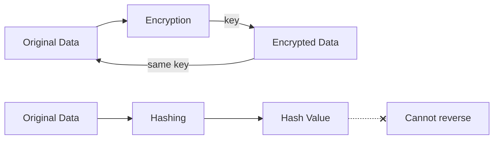

# MySQL Encryption Functions

## Introduction

Security is a critical aspect of any database system, especially when handling sensitive information like passwords, personal data, or financial details. MySQL provides several built-in functions to help you secure your data through encryption and hashing. 

In this tutorial, we'll explore MySQL's encryption and hashing functions that allow you to:
- Create one-way hashes for passwords
- Encrypt and decrypt data
- Generate secure random values
- Implement proper security practices in your database applications

Whether you're building a user authentication system or need to secure sensitive records, understanding these functions is essential for any database developer.

## Understanding Encryption vs. Hashing

Before diving into the functions, let's clarify two important concepts:

**Encryption** is a two-way process - data is encrypted using a key and can later be decrypted using the same or a different key to restore the original data.

**Hashing** is a one-way process - data is transformed into a fixed-size string of characters, and it's computationally infeasible to reverse the process to obtain the original data.



## One-Way Hash Functions

### MD5() Function

The `MD5()` function calculates an MD5 128-bit checksum, returning a 32-character hexadecimal number.

:::caution
MD5 is considered cryptographically broken and unsuitable for security purposes. It should only be used for checksums, not for password storage!
:::

#### Syntax

```sql
MD5(string)
```

#### Examples

```sql
SELECT MD5('hello'); -- Output: '5d41402abc4b2a76b9719d911017c592'

-- Comparing a user input with a stored hash
SELECT * FROM users WHERE MD5(username) = '5d41402abc4b2a76b9719d911017c592';
```

### SHA Functions

MySQL provides several Secure Hash Algorithm (SHA) functions with increasing security levels:

- `SHA1()` - 160-bit hash value, 40-character hex number
- `SHA2()` - SHA-2 family of hash functions with variable bit lengths

#### Syntax

```sql
SHA1(string)
SHA2(string, hash_length)
```

Where `hash_length` can be 224, 256, 384, 512, or 0 (equivalent to 256).

#### Examples

```sql
-- SHA1 example
SELECT SHA1('password123'); -- Output: 'cbfdac6008f9cab4083784cbd1874f76618d2a97'

-- SHA2 examples with different bit lengths
SELECT SHA2('password123', 224); -- 224-bit hash
SELECT SHA2('password123', 256); -- 256-bit hash (most common)
SELECT SHA2('password123', 512); -- 512-bit hash (most secure)
```

### Best Practices for Password Storage

When storing user passwords, you should:

1. Use a strong hash function (SHA2 with 256 bits or more)
2. Add a unique salt for each user
3. Consider using multiple iterations of hashing

Here's a practical example:

```sql
-- Creating a users table with secure password storage
CREATE TABLE users (
    id INT AUTO_INCREMENT PRIMARY KEY,
    username VARCHAR(50) NOT NULL,
    password_hash VARCHAR(128) NOT NULL,
    salt VARCHAR(64) NOT NULL
);

-- Inserting a user with a salted password hash
INSERT INTO users (username, password_hash, salt) 
VALUES (
    'john_doe',
    SHA2(CONCAT('my_password', 'unique_salt_value_here'), 256),
    'unique_salt_value_here'
);

-- Verifying a login attempt
SELECT * FROM users 
WHERE username = 'john_doe' 
AND password_hash = SHA2(CONCAT('entered_password', salt), 256);
```

## Two-Way Encryption Functions

### AES Encryption

Advanced Encryption Standard (AES) is a symmetric encryption algorithm that allows you to both encrypt and decrypt data using the same key.

#### Encryption with AES_ENCRYPT()

```sql
AES_ENCRYPT(string, key_string)
```

#### Decryption with AES_DECRYPT()

```sql
AES_DECRYPT(encrypted_string, key_string)
```

#### Examples

```sql
-- Encrypting a credit card number
SELECT AES_ENCRYPT('1234-5678-9012-3456', 'my_secret_key');

-- Storing encrypted data
CREATE TABLE payment_info (
    id INT AUTO_INCREMENT PRIMARY KEY,
    user_id INT NOT NULL,
    cc_number VARBINARY(255),
    FOREIGN KEY (user_id) REFERENCES users(id)
);

-- Insert encrypted credit card
INSERT INTO payment_info (user_id, cc_number)
VALUES (1, AES_ENCRYPT('1234-5678-9012-3456', 'my_secret_key'));

-- Retrieving and decrypting the data
SELECT 
    user_id, 
    CONVERT(AES_DECRYPT(cc_number, 'my_secret_key') USING utf8) AS decrypted_cc
FROM payment_info;
```

:::note
The encrypted result is binary data, so we use `VARBINARY` for storage and `CONVERT()` with `USING` for proper display when decrypting.
:::

### ENCRYPT() Function (Unix-specific)

The `ENCRYPT()` function uses the Unix `crypt()` system call to encrypt a string, but it's only available on Unix-like systems.

```sql
-- Only works on Unix systems
SELECT ENCRYPT('mypassword', 'salt');
```

## Secure Random Value Generation

### RANDOM_BYTES() Function

The `RANDOM_BYTES()` function returns a binary string of random bytes, which is useful for generating secure tokens or keys.

```sql
-- Generate 16 random bytes
SELECT HEX(RANDOM_BYTES(16)); -- Output might be: 'ED52E1F1906D3B6C209D2AAB6C8A172C'
```

### UUID() Function

The `UUID()` function generates a Universal Unique Identifier, which can be useful for creating unique identifiers without revealing sequential information.

```sql
SELECT UUID(); -- Output might be: '6ccd780c-baba-1026-9564-5b8c656024db'
```

## Real-World Applications

### Secure User Authentication System

Here's a complete example of a secure user registration and authentication system:

```sql
-- Create a secure users table
CREATE TABLE secure_users (
    id INT AUTO_INCREMENT PRIMARY KEY,
    username VARCHAR(50) UNIQUE NOT NULL,
    password_hash VARCHAR(128) NOT NULL,
    salt VARCHAR(64) NOT NULL,
    auth_token VARCHAR(64),
    token_expiry DATETIME
);

-- Register a new user (using prepared statements in your application)
-- 1. Generate a random salt
SET @salt = HEX(RANDOM_BYTES(16));

-- 2. Hash the password with the salt
SET @password = 'user_password';
SET @hashed_password = SHA2(CONCAT(@password, @salt), 256);

-- 3. Insert the user
INSERT INTO secure_users (username, password_hash, salt)
VALUES ('new_user', @hashed_password, @salt);

-- Login verification (pseudo-code mixed with SQL)
-- 1. Get user's salt
SELECT salt INTO @user_salt FROM secure_users WHERE username = 'new_user';

-- 2. Hash the provided password with the retrieved salt
SET @provided_password = 'user_password';
SET @hashed_attempt = SHA2(CONCAT(@provided_password, @user_salt), 256);

-- 3. Verify the password
SELECT * FROM secure_users 
WHERE username = 'new_user' 
AND password_hash = @hashed_attempt;

-- 4. If successful, generate an authentication token
SET @auth_token = HEX(RANDOM_BYTES(32));
UPDATE secure_users SET 
    auth_token = @auth_token,
    token_expiry = DATE_ADD(NOW(), INTERVAL 24 HOUR)
WHERE username = 'new_user';
```

### Storing Sensitive Customer Information

When dealing with data that needs to be retrieved and used later (unlike passwords):

```sql
-- Create a table for customer data
CREATE TABLE customer_data (
    id INT AUTO_INCREMENT PRIMARY KEY,
    customer_id INT NOT NULL,
    ssn VARBINARY(255), -- Social Security Number (encrypted)
    credit_card VARBINARY(255), -- Credit card (encrypted)
    FOREIGN KEY (customer_id) REFERENCES customers(id)
);

-- Insert encrypted customer data
INSERT INTO customer_data (customer_id, ssn, credit_card)
VALUES (
    1,
    AES_ENCRYPT('123-45-6789', 'ssn_encryption_key'),
    AES_ENCRYPT('4111-1111-1111-1111', 'cc_encryption_key')
);

-- Retrieve decrypted data when needed
SELECT 
    customer_id,
    CONVERT(AES_DECRYPT(ssn, 'ssn_encryption_key') USING utf8) AS ssn,
    CONVERT(AES_DECRYPT(credit_card, 'cc_encryption_key') USING utf8) AS credit_card
FROM customer_data
WHERE customer_id = 1;
```

## Best Practices for MySQL Encryption

1. **Never store encryption keys in the database** alongside the encrypted data
2. **Use strong, unique keys** for encryption
3. **Rotate encryption keys** periodically
4. **Use prepared statements** to prevent SQL injection
5. **Add a unique salt** for each password hash
6. **Use SHA-2 (256 bit or higher)** for password hashing
7. **Consider using more specialized password hashing algorithms** like bcrypt, although this typically requires application-level implementation
8. **Encrypt sensitive data at rest and in transit**

## Summary

MySQL offers a range of encryption functions that help you secure sensitive data:

- One-way hash functions (`MD5()`, `SHA1()`, `SHA2()`) are ideal for password storage
- Two-way encryption functions (`AES_ENCRYPT()` and `AES_DECRYPT()`) allow you to encrypt sensitive data that needs to be retrieved later
- Random value generators (`RANDOM_BYTES()` and `UUID()`) help create secure tokens and identifiers

Remember that database security is just one layer of a comprehensive security strategy. Always follow best practices, keep your MySQL server updated, and consider additional security measures for highly sensitive applications.

## Exercises

1. Create a secure user authentication table that stores usernames, salted password hashes, and last login times.
2. Write a query to verify a user's login using a salted password hash.
3. Create a table to securely store customer credit card information that can be retrieved later.
4. Generate a secure random token that expires in 30 minutes for a password reset functionality.
5. Implement row-level encryption for a table containing sensitive employee data.

## Additional Resources

- [MySQL Documentation: Encryption and Compression Functions](https://dev.mysql.com/doc/refman/8.0/en/encryption-functions.html)
- [OWASP Password Storage Cheat Sheet](https://cheatsheetseries.owasp.org/cheatsheets/Password_Storage_Cheat_Sheet.html)
- [NIST Guidelines for Password Management](https://pages.nist.gov/800-63-3/sp800-63b.html)

With these encryption tools and techniques, you can significantly improve the security of your MySQL databases and protect your users' sensitive information.