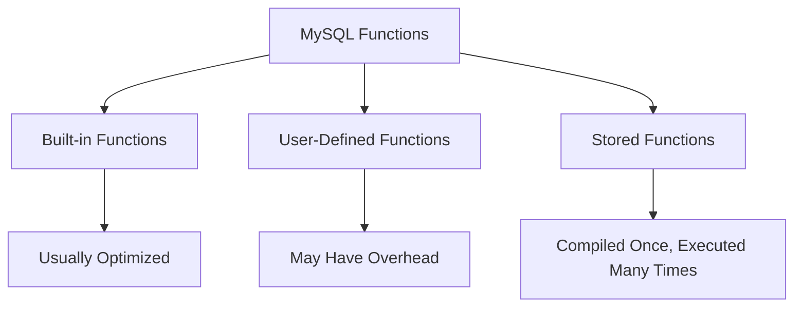

# MySQL Function Performance

When working with MySQL databases, understanding how functions affect performance is critical to creating efficient applications. Functions are powerful tools that can simplify your SQL code, but they can also introduce performance bottlenecks if not used properly.

## Introduction to MySQL Function Performance

MySQL functions help you manipulate data, perform calculations, and format output within your queries. However, each function call requires computational resources, and some functions are more expensive than others. In this guide, we'll explore how various MySQL functions impact performance and learn techniques to optimize them.

## Types of MySQL Functions and Their Performance Characteristics

MySQL functions generally fall into these categories:

1. **Built-in functions** - Native to MySQL, optimized by the database engine
2. **User-defined functions (UDFs)** - Custom functions created by users
3. **Stored functions** - Functions stored in the database for reuse

Each type has different performance implications:



## Benchmarking MySQL Function Performance

Before optimizing, you need to measure. Here's how to benchmark MySQL function performance:

### Using BENCHMARK() Function

MySQL's `BENCHMARK()` function repeats an expression multiple times and measures the execution time:

```sql
-- Benchmark string functions
SELECT BENCHMARK(1000000, MD5('test string'));
SELECT BENCHMARK(1000000, CONCAT('test', ' string'));

-- Compare date functions
SELECT BENCHMARK(1000000, DATE_FORMAT(NOW(), '%Y-%m-%d'));
SELECT BENCHMARK(1000000, YEAR(NOW()));
```

### Using Performance Schema

For more detailed analysis, you can use MySQL's Performance Schema:

```sql
-- Enable Performance Schema if not already enabled
SET GLOBAL performance_schema = ON;

-- Run your function-heavy query
-- ...

-- Check performance statistics
SELECT EVENT_NAME, COUNT_STAR, SUM_TIMER_WAIT 
FROM performance_schema.events_statements_summary_by_digest
WHERE DIGEST_TEXT LIKE '%YOUR_FUNCTION%'
ORDER BY SUM_TIMER_WAIT DESC;
```

## Common Performance Issues with MySQL Functions

### 1. Function Calls in WHERE Clauses

One of the most common performance issues occurs when functions are applied to indexed columns in WHERE clauses:

```sql
-- Bad practice: function on indexed column prevents index usage
SELECT * FROM customers 
WHERE YEAR(registration_date) = 2023;

-- Better approach: avoid function on indexed column
SELECT * FROM customers 
WHERE registration_date BETWEEN '2023-01-01' AND '2023-12-31';
```

When you apply a function to an indexed column, MySQL often can't use the index effectively.

### 2. String Function Overhead

String manipulation functions can be expensive, especially on large datasets:

```sql
-- Expensive when run on millions of rows
SELECT id, CONCAT(first_name, ' ', last_name) AS full_name 
FROM customers;

-- Consider storing pre-computed values for frequent lookups
ALTER TABLE customers ADD COLUMN full_name VARCHAR(100);
UPDATE customers SET full_name = CONCAT(first_name, ' ', last_name);
```

### 3. Aggregate Functions

Aggregate functions like `COUNT()`, `SUM()`, `AVG()` require processing the entire dataset:

```sql
-- May be slow on large tables
SELECT COUNT(*) FROM orders WHERE order_date > '2023-01-01';

-- Consider maintaining summary tables for frequent aggregations
CREATE TABLE order_summaries (
    date DATE PRIMARY KEY,
    order_count INT
);

-- Update periodically with aggregated data
INSERT INTO order_summaries 
SELECT DATE(order_date), COUNT(*) 
FROM orders 
GROUP BY DATE(order_date);
```

## Performance Optimization Strategies

### 1. Minimize Function Calls in Critical Queries

For queries that run frequently or on large datasets, minimize function usage:

```sql
-- Original query with multiple function calls
SELECT 
    order_id,
    UPPER(customer_name),
    DATE_FORMAT(order_date, '%Y-%m-%d'),
    ROUND(total_amount, 2)
FROM orders
WHERE MONTH(order_date) = 6;

-- Optimized version
SELECT 
    order_id,
    customer_name, -- process in application code if needed
    order_date,    -- format in application code
    total_amount   -- round in application code
FROM orders
WHERE order_date BETWEEN '2023-06-01' AND '2023-06-30';
```

### 2. Use Indexes with Function-Based Columns

In MySQL 8.0+, you can create functional indexes:

```sql
-- Create an index on a function result
CREATE INDEX idx_year_month ON orders ((YEAR(order_date)), (MONTH(order_date)));

-- Now this query can use the index
SELECT * FROM orders WHERE YEAR(order_date) = 2023 AND MONTH(order_date) = 6;
```

### 3. Pre-calculate Results

For frequently accessed data that requires function processing:

```sql
-- Add computed columns
ALTER TABLE products ADD COLUMN discounted_price DECIMAL(10,2);
UPDATE products SET discounted_price = price * (1 - discount_rate);

-- Create materialized views (in MySQL, use regular tables updated periodically)
CREATE TABLE monthly_sales_summary AS
SELECT 
    YEAR(sale_date) AS year,
    MONTH(sale_date) AS month, 
    SUM(amount) AS total_sales
FROM sales
GROUP BY YEAR(sale_date), MONTH(sale_date);
```

### 4. Optimize User-Defined Functions

When creating custom functions:

```sql
-- Efficient UDF
DELIMITER //
CREATE FUNCTION calculate_discount(price DECIMAL(10,2), customer_tier INT) 
RETURNS DECIMAL(10,2)
DETERMINISTIC
BEGIN
    DECLARE discount_rate DECIMAL(5,2);
    
    -- Simple logic with early returns
    IF customer_tier = 1 THEN
        RETURN price * 0.95;
    ELSEIF customer_tier = 2 THEN
        RETURN price * 0.9;
    ELSE
        RETURN price * 0.85;
    END IF;
END //
DELIMITER ;
```

Note the `DETERMINISTIC` keyword - this tells MySQL that for the same input, the function always returns the same output, which allows for better optimization.

## Real-World Example: Order Processing System

Let's examine a real-world scenario of an e-commerce order processing system:

```sql
-- Original inefficient query
SELECT 
    o.order_id,
    CONCAT(c.first_name, ' ', c.last_name) AS customer_name,
    DATE_FORMAT(o.order_date, '%d-%m-%Y') AS formatted_date,
    SUM(oi.quantity * ROUND(oi.price * (1 - oi.discount), 2)) AS total_amount,
    CASE 
        WHEN DATEDIFF(NOW(), o.order_date) <= 1 THEN 'Today/Yesterday'
        WHEN DATEDIFF(NOW(), o.order_date) <= 7 THEN 'Last Week'
        ELSE 'Older'
    END AS order_age
FROM orders o
JOIN customers c ON c.customer_id = o.customer_id
JOIN order_items oi ON oi.order_id = o.order_id
WHERE YEAR(o.order_date) = YEAR(CURDATE())
GROUP BY o.order_id, customer_name, formatted_date
ORDER BY o.order_date DESC;
```

### Optimized Version:

```sql
-- Step 1: Create a computed column for customer name
ALTER TABLE customers ADD COLUMN full_name VARCHAR(100);
UPDATE customers SET full_name = CONCAT(first_name, ' ', last_name);

-- Step 2: Create a specific index for date filtering
CREATE INDEX idx_order_year ON orders ((YEAR(order_date)));

-- Step 3: Pre-calculate order item totals
ALTER TABLE order_items ADD COLUMN item_total DECIMAL(10,2);
UPDATE order_items SET item_total = quantity * (price * (1 - discount));

-- Step 4: Optimized query
SELECT 
    o.order_id,
    c.full_name AS customer_name,
    o.order_date, -- Format in application
    SUM(oi.item_total) AS total_amount,
    CASE 
        WHEN o.order_date >= DATE_SUB(CURDATE(), INTERVAL 1 DAY) THEN 'Today/Yesterday'
        WHEN o.order_date >= DATE_SUB(CURDATE(), INTERVAL 7 DAY) THEN 'Last Week'
        ELSE 'Older'
    END AS order_age
FROM orders o
JOIN customers c ON c.customer_id = o.customer_id
JOIN order_items oi ON oi.order_id = o.order_id
WHERE o.order_date >= CONCAT(YEAR(CURDATE()), '-01-01')
  AND o.order_date < CONCAT(YEAR(CURDATE()) + 1, '-01-01')
GROUP BY o.order_id, customer_name, o.order_date
ORDER BY o.order_date DESC;
```

The optimized version:
- Uses pre-computed values where possible
- Avoids function calls on indexed columns
- Transforms date functions to use range conditions
- Creates specific indexes to support the query pattern

## Best Practices for MySQL Function Performance

1. **Profile before optimizing**: Use `EXPLAIN` and the Performance Schema to identify actual bottlenecks
2. **Avoid functions on indexed columns** in WHERE clauses
3. **Pre-compute values** for frequently accessed derived data
4. **Consider function determinism** and use appropriate modifiers (DETERMINISTIC, NO SQL, etc.)
5. **Use the right data type** for the job to minimize conversion functions
6. **Create functional indexes** (MySQL 8.0+) for queries that must use functions in filters
7. **Move function processing to the application** when appropriate
8. **Batch process** heavy function calculations during off-peak hours

## Function Caching Techniques

For expensive function calculations, consider these caching approaches:

```sql
-- Create a cache table for expensive calculations
CREATE TABLE tax_rate_cache (
    zip_code VARCHAR(10) PRIMARY KEY,
    tax_rate DECIMAL(5,2),
    last_updated TIMESTAMP DEFAULT CURRENT_TIMESTAMP
);

-- Function that uses the cache
DELIMITER //
CREATE FUNCTION get_tax_rate(zip VARCHAR(10)) 
RETURNS DECIMAL(5,2)
READS SQL DATA
BEGIN
    DECLARE rate DECIMAL(5,2);
    
    -- Try to get from cache
    SELECT tax_rate INTO rate FROM tax_rate_cache 
    WHERE zip_code = zip AND last_updated > DATE_SUB(NOW(), INTERVAL 1 DAY);
    
    -- If not found, calculate and cache
    IF rate IS NULL THEN
        -- Call expensive external calculation (simplified here)
        SET rate = 0.08; -- Placeholder for actual calculation
        
        -- Update cache
        INSERT INTO tax_rate_cache (zip_code, tax_rate) 
        VALUES (zip, rate)
        ON DUPLICATE KEY UPDATE tax_rate = rate, last_updated = CURRENT_TIMESTAMP;
    END IF;
    
    RETURN rate;
END //
DELIMITER ;
```

## Summary

MySQL functions are powerful tools that can make your queries more expressive and maintainable. However, they can also introduce performance issues if used incorrectly. By understanding how different functions affect database performance, benchmarking their impact, and following best practices for optimization, you can create efficient database applications that scale well.

Key takeaways include:
- Be cautious with functions in WHERE clauses, especially on indexed columns
- Pre-compute and store frequently accessed derived values
- Use appropriate data types and indexes
- Move processing to the application layer when it makes sense
- Benchmark and profile before making assumptions about performance

## Additional Resources

- **Further Learning**:
  - MySQL official documentation on [Functions and Operators](https://dev.mysql.com/doc/refman/8.0/en/functions.html)
  - MySQL documentation on [Query Optimization](https://dev.mysql.com/doc/refman/8.0/en/optimization.html)

## Exercises

1. Take a slow query from your application and identify any function calls that could be affecting performance.
2. Benchmark the difference between using `YEAR(date_column) = 2023` and `date_column BETWEEN '2023-01-01' AND '2023-12-31'` on a table with 100,000+ rows.
3. Create a user-defined function that calculates a customer's loyalty score based on order history, then optimize it using the techniques learned in this guide.
4. Compare the performance of text search using `LIKE '%term%'`, `INSTR(column, 'term')`, and MySQL's full-text search functions.
5. Design a caching strategy for an expensive function that calculates shipping costs based on distance and weight.