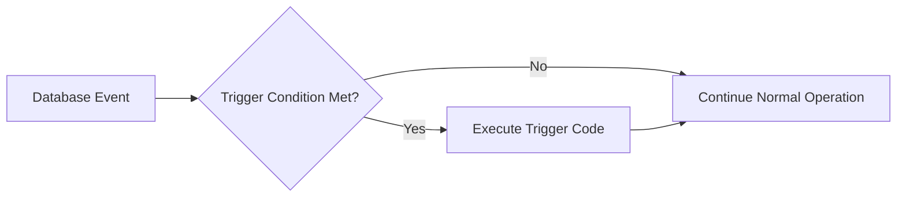

# MySQL Trigger Basics

## Introduction

MySQL triggers are special stored procedures that automatically execute in response to specific events on a table in a database. They're like sentinels that watch for certain actions and respond accordingly. Triggers provide a way to enforce business rules, maintain data integrity, audit changes, and automate actions when data is modified.

In this tutorial, you'll learn what triggers are, why they're useful, and how to create, manage, and use them in your MySQL database.

## What Are MySQL Triggers?

A trigger is a named database object that is associated with a table and activates when a particular event occurs for that table. These events include:

- `INSERT` operations
- `UPDATE` operations
- `DELETE` operations

Triggers can be set to fire:
- `BEFORE` the event (useful for validating or modifying data before changes)
- `AFTER` the event (useful for logging changes or updating related tables)



## Why Use Triggers?

Triggers offer several benefits in database management:

1. **Data Integrity** - Enforce complex business rules that can't be expressed through constraints alone
2. **Auditing** - Track changes made to tables automatically
3. **Cross-Table Updates** - Maintain derived data in other tables
4. **Validation** - Check data values before they're inserted or updated
5. **Automation** - Perform complex actions automatically when data changes

## Syntax for Creating Triggers

Here's the basic syntax for creating a trigger in MySQL:

```sql
CREATE TRIGGER trigger_name
{BEFORE | AFTER} {INSERT | UPDATE | DELETE}
ON table_name
FOR EACH ROW
BEGIN
    -- Trigger body; SQL statements
END;
```

Let's break down each part:

- `trigger_name`: A unique name for your trigger
- `{BEFORE | AFTER}`: When the trigger should fire relative to the action
- `{INSERT | UPDATE | DELETE}`: The action that activates the trigger
- `table_name`: The table the trigger is associated with
- `FOR EACH ROW`: Indicates that the trigger fires once for each row affected
- `BEGIN ... END`: The body containing SQL statements to execute

## Creating Your First Trigger

Let's create a simple trigger that logs when a new user is added to a system.

First, let's set up our tables:

```sql
-- Create users table
CREATE TABLE users (
    id INT AUTO_INCREMENT PRIMARY KEY,
    username VARCHAR(50) NOT NULL,
    email VARCHAR(100) NOT NULL,
    created_at DATETIME DEFAULT CURRENT_TIMESTAMP
);

-- Create audit log table
CREATE TABLE user_audit_log (
    log_id INT AUTO_INCREMENT PRIMARY KEY,
    user_id INT,
    action VARCHAR(20),
    timestamp DATETIME DEFAULT CURRENT_TIMESTAMP
);
```

Now, let's create a trigger that logs when a new user is inserted:

```sql
DELIMITER //

CREATE TRIGGER after_user_insert
AFTER INSERT ON users
FOR EACH ROW
BEGIN
    INSERT INTO user_audit_log (user_id, action)
    VALUES (NEW.id, 'INSERT');
END//

DELIMITER ;
```

Let's test our trigger by adding a user:

```sql
INSERT INTO users (username, email) VALUES ('johndoe', 'john@example.com');
```

Now if we check our audit log table:

```sql
SELECT * FROM user_audit_log;
```

Output:
```
+--------+---------+--------+---------------------+
| log_id | user_id | action | timestamp           |
+--------+---------+--------+---------------------+
|      1 |       1 | INSERT | 2023-06-15 14:25:30 |
+--------+---------+--------+---------------------+
```

The trigger automatically created a log entry when we inserted the new user!

## Understanding OLD and NEW References

In MySQL triggers, you can reference the values of columns with special keywords:

- `NEW`: Refers to the new row values for INSERT and UPDATE operations
- `OLD`: Refers to the old row values for UPDATE and DELETE operations

Here's how you might use them in different types of triggers:

| Operation | BEFORE Trigger | AFTER Trigger |
|-----------|---------------|--------------|
| INSERT    | NEW is available (and can be modified) | NEW is available (read-only) |
| UPDATE    | OLD and NEW are available (NEW can be modified) | OLD and NEW are available (read-only) |
| DELETE    | OLD is available (read-only) | OLD is available (read-only) |

## Practical Examples

### Example 1: Validating Data Before Insert

Let's create a trigger that ensures email addresses contain an '@' symbol:

```sql
DELIMITER //

CREATE TRIGGER validate_email_before_insert
BEFORE INSERT ON users
FOR EACH ROW
BEGIN
    IF NEW.email NOT LIKE '%@%.%' THEN
        SIGNAL SQLSTATE '45000'
        SET MESSAGE_TEXT = 'Invalid email format';
    END IF;
END//

DELIMITER ;
```

Now if we try to insert invalid data:

```sql
INSERT INTO users (username, email) VALUES ('baduser', 'invalidemail');
```

MySQL will return an error:
```
Error Code: 1644. Invalid email format
```

### Example 2: Maintaining Summary Statistics

Imagine we have an e-commerce system where we need to track total order amounts by customer:

```sql
-- Create tables
CREATE TABLE orders (
    order_id INT AUTO_INCREMENT PRIMARY KEY,
    customer_id INT NOT NULL,
    amount DECIMAL(10, 2) NOT NULL,
    order_date DATETIME DEFAULT CURRENT_TIMESTAMP
);

CREATE TABLE customer_stats (
    customer_id INT PRIMARY KEY,
    total_orders INT DEFAULT 0,
    total_spent DECIMAL(12, 2) DEFAULT 0.00
);
```

Let's create triggers to keep the customer stats updated:

```sql
DELIMITER //

-- When a new order is added
CREATE TRIGGER update_stats_after_insert
AFTER INSERT ON orders
FOR EACH ROW
BEGIN
    INSERT INTO customer_stats (customer_id, total_orders, total_spent)
    VALUES (NEW.customer_id, 1, NEW.amount)
    ON DUPLICATE KEY UPDATE
        total_orders = total_orders + 1,
        total_spent = total_spent + NEW.amount;
END//

-- When an order is deleted
CREATE TRIGGER update_stats_after_delete
AFTER DELETE ON orders
FOR EACH ROW
BEGIN
    UPDATE customer_stats
    SET total_orders = total_orders - 1,
        total_spent = total_spent - OLD.amount
    WHERE customer_id = OLD.customer_id;
END//

DELIMITER ;
```

Let's test these triggers:

```sql
-- Insert some orders
INSERT INTO orders (customer_id, amount) VALUES (101, 50.00);
INSERT INTO orders (customer_id, amount) VALUES (101, 75.50);
INSERT INTO orders (customer_id, amount) VALUES (102, 125.99);

-- Check customer stats
SELECT * FROM customer_stats;
```

Output:
```
+-------------+--------------+-------------+
| customer_id | total_orders | total_spent |
+-------------+--------------+-------------+
|         101 |            2 |      125.50 |
|         102 |            1 |      125.99 |
+-------------+--------------+-------------+
```

### Example 3: Audit Trail for Data Changes

Let's create a comprehensive audit trail for our users table:

```sql
-- Create a detailed audit table
CREATE TABLE users_audit (
    audit_id INT AUTO_INCREMENT PRIMARY KEY,
    user_id INT,
    action VARCHAR(10),
    old_username VARCHAR(50),
    new_username VARCHAR(50),
    old_email VARCHAR(100),
    new_email VARCHAR(100),
    changed_by VARCHAR(50),
    changed_at DATETIME DEFAULT CURRENT_TIMESTAMP
);

DELIMITER //

-- Trigger for INSERT
CREATE TRIGGER users_audit_insert
AFTER INSERT ON users
FOR EACH ROW
BEGIN
    INSERT INTO users_audit (
        user_id, action, new_username, new_email, changed_by
    )
    VALUES (
        NEW.id, 'INSERT', NEW.username, NEW.email, CURRENT_USER()
    );
END//

-- Trigger for UPDATE
CREATE TRIGGER users_audit_update
AFTER UPDATE ON users
FOR EACH ROW
BEGIN
    INSERT INTO users_audit (
        user_id, action, 
        old_username, new_username, 
        old_email, new_email,
        changed_by
    )
    VALUES (
        NEW.id, 'UPDATE', 
        OLD.username, NEW.username, 
        OLD.email, NEW.email,
        CURRENT_USER()
    );
END//

-- Trigger for DELETE
CREATE TRIGGER users_audit_delete
AFTER DELETE ON users
FOR EACH ROW
BEGIN
    INSERT INTO users_audit (
        user_id, action, old_username, old_email, changed_by
    )
    VALUES (
        OLD.id, 'DELETE', OLD.username, OLD.email, CURRENT_USER()
    );
END//

DELIMITER ;
```

## Managing Triggers

### Viewing Existing Triggers

To see all triggers in a database:

```sql
SHOW TRIGGERS;
```

To see triggers for a specific table:

```sql
SHOW TRIGGERS WHERE `Table` = 'users';
```

### Dropping a Trigger

If you need to remove a trigger:

```sql
DROP TRIGGER IF EXISTS trigger_name;
```

For example:

```sql
DROP TRIGGER IF EXISTS after_user_insert;
```

## Best Practices for Using Triggers

1. **Keep triggers lightweight**: Avoid complex logic that could impact performance
2. **Document your triggers well**: Comment your code and maintain documentation
3. **Be cautious with recursive triggers**: Avoid situations where triggers activate other triggers in an endless loop
4. **Use sparingly**: Don't overuse triggers; use them only when necessary
5. **Test thoroughly**: Triggers can have unexpected consequences if not tested properly
6. **Consider alternatives**: Sometimes a stored procedure or application code is more appropriate

## Limitations of MySQL Triggers

- Cannot use certain statements like COMMIT, ROLLBACK, or START TRANSACTION
- Cannot call stored procedures that perform commits or rollbacks
- Cannot modify tables that are already being used in the statement that fired the trigger (to avoid recursive triggers)
- Cannot return data to the client
- Maximum of 64 triggers per table (though practical limits are much lower)

## Common Trigger Issues to Avoid

1. **Endless loops**: Triggers that cause other triggers to fire repeatedly
2. **Performance impact**: Heavy processing in triggers can slow down regular operations
3. **Silent failures**: Logic errors in triggers can cause subtle data issues
4. **Maintenance overhead**: Too many triggers can make schema changes difficult

## Summary

MySQL triggers are powerful tools for automating database actions in response to specific events. They help maintain data integrity, automate tasks, and implement business rules within your database. 

We've covered:
- The basics of triggers and why they're useful
- How to create triggers for different events (INSERT, UPDATE, DELETE)
- Using OLD and NEW references for accessing row data
- Practical examples of triggers in action
- Best practices for trigger development

When used appropriately, triggers can significantly enhance your database application's reliability and functionality. However, they should be used judiciously, as overuse can lead to maintenance and performance issues.

## Exercises

1. Create a trigger that automatically converts email addresses to lowercase before insertion.
2. Create a table to track price changes and a trigger that logs when product prices are updated.
3. Create a trigger that prevents deletion of user accounts that have associated orders.
4. Implement a trigger-based system to maintain a count of comments per blog post.
5. Create a sophisticated trigger that enforces a business rule, such as "premium users cannot be downgraded if they have active subscriptions."

## Additional Resources

- [MySQL Documentation on Triggers](https://dev.mysql.com/doc/refman/8.0/en/triggers.html)
- [MySQL Stored Procedures and Triggers](https://www.mysqltutorial.org/mysql-triggers.aspx)
- [Advanced Trigger Techniques](https://dev.mysql.com/doc/refman/8.0/en/trigger-syntax.html)

Happy triggering!