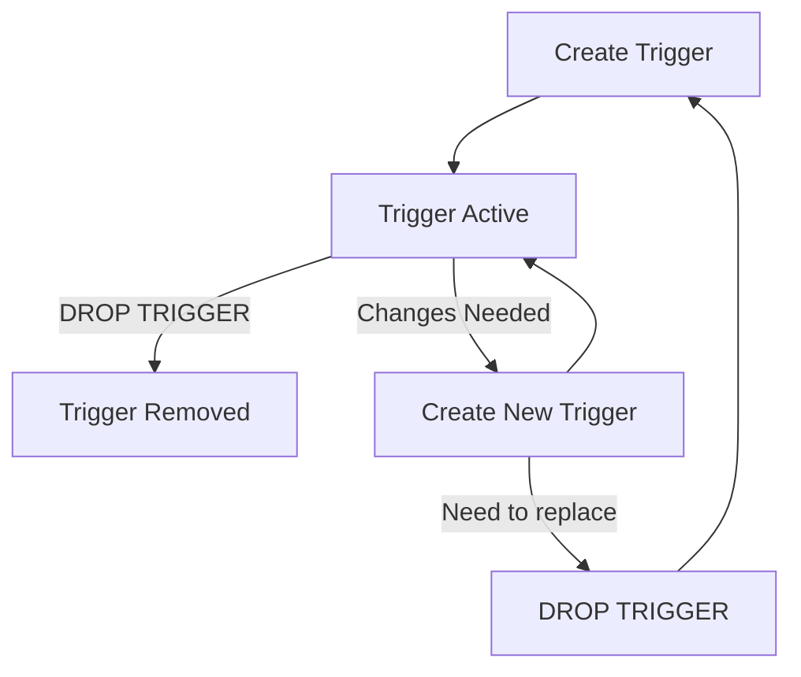

# MySQL DROP TRIGGER

## Introduction

In MySQL database management, triggers are special stored programs that automatically execute when specific events occur on a table. As your database evolves, you may need to remove triggers that are no longer necessary or need to be replaced. This is where the `DROP TRIGGER` statement comes in.

The `DROP TRIGGER` statement allows you to permanently remove a trigger from your database schema. Understanding how to properly remove triggers is essential for maintaining a clean and efficient database structure.

## DROP TRIGGER Syntax

The basic syntax for removing a trigger in MySQL is straightforward:

```sql
DROP TRIGGER [IF EXISTS] [schema_name.]trigger_name;
```

Where:
- `[IF EXISTS]` is an optional clause that prevents errors if the trigger doesn't exist
- `[schema_name.]` is optional and specifies the database where the trigger is located
- `trigger_name` is the name of the trigger you want to drop

## Prerequisites

Before dropping a trigger, you should:

1. Have the `TRIGGER` privilege for the relevant database
2. Understand which trigger you want to remove and its purpose
3. Consider any dependencies or processes that rely on the trigger

## Basic Usage Examples

### Example 1: Simple DROP TRIGGER

Let's say we have a trigger named `before_update_employees` that we want to remove:

```sql
DROP TRIGGER before_update_employees;
```

If the trigger exists, it will be permanently removed from the database schema.

### Example 2: Using IF EXISTS Clause

To avoid errors when the trigger might not exist:

```sql
DROP TRIGGER IF EXISTS before_update_employees;
```

This command will remove the trigger if it exists, or do nothing if it doesn't exist, without generating an error.

### Example 3: Specifying Schema Name

If your trigger is in a specific database:

```sql
DROP TRIGGER IF EXISTS hr_database.before_update_employees;
```

## Practical Applications

### Scenario 1: Replacing an Outdated Trigger

When updating your database logic, you often need to replace existing triggers with new ones. Since MySQL doesn't have a direct `ALTER TRIGGER` statement, you'll need to drop the old trigger before creating a new one.

```sql
-- First, drop the existing trigger
DROP TRIGGER IF EXISTS calculate_product_total;

-- Then create the new version with updated logic
DELIMITER //
CREATE TRIGGER calculate_product_total
AFTER INSERT ON order_items
FOR EACH ROW
BEGIN
    UPDATE orders
    SET total_amount = total_amount + (NEW.price * NEW.quantity)
    WHERE order_id = NEW.order_id;
END//
DELIMITER ;
```

### Scenario 2: Database Cleanup During Schema Migration

When migrating or restructuring your database, you may need to clean up unnecessary triggers:

```sql
-- Script to clean up all audit triggers that are no longer needed
DROP TRIGGER IF EXISTS audit_customers_insert;
DROP TRIGGER IF EXISTS audit_customers_update;
DROP TRIGGER IF EXISTS audit_customers_delete;
DROP TRIGGER IF EXISTS audit_orders_insert;
DROP TRIGGER IF EXISTS audit_orders_update;
DROP TRIGGER IF EXISTS audit_orders_delete;
```

### Scenario 3: Debugging Database Issues

When troubleshooting database performance issues, you might temporarily disable triggers by dropping them:

```sql
-- Drop potentially problematic trigger for debugging
DROP TRIGGER IF EXISTS complex_calculation_trigger;

-- After debugging, you can recreate the trigger if needed
```

## Checking Trigger Existence

Before dropping a trigger, you might want to check if it exists. You can query the `information_schema.triggers` table:

```sql
SELECT * FROM information_schema.triggers 
WHERE trigger_name = 'before_update_employees' 
AND trigger_schema = 'your_database_name';
```

## Common Errors and Solutions

### Error: Insufficient Privileges

```
ERROR 1227 (42000): Access denied; you need (at least one of) the TRIGGER privilege(s) for this operation
```

**Solution:** Ensure your MySQL user has the `TRIGGER` privilege:

```sql
GRANT TRIGGER ON database_name.* TO 'your_username'@'your_host';
```

### Error: Trigger Does Not Exist

```
ERROR 1360 (HY000): Trigger does not exist
```

**Solution:** Use the `IF EXISTS` clause to prevent this error:

```sql
DROP TRIGGER IF EXISTS trigger_name;
```

### Error: Wrong Schema

```
ERROR 1435 (HY000): Trigger in wrong schema
```

**Solution:** Specify the correct schema name:

```sql
DROP TRIGGER schema_name.trigger_name;
```

## Best Practices

1. **Always use `IF EXISTS`** to make your scripts more robust
2. **Document trigger changes** in your version control system
3. **Back up your trigger definitions** before dropping them:
   ```sql
   SHOW CREATE TRIGGER trigger_name;
   ```
4. **Consider database impact** - remember that dropping triggers may affect database behavior and data integrity
5. **Use transactions** when dropping and recreating multiple triggers to maintain consistency

## Visualizing Trigger Lifecycle



## Summary

The MySQL `DROP TRIGGER` statement is a straightforward but powerful command that permanently removes triggers from your database. When used properly with the `IF EXISTS` clause and proper schema specification, it provides a safe way to manage your database triggers.

Key points to remember:
- Use `IF EXISTS` to prevent errors
- Specify the schema name for clarity
- Ensure you have proper privileges
- Consider the impact on your database operations
- Document and back up trigger definitions before removal

## Practice Exercises

1. Create a simple trigger on a test table, then drop it using the `DROP TRIGGER` statement.
2. Write a script that checks if a trigger exists before attempting to drop it.
3. Create a migration script that drops and recreates multiple triggers with updated logic.
4. Research and list all triggers in your database that might be candidates for removal.

## Additional Resources

- [MySQL Official Documentation on DROP TRIGGER](https://dev.mysql.com/doc/refman/8.0/en/drop-trigger.html)
- [MySQL Trigger Privilege Requirements](https://dev.mysql.com/doc/refman/8.0/en/privileges-provided.html#priv_trigger)
- [MySQL Information Schema TRIGGERS Table](https://dev.mysql.com/doc/refman/8.0/en/information-schema-triggers-table.html)

With this knowledge, you now have a solid understanding of how to safely and effectively remove triggers in your MySQL database.