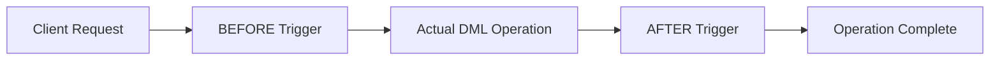

# MySQL Trigger Events

## Introduction

Trigger events are specific database operations that can activate a trigger in MySQL. When you create a trigger, you define not only what actions it should perform but also which events should cause it to execute. These events are fundamental to understanding how and when your triggers will run.

In MySQL, trigger events are closely related to Data Manipulation Language (DML) operations that modify data in tables. By understanding trigger events, you can create powerful automated responses to changes in your database, ensuring data consistency, enforcing business rules, and maintaining data integrity.

## What are Trigger Events?

A trigger event is a specific database operation that causes a trigger to execute. In MySQL, trigger events are exclusively related to data modification operations:

- `INSERT` - Occurs when a new row is added to a table
- `UPDATE` - Occurs when an existing row in a table is modified
- `DELETE` - Occurs when a row is removed from a table

When you create a trigger, you must specify which of these events will activate your trigger, as well as when the trigger should execute relative to the event (before or after).

## Trigger Event Timing

In addition to the event type, you must also specify the timing of the trigger execution:

- `BEFORE` - Trigger executes before the event operation is performed
- `AFTER` - Trigger executes after the event operation is completed

This timing is crucial for determining how your trigger interacts with the data modification process.



## Creating Triggers with Different Events

Let's examine how to create triggers for each event type:

### INSERT Triggers

INSERT triggers activate when new rows are added to a table. You can use them to validate data before insertion or perform additional operations after insertion.

#### BEFORE INSERT Example

```sql
DELIMITER //
CREATE TRIGGER before_employee_insert
BEFORE INSERT ON employees 
FOR EACH ROW
BEGIN
  -- Standardize email format to lowercase
  SET NEW.email = LOWER(NEW.email);
  
  -- Set default department if none provided
  IF NEW.department IS NULL THEN
    SET NEW.department = 'Unassigned';
  END IF;
END //
DELIMITER ;
```

In this example, the trigger runs before each insertion into the `employees` table. It standardizes the email format and sets a default department if none was provided.

#### AFTER INSERT Example

```sql
DELIMITER //
CREATE TRIGGER after_employee_insert
AFTER INSERT ON employees
FOR EACH ROW
BEGIN
  -- Log the new employee addition
  INSERT INTO employee_audit_log (action_type, employee_id, performed_at, description)
  VALUES ('INSERT', NEW.id, NOW(), CONCAT('Added employee: ', NEW.first_name, ' ', NEW.last_name));
  
  -- Update employee count in departments table
  UPDATE departments
  SET employee_count = employee_count + 1
  WHERE department_name = NEW.department;
END //
DELIMITER ;
```

This trigger runs after an insertion is completed, logging the action to an audit table and updating a count in another table.

### UPDATE Triggers

UPDATE triggers activate when existing rows are modified. They can validate changes or perform complementary operations.

#### BEFORE UPDATE Example

```sql
DELIMITER //
CREATE TRIGGER before_salary_update
BEFORE UPDATE ON employees
FOR EACH ROW
BEGIN
  -- Prevent negative salaries
  IF NEW.salary < 0 THEN
    SET NEW.salary = OLD.salary;
  END IF;
  
  -- Record when salary changes
  IF NEW.salary != OLD.salary THEN
    SET NEW.salary_last_updated = NOW();
  END IF;
END //
DELIMITER ;
```

This trigger runs before an update operation, ensuring salaries cannot be negative and automatically recording when salary changes occur.

#### AFTER UPDATE Example

```sql
DELIMITER //
CREATE TRIGGER after_address_update
AFTER UPDATE ON employees
FOR EACH ROW
BEGIN
  -- If address was changed, log it and notify shipping department
  IF NEW.address != OLD.address OR NEW.city != OLD.city OR NEW.state != OLD.state THEN
    INSERT INTO address_change_log (employee_id, old_address, new_address, changed_at)
    VALUES (
      NEW.id, 
      CONCAT(OLD.address, ', ', OLD.city, ', ', OLD.state),
      CONCAT(NEW.address, ', ', NEW.city, ', ', NEW.state),
      NOW()
    );
    
    -- Insert notification for shipping department
    INSERT INTO notifications (department, message, created_at)
    VALUES ('Shipping', CONCAT('Employee #', NEW.id, ' changed address. Update shipping records.'), NOW());
  END IF;
END //
DELIMITER ;
```

This trigger runs after an update operation, logging address changes and creating notifications for relevant departments.

### DELETE Triggers

DELETE triggers activate when rows are removed from a table. They can perform cleanup operations or maintain referential integrity.

#### BEFORE DELETE Example

```sql
DELIMITER //
CREATE TRIGGER before_employee_delete
BEFORE DELETE ON employees
FOR EACH ROW
BEGIN
  -- Archive employee records before deletion
  INSERT INTO archived_employees
  SELECT *, NOW() as archived_date FROM employees
  WHERE id = OLD.id;
  
  -- Check if employee has active projects
  DECLARE active_count INT;
  
  SELECT COUNT(*) INTO active_count
  FROM project_assignments
  WHERE employee_id = OLD.id AND status = 'active';
  
  IF active_count > 0 THEN
    -- Cancel deletion by raising error
    SIGNAL SQLSTATE '45000'
    SET MESSAGE_TEXT = 'Cannot delete employee with active projects';
  END IF;
END //
DELIMITER ;
```

This trigger runs before a deletion, archiving the employee data and preventing deletion if the employee still has active projects.

#### AFTER DELETE Example

```sql
DELIMITER //
CREATE TRIGGER after_employee_delete
AFTER DELETE ON employees
FOR EACH ROW
BEGIN
  -- Log deletion
  INSERT INTO employee_audit_log (action_type, employee_id, performed_at, description)
  VALUES ('DELETE', OLD.id, NOW(), CONCAT('Removed employee: ', OLD.first_name, ' ', OLD.last_name));
  
  -- Update department counts
  UPDATE departments
  SET employee_count = employee_count - 1
  WHERE department_name = OLD.department;
  
  -- Clean up related records
  DELETE FROM employee_credentials WHERE employee_id = OLD.id;
END //
DELIMITER ;
```

This trigger runs after a deletion is completed, logging the action, updating counts, and cleaning up related records.

## Accessing Data in Trigger Events

Depending on the trigger event, you have access to different data:

1. **INSERT triggers**:
   - `NEW` - Refers to the new row being inserted
   - `OLD` - Not available (there is no previous row)

2. **UPDATE triggers**:
   - `NEW` - Refers to the row after the update
   - `OLD` - Refers to the row before the update

3. **DELETE triggers**:
   - `NEW` - Not available (there is no new row)
   - `OLD` - Refers to the row being deleted

## Practical Real-World Applications

### 1. Data Validation and Normalization

```sql
DELIMITER //
CREATE TRIGGER normalize_product_data
BEFORE INSERT ON products
FOR EACH ROW
BEGIN
  -- Standardize product code format (uppercase)
  SET NEW.product_code = UPPER(NEW.product_code);
  
  -- Ensure price is not below cost
  IF NEW.price <= NEW.cost THEN
    SET NEW.price = NEW.cost * 1.2; -- 20% markup minimum
  END IF;
  
  -- Set default category if none provided
  IF NEW.category IS NULL OR NEW.category = '' THEN
    SET NEW.category = 'Uncategorized';
  END IF;
END //
DELIMITER ;
```

This trigger ensures data quality by standardizing formats and enforcing business rules before data is inserted.

### 2. Maintaining Summary Tables

```sql
DELIMITER //
CREATE TRIGGER update_sales_summary
AFTER INSERT ON sales
FOR EACH ROW
BEGIN
  -- Update daily sales summary
  INSERT INTO daily_sales_summary (date, total_sales, order_count)
  VALUES (DATE(NEW.sale_date), NEW.amount, 1)
  ON DUPLICATE KEY UPDATE 
    total_sales = total_sales + NEW.amount,
    order_count = order_count + 1;
    
  -- Update product-specific stats
  INSERT INTO product_sales (product_id, total_sold, revenue)
  VALUES (NEW.product_id, NEW.quantity, NEW.amount)
  ON DUPLICATE KEY UPDATE 
    total_sold = total_sold + NEW.quantity,
    revenue = revenue + NEW.amount;
END //
DELIMITER ;
```

This trigger automatically maintains summary statistics tables whenever a new sale is recorded, eliminating the need for separate batch processes.

### 3. Implementing Complex Business Logic

```sql
DELIMITER //
CREATE TRIGGER inventory_management
AFTER UPDATE ON inventory
FOR EACH ROW
BEGIN
  -- Send restock alerts when inventory drops below threshold
  IF NEW.quantity < NEW.reorder_threshold AND OLD.quantity >= OLD.reorder_threshold THEN
    INSERT INTO notifications (type, message, created_at)
    VALUES ('restock_alert', 
           CONCAT('Product #', NEW.product_id, ' (', NEW.product_name, ') is below reorder threshold. Current: ', 
                 NEW.quantity, ', Threshold: ', NEW.reorder_threshold),
           NOW());
           
    -- Flag item for purchasing department
    INSERT INTO purchase_queue (product_id, quantity_needed, requested_at, status)
    VALUES (NEW.product_id, NEW.reorder_quantity, NOW(), 'pending')
    ON DUPLICATE KEY UPDATE 
      quantity_needed = NEW.reorder_quantity,
      requested_at = NOW(),
      status = 'pending';
  END IF;
  
  -- Automatically mark as out of stock when quantity reaches zero
  IF NEW.quantity = 0 AND OLD.quantity > 0 THEN
    UPDATE products
    SET status = 'out_of_stock'
    WHERE id = NEW.product_id;
  END IF;
  
  -- Mark as back in stock when quantity increases from zero
  IF NEW.quantity > 0 AND OLD.quantity = 0 THEN
    UPDATE products
    SET status = 'in_stock'
    WHERE id = NEW.product_id;
  END IF;
END //
DELIMITER ;
```

This trigger implements complex inventory management logic that responds to inventory level changes, creates notifications, and updates product statuses.

## Potential Issues and Best Practices

When working with trigger events, keep these best practices in mind:

1. **Avoid infinite loops**: Be careful not to create situations where triggers can call themselves recursively. For example, if you have an AFTER UPDATE trigger that performs another UPDATE on the same table, you might create an infinite loop.

```sql
-- Potentially problematic trigger (could create an infinite loop)
DELIMITER //
CREATE TRIGGER dangerous_trigger
AFTER UPDATE ON accounts
FOR EACH ROW
BEGIN
  -- This UPDATE could trigger the same trigger again!
  UPDATE accounts SET last_modified = NOW() WHERE id = NEW.id;
END //
DELIMITER ;

-- Better approach
DELIMITER //
CREATE TRIGGER safe_trigger
BEFORE UPDATE ON accounts
FOR EACH ROW
BEGIN
  -- Set the value directly in the row being updated
  SET NEW.last_modified = NOW();
END //
DELIMITER ;
```

2. **Keep triggers lightweight**: Triggers execute for each affected row, so heavy processing can significantly impact performance. Consider using stored procedures for complex logic.

3. **Use the correct timing**: Choose BEFORE or AFTER carefully:
   - Use BEFORE triggers for validation and value modification
   - Use AFTER triggers for auditing and propagating changes to other tables

4. **Carefully consider transaction context**: Triggers execute within the same transaction as the triggering statement. If a trigger fails, the entire transaction (including the original operation) is rolled back.

## Summary

MySQL trigger events are the specific operations that cause triggers to execute. The three trigger events are INSERT, UPDATE, and DELETE, and each can be combined with BEFORE or AFTER timing to determine exactly when the trigger's logic runs.

By effectively using trigger events, you can:
- Enforce data validation and business rules
- Maintain data integrity across tables
- Automate complex business processes
- Create audit trails and logs
- Keep summary data up-to-date

Remember to use the appropriate trigger event and timing for your specific needs, and follow best practices to ensure your triggers enhance rather than degrade database performance.

## Exercises

1. Create a BEFORE INSERT trigger on a `users` table that validates email formats and converts them to lowercase.
2. Create an AFTER UPDATE trigger that logs all changes to sensitive fields in a `customer_data` table to an audit table.
3. Create a BEFORE DELETE trigger that prevents deletion of records that have related entries in other tables.
4. Design a set of triggers to maintain a running average of product ratings whenever new reviews are added, updated, or deleted.
5. Implement a trigger-based notification system that alerts administrators when certain high-value transactions occur.

## Additional Resources

- [MySQL Official Documentation on Triggers](https://dev.mysql.com/doc/refman/8.0/en/triggers.html)
- [MySQL Stored Procedure Programming](https://www.oreilly.com/library/view/mysql-stored-procedure/0596100892/) - A book covering MySQL stored procedures and triggers
- [MySQL Workbench](https://www.mysql.com/products/workbench/) - A visual database design tool that includes trigger creation features