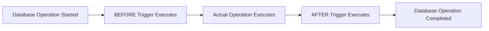

# MySQL Trigger Timing

## Introduction

Triggers are special database objects that automatically execute in response to certain events on a table. One of the most crucial aspects of creating effective triggers is understanding **when** they execute relative to the database operation that activates them. In MySQL, this is referred to as **trigger timing**.

MySQL supports two distinct timing options for triggers:
- **BEFORE triggers**: Execute before the triggering event
- **AFTER triggers**: Execute after the triggering event

Understanding the differences between these timing options is essential for implementing triggers that achieve your desired database behavior. This guide will explore both types with practical examples to demonstrate when and how to use each effectively.

## BEFORE vs AFTER Triggers: The Key Differences

Before diving into examples, let's clarify the fundamental differences between these two timing options:



### BEFORE Triggers

- Execute **before** the actual database operation (INSERT, UPDATE, DELETE)
- Can examine and modify the values to be inserted or updated
- Can prevent the operation from occurring by using `SIGNAL SQLSTATE` to raise an error
- Cannot access the AUTO_INCREMENT value of a newly inserted row (as it doesn't exist yet)
- Ideal for data validation and normalization

### AFTER Triggers

- Execute **after** the actual database operation completes
- Cannot modify the values that were inserted or updated (it's too late)
- Can access all final values, including AUTO_INCREMENT values
- Cannot prevent the operation (it has already happened)
- Ideal for logging changes, maintaining summary tables, and cascading changes

## Creating Triggers with Different Timing Options

The basic syntax for creating a trigger with timing options is:

```sql
CREATE TRIGGER trigger_name
{BEFORE | AFTER} {INSERT | UPDATE | DELETE}
ON table_name FOR EACH ROW
BEGIN
    -- Trigger body
END;
```

Let's explore both types with examples.

## BEFORE Triggers in Action

### Example 1: Data Validation

One common use for BEFORE triggers is validating data before it's inserted or updated:

```sql
DELIMITER //

CREATE TRIGGER validate_product_price
BEFORE INSERT ON products
FOR EACH ROW
BEGIN
    IF NEW.price < 0 THEN
        SIGNAL SQLSTATE '45000'
        SET MESSAGE_TEXT = 'Price cannot be negative';
    END IF;
END//

DELIMITER ;
```

In this example, the trigger prevents inserting products with negative prices by raising an error.

### Example 2: Data Normalization

BEFORE triggers are excellent for normalizing data before it's stored:

```sql
DELIMITER //

CREATE TRIGGER normalize_email
BEFORE INSERT ON users
FOR EACH ROW
BEGIN
    -- Convert email to lowercase
    SET NEW.email = LOWER(NEW.email);
    
    -- Trim whitespace from username
    SET NEW.username = TRIM(NEW.username);
END//

DELIMITER ;
```

When executing an insert like:

```sql
INSERT INTO users (username, email) VALUES ('  JohnDoe  ', 'John.Doe@EXAMPLE.com');
```

The trigger will normalize the data, resulting in:
- username: `JohnDoe` (without spaces)
- email: `john.doe@example.com` (lowercase)

## AFTER Triggers in Action

### Example 1: Audit Logging

AFTER triggers are perfect for maintaining audit logs of changes:

```sql
DELIMITER //

CREATE TRIGGER log_product_changes
AFTER UPDATE ON products
FOR EACH ROW
BEGIN
    INSERT INTO product_changelog (product_id, old_price, new_price, changed_at)
    VALUES (NEW.id, OLD.price, NEW.price, NOW());
END//

DELIMITER ;
```

This trigger records price changes in a separate audit table whenever a product is updated.

### Example 2: Maintaining Summary Tables

AFTER triggers can help maintain denormalized summary data:

```sql
DELIMITER //

CREATE TRIGGER update_order_totals
AFTER INSERT ON order_items
FOR EACH ROW
BEGIN
    -- Update the order's total amount
    UPDATE orders
    SET total_amount = total_amount + (NEW.price * NEW.quantity)
    WHERE id = NEW.order_id;
END//

DELIMITER ;
```

This trigger automatically updates the total amount in the orders table whenever new items are added to an order.

## Practical Use Case: Inventory Management System

Let's look at a more comprehensive example of using both BEFORE and AFTER triggers in an inventory management system:

```sql
-- Create tables
CREATE TABLE products (
    id INT AUTO_INCREMENT PRIMARY KEY,
    name VARCHAR(100) NOT NULL,
    stock INT NOT NULL DEFAULT 0,
    price DECIMAL(10,2) NOT NULL,
    last_updated TIMESTAMP
);

CREATE TABLE orders (
    id INT AUTO_INCREMENT PRIMARY KEY,
    customer_id INT,
    order_date TIMESTAMP DEFAULT CURRENT_TIMESTAMP,
    status VARCHAR(20) DEFAULT 'pending'
);

CREATE TABLE order_items (
    id INT AUTO_INCREMENT PRIMARY KEY,
    order_id INT,
    product_id INT,
    quantity INT NOT NULL,
    FOREIGN KEY (order_id) REFERENCES orders(id),
    FOREIGN KEY (product_id) REFERENCES products(id)
);

-- BEFORE trigger to validate stock availability
DELIMITER //
CREATE TRIGGER check_stock_before_order
BEFORE INSERT ON order_items
FOR EACH ROW
BEGIN
    DECLARE available_stock INT;
    
    -- Get current stock
    SELECT stock INTO available_stock
    FROM products
    WHERE id = NEW.product_id;
    
    -- Check if enough stock is available
    IF NEW.quantity > available_stock THEN
        SIGNAL SQLSTATE '45000'
        SET MESSAGE_TEXT = 'Insufficient stock available';
    END IF;
END//
DELIMITER ;

-- AFTER trigger to update inventory
DELIMITER //
CREATE TRIGGER update_inventory_after_order
AFTER INSERT ON order_items
FOR EACH ROW
BEGIN
    -- Reduce stock
    UPDATE products
    SET stock = stock - NEW.quantity,
        last_updated = NOW()
    WHERE id = NEW.product_id;
end//
DELIMITER ;
```

In this example:
1. The BEFORE trigger checks if there's enough stock before allowing a new order item.
2. The AFTER trigger updates the inventory count after an order item is successfully added.

Let's see how it works:

```sql
-- Insert initial product
INSERT INTO products (name, stock, price) VALUES ('Laptop', 10, 999.99);

-- Create an order
INSERT INTO orders (customer_id) VALUES (101);

-- Add item to order (works because stock is available)
INSERT INTO order_items (order_id, product_id, quantity) VALUES (1, 1, 2);
-- Stock is now 8

-- Try to add too many items (will fail)
INSERT INTO order_items (order_id, product_id, quantity) VALUES (1, 1, 10);
-- Error: Insufficient stock available
```

## When to Choose BEFORE vs AFTER Triggers

| Use BEFORE Triggers When: | Use AFTER Triggers When: |
|--------------------------|-------------------------|
| Validating data before saving | Logging changes after they occur |
| Normalizing or transforming data | Maintaining summary or aggregate tables |
| Enforcing business rules | Triggering notifications after changes |
| Preventing invalid operations | Updating related tables as a consequence |
| Setting default values dynamically | Implementing audit trails |

## Best Practices for Trigger Timing

1. **Choose the right timing**: Select BEFORE triggers for validation and data preparation, AFTER triggers for logging and consequential actions.

2. **Keep triggers lightweight**: Avoid complex operations that could slow down your database operations.

3. **Prevent trigger loops**: Be careful when updating tables that might activate other triggers.

4. **Document your triggers**: Always comment your trigger code to explain what it does.

5. **Test extensively**: Test both successful operations and cases where triggers should prevent operations.

## Common Pitfalls

1. **Using AFTER triggers for validation**: It's too late to validate data in an AFTER trigger as the operation has already occurred.

2. **Accessing AUTO_INCREMENT values in BEFORE INSERT triggers**: These values aren't available yet in BEFORE INSERT triggers.

3. **Overuse of triggers**: Too many triggers can make a database's behavior hard to understand and debug.

4. **Chain reactions**: Be careful of triggers that activate other triggers, creating complex chains of operations.

## Summary

MySQL trigger timing (BEFORE and AFTER) gives you precise control over when your trigger logic executes relative to database operations. BEFORE triggers are ideal for validation and data preparation, while AFTER triggers excel at maintaining derived data and creating audit trails.

By choosing the right trigger timing, you can ensure your database maintains data integrity, automates routine tasks, and implements business rules effectively.

## Exercises

1. Create a BEFORE trigger that validates that a user's date of birth is not in the future.

2. Create an AFTER trigger that maintains a count of comments for each blog post in a blog system.

3. Implement a trigger system that prevents deleting users who still have active orders, using appropriate trigger timing.

4. Create a trigger that automatically converts product names to title case before inserting or updating them.

5. Design a trigger-based audit system that logs all changes to sensitive customer data such as addresses and phone numbers.

## Additional Resources

- [MySQL Documentation on Triggers](https://dev.mysql.com/doc/refman/8.0/en/triggers.html)
- [MySQL Error Handling in Triggers](https://dev.mysql.com/doc/refman/8.0/en/signal.html)
- [Optimizing Trigger Performance](https://dev.mysql.com/doc/refman/8.0/en/trigger-optimization.html)

Understanding trigger timing is essential for creating effective, efficient database applications. By mastering BEFORE and AFTER triggers, you'll be able to automate complex database behaviors while maintaining data integrity.