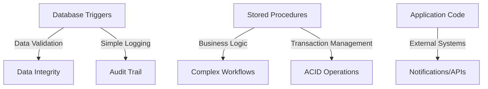

# MySQL Trigger Limitations

While MySQL triggers are powerful tools for automating database actions, they come with certain limitations that developers need to understand. Knowing these constraints helps you design more effective database solutions and avoid potential pitfalls.

## Introduction to MySQL Trigger Limitations

Triggers in MySQL allow you to automatically execute code when specific data modification events occur, such as INSERT, UPDATE, or DELETE operations. However, MySQL imposes various restrictions on triggers to maintain database performance, security, and predictability. Let's explore these limitations in detail.

## Maximum Number of Triggers

MySQL restricts the number of triggers you can define on a single table:

- You can have at most **six triggers per table** (one for each combination of time - BEFORE/AFTER and event - INSERT/UPDATE/DELETE)
- You cannot have multiple triggers for the same combination of event and action time on the same table

```sql
-- This is allowed (different timing):
CREATE TRIGGER before_employee_update BEFORE UPDATE ON employees
FOR EACH ROW
BEGIN
    -- Trigger body
END;

CREATE TRIGGER after_employee_update AFTER UPDATE ON employees
FOR EACH ROW
BEGIN
    -- Trigger body
END;

-- This would cause an error (same timing and event):
CREATE TRIGGER another_before_employee_update BEFORE UPDATE ON employees
FOR EACH ROW
BEGIN
    -- Trigger body
END;
-- Error: Multiple triggers with the same action time and event for one table
```

## Nested Trigger Limitations

MySQL supports nested triggers (triggers that activate other triggers), but with restrictions:

- Maximum nesting depth is limited to 4 levels
- Recursion in triggers is not allowed (a trigger cannot activate itself either directly or indirectly)

Here's an example of a potential recursion issue:

```sql
-- This setup would cause recursive trigger execution:

CREATE TABLE audits (
    id INT AUTO_INCREMENT PRIMARY KEY,
    table_name VARCHAR(50),
    action VARCHAR(50),
    modified_time TIMESTAMP DEFAULT CURRENT_TIMESTAMP
);

CREATE TABLE employees (
    id INT AUTO_INCREMENT PRIMARY KEY,
    name VARCHAR(100),
    salary DECIMAL(10,2)
);

-- First trigger
CREATE TRIGGER after_employee_update AFTER UPDATE ON employees
FOR EACH ROW
BEGIN
    INSERT INTO audits(table_name, action) VALUES ('employees', 'UPDATE');
END;

-- Second trigger (would cause recursion)
CREATE TRIGGER after_audit_insert AFTER INSERT ON audits
FOR EACH ROW
BEGIN
    -- This would cause infinite recursion if allowed:
    UPDATE employees SET salary = salary * 1.01 WHERE id = 1;
END;
```

If executed, the above triggers would create an infinite loop where:
1. Updating an employee triggers an insert into audits
2. Inserting into audits triggers an update on employees
3. The cycle repeats indefinitely

MySQL prevents this by disallowing recursive trigger invocation.

## Limitations on Trigger Operations

### Cannot Use Certain SQL Statements

Triggers cannot contain certain SQL statements:

- Cannot use statements that commit or roll back the current transaction:
  - `COMMIT`
  - `ROLLBACK`
  - `SAVEPOINT`
  - `RELEASE SAVEPOINT`

- Cannot use statements that return results to the client:
  - `SELECT` statements that return data to the client
  - `SHOW` statements

- Cannot use statements that refer to temporary tables

### Restricted DDL Operations

Triggers cannot contain Data Definition Language (DDL) statements:

```sql
-- This would NOT work in a trigger:
CREATE TRIGGER after_product_insert AFTER INSERT ON products
FOR EACH ROW
BEGIN
    -- Cannot create tables in triggers
    CREATE TABLE new_table (id INT);
    
    -- Cannot drop tables in triggers
    DROP TABLE old_table;
    
    -- Cannot alter tables in triggers
    ALTER TABLE other_table ADD COLUMN new_col INT;
END;
```

## No Access to Connection Information

Triggers don't have access to client connection information:

```sql
-- This would NOT work in a trigger:
CREATE TRIGGER log_user_action AFTER UPDATE ON employees
FOR EACH ROW
BEGIN
    -- Variables like USER() or CONNECTION_ID() might not return
    -- the expected values as they reflect the trigger's context
    INSERT INTO audit_log (user, action) 
    VALUES (USER(), 'update employee');
END;
```

## Trigger Timing Limitations

### No INSTEAD OF Triggers

Unlike some other database systems, MySQL doesn't support INSTEAD OF triggers:

```sql
-- This syntax is NOT supported in MySQL:
CREATE TRIGGER instead_of_employee_delete INSTEAD OF DELETE ON employees
FOR EACH ROW
BEGIN
    -- Alternative logic
END;
```

### No Triggers on Views

MySQL does not support triggers on views, only on base tables:

```sql
-- This would NOT work:
CREATE VIEW employee_summary AS
SELECT id, name, department FROM employees;

CREATE TRIGGER after_view_update AFTER UPDATE ON employee_summary
FOR EACH ROW
BEGIN
    -- Trigger logic here
END;
-- Error: Trigger cannot be created on a view
```

## Performance Considerations

While not strictly limitations, there are important performance implications to consider:

### Trigger Execution Overhead

Triggers add execution overhead. Each triggered action requires additional processing:

```sql
-- Consider a heavily used table with multiple triggers
CREATE TABLE orders (
    id INT AUTO_INCREMENT PRIMARY KEY,
    customer_id INT,
    amount DECIMAL(10,2),
    status VARCHAR(20)
);

CREATE TRIGGER before_order_insert BEFORE INSERT ON orders
FOR EACH ROW
BEGIN
    -- Validation logic
END;

CREATE TRIGGER after_order_insert AFTER INSERT ON orders
FOR EACH ROW
BEGIN
    -- Update statistics
END;

CREATE TRIGGER after_order_update AFTER UPDATE ON orders
FOR EACH ROW
BEGIN
    -- Audit logging
END;

-- With high volume of inserts/updates, these triggers could impact performance
```

## Error Handling Limitations

Error handling in triggers is limited:

- Cannot use `HANDLER` declarations for exceptions
- Cannot redirect errors or warnings
- If a trigger encounters an error, the entire statement that activated it will generally fail

```sql
CREATE TRIGGER employee_check BEFORE INSERT ON employees
FOR EACH ROW
BEGIN
    -- Cannot use HANDLER for exceptions like in stored procedures
    -- IF new.salary < 0 THEN
    --     SIGNAL SQLSTATE '45000' SET MESSAGE_TEXT = 'Salary cannot be negative';
    -- END IF;
    
    -- Instead, you can use this simpler approach:
    IF new.salary < 0 THEN
        SIGNAL SQLSTATE '45000' SET MESSAGE_TEXT = 'Salary cannot be negative';
    END IF;
END;
```

## Real-World Impact of Trigger Limitations

Let's explore practical scenarios where trigger limitations matter:

### Case Study: Order Processing System

Consider an e-commerce platform that needs to:
1. Validate orders before insertion
2. Update inventory after order creation
3. Log all activities
4. Send notifications

**Problem**: Direct implementation using only triggers could hit several limitations:

```sql
-- Setup tables
CREATE TABLE orders (
    id INT AUTO_INCREMENT PRIMARY KEY, 
    customer_id INT,
    total_amount DECIMAL(10,2),
    status VARCHAR(20)
);

CREATE TABLE inventory (
    product_id INT PRIMARY KEY,
    quantity INT
);

CREATE TABLE order_items (
    id INT AUTO_INCREMENT PRIMARY KEY,
    order_id INT,
    product_id INT,
    quantity INT,
    price DECIMAL(10,2)
);

CREATE TABLE activity_log (
    id INT AUTO_INCREMENT PRIMARY KEY,
    related_table VARCHAR(50),
    action_type VARCHAR(20),
    record_id INT,
    details TEXT,
    created_at TIMESTAMP DEFAULT CURRENT_TIMESTAMP
);

-- This trigger would update inventory and log activity
CREATE TRIGGER after_order_item_insert AFTER INSERT ON order_items
FOR EACH ROW
BEGIN
    -- Update inventory
    UPDATE inventory 
    SET quantity = quantity - NEW.quantity 
    WHERE product_id = NEW.product_id;
    
    -- Log activity
    INSERT INTO activity_log (related_table, action_type, record_id, details)
    VALUES ('order_items', 'INSERT', NEW.id, CONCAT('Added product: ', NEW.product_id));
    
    -- Cannot directly send notifications from here
    -- Cannot handle complex error conditions
    -- Cannot perform transaction management
END;
```

**Better Solution**: A hybrid approach combining triggers for data integrity with application code or stored procedures for complex logic:

```sql
-- Simplified trigger focused on data integrity
CREATE TRIGGER before_order_item_insert BEFORE INSERT ON order_items
FOR EACH ROW
BEGIN
    DECLARE current_stock INT;
    
    -- Check inventory availability
    SELECT quantity INTO current_stock FROM inventory 
    WHERE product_id = NEW.product_id;
    
    IF current_stock < NEW.quantity THEN
        SIGNAL SQLSTATE '45000' 
        SET MESSAGE_TEXT = 'Insufficient inventory for this product';
    END IF;
END;

-- Then handle complex operations in stored procedures
DELIMITER //
CREATE PROCEDURE process_new_order(IN p_customer_id INT, IN p_total DECIMAL(10,2))
BEGIN
    DECLARE new_order_id INT;
    
    -- Start transaction for complex operations
    START TRANSACTION;
    
    -- Insert the order
    INSERT INTO orders (customer_id, total_amount, status)
    VALUES (p_customer_id, p_total, 'NEW');
    
    -- Get the new order ID
    SET new_order_id = LAST_INSERT_ID();
    
    -- Order items would be inserted separately (triggers will validate)
    
    -- Additional complex logic here
    
    -- Log the activity
    INSERT INTO activity_log (related_table, action_type, record_id, details)
    VALUES ('orders', 'INSERT', new_order_id, 'New order created');
    
    COMMIT;
END //
DELIMITER ;
```

## Workarounds for Common Trigger Limitations

### Handling Multiple Triggers with Same Event and Timing

Since MySQL doesn't allow multiple triggers with the same event and timing on a table, combine logic in a single trigger:

```sql
-- Instead of multiple BEFORE INSERT triggers, combine logic:
CREATE TRIGGER before_employee_insert BEFORE INSERT ON employees
FOR EACH ROW
BEGIN
    -- Validation logic 1
    IF NEW.salary < 0 THEN
        SIGNAL SQLSTATE '45000' SET MESSAGE_TEXT = 'Salary cannot be negative';
    END IF;
    
    -- Validation logic 2
    IF NEW.hire_date > CURRENT_DATE() THEN
        SIGNAL SQLSTATE '45000' SET MESSAGE_TEXT = 'Hire date cannot be in the future';
    END IF;
    
    -- Default value logic that would have been in another trigger
    IF NEW.status IS NULL THEN
        SET NEW.status = 'ACTIVE';
    END IF;
END;
```

### Managing Complex Workflows

For complex workflows that would hit trigger limitations, use a combination of:

1. Simple triggers for data validation
2. Stored procedures for complex logic
3. Application-level code for notifications and external systems



## Summary

MySQL triggers are powerful database objects with specific limitations that shape how you should use them:

- **Quantity limits**: Maximum of six triggers per table (one for each combination of timing and event)
- **Nesting restrictions**: Maximum nesting depth of 4, no recursive triggers
- **Statement limitations**: No transaction control statements, DDL statements, or certain DML operations
- **Structural limitations**: No INSTEAD OF triggers or triggers on views
- **Performance considerations**: Multiple triggers can impact database performance

Understanding these limitations helps you design more effective database solutions by:
1. Using triggers primarily for data validation and simple integrity constraints
2. Leveraging stored procedures for complex business logic 
3. Handling external systems interaction at the application level
4. Being mindful of performance impacts in high-volume systems

## Additional Resources and Exercises

### Further Learning

- MySQL official documentation on [trigger syntax and examples](https://dev.mysql.com/doc/refman/8.0/en/trigger-syntax.html)
- MySQL official documentation on [stored program restrictions](https://dev.mysql.com/doc/refman/8.0/en/stored-program-restrictions.html)

### Practice Exercises

1. **Trigger Refactoring Exercise**: Identify problematic triggers in the following schema and refactor them to avoid MySQL limitations:
   ```sql
   CREATE TABLE products (id INT PRIMARY KEY, name VARCHAR(100), price DECIMAL(10,2), stock INT);
   CREATE TABLE orders (id INT PRIMARY KEY, customer_id INT, order_date DATE);
   CREATE TABLE order_items (order_id INT, product_id INT, quantity INT);
   
   -- Implement triggers that:
   -- 1. Validate product stock before ordering
   -- 2. Update product stock after ordering
   -- 3. Calculate and update order total price
   -- 4. Log all operations
   ```

2. **Hybrid Solution Design**: Design a database schema with appropriate triggers, stored procedures, and application logic for a library management system that needs to:
   - Track book checkouts and returns
   - Calculate late fees
   - Maintain member status based on activity
   - Generate monthly reports
   - Send notification emails for due dates

Remember that understanding MySQL trigger limitations doesn't make triggers less useful—it makes you more effective at using them appropriately within a well-designed database system.