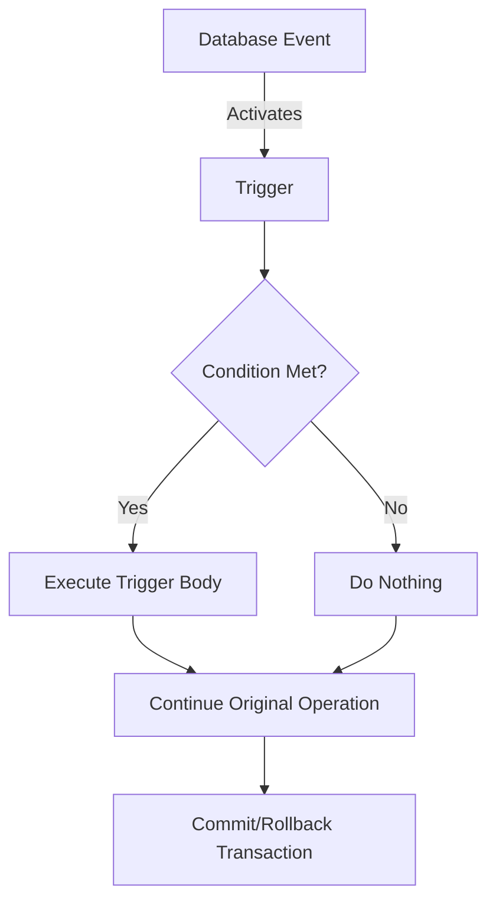

# MySQL Trigger Examples

In this tutorial, we'll explore various practical examples of MySQL triggers that you can implement in your own database projects. Triggers are powerful database objects that automatically execute when specific events occur on a table, such as INSERT, UPDATE, or DELETE operations.

## Introduction to MySQL Triggers

Before diving into examples, let's briefly recap what triggers are. A MySQL trigger is a stored program that automatically executes when a specific event occurs on a particular table. These events include:

- `BEFORE INSERT` - Executes before a new row is inserted
- `AFTER INSERT` - Executes after a new row is inserted
- `BEFORE UPDATE` - Executes before an existing row is updated
- `AFTER UPDATE` - Executes after an existing row is updated
- `BEFORE DELETE` - Executes before a row is deleted
- `AFTER DELETE` - Executes after a row is deleted

Triggers can help maintain data integrity, implement business rules, audit changes, and automate tasks.

## Basic Trigger Syntax

Here's the general syntax for creating a trigger in MySQL:

```sql
CREATE TRIGGER trigger_name
{BEFORE | AFTER} {INSERT | UPDATE | DELETE} ON table_name
FOR EACH ROW
BEGIN
    -- Trigger body code
END;
```

Now let's explore practical examples of MySQL triggers.

## Example 1: Data Validation Trigger

One common use of triggers is to validate data before it's inserted or updated.

### Scenario: Ensuring Product Price is Positive

Let's create a trigger that prevents inserting products with negative or zero prices:

```sql
DELIMITER //

CREATE TRIGGER before_product_insert
BEFORE INSERT ON products
FOR EACH ROW
BEGIN
    IF NEW.price <= 0 THEN
        SIGNAL SQLSTATE '45000' 
        SET MESSAGE_TEXT = 'Price must be greater than zero';
    END IF;
END//

DELIMITER ;
```

### How It Works:

1. We define a `BEFORE INSERT` trigger on the `products` table
2. Inside the trigger, we check if the new price value is less than or equal to zero
3. If the condition is true, we raise an error with a custom message
4. The insert operation will be aborted with our error message

### Testing the Trigger:

```sql
-- This will succeed
INSERT INTO products (name, price, category) VALUES ('Laptop', 899.99, 'Electronics');

-- This will fail with our error message
INSERT INTO products (name, price, category) VALUES ('Broken Item', -10, 'Misc');
```

## Example 2: Auditing with Triggers

Triggers are excellent for creating audit trails of database changes.

### Scenario: Tracking Price Changes

Let's create a price history table and a trigger that records product price changes:

```sql
-- Create a price history table
CREATE TABLE price_history (
    id INT AUTO_INCREMENT PRIMARY KEY,
    product_id INT NOT NULL,
    old_price DECIMAL(10,2),
    new_price DECIMAL(10,2),
    changed_at TIMESTAMP DEFAULT CURRENT_TIMESTAMP,
    changed_by VARCHAR(50)
);

-- Create the trigger
DELIMITER //

CREATE TRIGGER after_product_price_update
AFTER UPDATE ON products
FOR EACH ROW
BEGIN
    IF OLD.price != NEW.price THEN
        INSERT INTO price_history (product_id, old_price, new_price, changed_by)
        VALUES (NEW.id, OLD.price, NEW.price, CURRENT_USER());
    END IF;
END//

DELIMITER ;
```

### How It Works:

1. We create a history table to store price changes
2. Our `AFTER UPDATE` trigger checks if the price has changed
3. If it has, we record the old and new prices, along with user information
4. The `OLD` and `NEW` keywords refer to the row's values before and after the update

### Testing the Trigger:

```sql
-- Update a product price
UPDATE products SET price = 999.99 WHERE id = 1;

-- Check the audit trail
SELECT * FROM price_history;
```

Output:
```
+----+------------+-----------+-----------+---------------------+-------------+
| id | product_id | old_price | new_price | changed_at          | changed_by  |
+----+------------+-----------+-----------+---------------------+-------------+
|  1 |          1 |    899.99 |    999.99 | 2023-04-12 14:32:15 | root@localhost |
+----+------------+-----------+-----------+---------------------+-------------+
```

## Example 3: Automatic Data Updates

Triggers can be used to automatically update related data.

### Scenario: Maintaining a Product Inventory Count

Let's create a trigger that updates inventory counts when orders are placed:

```sql
DELIMITER //

CREATE TRIGGER after_order_item_insert
AFTER INSERT ON order_items
FOR EACH ROW
BEGIN
    -- Reduce the stock quantity for the product
    UPDATE products 
    SET stock_quantity = stock_quantity - NEW.quantity
    WHERE id = NEW.product_id;
    
    -- Check if we need to raise a low stock alert
    DECLARE remaining_stock INT;
    SELECT stock_quantity INTO remaining_stock 
    FROM products WHERE id = NEW.product_id;
    
    IF remaining_stock < 5 THEN
        INSERT INTO inventory_alerts (product_id, alert_message)
        VALUES (NEW.product_id, CONCAT('Low stock alert: Only ', remaining_stock, ' remaining'));
    END IF;
END//

DELIMITER ;
```

### How It Works:

1. When a new order item is inserted, the trigger automatically reduces the product's stock
2. It then checks if the remaining stock is below a threshold (5 in this example)
3. If stock is low, it creates an alert in a separate alerts table

## Example 4: Enforcing Referential Integrity

While MySQL's foreign keys enforce basic referential integrity, triggers can implement more complex rules.

### Scenario: Preventing Customer Deletion with Active Orders

```sql
DELIMITER //

CREATE TRIGGER before_customer_delete
BEFORE DELETE ON customers
FOR EACH ROW
BEGIN
    DECLARE order_count INT;
    
    -- Count active orders for this customer
    SELECT COUNT(*) INTO order_count 
    FROM orders 
    WHERE customer_id = OLD.id AND status != 'completed';
    
    -- Prevent deletion if there are active orders
    IF order_count > 0 THEN
        SIGNAL SQLSTATE '45000'
        SET MESSAGE_TEXT = 'Cannot delete customer with active orders';
    END IF;
END//

DELIMITER ;
```

### How It Works:

1. Before a customer is deleted, the trigger counts how many active orders they have
2. If they have any active orders, the deletion is prevented with an error message
3. This ensures that you don't orphan order records by deleting a customer

## Example 5: Calculated Columns with Triggers

Triggers can maintain calculated or derived columns.

### Scenario: Automatically Calculating Order Totals

```sql
DELIMITER //

CREATE TRIGGER after_order_item_change
AFTER INSERT ON order_items
FOR EACH ROW
BEGIN
    -- Update the order total
    UPDATE orders
    SET total_amount = (
        SELECT SUM(price * quantity)
        FROM order_items
        WHERE order_id = NEW.order_id
    )
    WHERE id = NEW.order_id;
END//

-- Also handle updates to order items
CREATE TRIGGER after_order_item_update
AFTER UPDATE ON order_items
FOR EACH ROW
BEGIN
    -- Update the order total
    UPDATE orders
    SET total_amount = (
        SELECT SUM(price * quantity)
        FROM order_items
        WHERE order_id = NEW.order_id
    )
    WHERE id = NEW.order_id;
END//

-- Also handle deletes
CREATE TRIGGER after_order_item_delete
AFTER DELETE ON order_items
FOR EACH ROW
BEGIN
    -- Update the order total
    UPDATE orders
    SET total_amount = (
        SELECT SUM(price * quantity)
        FROM order_items
        WHERE order_id = OLD.order_id
    )
    WHERE id = OLD.order_id;
END//

DELIMITER ;
```

### How It Works:

1. We create three triggers to handle insert, update, and delete operations
2. Each trigger recalculates the order total based on the sum of (price × quantity) for all items
3. The order's total_amount field is automatically kept in sync with its items

## Example 6: Implementing Soft Deletes

Soft deletes preserve data by marking records as deleted rather than physically removing them.

### Scenario: Implementing Soft Deletes for Products

```sql
-- First, add a deleted column
ALTER TABLE products ADD COLUMN deleted BOOLEAN DEFAULT FALSE;
ALTER TABLE products ADD COLUMN deleted_at DATETIME DEFAULT NULL;

-- Create trigger to handle "soft delete"
DELIMITER //

CREATE TRIGGER before_product_delete
BEFORE DELETE ON products
FOR EACH ROW
BEGIN
    -- Instead of allowing the delete, we'll insert into an archive table
    INSERT INTO product_archive (id, name, price, category, created_at)
    VALUES (OLD.id, OLD.name, OLD.price, OLD.category, OLD.created_at);
    
    -- Then convert the delete into an update
    UPDATE products 
    SET deleted = TRUE, 
        deleted_at = NOW() 
    WHERE id = OLD.id;
    
    -- Signal to prevent the actual delete
    SIGNAL SQLSTATE '45000'
    SET MESSAGE_TEXT = 'Products cannot be deleted; they have been archived instead';
END//

DELIMITER ;
```

### How It Works:

1. We add columns to track deletion status
2. Our `BEFORE DELETE` trigger copies the data to an archive table
3. It then marks the record as deleted using an update
4. Finally, it prevents the actual deletion with an error message

To properly implement soft deletes, you would also need to modify your application queries to include `WHERE deleted = FALSE`.

## Example 7: Multi-Table Synchronization

Triggers can ensure data consistency across multiple related tables.

### Scenario: Synchronizing User Profile Data

```sql
DELIMITER //

CREATE TRIGGER after_user_update
AFTER UPDATE ON users
FOR EACH ROW
BEGIN
    -- If email changed, update it in the profile table too
    IF NEW.email != OLD.email THEN
        UPDATE user_profiles 
        SET email = NEW.email,
            last_updated = NOW()
        WHERE user_id = NEW.id;
    END IF;
    
    -- If name changed, update display name in profiles
    IF NEW.first_name != OLD.first_name OR NEW.last_name != OLD.last_name THEN
        UPDATE user_profiles
        SET display_name = CONCAT(NEW.first_name, ' ', NEW.last_name),
            last_updated = NOW()
        WHERE user_id = NEW.id;
    END IF;
END//

DELIMITER ;
```

### How It Works:

1. When user data is updated in the main users table
2. The trigger detects specific changes (email or name)
3. It automatically propagates those changes to the related profile table
4. This ensures consistency across related tables

## Best Practices and Considerations

When using MySQL triggers, keep these best practices in mind:

1. **Performance Impact**: Triggers execute additional code for each row affected by the triggering statement, which can impact performance with large datasets.

2. **Debugging Challenges**: Because triggers run automatically, debugging can be challenging. Consider logging trigger actions to a separate table for troubleshooting.

3. **Maintainability**: Document your triggers thoroughly. Complex business logic in triggers can be hard to maintain.

4. **Recursion Risk**: Be careful not to create trigger chains that could cause infinite recursion. For example, if Table A's trigger updates Table B, and Table B's trigger updates Table A.

5. **Transaction Awareness**: Remember that triggers operate within the same transaction as the triggering statement. If the transaction rolls back, trigger actions also roll back.



## Summary

MySQL triggers are powerful tools that can help maintain data integrity, automate processes, and enforce business rules directly at the database level. In this tutorial, we explored seven practical examples:

1. Data validation to ensure data quality
2. Audit logging to track data changes
3. Automatic inventory management
4. Complex referential integrity rules
5. Maintaining calculated columns
6. Implementing soft delete functionality 
7. Synchronizing data across multiple tables

These examples demonstrate how triggers can enhance your database design and reduce the need for application-level logic to maintain data consistency.

## Exercise Ideas

To reinforce your understanding of MySQL triggers:

1. Create a trigger that logs all login attempts to a security log table
2. Implement a trigger that automatically updates a "last_modified" timestamp on any table update
3. Design a trigger system that calculates and stores the average rating for products based on customer reviews
4. Build a trigger to implement a simple approval workflow where new records need approval before becoming "active"

## Additional Resources

- [MySQL Documentation on Triggers](https://dev.mysql.com/doc/refman/8.0/en/triggers.html)
- Practice building and testing triggers in a safe development environment
- Consider exploring event schedulers as a complement to triggers for time-based operations

Remember that while triggers are powerful, they should be used judiciously. For very complex business logic, you might want to consider handling it at the application level instead of within database triggers.

Happy coding!