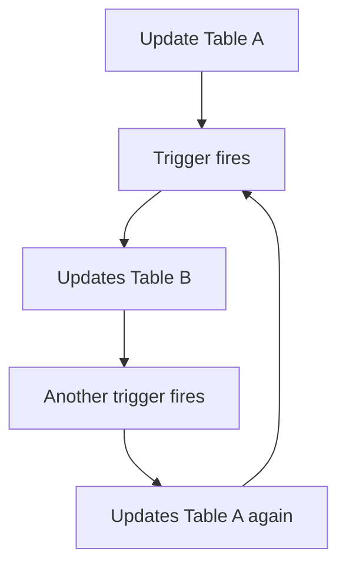

# MySQL Trigger Debugging

Triggers are powerful database objects that automatically execute in response to specific events. However, with this power comes complexity, and debugging triggers can be challenging for beginners. This guide will help you understand how to effectively debug MySQL triggers, identify common issues, and implement best practices for troubleshooting.

## Introduction to Trigger Debugging

Debugging triggers differs from debugging regular SQL queries or stored procedures because:

1. Triggers execute automatically
2. They often run in the background without direct user interaction
3. Error messages may not be immediately visible to applications
4. Trigger failures can cause entire transactions to fail

Understanding how to debug triggers effectively is essential for maintaining reliable database operations.

## Setting Up for Effective Debugging

Before we dive into specific debugging techniques, let's set up our debugging environment:

### Enable Error Logging

MySQL maintains error logs that can provide valuable insights when triggers fail:

```sql
-- Check where your error log is located
SHOW VARIABLES LIKE 'log_error';

-- Enable general query logging (for development environments only)
SET GLOBAL general_log = 'ON';
SET GLOBAL log_output = 'TABLE';

-- Now queries will be logged to mysql.general_log table
```

:::caution
General query logging can impact performance and generate large log files. Use it only during development and debugging, not in production environments.
:::

### Create a Test Table and Trigger

Let's create a simple setup to practice debugging:

```sql
-- Create test tables
CREATE TABLE products (
  product_id INT PRIMARY KEY AUTO_INCREMENT,
  product_name VARCHAR(100),
  price DECIMAL(10, 2),
  stock INT
);

CREATE TABLE inventory_log (
  log_id INT PRIMARY KEY AUTO_INCREMENT,
  product_id INT,
  action VARCHAR(20),
  quantity INT,
  log_date TIMESTAMP DEFAULT CURRENT_TIMESTAMP,
  user VARCHAR(50)
);
```

Now, let's create a trigger with a deliberate issue for debugging practice:

```sql
DELIMITER //
CREATE TRIGGER after_product_update
AFTER UPDATE ON products
FOR EACH ROW
BEGIN
  -- Deliberate error: referenced non-existent column 'quantity'
  IF NEW.stock <> OLD.stock THEN
    INSERT INTO inventory_log (product_id, action, quantity, user)
    VALUES (NEW.product_id, 'UPDATE', NEW.quantity, USER());
  END IF;
END//
DELIMITER ;
```

## Common Trigger Debugging Techniques

### 1. Using Signal Statements

The `SIGNAL` statement allows you to raise custom errors inside triggers, which is invaluable for debugging:

```sql
DELIMITER //
CREATE TRIGGER before_product_insert
BEFORE INSERT ON products
FOR EACH ROW
BEGIN
  -- Debug information using SIGNAL
  IF NEW.price <= 0 THEN
    SIGNAL SQLSTATE '45000' 
    SET MESSAGE_TEXT = 'Debug: price is invalid. Value provided was:', 
    MYSQL_ERRNO = 30001;
  END IF;
END//
DELIMITER ;
```

When you try to insert a product with an invalid price:

```sql
-- This will trigger our debug message
INSERT INTO products (product_name, price, stock) 
VALUES ('Test Product', -10, 100);
```

Output:
```
Error Code: 30001
Debug: price is invalid. Value provided was:
```

### 2. Creating Debug Tables

A practical approach is to create a dedicated debug table to record information during trigger execution:

```sql
-- Create a debug table
CREATE TABLE trigger_debug_log (
  id INT AUTO_INCREMENT PRIMARY KEY,
  trigger_name VARCHAR(100),
  table_name VARCHAR(100),
  debug_info TEXT,
  created_at TIMESTAMP DEFAULT CURRENT_TIMESTAMP
);
```

Now, let's fix our problematic trigger and add debugging:

```sql
DELIMITER //
CREATE OR REPLACE TRIGGER after_product_update
AFTER UPDATE ON products
FOR EACH ROW
BEGIN
  -- Log debug information
  INSERT INTO trigger_debug_log (trigger_name, table_name, debug_info)
  VALUES ('after_product_update', 'products', 
    CONCAT('OLD stock: ', OLD.stock, ', NEW stock: ', NEW.stock));
    
  -- Fixed version
  IF NEW.stock <> OLD.stock THEN
    INSERT INTO inventory_log (product_id, action, quantity, user)
    VALUES (NEW.product_id, 'UPDATE', NEW.stock - OLD.stock, USER());
  END IF;
END//
DELIMITER ;
```

Now when we update a product:

```sql
-- Insert a test product
INSERT INTO products (product_name, price, stock) VALUES ('Debugging Example', 25.99, 50);

-- Update the stock
UPDATE products SET stock = 45 WHERE product_name = 'Debugging Example';
```

We can check our debug table:

```sql
SELECT * FROM trigger_debug_log ORDER BY created_at DESC LIMIT 1;
```

Output:
```
| id | trigger_name        | table_name | debug_info               | created_at          |
|----|---------------------|------------|--------------------------|---------------------|
| 1  | after_product_update| products   | OLD stock: 50, NEW stock: 45 | 2023-05-10 14:25:12 |
```

### 3. Viewing Trigger Errors

When a trigger fails, MySQL provides error messages. You can view the last error message with:

```sql
SHOW ERRORS;
```

For a more comprehensive history of errors:

```sql
SHOW WARNINGS;
```

## Systematic Trigger Debugging

Let's adopt a systematic approach to debugging triggers:

### Step 1: Verify Trigger Existence and Structure

```sql
-- List all triggers
SHOW TRIGGERS;

-- View detailed trigger definition
SHOW CREATE TRIGGER after_product_update;
```

### Step 2: Test Trigger Conditions

Create a controlled test case that should activate your trigger:

```sql
-- Start a transaction so we can rollback after testing
START TRANSACTION;

-- Perform an operation that should trigger our trigger
UPDATE products SET stock = stock - 5 WHERE product_id = 1;

-- Check if the trigger executed correctly
SELECT * FROM inventory_log ORDER BY log_id DESC LIMIT 1;

-- Rollback to undo test changes
ROLLBACK;
```

### Step 3: Use Temporary Logging

Insert temporary debugging code into your trigger:

```sql
DELIMITER //
CREATE OR REPLACE TRIGGER after_product_update
AFTER UPDATE ON products
FOR EACH ROW
BEGIN
  -- Debug variable values
  INSERT INTO trigger_debug_log (trigger_name, debug_info)
  VALUES ('after_product_update', 
    CONCAT(
      'Product ID: ', NEW.product_id, 
      ', Old Stock: ', OLD.stock, 
      ', New Stock: ', NEW.stock,
      ', Difference: ', NEW.stock - OLD.stock
    )
  );
  
  -- Normal trigger logic follows...
  IF NEW.stock <> OLD.stock THEN
    INSERT INTO inventory_log (product_id, action, quantity, user)
    VALUES (NEW.product_id, 'UPDATE', NEW.stock - OLD.stock, USER());
  END IF;
END//
DELIMITER ;
```

## Common Trigger Issues and Solutions

### 1. Recursive Trigger Calls

One of the most confusing issues occurs when triggers cause recursive loops:



**Solution**: Implement guards in your triggers or restructure them to prevent recursion:

```sql
DELIMITER //
CREATE TRIGGER update_related_table
AFTER UPDATE ON main_table
FOR EACH ROW
BEGIN
  -- Set a session variable to prevent recursion
  IF @updating_related IS NULL THEN
    SET @updating_related = 1;
    
    UPDATE related_table 
    SET column1 = NEW.column1 
    WHERE foreign_key = NEW.id;
    
    SET @updating_related = NULL;
  END IF;
END//
DELIMITER ;
```

### 2. Incorrectly Handling NULL Values

NULL handling can cause subtle bugs in triggers:

```sql
DELIMITER //
CREATE TRIGGER before_insert_check
BEFORE INSERT ON orders
FOR EACH ROW
BEGIN
  -- Incorrect NULL handling
  IF NEW.discount = 0 THEN  -- This will fail if discount is NULL!
    SET NEW.discount_applied = 'No';
  END IF;
END//
DELIMITER ;
```

**Solution**: Always use `IS NULL` or `IS NOT NULL` to handle NULL values:

```sql
DELIMITER //
CREATE OR REPLACE TRIGGER before_insert_check
BEFORE INSERT ON orders
FOR EACH ROW
BEGIN
  -- Correct NULL handling
  IF NEW.discount IS NULL OR NEW.discount = 0 THEN
    SET NEW.discount_applied = 'No';
  END IF;
END//
DELIMITER ;
```

### 3. Complex Transaction Issues

Sometimes triggers fail because of transaction issues or lock conflicts:

**Solution**: Use `SHOW ENGINE INNODB STATUS` to investigate transaction and lock problems:

```sql
-- Check for lock conflicts
SHOW ENGINE INNODB STATUS;
```

## Real-world Application: Auditing with Debugging

Let's build a practical auditing system with robust debugging:

```sql
-- Create tables for our example
CREATE TABLE customers (
  id INT AUTO_INCREMENT PRIMARY KEY,
  name VARCHAR(100),
  email VARCHAR(100),
  status VARCHAR(20),
  created_at TIMESTAMP DEFAULT CURRENT_TIMESTAMP
);

CREATE TABLE customer_audit_log (
  audit_id INT AUTO_INCREMENT PRIMARY KEY,
  customer_id INT,
  action VARCHAR(10),
  field_name VARCHAR(50),
  old_value TEXT,
  new_value TEXT,
  changed_by VARCHAR(100),
  changed_at TIMESTAMP DEFAULT CURRENT_TIMESTAMP
);

CREATE TABLE debug_logs (
  log_id INT AUTO_INCREMENT PRIMARY KEY,
  source VARCHAR(100),
  message TEXT,
  created_at TIMESTAMP DEFAULT CURRENT_TIMESTAMP
);
```

Now, let's create a trigger with comprehensive debugging:

```sql
DELIMITER //
CREATE TRIGGER after_customer_update
AFTER UPDATE ON customers
FOR EACH ROW
BEGIN
  DECLARE debug_msg TEXT;
  
  -- Log entry to debug table
  SET debug_msg = CONCAT('Trigger executing for customer ID: ', NEW.id);
  INSERT INTO debug_logs (source, message) VALUES ('after_customer_update', debug_msg);
  
  -- Check which fields were updated and log them
  IF NEW.name <> OLD.name OR (NEW.name IS NULL XOR OLD.name IS NULL) THEN
    INSERT INTO customer_audit_log (customer_id, action, field_name, old_value, new_value, changed_by)
    VALUES (NEW.id, 'UPDATE', 'name', OLD.name, NEW.name, CURRENT_USER());
    
    -- Additional debug logging
    SET debug_msg = CONCAT('Name changed from "', IFNULL(OLD.name, 'NULL'), '" to "', IFNULL(NEW.name, 'NULL'), '"');
    INSERT INTO debug_logs (source, message) VALUES ('after_customer_update', debug_msg);
  END IF;
  
  IF NEW.email <> OLD.email OR (NEW.email IS NULL XOR OLD.email IS NULL) THEN
    INSERT INTO customer_audit_log (customer_id, action, field_name, old_value, new_value, changed_by)
    VALUES (NEW.id, 'UPDATE', 'email', OLD.email, NEW.email, CURRENT_USER());
    
    -- Additional debug logging
    SET debug_msg = CONCAT('Email changed from "', IFNULL(OLD.email, 'NULL'), '" to "', IFNULL(NEW.email, 'NULL'), '"');
    INSERT INTO debug_logs (source, message) VALUES ('after_customer_update', debug_msg);
  END IF;
  
  IF NEW.status <> OLD.status OR (NEW.status IS NULL XOR OLD.status IS NULL) THEN
    INSERT INTO customer_audit_log (customer_id, action, field_name, old_value, new_value, changed_by)
    VALUES (NEW.id, 'UPDATE', 'status', OLD.status, NEW.status, CURRENT_USER());
    
    -- Additional debug logging
    SET debug_msg = CONCAT('Status changed from "', IFNULL(OLD.status, 'NULL'), '" to "', IFNULL(NEW.status, 'NULL'), '"');
    INSERT INTO debug_logs (source, message) VALUES ('after_customer_update', debug_msg);
  END IF;
  
  -- Final debug log
  INSERT INTO debug_logs (source, message) 
  VALUES ('after_customer_update', 'Trigger completed execution successfully');
END//
DELIMITER ;
```

Let's test our debugging:

```sql
-- Insert test customer
INSERT INTO customers (name, email, status) 
VALUES ('John Doe', 'john@example.com', 'active');

-- Update the customer to trigger our debugging
UPDATE customers 
SET email = 'johndoe@updated.com', status = 'premium' 
WHERE name = 'John Doe';

-- Check our debug logs
SELECT * FROM debug_logs ORDER BY created_at DESC LIMIT 10;

-- Check audit logs
SELECT * FROM customer_audit_log ORDER BY changed_at DESC LIMIT 10;
```

## Advanced Debugging Techniques

### Using Prepared Statements for Complex Debugging

For complex triggers, prepared statements can help inspect values:

```sql
DELIMITER //
CREATE TRIGGER complex_debug_example
AFTER INSERT ON orders
FOR EACH ROW
BEGIN
  -- Prepare a debug statement with multiple values
  SET @debug_sql = CONCAT(
    "INSERT INTO debug_logs (source, message) VALUES ('complex_debug_example', '",
    "Order ID: ", NEW.order_id,
    ", Customer ID: ", NEW.customer_id,
    ", Amount: ", NEW.total_amount,
    ", Items: ", NEW.item_count,
    ", Timestamp: ", CAST(NOW() AS CHAR),
    "')"
  );
  
  -- Execute the dynamic debugging
  PREPARE stmt FROM @debug_sql;
  EXECUTE stmt;
  DEALLOCATE PREPARE stmt;
  
  -- Actual trigger logic follows...
END//
DELIMITER ;
```

### Creating a Comprehensive Debugging Framework

For large projects, consider creating a specialized debugging function:

```sql
DELIMITER //
CREATE FUNCTION log_debug(p_source VARCHAR(100), p_message TEXT) 
RETURNS INT
DETERMINISTIC
BEGIN
  INSERT INTO debug_logs (source, message)
  VALUES (p_source, p_message);
  
  RETURN LAST_INSERT_ID();
END//
DELIMITER ;
```

Now you can use this in any trigger:

```sql
DELIMITER //
CREATE TRIGGER product_safety_check
BEFORE INSERT ON products
FOR EACH ROW
BEGIN
  -- Simple debug call
  SELECT log_debug('product_safety_check', 'Starting safety validation') INTO @log_id;
  
  -- Rest of your trigger logic...
  IF NEW.price > 10000 THEN
    SELECT log_debug('product_safety_check', CONCAT('High price detected: ', NEW.price)) INTO @log_id;
    -- Additional validation...
  END IF;
END//
DELIMITER ;
```

## Summary

Debugging MySQL triggers requires a systematic approach and specialized techniques due to their automatic and background execution nature. In this guide, we explored multiple debugging strategies:

1. Using `SIGNAL` statements for custom error messages
2. Creating dedicated debug tables for logging trigger actions
3. Implementing systematic debugging approaches
4. Handling common trigger issues like recursion and NULL values
5. Building comprehensive auditing systems with integrated debugging
6. Using advanced techniques like prepared statements and debugging frameworks

By applying these techniques, you'll be able to identify and fix issues in your database triggers more efficiently, resulting in more reliable database operations.

## Additional Resources

To deepen your understanding of MySQL trigger debugging:

1. Explore MySQL's error log files and configuration options
2. Practice creating complex triggers with conditionals and error handling
3. Learn about MySQL's performance schema to monitor trigger execution

## Practice Exercises

1. Create a debug-enabled trigger that validates customer data before insertion and logs all validation errors.
2. Build a trigger that prevents recursive calls when updating related tables.
3. Develop a comprehensive auditing system with debugging for a multi-table transaction.
4. Create a debugging framework that includes severity levels (info, warning, error) and can be toggled on/off globally.
5. Debug an existing trigger that is failing by adding progressive debug statements to narrow down the issue.

By practicing these exercises, you'll strengthen your trigger debugging skills and be better prepared for real-world database challenges.