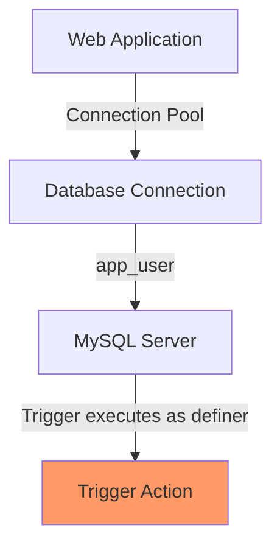

# MySQL Trigger Security

When implementing MySQL triggers, security considerations are crucial to protect your database from unauthorized access, unintended modifications, and potential vulnerabilities. Triggers execute automatically with powerful privileges, making security understanding essential for database developers.

## Introduction to Trigger Security

Triggers are special database objects that execute automatically when specific events occur on a table. Because of their automatic nature and elevated privileges, they represent a unique security challenge that requires careful consideration.

### Why Trigger Security Matters

Triggers can:
- Execute with the privileges of their creator (definer)
- Modify data across multiple tables
- Run without explicit user authorization
- Potentially cascade changes throughout a database system

In this tutorial, we'll explore the security model for MySQL triggers, understand potential vulnerabilities, and learn best practices for implementing secure triggers.

## Understanding the MySQL Trigger Security Model

### The Definer Concept

In MySQL, triggers operate using the "definer" security model. Each trigger has a definer - the user who created the trigger.

```sql
CREATE DEFINER = 'username'@'hostname' TRIGGER trigger_name
BEFORE INSERT ON table_name
FOR EACH ROW
BEGIN
    -- Trigger logic
END;
```

#### Key Security Points

1. **Privilege Execution**: Triggers execute with the privileges of the definer, not the user who initiates the triggering statement.
2. **Privilege Escalation Risk**: This can lead to privilege escalation if not carefully managed.
3. **Activation Control**: Users need only the privilege to perform the triggering action, not to execute the trigger code directly.

### Required Privileges for Trigger Operations

Understanding required privileges is essential for proper security management:

| Operation | Required Privileges |
|-----------|-------------------|
| Create a trigger | `TRIGGER` privilege on the table + privileges needed for statements in trigger body |
| Drop a trigger | `TRIGGER` privilege on the table |
| Execute a trigger | No direct privilege needed - just the privilege to perform the triggering action |
| View trigger definitions | `TRIGGER` privilege on the related table |

## Common Security Vulnerabilities with Triggers

### 1. Privilege Escalation

If a trigger is defined with a high-privilege user as the definer, it can perform actions that the activating user couldn't normally perform.

#### Example of a Vulnerable Trigger

```sql
-- Created by admin with all privileges
CREATE DEFINER = 'admin'@'localhost' TRIGGER update_admin_log
AFTER INSERT ON customer_data
FOR EACH ROW
BEGIN
    INSERT INTO admin_restricted_table VALUES (NEW.customer_id, NOW(), USER());
END;
```

In this example, any user with INSERT privileges on `customer_data` can indirectly insert into `admin_restricted_table`, even if they don't have direct access to it.

### 2. SQL Injection via Triggers

Triggers that construct dynamic SQL from user input can be vulnerable to SQL injection attacks.

#### Vulnerable Example:

```sql
-- A vulnerable trigger with SQL injection possibilities
CREATE TRIGGER log_activity
BEFORE UPDATE ON products
FOR EACH ROW
BEGIN
    SET @sql = CONCAT('INSERT INTO audit_log VALUES ("', NEW.product_name, '", "', NOW(), '")');
    PREPARE stmt FROM @sql;
    EXECUTE stmt;
    DEALLOCATE PREPARE stmt;
END;
```

If `product_name` contains malicious SQL fragments, this could lead to SQL injection.

### 3. Infinite Trigger Loops

Without proper safeguards, triggers can create infinite loops by continuously triggering each other.

```sql
-- Potential infinite loop
CREATE TRIGGER update_table_a
AFTER UPDATE ON table_b
FOR EACH ROW
BEGIN
    UPDATE table_a SET last_modified = NOW();
END;

CREATE TRIGGER update_table_b
AFTER UPDATE ON table_a
FOR EACH ROW
BEGIN
    UPDATE table_b SET last_modified = NOW();
END;
```

This creates a dangerous cycle: update to table_a triggers update to table_b, which triggers update to table_a, and so on.

## Best Practices for Secure Triggers

### 1. Use Minimal Privileges

Create triggers using a definer with only the minimal privileges needed:

```sql
-- Create a limited privilege user for triggers
CREATE USER 'trigger_user'@'localhost' IDENTIFIED BY 'password';
GRANT SELECT, INSERT ON database.log_table TO 'trigger_user'@'localhost';
GRANT SELECT ON database.main_table TO 'trigger_user'@'localhost';

-- Use this limited user as the definer
CREATE DEFINER = 'trigger_user'@'localhost' TRIGGER log_changes
AFTER UPDATE ON main_table
FOR EACH ROW
BEGIN
    INSERT INTO log_table VALUES (OLD.id, NEW.value, NOW(), USER());
END;
```

### 2. Avoid Dynamic SQL in Triggers

Instead of building SQL strings dynamically, use direct SQL statements:

```sql
-- Secure approach: direct SQL rather than dynamic construction
CREATE TRIGGER log_activity
BEFORE UPDATE ON products
FOR EACH ROW
BEGIN
    INSERT INTO audit_log VALUES (NEW.product_name, NOW());
END;
```

### 3. Implement Guards Against Infinite Loops

Use flags or conditions to prevent recursive trigger activation:

```sql
-- Using a condition to prevent recursive activation
CREATE TRIGGER update_related_table
AFTER UPDATE ON main_table
FOR EACH ROW
BEGIN
    -- Only proceed if not already in a trigger chain
    IF @trigger_active IS NULL THEN
        SET @trigger_active = 1;
        UPDATE related_table SET updated_at = NOW() WHERE main_id = NEW.id;
        SET @trigger_active = NULL;
    END IF;
END;
```

### 4. Audit and Document Triggers

Regular security auditing of triggers is essential:

```sql
-- Query to examine all triggers and their definers
SELECT 
    TRIGGER_SCHEMA, 
    TRIGGER_NAME, 
    DEFINER, 
    EVENT_MANIPULATION, 
    EVENT_OBJECT_TABLE
FROM information_schema.TRIGGERS
ORDER BY TRIGGER_SCHEMA, EVENT_OBJECT_TABLE;
```

Maintain comprehensive documentation for each trigger, including:
- Purpose
- Expected behavior
- Security considerations
- The reason for the chosen definer

### 5. Validate Input Data in Triggers

When possible, validate data within triggers to prevent security issues:

```sql
CREATE TRIGGER validate_before_insert
BEFORE INSERT ON user_accounts
FOR EACH ROW
BEGIN
    -- Basic validation
    IF NEW.email NOT LIKE '%@%.%' THEN
        SIGNAL SQLSTATE '45000' SET MESSAGE_TEXT = 'Invalid email format';
    END IF;
    
    -- Sanitize input
    SET NEW.username = TRIM(NEW.username);
END;
```

## Practical Example: A Secure Audit System

Let's build a secure audit system using triggers that follows best practices.

### Step 1: Create a dedicated user for audit triggers

```sql
CREATE USER 'audit_user'@'localhost' IDENTIFIED BY 'secure_password';
GRANT SELECT ON app_db.* TO 'audit_user'@'localhost';
GRANT INSERT ON app_db.audit_logs TO 'audit_user'@'localhost';
```

### Step 2: Create an audit table

```sql
CREATE TABLE audit_logs (
    audit_id INT AUTO_INCREMENT PRIMARY KEY,
    table_name VARCHAR(100) NOT NULL,
    record_id INT NOT NULL,
    action VARCHAR(10) NOT NULL, -- INSERT, UPDATE, DELETE
    changed_by VARCHAR(100) NOT NULL,
    change_timestamp DATETIME NOT NULL,
    old_data JSON NULL,
    new_data JSON NULL
);
```

### Step 3: Create secure audit triggers

```sql
-- Secure audit trigger for customer table
DELIMITER //
CREATE DEFINER = 'audit_user'@'localhost' TRIGGER customer_after_insert
AFTER INSERT ON customers
FOR EACH ROW
BEGIN
    INSERT INTO audit_logs (
        table_name, 
        record_id, 
        action, 
        changed_by, 
        change_timestamp, 
        old_data, 
        new_data
    ) VALUES (
        'customers', 
        NEW.customer_id, 
        'INSERT', 
        USER(), 
        NOW(), 
        NULL, 
        JSON_OBJECT(
            'customer_id', NEW.customer_id,
            'name', NEW.name,
            'email', NEW.email,
            'status', NEW.status
        )
    );
END//
DELIMITER ;
```

This would be repeated with variations for UPDATE and DELETE operations.

### Step 4: Test the audit system

```sql
-- Insert a new customer
INSERT INTO customers (name, email, status) VALUES ('Jane Smith', 'jane@example.com', 'active');

-- Verify the audit log
SELECT * FROM audit_logs WHERE table_name = 'customers' ORDER BY change_timestamp DESC LIMIT 1;
```

**Output:**
```
+----------+------------+-----------+--------+------------------+---------------------+----------+---------------------------------------------------------------+
| audit_id | table_name | record_id | action | changed_by       | change_timestamp    | old_data | new_data                                                       |
+----------+------------+-----------+--------+------------------+---------------------+----------+---------------------------------------------------------------+
|       1  | customers  |     1001  | INSERT | app_user@localhost | 2023-08-15 14:32:15 | NULL     | {"name":"Jane Smith","email":"jane@example.com","status":"active"} |
+----------+------------+-----------+--------+------------------+---------------------+----------+---------------------------------------------------------------+
```

### Security Analysis:

1. The trigger uses a dedicated user with minimal privileges
2. No dynamic SQL is used, preventing SQL injection
3. The trigger records the actual user who made the change
4. Sensitive data is properly structured and stored
5. The audit trail is complete and tamper-evident

## Row-Level Security with Triggers

Triggers can enforce row-level security policies that are impossible with standard MySQL privileges:

```sql
DELIMITER //
CREATE DEFINER = 'security_admin'@'localhost' TRIGGER enforce_data_access
BEFORE SELECT ON customer_data
FOR EACH ROW
BEGIN
    DECLARE current_user_department VARCHAR(50);
    
    -- Get the current user's department
    SELECT department INTO current_user_department 
    FROM user_departments 
    WHERE username = SUBSTRING_INDEX(USER(), '@', 1);
    
    -- Enforce department-level data access
    IF NEW.department != current_user_department AND current_user_department != 'admin' THEN
        SIGNAL SQLSTATE '45000' SET MESSAGE_TEXT = 'Access denied to records from other departments';
    END IF;
END//
DELIMITER ;
```

> **Note**: While this pattern is conceptually valid, MySQL doesn't actually support BEFORE SELECT triggers. This type of access control would typically be implemented in application code or using views with stored procedures.

## Advanced Security Considerations

### Trigger Visibility and Metadata Security

MySQL stores trigger definitions in the `INFORMATION_SCHEMA.TRIGGERS` table and `mysql.trigger` table. Secure these by restricting access:

```sql
-- Grant only necessary privileges to view trigger definitions
GRANT SELECT ON information_schema.TRIGGERS TO 'security_auditor'@'localhost';
```

### Monitoring Trigger Activities

For critical systems, implement monitoring of trigger activities:

```sql
-- Create a trigger activity log
CREATE TABLE trigger_execution_log (
    id INT AUTO_INCREMENT PRIMARY KEY,
    trigger_name VARCHAR(100),
    table_name VARCHAR(100),
    execution_time DATETIME,
    execution_user VARCHAR(100)
);

-- Add logging to your triggers
CREATE TRIGGER example_with_logging
AFTER INSERT ON important_table
FOR EACH ROW
BEGIN
    -- Log the trigger execution
    INSERT INTO trigger_execution_log (trigger_name, table_name, execution_time, execution_user)
    VALUES ('example_with_logging', 'important_table', NOW(), USER());
    
    -- Regular trigger logic follows...
END;
```

### Security in Multi-Tier Applications

In multi-tier applications, consider how triggers interact with connection pools and application users:



Since connection pools often use a single database user for all connections, triggers can't distinguish between different application users without additional context.

## Summary

MySQL trigger security requires careful consideration of privileges, definer settings, and potential vulnerabilities. By following best practices:

1. Use the principle of least privilege when defining triggers
2. Avoid dynamic SQL in trigger bodies
3. Implement safeguards against recursive trigger activation
4. Regularly audit trigger definitions and permissions
5. Document all triggers thoroughly
6. Validate and sanitize data within triggers when appropriate

When properly secured, triggers are powerful tools for enforcing business rules, maintaining data integrity, and implementing auditing systems in MySQL databases.

## Additional Resources and Exercises

### Further Reading

- [MySQL Documentation: Trigger Syntax and Examples](https://dev.mysql.com/doc/refman/8.0/en/trigger-syntax.html)
- [MySQL Documentation: Privileges](https://dev.mysql.com/doc/refman/8.0/en/privileges-provided.html)

### Practice Exercises

1. **Security Audit**: Review an existing database and identify all triggers. Document their definers and the privileges they require.

2. **Secure Refactoring**: Take an existing trigger that uses dynamic SQL and refactor it to use direct SQL statements instead.

3. **Least Privilege Implementation**: Create a minimal-privilege user account specifically for a trigger and modify the trigger to use this definer.

4. **Secure Audit System**: Extend the audit system example to cover multiple tables and include protections against tampering.

5. **Security Testing**: Develop a plan to test triggers for SQL injection vulnerabilities, particularly those that process user input.

By implementing these security practices, you'll ensure that your MySQL triggers enhance your application's functionality without compromising its security.