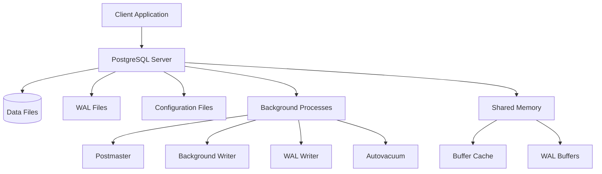

# PostgreSQL Introduction

## What is PostgreSQL?

<div style={{
    "width": "20%",
    "margin": "0 auto",
    "text-align": "center"
}}>
    
</div>

PostgreSQL (often shortened to "Postgres") is a powerful, open-source object-relational database management system (ORDBMS) that uses and extends the SQL language. It's known for its proven architecture, reliability, data integrity, robust feature set, and extensibility.

First released in 1996, PostgreSQL has earned a strong reputation for its:

- Standards compliance
- Extensibility
- Community support
- Cross-platform compatibility

Whether you're building a simple application or a complex, data-intensive system, PostgreSQL offers a robust foundation for your data storage needs.

## Why Use PostgreSQL?

PostgreSQL stands out among database systems for several compelling reasons:

### 1. Free and Open Source

PostgreSQL is completely free and open-source software, released under the PostgreSQL License, a liberal open source license similar to the BSD or MIT licenses.

### 2. ACID Compliance

PostgreSQL is fully ACID compliant (Atomicity, Consistency, Isolation, Durability), ensuring reliable transaction processing.

### 3. Advanced Features

PostgreSQL offers advanced features not found in many other databases:

- Complex queries
- Foreign keys
- Triggers
- Updatable views
- Transactional integrity
- Multi-version concurrency control (MVCC)

### 4. Extensibility

You can define your own data types, custom functions, and even write code in different programming languages without recompiling your database.

### 5. Active Community

A vibrant community continuously contributes to PostgreSQL's development, ensuring it stays current with the latest database technology trends.

## PostgreSQL Architecture

Understanding PostgreSQL's architecture helps you use it effectively:



### Key Components:

- **Postmaster**: The main PostgreSQL process that forks other processes
- **Shared Memory**: Where PostgreSQL caches data and performs operations
- **Buffer Cache**: Stores recently accessed data for quick retrieval
- **WAL (Write-Ahead Log)**: Ensures data integrity and enables point-in-time recovery

## Setting Up PostgreSQL

Let's walk through installing PostgreSQL and creating your first database.

### Installation

PostgreSQL is available for all major operating systems. Here's a basic guide for installation:

#### On Ubuntu/Debian:

```bash
sudo apt update
sudo apt install postgresql postgresql-contrib
```

#### On MacOS (using Homebrew):

```bash
brew install postgresql
```

#### On Windows:

1. Download the installer from [postgresql.org](https://www.postgresql.org/download/windows/)
2. Run the installer and follow the prompts
3. Use the default settings unless you have specific requirements

### Verifying Installation

After installation, verify that PostgreSQL is running:

```bash
sudo systemctl status postgresql
```

Or on MacOS:

```bash
brew services list
```

### Accessing PostgreSQL

PostgreSQL creates a default user called `postgres`. Let's access the PostgreSQL command line:

```bash
sudo -u postgres psql
```

This command opens the PostgreSQL interactive terminal:

```
psql (14.5)
Type "help" for help.

postgres=#
```

## Basic PostgreSQL Commands

Here are some fundamental commands to get you started:

### 1. Creating a Database

```sql
CREATE DATABASE my_first_db;
```

### 2. Listing Databases

```sql
\l
```

Output:
```
                              List of databases
    Name     |  Owner   | Encoding | Collate | Ctype |   Access privileges   
-------------+----------+----------+---------+-------+-----------------------
 my_first_db | postgres | UTF8     | C.UTF-8 | C.UTF-8 | 
 postgres    | postgres | UTF8     | C.UTF-8 | C.UTF-8 | 
 template0   | postgres | UTF8     | C.UTF-8 | C.UTF-8 | =c/postgres          +
             |          |          |         |       | postgres=CTc/postgres
 template1   | postgres | UTF8     | C.UTF-8 | C.UTF-8 | =c/postgres          +
             |          |          |         |       | postgres=CTc/postgres
(4 rows)
```

### 3. Connecting to a Database

```sql
\c my_first_db
```

Output:
```
You are now connected to database "my_first_db" as user "postgres".
my_first_db=#
```

### 4. Creating a Table

```sql
CREATE TABLE users (
    user_id SERIAL PRIMARY KEY,
    username VARCHAR(50) UNIQUE NOT NULL,
    email VARCHAR(100) UNIQUE NOT NULL,
    created_at TIMESTAMP WITH TIME ZONE DEFAULT CURRENT_TIMESTAMP
);
```

### 5. Inserting Data

```sql
INSERT INTO users (username, email) 
VALUES 
('john_doe', 'john@example.com'),
('jane_smith', 'jane@example.com');
```

### 6. Querying Data

```sql
SELECT * FROM users;
```

Output:
```
 user_id | username  |      email       |          created_at          
---------+-----------+------------------+-------------------------------
       1 | john_doe  | john@example.com | 2023-09-15 14:30:45.123456+00
       2 | jane_smith | jane@example.com | 2023-09-15 14:30:45.135792+00
(2 rows)
```

### 7. Updating Data

```sql
UPDATE users 
SET email = 'john.doe@example.com' 
WHERE username = 'john_doe';
```

### 8. Deleting Data

```sql
DELETE FROM users 
WHERE username = 'jane_smith';
```

### 9. Exiting the PostgreSQL Terminal

```sql
\q
```

## PostgreSQL Data Types

PostgreSQL supports a rich set of data types:

### Numeric Types

- `INTEGER`: Whole number
- `SERIAL`: Auto-incrementing integer
- `NUMERIC` or `DECIMAL`: Exact numeric with specified precision
- `REAL`: Floating-point number
- `DOUBLE PRECISION`: Double precision floating-point number

### Character Types

- `CHAR(n)`: Fixed-length character string
- `VARCHAR(n)`: Variable-length character string with limit
- `TEXT`: Variable-length character string without limit

### Date/Time Types

- `DATE`: Calendar date
- `TIME`: Time of day
- `TIMESTAMP`: Date and time
- `TIMESTAMPTZ`: Timestamp with time zone
- `INTERVAL`: Time interval

### Boolean Type

- `BOOLEAN`: True or false values

### Other Common Types

- `UUID`: Universally unique identifier
- `JSON`/`JSONB`: JSON data
- `ARRAY`: Array of values
- `BYTEA`: Binary data

## Real-World Example: Building a Book Inventory System

Let's create a simple book inventory system to demonstrate PostgreSQL in action:

### Step 1: Create the Tables

```sql
-- Create a table for book categories
CREATE TABLE categories (
    category_id SERIAL PRIMARY KEY,
    name VARCHAR(100) NOT NULL,
    description TEXT
);

-- Create a table for authors
CREATE TABLE authors (
    author_id SERIAL PRIMARY KEY,
    first_name VARCHAR(50) NOT NULL,
    last_name VARCHAR(50) NOT NULL,
    biography TEXT,
    birth_date DATE
);

-- Create a table for books
CREATE TABLE books (
    book_id SERIAL PRIMARY KEY,
    title VARCHAR(255) NOT NULL,
    isbn VARCHAR(13) UNIQUE,
    published_date DATE,
    price DECIMAL(10, 2),
    category_id INTEGER REFERENCES categories(category_id),
    in_stock BOOLEAN DEFAULT true,
    description TEXT
);

-- Create a join table for books and authors (many-to-many)
CREATE TABLE book_authors (
    book_id INTEGER REFERENCES books(book_id),
    author_id INTEGER REFERENCES authors(author_id),
    PRIMARY KEY (book_id, author_id)
);
```

### Step 2: Insert Sample Data

```sql
-- Insert categories
INSERT INTO categories (name, description) VALUES
('Fiction', 'Fictional literature'),
('Science', 'Scientific books and research'),
('History', 'Historical accounts and analysis');

-- Insert authors
INSERT INTO authors (first_name, last_name, biography, birth_date) VALUES
('J.K.', 'Rowling', 'British author best known for the Harry Potter series', '1965-07-31'),
('Stephen', 'Hawking', 'Theoretical physicist and cosmologist', '1942-01-08'),
('Yuval Noah', 'Harari', 'Israeli historian and professor', '1976-02-24');

-- Insert books
INSERT INTO books (title, isbn, published_date, price, category_id, description) VALUES
('Harry Potter and the Philosopher''s Stone', '9780747532743', '1997-06-26', 19.99, 1, 'First book in the Harry Potter series'),
('A Brief History of Time', '9780553380163', '1988-04-01', 29.99, 2, 'Popular science book on cosmology'),
('Sapiens: A Brief History of Humankind', '9780062316097', '2014-02-10', 24.99, 3, 'A book about the history of humanity');

-- Link books and authors
INSERT INTO book_authors (book_id, author_id) VALUES
(1, 1),  -- Harry Potter - J.K. Rowling
(2, 2),  -- A Brief History of Time - Stephen Hawking
(3, 3);  -- Sapiens - Yuval Noah Harari
```

### Step 3: Query the Data

Let's perform some useful queries:

#### Get All Books with Their Authors and Categories

```sql
SELECT 
    b.title,
    b.isbn,
    b.price,
    c.name AS category,
    CONCAT(a.first_name, ' ', a.last_name) AS author
FROM 
    books b
JOIN 
    categories c ON b.category_id = c.category_id
JOIN 
    book_authors ba ON b.book_id = ba.book_id
JOIN 
    authors a ON ba.author_id = a.author_id
ORDER BY 
    b.title;
```

Output:
```
                   title                 |     isbn      | price  | category |        author        
-----------------------------------------+---------------+--------+----------+----------------------
 A Brief History of Time                 | 9780553380163 |  29.99 | Science  | Stephen Hawking
 Harry Potter and the Philosopher's Stone| 9780747532743 |  19.99 | Fiction  | J.K. Rowling
 Sapiens: A Brief History of Humankind   | 9780062316097 |  24.99 | History  | Yuval Noah Harari
(3 rows)
```

#### Find the Total Value of Books in Stock

```sql
SELECT 
    SUM(price) AS total_value 
FROM 
    books 
WHERE 
    in_stock = true;
```

Output:
```
 total_value 
-------------
      74.97
(1 row)
```

#### Get Book Count by Category

```sql
SELECT 
    c.name, 
    COUNT(b.book_id) AS book_count
FROM 
    categories c
LEFT JOIN 
    books b ON c.category_id = b.category_id
GROUP BY 
    c.name
ORDER BY 
    book_count DESC;
```

Output:
```
   name   | book_count 
----------+------------
 Fiction  |          1
 Science  |          1
 History  |          1
(3 rows)
```

## PostgreSQL vs. Other Databases

How does PostgreSQL compare to other popular database systems?

| Feature | PostgreSQL | MySQL | SQLite | 
|---------|------------|-------|--------|
| Type | Object-relational | Relational | Relational |
| License | PostgreSQL License (free) | GPL/Commercial | Public Domain |
| ACID Compliance | Full | Depends on storage engine | Full |
| Complex Queries | Excellent | Good | Limited |
| Concurrency | MVCC | Lock-based | Limited |
| JSON Support | Native | Since 5.7 | Limited |
| Extensions | Many | Limited | Few |
| Best For | Complex applications, data warehousing | Web applications, fast reads | Embedded applications, local storage |

## Summary

In this introduction to PostgreSQL, we've covered:

- What PostgreSQL is and its key advantages
- Basic architecture and components
- Setting up PostgreSQL and creating your first database
- Fundamental commands for database operations
- Core data types
- A practical example of building a book inventory system

PostgreSQL's combination of robust features, reliability, and open-source nature makes it an excellent choice for applications of all sizes. As you continue your database journey, you'll discover even more powerful capabilities that PostgreSQL offers.

## Additional Resources

Here are some resources to continue your PostgreSQL learning:

- **Official Documentation**: The [PostgreSQL Documentation](https://www.postgresql.org/docs/) is comprehensive and well-maintained
- **Practice Exercises**: Try creating more complex database schemas and queries
- **Community Forums**: The [PostgreSQL Community](https://www.postgresql.org/community/) is active and helpful

## Exercises

To reinforce your learning, try these exercises:

1. Create a new database for a personal project
2. Design a schema with at least three interconnected tables
3. Write queries that use joins, aggregations, and filters
4. Experiment with different data types
5. Practice backing up and restoring your database

By mastering PostgreSQL fundamentals, you're building a strong foundation for your database skills that will serve you well in many software development contexts.