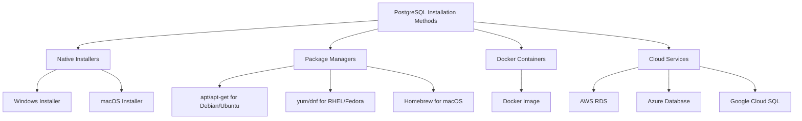

# PostgreSQL Installation

PostgreSQL is a powerful, open-source object-relational database system with over 30 years of active development. In this guide, we'll walk through the installation process on different operating systems to get you up and running with PostgreSQL.

## Introduction

Before diving into database concepts and SQL queries, we need to set up PostgreSQL on your system. This guide covers installation procedures for Windows, macOS, and Linux, ensuring you can follow along regardless of your operating system.

PostgreSQL provides robust features for storing, manipulating, and retrieving data, making it an excellent choice for beginners and professionals alike.

## Installation Methods

There are several ways to install PostgreSQL:



Let's explore each method for different operating systems.

## Installing PostgreSQL on Windows

Windows users can install PostgreSQL using the official installer package.

### Step 1: Download the Installer

1. Visit the [PostgreSQL official download page](https://www.postgresql.org/download/windows/)
2. Click on the "Download the installer" button
3. Select the latest version (currently 15.x)

### Step 2: Run the Installer

1. Launch the downloaded installer
2. Follow the installation wizard:

```bash
# The installation will create a new Windows service named:
postgresql-x64-15
```

### Step 3: Select Components

Select the components you want to install:

- PostgreSQL Server (required)
- pgAdmin 4 (recommended graphical interface)
- Command Line Tools (recommended)
- Stack Builder (optional)

### Step 4: Choose Installation Directory

```bash
# Default directory
C:\Program Files\PostgreSQL\15
```

### Step 5: Set Password

Create a password for the database superuser (postgres). **Make sure to remember this password!**

### Step 6: Select Port

The default port is `5432`. Only change this if you have another service using this port.

### Step 7: Select Locale

Choose the default locale for the database cluster.

### Step 8: Complete Installation

Click "Finish" to complete the installation process.

### Step 9: Verify Installation

Open Command Prompt and run:

```bash
psql --version
```

You should see output similar to:

```
psql (PostgreSQL) 15.x
```

## Installing PostgreSQL on macOS

macOS users have several installation options.

### Option 1: Using Homebrew (Recommended)

[Homebrew](https://brew.sh/) is a popular package manager for macOS.

1. Install Homebrew if you haven't already:

```bash
/bin/bash -c "$(curl -fsSL https://raw.githubusercontent.com/Homebrew/install/HEAD/install.sh)"
```

2. Install PostgreSQL:

```bash
brew install postgresql
```

3. Start PostgreSQL service:

```bash
brew services start postgresql
```

4. Verify installation:

```bash
psql --version
```

### Option 2: Using the macOS Installer

1. Download the installer from [PostgreSQL for macOS](https://www.postgresql.org/download/macosx/)
2. Run the downloaded `.dmg` file
3. Follow the installation wizard, similar to the Windows installation process

## Installing PostgreSQL on Linux

### For Debian/Ubuntu-based distributions:

1. Update your package lists:

```bash
sudo apt update
```

2. Install PostgreSQL:

```bash
sudo apt install postgresql postgresql-contrib
```

3. Start the service:

```bash
sudo systemctl start postgresql
```

4. Enable PostgreSQL to start on boot:

```bash
sudo systemctl enable postgresql
```

5. Verify installation:

```bash
psql --version
```

### For Red Hat/Fedora-based distributions:

1. Install PostgreSQL:

```bash
sudo dnf install postgresql-server postgresql-contrib
```

2. Initialize the database:

```bash
sudo postgresql-setup --initdb
```

3. Start the service:

```bash
sudo systemctl start postgresql
```

4. Enable PostgreSQL to start on boot:

```bash
sudo systemctl enable postgresql
```

## Using Docker for PostgreSQL

Docker provides a clean, isolated environment for running PostgreSQL.

### Prerequisites

- [Docker](https://www.docker.com/get-started) installed on your system

### Steps to Run PostgreSQL in Docker

1. Pull the official PostgreSQL image:

```bash
docker pull postgres
```

2. Run a PostgreSQL container:

```bash
docker run --name my-postgres -e POSTGRES_PASSWORD=mysecretpassword -d -p 5432:5432 postgres
```

3. Connect to the PostgreSQL server:

```bash
docker exec -it my-postgres psql -U postgres
```

## Initial Configuration

After installation, let's perform some basic configurations.

### Accessing PostgreSQL

By default, PostgreSQL creates a user named "postgres" with administrative privileges.

#### On Windows

Open pgAdmin or use the following in Command Prompt:

```bash
psql -U postgres
```

You'll be prompted for the password you set during installation.

#### On macOS (Homebrew)

If installed via Homebrew, you can connect as your system user:

```bash
psql postgres
```

#### On Linux

Switch to the postgres user and then access the PostgreSQL prompt:

```bash
sudo -i -u postgres
psql
```

### Creating Your First Database

Once connected to PostgreSQL, create a new database:

```sql
CREATE DATABASE my_first_db;
```

Connect to the new database:

```sql
\c my_first_db
```

Create a simple table:

```sql
CREATE TABLE users (
    id SERIAL PRIMARY KEY,
    name VARCHAR(100),
    email VARCHAR(100),
    created_at TIMESTAMP DEFAULT CURRENT_TIMESTAMP
);
```

Insert data:

```sql
INSERT INTO users (name, email) VALUES ('John Doe', 'john@example.com');
```

Query the data:

```sql
SELECT * FROM users;
```

You should see:

```
 id |  name   |      email       |         created_at         
----+---------+------------------+----------------------------
  1 | John Doe| john@example.com | 2023-08-01 12:34:56.789012
(1 row)
```

## Troubleshooting Common Installation Issues

### Port Conflicts

If port 5432 is already in use, you can:

1. Change the port during installation
2. Or modify `postgresql.conf` after installation:

```bash
# Location varies by system:
# Windows: C:\Program Files\PostgreSQL\15\data\postgresql.conf
# macOS (Homebrew): /usr/local/var/postgres/postgresql.conf
# Linux: /etc/postgresql/15/main/postgresql.conf

# Change:
port = 5432
# To:
port = 5433  # or another available port
```

### Authentication Issues

If you encounter "peer authentication failed" on Linux:

1. Edit the `pg_hba.conf` file:

```bash
sudo nano /etc/postgresql/15/main/pg_hba.conf
```

2. Change authentication method from `peer` to `md5` for local connections:

```
# Replace:
local   all             all                                     peer
# With:
local   all             all                                     md5
```

3. Restart PostgreSQL:

```bash
sudo systemctl restart postgresql
```

### Service Won't Start

If the PostgreSQL service fails to start:

1. Check the logs:

```bash
# Windows: Event Viewer
# macOS: /usr/local/var/log/postgres.log
# Linux: /var/log/postgresql/postgresql-15-main.log
```

2. Ensure data directory has proper permissions
3. Verify there's enough disk space
4. Make sure no other PostgreSQL instance is running

## Summary

In this guide, we covered:

1. Installing PostgreSQL on Windows, macOS, and Linux
2. Setting up PostgreSQL in Docker
3. Basic initial configuration and database creation
4. Troubleshooting common installation issues

Now that you have PostgreSQL installed, you're ready to dive deeper into database concepts, SQL queries, and database management in the next lessons of our PostgreSQL Fundamentals series.

## Additional Resources

- [PostgreSQL Official Documentation](https://www.postgresql.org/docs/)
- [PostgreSQL Tutorial](https://www.postgresqltutorial.com/)
- [pgAdmin Documentation](https://www.pgadmin.org/docs/)

## Exercises

1. Install PostgreSQL on your system using the method most appropriate for your operating system.
2. Create a new database named "practice_db".
3. Create a simple table of your choice with at least three columns.
4. Insert at least five records into your table.
5. Write a SELECT query to retrieve and display your inserted data.

With PostgreSQL properly installed, you now have a solid foundation to build upon as you learn SQL and database management concepts!