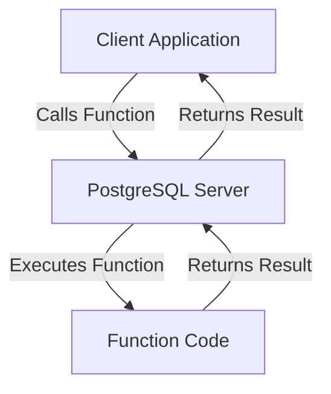

# PostgreSQL Functions

## Introduction

PostgreSQL functions (sometimes called stored procedures) are reusable blocks of SQL and procedural code that can be stored in the database and executed when needed. Functions allow you to encapsulate complex logic, improve code reusability, and simplify database operations.

In this tutorial, you'll learn:
- What PostgreSQL functions are and why they're useful
- How to create basic and advanced functions
- How to use different function parameters and return types
- Best practices for working with PostgreSQL functions

## What Are PostgreSQL Functions?

PostgreSQL functions are similar to functions in programming languages - they accept input parameters, execute a series of statements, and return results. The key difference is that PostgreSQL functions run directly in the database server.



### Benefits of Using Functions

- **Code Reusability**: Write once, use many times
- **Encapsulation**: Hide complex logic behind a simple interface
- **Performance**: Reduce network traffic by executing logic on the server
- **Maintainability**: Update logic in one place instead of multiple client applications
- **Security**: Control access at the function level

## Creating Basic Functions

Let's start with a simple function that calculates the area of a circle:

```sql
CREATE OR REPLACE FUNCTION calculate_circle_area(radius NUMERIC)
RETURNS NUMERIC AS
$$
BEGIN
    RETURN PI() * radius * radius;
END;
$$ LANGUAGE plpgsql;
```

To use this function:

```sql
SELECT calculate_circle_area(5);
```

Output:
```
 calculate_circle_area
-----------------------
 78.53981633974483
```

### Function Structure Explained

1. `CREATE OR REPLACE FUNCTION`: Defines a new function or replaces an existing one
2. `calculate_circle_area(radius NUMERIC)`: Function name with parameters
3. `RETURNS NUMERIC`: Specifies the return type
4. `AS $$...$$`: Function body enclosed in dollar quotes
5. `BEGIN...END;`: PL/pgSQL block structure
6. `LANGUAGE plpgsql`: Specifies the procedural language

## Function Parameters

PostgreSQL functions can have different types of parameters:

### IN Parameters (Default)

Input parameters that the function can read but not modify:

```sql
CREATE OR REPLACE FUNCTION greet_user(IN user_name TEXT)
RETURNS TEXT AS
$$
BEGIN
    RETURN 'Hello, ' || user_name || '!';
END;
$$ LANGUAGE plpgsql;
```

```sql
SELECT greet_user('Alice');
```

Output:
```
 greet_user
-------------
 Hello, Alice!
```

### OUT Parameters

Output parameters allow a function to return multiple values:

```sql
CREATE OR REPLACE FUNCTION get_circle_measurements(
    IN radius NUMERIC,
    OUT area NUMERIC,
    OUT circumference NUMERIC
) AS
$$
BEGIN
    area := PI() * radius * radius;
    circumference := 2 * PI() * radius;
END;
$$ LANGUAGE plpgsql;
```

```sql
SELECT * FROM get_circle_measurements(5);
```

Output:
```
       area       | circumference
------------------+---------------
 78.53981633974483 | 31.41592653589793
```

### INOUT Parameters

Parameters that serve as both input and output:

```sql
CREATE OR REPLACE FUNCTION double_value(
    INOUT value NUMERIC
) AS
$$
BEGIN
    value := value * 2;
END;
$$ LANGUAGE plpgsql;
```

```sql
SELECT double_value(10);
```

Output:
```
 double_value
-------------
          20
```

## Return Types

PostgreSQL functions can return various types of data:

### Scalar Values

Functions can return a single value:

```sql
CREATE OR REPLACE FUNCTION add_numbers(a INT, b INT)
RETURNS INT AS
$$
BEGIN
    RETURN a + b;
END;
$$ LANGUAGE plpgsql;
```

```sql
SELECT add_numbers(5, 3);
```

Output:
```
 add_numbers
-------------
          8
```

### Table Results

Functions can return multiple rows and columns:

```sql
CREATE OR REPLACE FUNCTION get_employees_by_department(dept_name TEXT)
RETURNS TABLE (
    employee_id INT,
    first_name TEXT,
    last_name TEXT,
    hire_date DATE
) AS
$$
BEGIN
    RETURN QUERY
    SELECT e.employee_id, e.first_name, e.last_name, e.hire_date
    FROM employees e
    JOIN departments d ON e.department_id = d.department_id
    WHERE d.department_name = dept_name;
END;
$$ LANGUAGE plpgsql;
```

```sql
SELECT * FROM get_employees_by_department('Marketing');
```

Example output:
```
 employee_id | first_name | last_name |  hire_date
-------------+------------+-----------+-------------
        201 | Michael    | Smith     | 2018-07-15
        203 | Susan      | Johnson   | 2019-03-22
```

### SETOF Type

Similarly, you can return a set of rows:

```sql
CREATE OR REPLACE FUNCTION get_products_by_category(category_name TEXT)
RETURNS SETOF products AS
$$
BEGIN
    RETURN QUERY
    SELECT p.*
    FROM products p
    JOIN categories c ON p.category_id = c.category_id
    WHERE c.category_name = category_name;
END;
$$ LANGUAGE plpgsql;
```

```sql
SELECT * FROM get_products_by_category('Electronics');
```

## Using Variables in Functions

You can declare and use variables within functions:

```sql
CREATE OR REPLACE FUNCTION calculate_tax(amount NUMERIC, tax_rate NUMERIC DEFAULT 0.1)
RETURNS NUMERIC AS
$$
DECLARE
    tax_amount NUMERIC;
BEGIN
    tax_amount := amount * tax_rate;
    RETURN tax_amount;
END;
$$ LANGUAGE plpgsql;
```

```sql
SELECT calculate_tax(100);       -- Using default tax rate
SELECT calculate_tax(100, 0.05); -- Specifying tax rate
```

Output:
```
 calculate_tax
--------------
          10

 calculate_tax
--------------
           5
```

## Conditional Logic in Functions

You can use IF-ELSE statements for conditional logic:

```sql
CREATE OR REPLACE FUNCTION get_grade(score NUMERIC)
RETURNS CHAR AS
$$
BEGIN
    IF score >= 90 THEN
        RETURN 'A';
    ELSIF score >= 80 THEN
        RETURN 'B';
    ELSIF score >= 70 THEN
        RETURN 'C';
    ELSIF score >= 60 THEN
        RETURN 'D';
    ELSE
        RETURN 'F';
    END IF;
END;
$$ LANGUAGE plpgsql;
```

```sql
SELECT get_grade(85);
```

Output:
```
 get_grade
-----------
 B
```

## Loops in Functions

PostgreSQL supports different types of loops in functions:

### FOR Loop

```sql
CREATE OR REPLACE FUNCTION sum_numbers(n INT)
RETURNS INT AS
$$
DECLARE
    total INT := 0;
BEGIN
    FOR i IN 1..n LOOP
        total := total + i;
    END LOOP;
    RETURN total;
END;
$$ LANGUAGE plpgsql;
```

```sql
SELECT sum_numbers(5);
```

Output:
```
 sum_numbers
-------------
          15
```

### WHILE Loop

```sql
CREATE OR REPLACE FUNCTION factorial(n INT)
RETURNS BIGINT AS
$$
DECLARE
    result BIGINT := 1;
    i INT := 1;
BEGIN
    WHILE i <= n LOOP
        result := result * i;
        i := i + 1;
    END LOOP;
    RETURN result;
END;
$$ LANGUAGE plpgsql;
```

```sql
SELECT factorial(5);
```

Output:
```
 factorial
-----------
       120
```

## Error Handling in Functions

You can use exception handling to manage errors:

```sql
CREATE OR REPLACE FUNCTION divide_numbers(a NUMERIC, b NUMERIC)
RETURNS NUMERIC AS
$$
BEGIN
    IF b = 0 THEN
        RAISE EXCEPTION 'Division by zero error';
    END IF;
    
    RETURN a / b;

EXCEPTION
    WHEN division_by_zero THEN
        RAISE EXCEPTION 'Cannot divide by zero';
    WHEN others THEN
        RAISE EXCEPTION 'An unexpected error occurred: %', SQLERRM;
END;
$$ LANGUAGE plpgsql;
```

```sql
SELECT divide_numbers(10, 2);  -- Works fine
SELECT divide_numbers(10, 0);  -- Raises an exception
```

## Real-World Example: Customer Management System

Let's create a more practical example for a customer management system:

```sql
-- First, assume we have tables for customers and orders
CREATE TABLE customers (
    customer_id SERIAL PRIMARY KEY,
    name TEXT NOT NULL,
    email TEXT UNIQUE NOT NULL,
    created_at TIMESTAMP DEFAULT CURRENT_TIMESTAMP
);

CREATE TABLE orders (
    order_id SERIAL PRIMARY KEY,
    customer_id INT REFERENCES customers(customer_id),
    amount NUMERIC NOT NULL,
    order_date TIMESTAMP DEFAULT CURRENT_TIMESTAMP
);

-- Function to register a new customer and return the ID
CREATE OR REPLACE FUNCTION register_customer(
    customer_name TEXT,
    customer_email TEXT
)
RETURNS INT AS
$$
DECLARE
    new_customer_id INT;
BEGIN
    -- Check if email already exists
    IF EXISTS (SELECT 1 FROM customers WHERE email = customer_email) THEN
        RAISE EXCEPTION 'Customer with email % already exists', customer_email;
    END IF;
    
    -- Insert the new customer
    INSERT INTO customers (name, email)
    VALUES (customer_name, customer_email)
    RETURNING customer_id INTO new_customer_id;
    
    RETURN new_customer_id;
END;
$$ LANGUAGE plpgsql;

-- Function to place an order and return order details
CREATE OR REPLACE FUNCTION place_order(
    p_customer_id INT,
    p_amount NUMERIC
)
RETURNS TABLE (
    order_id INT,
    customer_name TEXT,
    order_amount NUMERIC,
    order_date TIMESTAMP
) AS
$$
DECLARE
    new_order_id INT;
BEGIN
    -- Check if customer exists
    IF NOT EXISTS (SELECT 1 FROM customers WHERE customer_id = p_customer_id) THEN
        RAISE EXCEPTION 'Customer with ID % does not exist', p_customer_id;
    END IF;
    
    -- Insert the new order
    INSERT INTO orders (customer_id, amount)
    VALUES (p_customer_id, p_amount)
    RETURNING order_id, order_date INTO new_order_id, order_date;
    
    -- Return order details
    RETURN QUERY
    SELECT o.order_id, c.name, o.amount, o.order_date
    FROM orders o
    JOIN customers c ON o.customer_id = c.customer_id
    WHERE o.order_id = new_order_id;
END;
$$ LANGUAGE plpgsql;

-- Function to get customer statistics
CREATE OR REPLACE FUNCTION get_customer_stats(p_customer_id INT)
RETURNS TABLE (
    customer_name TEXT,
    total_orders INT,
    total_spent NUMERIC,
    average_order NUMERIC,
    first_order_date TIMESTAMP,
    last_order_date TIMESTAMP
) AS
$$
BEGIN
    RETURN QUERY
    SELECT 
        c.name,
        COUNT(o.order_id)::INT,
        COALESCE(SUM(o.amount), 0),
        COALESCE(AVG(o.amount), 0),
        MIN(o.order_date),
        MAX(o.order_date)
    FROM customers c
    LEFT JOIN orders o ON c.customer_id = o.customer_id
    WHERE c.customer_id = p_customer_id
    GROUP BY c.name;
END;
$$ LANGUAGE plpgsql;
```

Using these functions:

```sql
-- Register a new customer
SELECT register_customer('John Doe', 'john@example.com');

-- Place an order
SELECT * FROM place_order(1, 99.99);

-- Get customer statistics
SELECT * FROM get_customer_stats(1);
```

## Performance Considerations

When working with PostgreSQL functions, keep these performance tips in mind:

1. **Use IMMUTABLE, STABLE, or VOLATILE**: Define function volatility correctly
   ```sql
   CREATE OR REPLACE FUNCTION add_numbers(a INT, b INT)
   RETURNS INT
   IMMUTABLE -- Function always returns the same result for the same inputs
   AS
   $$
   BEGIN
       RETURN a + b;
   END;
   $$ LANGUAGE plpgsql;
   ```

2. **Avoid excessive context switching**: Minimize switching between SQL and procedural code

3. **Consider SECURITY DEFINER vs SECURITY INVOKER**: Choose the right security context

4. **Use appropriate function language**: Choose between PL/pgSQL, SQL, PL/Python, etc., based on your needs

## Best Practices

1. **Use descriptive names**: Make function names clear and descriptive
2. **Document your functions**: Add comments to explain complex logic
3. **Handle errors gracefully**: Use exception handling to manage errors
4. **Test thoroughly**: Create unit tests for your functions
5. **Use schemas to organize functions**: Group related functions in schemas
6. **Control transaction behavior**: Use COMMIT and ROLLBACK appropriately
7. **Validate input parameters**: Check parameters for validity before using them

## Summary

PostgreSQL functions are powerful tools that allow you to encapsulate logic, improve code reusability, and enhance database performance. In this tutorial, you've learned:

- How to create and use PostgreSQL functions
- Different parameter types and return values
- Conditional logic and loops in functions
- Error handling techniques
- Real-world examples of functions in action

By mastering PostgreSQL functions, you'll be able to write more maintainable and efficient database code.

## Additional Resources and Exercises

### Exercises

1. Create a function that calculates the total price of items with tax based on a specified tax rate.
2. Write a function that returns all products that have not been ordered in the last 30 days.
3. Create a function that generates a report of top customers by order amount.
4. Write a function that archives old records from a transaction table to an archive table.

### Resources for Further Learning

- [PostgreSQL Official Documentation on Functions](https://www.postgresql.org/docs/current/plpgsql.html)
- Practice writing functions in your own PostgreSQL database
- Explore advanced topics like triggers, which use functions to respond to database events