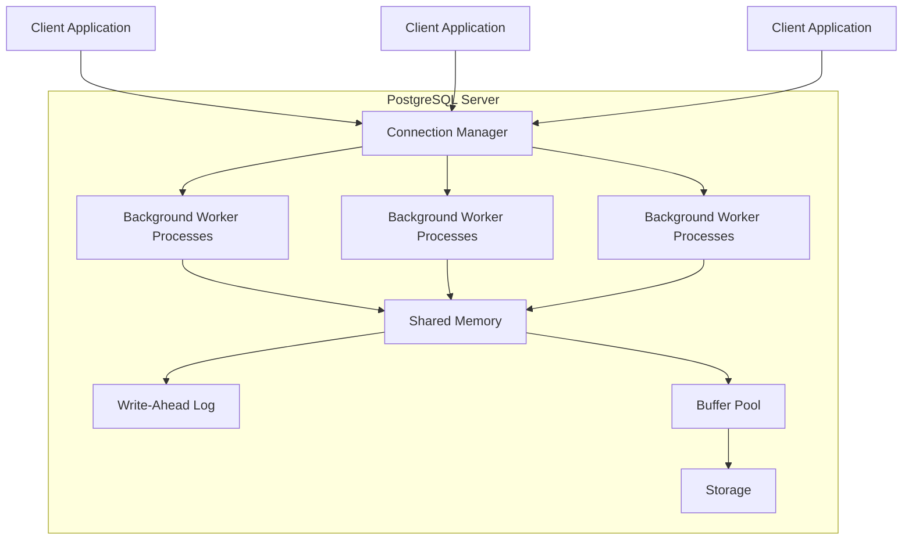
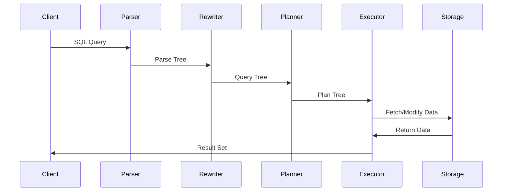
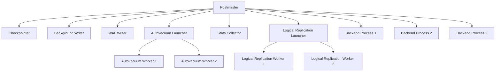

# PostgreSQL Architecture

## Introduction

PostgreSQL (often called "Postgres") is a powerful, open-source object-relational database system with over 30 years of active development. Understanding its architecture is essential for effectively using and optimizing PostgreSQL databases, especially as your applications scale.

In this guide, we'll explore the core components that make up the PostgreSQL architecture, how they interact with each other, and why this architecture makes PostgreSQL both robust and flexible.

## PostgreSQL Architecture Overview

PostgreSQL follows a client-server model where the server process manages the database files, accepts connections from client applications, and performs database actions on behalf of the clients.

Let's break down the key components:



## Core Components

### 1. Postmaster (Main Server Process)

The postmaster is the first process that starts when PostgreSQL is initialized. It:

- Listens for client connections
- Creates backend processes to handle connections
- Performs recovery operations when needed
- Manages the various background processes

```bash
# Check postmaster process
$ ps aux | grep postgres
postgres  1234  0.0  0.2 288096 16928 ?   Ss   09:15  0:00 /usr/lib/postgresql/14/bin/postgres -D /var/lib/postgresql/14/main
```

### 2. Backend Processes

Each time a client connects to the database, the postmaster forks a new process called a "backend process" or "server process" to handle that connection.

- Each backend process communicates with one client only
- Multiple backend processes run in parallel, serving different clients
- When the client disconnects, the backend process terminates

### 3. Background Workers

PostgreSQL uses several specialized background processes for database maintenance:

- **Writer Process**: Writes dirty shared buffers to disk
- **WAL Writer**: Flushes Write-Ahead Log data to disk
- **Autovacuum Launcher**: Starts autovacuum worker processes
- **Stats Collector**: Collects statistics about server activity
- **Checkpointer**: Creates checkpoints periodically

### 4. Shared Memory

PostgreSQL uses shared memory to communicate between processes and cache frequently accessed data:

- **Shared Buffer Cache**: Stores recently accessed database pages
- **WAL Buffers**: Temporarily holds WAL data before writing to disk
- **Commit Log**: Tracks transaction status

```sql
-- Check shared buffer configuration
SHOW shared_buffers;
```

Example output:
```
 shared_buffers
----------------
 128MB
```

### 5. Storage Architecture

PostgreSQL organizes data storage into several layers:

#### Files and Directories

PostgreSQL stores database data in a directory structure. By default, all data is stored in a cluster's data directory:

```bash
$ ls -la /var/lib/postgresql/14/main
total 56
drwx------ 19 postgres postgres 4096 Mar 10 12:34 .
drwxr-xr-x  3 postgres postgres 4096 Mar 10 12:30 ..
drwx------  5 postgres postgres 4096 Mar 10 12:34 base
drwx------  2 postgres postgres 4096 Mar 10 12:34 global
drwx------  2 postgres postgres 4096 Mar 10 12:34 pg_commit_ts
...
```

#### Tablespaces

Tablespaces allow you to define locations in the file system where the files containing database objects can be stored:

```sql
-- Create a new tablespace
CREATE TABLESPACE fastdisk LOCATION '/ssd/postgresql/data';

-- Create a table in the new tablespace
CREATE TABLE large_data (
    id serial PRIMARY KEY,
    data jsonb
) TABLESPACE fastdisk;
```

### 6. Write-Ahead Log (WAL)

The Write-Ahead Log (WAL) is a crucial component for ensuring data integrity:

- Changes are written to WAL before being applied to data files
- Ensures data consistency in case of crashes
- Enables point-in-time recovery
- Used for replication

```sql
-- Check WAL settings
SHOW wal_level;
```

Example output:
```
 wal_level
-----------
 replica
```

## Client-Server Communication Process

Let's walk through what happens when a client executes a query:

1. **Connection Establishment**: Client connects to the PostgreSQL server
2. **Authentication**: Client authenticates using configured method (password, certificate, etc.)
3. **Query Submission**: Client sends SQL query to the server
4. **Parsing**: Server parses the SQL into an internal representation
5. **Rewriting**: Query rewriting systems transform the query if needed
6. **Planning**: Query planner/optimizer generates an execution plan
7. **Execution**: Executor runs the plan and retrieves results
8. **Result Transmission**: Results are sent back to the client



## Query Processing and Planning

The query processor converts SQL statements into a form the system can execute:

### Query Planning Example

Let's look at how PostgreSQL might handle a simple join query:

```sql
EXPLAIN SELECT customers.name, orders.order_date 
FROM customers 
JOIN orders ON customers.id = orders.customer_id
WHERE orders.total > 100;
```

Example output:
```
                                QUERY PLAN
--------------------------------------------------------------------------
 Hash Join  (cost=33.38..62.84 rows=249 width=36)
   Hash Cond: (orders.customer_id = customers.id)
   ->  Seq Scan on orders  (cost=0.00..25.88 rows=249 width=16)
         Filter: (total > 100)
   ->  Hash  (cost=18.50..18.50 rows=1000 width=20)
         ->  Seq Scan on customers  (cost=0.00..18.50 rows=1000 width=20)
```

This plan shows:
1. PostgreSQL will scan the orders table, filtering for total > 100
2. Build a hash table from the customers table
3. Join the tables using a hash join algorithm

## Concurrency and Transaction Management

PostgreSQL uses Multi-Version Concurrency Control (MVCC) to handle multiple users accessing the database simultaneously:

- Each transaction sees a snapshot of the database
- Writers don't block readers
- Readers don't block writers
- Maintains data consistency without excessive locking

### MVCC Example

```sql
-- Session 1: Start a transaction and update data
BEGIN;
UPDATE accounts SET balance = balance - 100 WHERE id = 1;

-- Session 2 (runs concurrently): The SELECT doesn't see the uncommitted change
SELECT balance FROM accounts WHERE id = 1;

-- Session 1: Commit the transaction
COMMIT;

-- Session 2: Now the SELECT sees the new value
SELECT balance FROM accounts WHERE id = 1;
```

## Memory Architecture

PostgreSQL uses a combination of shared memory and process-local memory:

### Shared Memory Components

- **Shared Buffer Pool**: Caches data pages from disk
- **WAL Buffers**: Temporarily stores WAL records
- **Commit Log**: Tracks transaction statuses

### Local Memory Areas

- **Work Memory**: Used for sorting operations and hash tables
- **Maintenance Work Memory**: Used for maintenance operations
- **Temp Buffers**: Holds temporary table data

```sql
-- Check memory-related settings
SHOW work_mem;
SHOW maintenance_work_mem;
SHOW temp_buffers;
```

Example output:
```
 work_mem
----------
 4MB

 maintenance_work_mem
---------------------
 64MB

 temp_buffers
-------------
 8MB
```

## PostgreSQL Process Structure

The complete process structure looks like this:



## Practical Application: Tuning PostgreSQL

Understanding PostgreSQL's architecture helps you optimize performance:

### Example: Optimizing Shared Buffers

```sql
-- First, check current setting
SHOW shared_buffers;

-- Modify the setting in postgresql.conf
-- shared_buffers = 2GB

-- After restarting PostgreSQL, verify the change
SHOW shared_buffers;
```

### Example: Monitoring Processes

```bash
# List all PostgreSQL processes
$ ps aux | grep postgres

# Check for connections and their states
$ sudo -u postgres psql -c "SELECT * FROM pg_stat_activity;"
```

## Summary

PostgreSQL's architecture is designed for reliability, data integrity, and extensibility. Key components include:

1. The client-server model with the postmaster managing connections
2. Backend processes handling client interactions
3. Background worker processes for maintenance tasks
4. Shared memory for inter-process communication
5. A robust storage system with WAL for data safety
6. Advanced query planning and execution
7. MVCC for concurrent transactions

Understanding these components helps you make better decisions when designing databases, troubleshooting issues, and optimizing performance.

## Additional Resources

- [PostgreSQL Official Documentation](https://www.postgresql.org/docs/)
- [PostgreSQL Administration Cookbook](https://www.packtpub.com/product/postgresql-14-administration-cookbook/9781803243672)
- [PgLife](https://pglife.info/) - Site with realtime statistics about PostgreSQL community

## Practice Exercises

1. Use the `pg_stat_activity` view to monitor active connections to your database.
2. Experiment with different `shared_buffers` settings and observe the impact on performance.
3. Set up WAL archiving and practice a point-in-time recovery.
4. Use `EXPLAIN ANALYZE` to examine query plans for your complex queries.
5. Create a script to monitor the number of PostgreSQL background processes.

---

Remember that understanding PostgreSQL's architecture is an ongoing journey. As you work more with PostgreSQL, you'll gain insights into how these components interact and how to leverage them for optimal database performance.