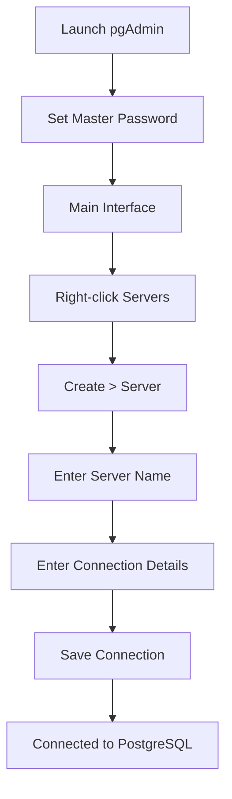

# PostgreSQL pgAdmin Setup

## Introduction

When working with PostgreSQL databases, having a graphical user interface can significantly simplify database management tasks. pgAdmin is the most popular and feature-rich open-source administration and development platform for PostgreSQL. This guide will walk you through installing and configuring pgAdmin, connecting it to your PostgreSQL server, and performing basic operations to get you started.

## What is pgAdmin?

pgAdmin is a free, open-source graphical management tool for PostgreSQL databases. It provides a user-friendly interface that makes it easier to:

- Create and manage databases
- Execute and debug SQL queries
- Create and modify tables, views, and other database objects
- Monitor database performance
- Backup and restore databases
- Visualize query plans

## Installing pgAdmin

pgAdmin is available for Windows, macOS, and Linux. Let's go through the installation process for each operating system.

### Windows Installation

1. Go to the [pgAdmin download page](https://www.pgadmin.org/download/pgadmin-4-windows/)
2. Download the latest version of the Windows installer
3. Run the downloaded installer and follow the installation wizard:
   - Accept the license agreement
   - Choose the installation directory (default is recommended)
   - Click "Next" through the prompts and then "Install"
   - Click "Finish" to complete the installation

### macOS Installation

1. Go to the [pgAdmin download page](https://www.pgadmin.org/download/pgadmin-4-macos/)
2. Download the disk image (.dmg) file
3. Open the downloaded disk image
4. Drag the pgAdmin icon to the Applications folder
5. Launch pgAdmin from your Applications folder

### Linux Installation

For Debian/Ubuntu-based distributions:

```bash
# Add the repository key
curl -fsS https://www.pgadmin.org/static/packages_pgadmin_org.pub | sudo gpg --dearmor -o /usr/share/keyrings/packages-pgadmin-org.gpg

# Add the repository
sudo sh -c 'echo "deb [signed-by=/usr/share/keyrings/packages-pgadmin-org.gpg] https://ftp.postgresql.org/pub/pgadmin/pgadmin4/apt/$(lsb_release -cs) pgadmin4 main" > /etc/apt/sources.list.d/pgadmin4.list'

# Update the package list
sudo apt update

# Install pgAdmin 4
sudo apt install pgadmin4
```

For Red Hat/Fedora-based distributions:

```bash
# Add the repository
sudo rpm -i https://ftp.postgresql.org/pub/pgadmin/pgadmin4/yum/pgadmin4-redhat-repo-latest.noarch.rpm

# Install pgAdmin 4
sudo yum install pgadmin4
```

## First Launch and Setup

When you first launch pgAdmin, it will prompt you to set a master password. This password protects your server connection details and is required each time you start pgAdmin.

1. Enter and confirm your master password
2. Click "OK" to continue

pgAdmin will open in your default web browser, displaying the main interface:

![pgAdmin Interface]

## Connecting to a PostgreSQL Server

Now that pgAdmin is installed and running, let's connect it to a PostgreSQL server:

1. Right-click on "Servers" in the browser tree (left panel)
2. Select "Create" > "Server..."
3. In the "General" tab, enter a name for your server connection (e.g., "Local PostgreSQL")

4. Switch to the "Connection" tab and enter the following details:
   - Host name/address: `localhost` (if PostgreSQL is on the same machine) or the server's IP address
   - Port: `5432` (default PostgreSQL port)
   - Maintenance database: `postgres` (default database)
   - Username: Your PostgreSQL username (default is `postgres`)
   - Password: Your PostgreSQL password
   - Save password?: Check this if you want pgAdmin to remember your password

5. Click "Save" to establish the connection

If the connection is successful, your server will appear in the browser tree, and you can expand it to see the databases, schemas, and other objects.



## Using pgAdmin: Basic Operations

Let's walk through some basic operations you can perform with pgAdmin:

### Browsing Database Objects

1. Expand your server in the browser tree
2. Expand the "Databases" node to see existing databases
3. Expand a database to see its schemas
4. Expand the "public" schema to access tables, views, and other objects

### Creating a New Database

1. Right-click on "Databases" under your server
2. Select "Create" > "Database..."
3. Enter a name for your database (e.g., "my_first_db")
4. Set the owner (default is the user you connected with)
5. Click "Save" to create the database

### Creating a New Table

1. Navigate to your database > Schemas > public
2. Right-click on "Tables"
3. Select "Create" > "Table..."
4. Enter a name for your table (e.g., "users")
5. Switch to the "Columns" tab to define columns:
   - Click "+" to add a new column
   - Enter "id" for the name
   - Select "integer" for data type
   - Check the "Primary key?" box
   
6. Add more columns by clicking "+" again:
   - Enter "username" for the name
   - Select "character varying" for data type
   - Set the length to 50
   - Check the "Not Null?" box
   
7. Add another column:
   - Enter "email" for the name
   - Select "character varying" for data type
   - Set the length to 100
   - Check the "Not Null?" box

8. Click "Save" to create the table

### Running SQL Queries

1. Select your database in the browser tree
2. Click the "Query Tool" button in the top toolbar (or right-click on the database and select "Query Tool")
3. Type your SQL query in the editor:

```sql
-- Create a new table
CREATE TABLE products (
    id SERIAL PRIMARY KEY,
    name VARCHAR(100) NOT NULL,
    price DECIMAL(10, 2) NOT NULL,
    description TEXT,
    created_at TIMESTAMP DEFAULT CURRENT_TIMESTAMP
);

-- Insert sample data
INSERT INTO products (name, price, description)
VALUES 
    ('Laptop', 1299.99, 'High-performance laptop with 16GB RAM'),
    ('Smartphone', 799.99, 'Latest model with 128GB storage'),
    ('Headphones', 149.99, 'Noise-cancelling wireless headphones');

-- Query the data
SELECT * FROM products;
```

4. Click the "Execute/Refresh" button (lightning bolt icon) or press F5 to run the query
5. View the results in the "Data Output" panel below the editor

### Viewing and Editing Table Data

1. Navigate to your table in the browser tree
2. Right-click on the table and select "View/Edit Data" > "All Rows"
3. The data will appear in a grid view where you can:
   - Edit cells directly
   - Add new rows using the "+" button
   - Delete rows using the "trash" button
4. After making changes, click "Save" to commit them to the database

### Exporting and Importing Data

#### Exporting Data:
1. Right-click on your table
2. Select "Export/Import" > "Export..."
3. Configure export options:
   - Format: CSV, SQL, etc.
   - Columns to export
   - Output file location
4. Click "Export" to save the data

#### Importing Data:
1. Right-click on your table
2. Select "Export/Import" > "Import..."
3. Configure import options:
   - Format: CSV, SQL, etc.
   - Input file location
   - Columns mapping
4. Click "Import" to load the data

## Advanced Features

pgAdmin offers many advanced features for database administration:

### Database Backup and Restore

1. Right-click on your database
2. Select "Backup..." to create a backup or "Restore..." to restore from a backup
3. Configure backup/restore options and proceed

### Query Execution Plans

To analyze query performance:
1. Write your SQL query in the Query Tool
2. Click the "Explain" button to view the execution plan
3. Analyze the plan to identify potential performance issues

### Server Monitoring

pgAdmin provides dashboards for monitoring your PostgreSQL server:
1. Right-click on your server
2. Select "Dashboard" to view performance metrics
3. Monitor aspects like connections, transactions, and disk usage

## Troubleshooting Common Issues

### Connection Issues

If you can't connect to your PostgreSQL server:
1. Verify that the PostgreSQL service is running
2. Check the connection details (hostname, port, username, password)
3. Ensure the PostgreSQL server is configured to accept connections
4. Check firewall settings that might block connections

### Authentication Errors

If you receive authentication errors:
1. Double-check your username and password
2. Verify the authentication method in PostgreSQL's `pg_hba.conf` file
3. Ensure your user has the necessary permissions

### Performance Issues

If pgAdmin is running slowly:
1. Close unused query tabs
2. Avoid retrieving large datasets
3. Increase the memory allocated to pgAdmin in the preferences

## Summary

In this guide, we've covered:
- Installing pgAdmin on various operating systems
- Connecting pgAdmin to a PostgreSQL server
- Performing basic operations like creating databases and tables
- Executing SQL queries and managing data
- Using advanced features like backup/restore and monitoring
- Troubleshooting common issues

pgAdmin is a powerful tool that makes PostgreSQL database management more accessible, especially for beginners. As you become more comfortable with pgAdmin, you'll discover many more features that can help you work efficiently with your PostgreSQL databases.

## Additional Resources

- [Official pgAdmin Documentation](https://www.pgadmin.org/docs/)
- [PostgreSQL Documentation](https://www.postgresql.org/docs/)
- [pgAdmin Tutorial Videos](https://www.pgadmin.org/videos/)

## Practice Exercises

1. Install pgAdmin and connect it to your PostgreSQL server
2. Create a new database named "practice_db"
3. Create a table called "employees" with columns for id, name, position, and salary
4. Insert at least five records into the employees table
5. Write and execute a query to find employees with a salary greater than 50000
6. Export the employees table to a CSV file
7. Create a backup of your practice_db database