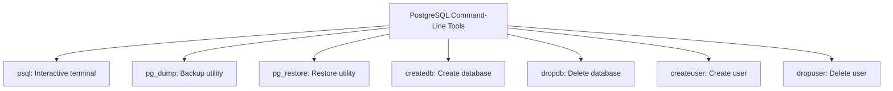

# PostgreSQL Command Line

## Introduction

The PostgreSQL command-line interface (CLI) provides powerful tools for interacting with your PostgreSQL databases directly from your terminal. While graphical tools exist, mastering the command line gives you more control, efficiency, and the ability to automate database tasks through scripts.

In this tutorial, we'll explore PostgreSQL's primary command-line tools, focusing on the interactive terminal `psql`, which is the official client for PostgreSQL.

## Prerequisites

Before we begin, ensure you have:
- PostgreSQL installed on your system
- Basic knowledge of SQL queries
- Access to a terminal or command prompt

## PostgreSQL Command-Line Utilities

PostgreSQL comes with several command-line utilities:



## Connecting to PostgreSQL with psql

The `psql` utility is your primary tool for interacting with PostgreSQL databases.

### Basic Connection Syntax

```bash
psql -h hostname -p port -U username -d database_name
```

Parameters:
- `-h`: Host server (default: localhost)
- `-p`: Port (default: 5432)
- `-U`: Username
- `-d`: Database name

### Connection Examples

Connect to a local database:

```bash
psql -U postgres -d mydatabase
```

Connect to a remote database:

```bash
psql -h db.example.com -p 5432 -U appuser -d production_db
```

If successful, you'll see a prompt like:

```
mydatabase=#
```

The `#` symbol indicates you're connected as a superuser. Regular users see a `>` symbol instead.

## Essential psql Commands

psql has two types of commands:
1. **SQL queries** - standard SQL statements that interact with the database
2. **Meta-commands** - psql-specific commands that start with a backslash `\`

### Most Useful Meta-Commands

| Command | Description | Example Output |
|---------|-------------|---------------|
| `\?` | Show help for psql meta-commands | *[List of available commands]* |
| `\h` | SQL command help | *[SQL syntax help]* |
| `\c dbname` | Connect to a database | `You are now connected to database "newdb" as user "postgres".` |
| `\l` | List all databases | *[Table of databases]* |
| `\dt` | List tables in current database | *[Table of relations]* |
| `\d tablename` | Describe a table | *[Table structure details]* |
| `\du` | List all users/roles | *[List of roles]* |
| `\x` | Toggle expanded display | `Expanded display is on.` |
| `\e` | Open editor for query input | *[Opens system editor]* |
| `\i filename` | Execute commands from file | *[Executes SQL file]* |
| `\o filename` | Send results to file | *[Output directed to file]* |
| `\q` | Quit psql | *[Exits psql]* |

### Examples of psql in Action

Let's see how to use psql commands to explore a database:

```bash
# Connect to the database
psql -U postgres -d sample_db

# List all tables
sample_db=# \dt
         List of relations
 Schema |  Name   | Type  |  Owner   
--------+---------+-------+----------
 public | customers | table | postgres
 public | orders    | table | postgres
 public | products  | table | postgres
(3 rows)

# Examine the structure of the customers table
sample_db=# \d customers
                                Table "public.customers"
    Column    |          Type          | Collation | Nullable |       Default       
--------------+------------------------+-----------+----------+---------------------
 customer_id  | integer                |           | not null | nextval('...')
 name         | character varying(100) |           | not null | 
 email        | character varying(100) |           | not null | 
 created_at   | timestamp              |           | not null | CURRENT_TIMESTAMP
Primary key: "customers_pkey"
Referenced by:
    TABLE "orders" CONSTRAINT "orders_customer_id_fkey" FOREIGN KEY (customer_id) REFERENCES customers(customer_id)
```

## Running SQL Queries

Once connected with psql, you can run SQL queries directly:

```sql
-- Create a new table
CREATE TABLE employees (
    id SERIAL PRIMARY KEY,
    name VARCHAR(100) NOT NULL,
    department VARCHAR(100),
    salary NUMERIC(10,2)
);

-- Insert data
INSERT INTO employees (name, department, salary) 
VALUES ('John Doe', 'Engineering', 75000.00);

-- Query data
SELECT * FROM employees;
```

Result:

```
 id |   name   |  department  |  salary  
----+----------+--------------+----------
  1 | John Doe | Engineering  | 75000.00
(1 row)
```

Remember that SQL queries in psql:
- Can span multiple lines
- Must end with a semicolon `;`
- Are case-insensitive for keywords (but case-sensitive for identifiers unless quoted)

## Formatting Output

psql offers several options to format the output of your queries:

### Toggle Expanded Display

```bash
sample_db=# \x
Expanded display is on.
sample_db=# SELECT * FROM employees LIMIT 1;
-[ RECORD 1 ]+-----------
id           | 1
name         | John Doe
department   | Engineering
salary       | 75000.00
```

### Export Results to CSV

```bash
sample_db=# \copy (SELECT * FROM employees) TO '~/employees.csv' WITH CSV HEADER;
COPY 1
```

### Format as HTML

```bash
sample_db=# \H
Output format is html.
sample_db=# SELECT * FROM employees;
<table>
  <tr>
    <th>id</th>
    <th>name</th>
    <th>department</th>
    <th>salary</th>
  </tr>
  <tr>
    <td>1</td>
    <td>John Doe</td>
    <td>Engineering</td>
    <td>75000.00</td>
  </tr>
</table>
```

## Scripting with psql

You can use psql for non-interactive scripting too:

### Run a Single Command

```bash
psql -U postgres -d sample_db -c "SELECT COUNT(*) FROM employees;"
```

### Execute a SQL File

```bash
psql -U postgres -d sample_db -f my_script.sql
```

### Writing Output to File

```bash
psql -U postgres -d sample_db -c "SELECT * FROM employees;" -o employees.txt
```

## Database Administration Tasks

### Creating a New Database

```bash
createdb -U postgres new_database
```

Or from within psql:

```sql
CREATE DATABASE new_database;
```

### Dropping a Database

```bash
dropdb -U postgres old_database
```

Or from within psql:

```sql
DROP DATABASE old_database;
```

### Creating a User

```bash
createuser -U postgres --interactive
```

This starts an interactive prompt:

```
Enter name of role to add: newuser
Shall the new role be a superuser? (y/n) n
Shall the new role be allowed to create databases? (y/n) y
Shall the new role be allowed to create more new roles? (y/n) n
```

Or from within psql:

```sql
CREATE USER newuser WITH PASSWORD 'securepassword';
```

## Database Backup and Restore

### Creating a Backup with pg_dump

```bash
pg_dump -U postgres -d sample_db > sample_db_backup.sql
```

For a compressed backup:

```bash
pg_dump -U postgres -d sample_db | gzip > sample_db_backup.sql.gz
```

### Restoring from a Backup

```bash
psql -U postgres -d sample_db < sample_db_backup.sql
```

For a compressed backup:

```bash
gunzip -c sample_db_backup.sql.gz | psql -U postgres -d sample_db
```

## Practical Examples

### Example 1: Database Analysis

Let's analyze a database to find the largest tables:

```sql
-- Connect to the database
\c mydatabase

-- Find the 5 largest tables
SELECT
    table_name,
    pg_size_pretty(pg_total_relation_size(quote_ident(table_name))) as total_size,
    pg_size_pretty(pg_relation_size(quote_ident(table_name))) as table_size,
    pg_size_pretty(pg_total_relation_size(quote_ident(table_name)) - 
                   pg_relation_size(quote_ident(table_name))) as index_size
FROM
    information_schema.tables
WHERE
    table_schema = 'public'
ORDER BY
    pg_total_relation_size(quote_ident(table_name)) DESC
LIMIT 5;
```

Output:

```
  table_name  | total_size | table_size | index_size 
--------------+------------+------------+------------
 orders       | 2346 MB    | 1654 MB    | 692 MB
 customers    | 843 MB     | 534 MB     | 309 MB
 products     | 512 MB     | 318 MB     | 194 MB
 transactions | 423 MB     | 276 MB     | 147 MB
 inventory    | 128 MB     | 98 MB      | 30 MB
(5 rows)
```

### Example 2: User Management Script

```bash
#!/bin/bash
# Script to create a database user with limited permissions

DB_NAME="app_database"
USER_NAME="app_user"
USER_PASS="secure123"

# Create user
psql -U postgres -c "CREATE USER $USER_NAME WITH PASSWORD '$USER_PASS';"

# Create database
psql -U postgres -c "CREATE DATABASE $DB_NAME;"

# Grant privileges
psql -U postgres -c "GRANT CONNECT ON DATABASE $DB_NAME TO $USER_NAME;"
psql -U postgres -d $DB_NAME -c "GRANT USAGE ON SCHEMA public TO $USER_NAME;"
psql -U postgres -d $DB_NAME -c "GRANT SELECT, INSERT, UPDATE, DELETE ON ALL TABLES IN SCHEMA public TO $USER_NAME;"
psql -U postgres -d $DB_NAME -c "ALTER DEFAULT PRIVILEGES IN SCHEMA public GRANT SELECT, INSERT, UPDATE, DELETE ON TABLES TO $USER_NAME;"

echo "User $USER_NAME created with access to $DB_NAME"
```

### Example 3: Database Monitoring

Create a file called `monitor_locks.sql`:

```sql
SELECT 
    pid,
    usename,
    pg_blocking_pids(pid) as blocked_by,
    query,
    pg_stat_activity.query_start,
    age(now(), pg_stat_activity.query_start) as query_duration
FROM pg_stat_activity
WHERE 
    state != 'idle'
ORDER BY query_duration DESC;
```

Run it periodically to monitor long-running queries:

```bash
# Run every 5 minutes and log the output
while true; do
    date >> db_monitoring.log
    psql -U postgres -d production_db -f monitor_locks.sql >> db_monitoring.log
    echo "-----------------------" >> db_monitoring.log
    sleep 300
done
```

## psql Productivity Tips

1. **Command History**: Press up/down arrows to navigate through previous commands.

2. **Tab Completion**: Press Tab to auto-complete table names, column names, and even SQL keywords.

3. **Create a `.psqlrc` File**: Customize your psql environment by creating a `.psqlrc` file in your home directory:

```
-- Set formatting options
\pset null '(null)'
\pset linestyle unicode
\pset border 2

-- Custom prompt with database and user
\set PROMPT1 '%n@%m:%>/%/ %R%# '

-- Better timing info
\timing on

-- Expanded auto mode
\x auto
```

4. **Use `EXPLAIN ANALYZE`**: Understand query performance:

```sql
EXPLAIN ANALYZE SELECT * FROM orders WHERE customer_id = 123;
```

5. **Use psql variables**:

```sql
\set user_id 42
SELECT * FROM users WHERE id = :user_id;
```

## Common Issues and Solutions

### Connection Refused

If you see `psql: error: connection to server at "localhost" (::1), port 5432 failed`:

1. Check if PostgreSQL is running:
   ```bash
   pg_isready
   ```

2. Verify connection settings in `pg_hba.conf` and `postgresql.conf`

### Authentication Failed

If you see `psql: error: FATAL: password authentication failed for user`:

1. Double-check your username and password
2. Verify authentication settings in `pg_hba.conf`
3. Use the correct authentication method:
   ```bash
   psql -U username -d dbname -W  # Force password prompt
   ```

## Summary

The PostgreSQL command line offers a powerful interface to work with PostgreSQL databases. In this guide, we've explored:

- Connecting to PostgreSQL using `psql`
- Essential psql meta-commands for navigation and exploration
- Running SQL queries and formatting output
- Database administration tasks
- Backup and restore operations
- Practical scripts for database management

Mastering these command-line tools will significantly enhance your productivity as a database developer or administrator, allowing you to quickly execute tasks that might be cumbersome through GUI interfaces.

## Additional Resources

- [Official PostgreSQL Documentation: psql](https://www.postgresql.org/docs/current/app-psql.html)
- [Official PostgreSQL Documentation: Client Applications](https://www.postgresql.org/docs/current/reference-client.html)

## Exercises

1. Connect to your local PostgreSQL instance and list all databases.
2. Create a new database called `practice_db` and connect to it.
3. Create a `users` table with columns for `id`, `username`, `email`, and `created_at`.
4. Insert 5 sample users into the table.
5. Write a query to select all users and export the results to a CSV file.
6. Create a backup of your `practice_db` database.
7. Create a new user with read-only access to `practice_db`.
8. Write a script that runs daily to list all tables in `practice_db` along with their sizes.