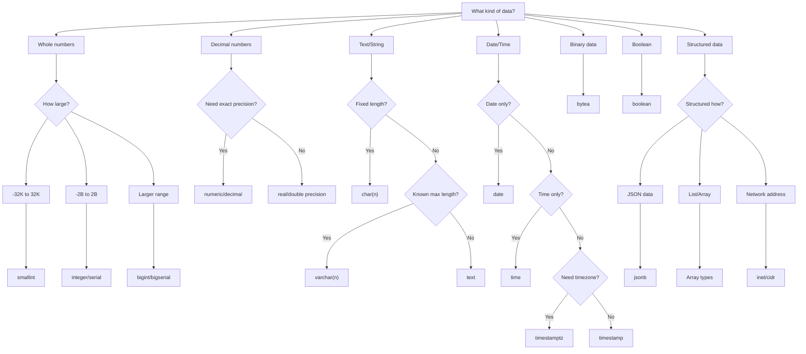

# PostgreSQL Data Types

## Introduction

Data types are fundamental building blocks in any database system, and PostgreSQL offers one of the richest sets of native data types among SQL databases. Understanding these data types is essential for designing efficient database schemas, writing effective queries, and ensuring data integrity.

In this guide, we'll explore the various data types available in PostgreSQL, when to use them, and how they affect database performance and functionality. Whether you're designing a new database or optimizing an existing one, mastering PostgreSQL data types will help you make better decisions for your applications.

## Numeric Data Types

PostgreSQL provides several numeric data types for storing integer and floating-point values.

### Integer Types

PostgreSQL offers four integer types with different ranges:

| Type | Storage Size | Range |
|------|--------------|-------|
| `smallint` | 2 bytes | -32,768 to +32,767 |
| `integer` | 4 bytes | -2,147,483,648 to +2,147,483,647 |
| `bigint` | 8 bytes | -9,223,372,036,854,775,808 to +9,223,372,036,854,775,807 |
| `serial` | 4 bytes | 1 to 2,147,483,647 (auto-incrementing) |
| `bigserial` | 8 bytes | 1 to 9,223,372,036,854,775,807 (auto-incrementing) |

Example of creating a table with different integer types:

```sql
CREATE TABLE product (
    product_id serial PRIMARY KEY,
    small_quantity smallint,
    standard_quantity integer,
    large_quantity bigint
);
```

The `serial` and `bigserial` types are not true data types, but a convenience notation that creates an auto-incrementing integer column, commonly used for primary keys.

### Floating-Point Types

For decimal values, PostgreSQL provides:

| Type | Storage Size | Description |
|------|--------------|-------------|
| `real` | 4 bytes | 6 decimal digits precision |
| `double precision` | 8 bytes | 15 decimal digits precision |
| `numeric(p,s)` | variable | User-specified precision, exact |

Example usage:

```sql
CREATE TABLE measurements (
    measurement_id serial PRIMARY KEY,
    temperature real,
    precise_reading double precision,
    exact_value numeric(10,2)  -- 10 digits total, 2 after decimal point
);

INSERT INTO measurements (temperature, precise_reading, exact_value)
VALUES (23.5, 23.456789012345, 1234567.89);

SELECT * FROM measurements;

-- Result:
-- measurement_id | temperature | precise_reading | exact_value
-- 1              | 23.5        | 23.4567890123   | 1234567.89
```

The `numeric` type is particularly useful for financial calculations where exactness is critical, as it avoids floating-point rounding errors.

## Character and Text Types

PostgreSQL offers several character data types for storing strings:

| Type | Description |
|------|-------------|
| `char(n)` | Fixed-length, blank padded |
| `varchar(n)` | Variable-length with limit |
| `text` | Variable unlimited length |

Example:

```sql
CREATE TABLE user_profiles (
    user_id serial PRIMARY KEY,
    country_code char(2),
    username varchar(50),
    biography text
);

INSERT INTO user_profiles (country_code, username, biography)
VALUES ('US', 'johndoe', 'John is a software developer with over 10 years of experience...');
```

Best practices:
- Use `char(n)` only when the length is truly fixed (e.g., country codes, state abbreviations)
- Use `varchar(n)` when you want to enforce a maximum length
- Use `text` when the length varies and you don't need to restrict it

Performance-wise, there's little difference between `varchar` and `text` in modern PostgreSQL versions, so `text` is often preferred for simplicity.

## Boolean Type

The `boolean` type stores true/false values:

```sql
CREATE TABLE task_list (
    task_id serial PRIMARY KEY,
    description text,
    is_completed boolean DEFAULT false
);

INSERT INTO task_list (description, is_completed)
VALUES 
    ('Complete PostgreSQL tutorial', false),
    ('Update database schema', true);

-- Query for incomplete tasks
SELECT * FROM task_list WHERE is_completed = false;
```

PostgreSQL accepts various input formats for boolean values:
- True: `TRUE`, `'true'`, `'t'`, `'yes'`, `'y'`, `'1'`
- False: `FALSE`, `'false'`, `'f'`, `'no'`, `'n'`, `'0'`

## Date and Time Types

PostgreSQL provides robust support for temporal data:

| Type | Storage Size | Description | Example |
|------|--------------|-------------|---------|
| `date` | 4 bytes | Date only | `2023-10-25` |
| `time` | 8 bytes | Time only | `15:30:45` |
| `timestamp` | 8 bytes | Date and time | `2023-10-25 15:30:45` |
| `timestamptz` | 8 bytes | Date and time with time zone | `2023-10-25 15:30:45+00` |
| `interval` | 16 bytes | Time period | `4 hours 30 minutes` |

Example of using date/time types:

```sql
CREATE TABLE events (
    event_id serial PRIMARY KEY,
    event_name text,
    event_date date,
    start_time time,
    end_time time,
    created_at timestamptz DEFAULT CURRENT_TIMESTAMP
);

INSERT INTO events (event_name, event_date, start_time, end_time)
VALUES ('PostgreSQL Workshop', '2023-11-15', '09:00:00', '17:00:00');

-- Finding events for a specific date
SELECT * FROM events WHERE event_date = '2023-11-15';

-- Duration calculation
SELECT event_name, (end_time - start_time) AS duration FROM events;
```

Best practice: Use `timestamptz` (timestamp with time zone) for most timestamp columns to ensure time zone awareness, especially in applications serving users across different regions.

## Binary Data Types

PostgreSQL offers the `bytea` type for storing binary data such as images, files, or any raw bytes:

```sql
CREATE TABLE documents (
    document_id serial PRIMARY KEY,
    filename text,
    filetype text,
    content bytea
);

-- Example of inserting binary data (in practice, use parameterized queries)
INSERT INTO documents (filename, filetype, content)
VALUES ('report.pdf', 'application/pdf', '\x255044462D312E350D0A...');
```

When working with binary data in applications, it's better to use parameterized queries rather than trying to escape binary data in SQL strings.

## JSON and JSONB Types

PostgreSQL provides excellent support for JSON data with two types:

| Type | Description |
|------|-------------|
| `json` | Stores exact copy of input text |
| `jsonb` | Stores binary format, more efficient for processing |

Example:

```sql
CREATE TABLE user_data (
    user_id serial PRIMARY KEY,
    profile json,
    settings jsonb
);

INSERT INTO user_data (profile, settings)
VALUES (
    '{"name": "Alice", "age": 28, "interests": ["hiking", "programming"]}',
    '{"theme": "dark", "notifications": true, "language": "en"}'
);

-- Query JSON data
SELECT profile->>'name' AS name,
       profile->'interests' AS interests,
       settings->>'theme' AS theme
FROM user_data;
```

The `jsonb` type offers several advantages over `json`:
- More efficient querying and indexing
- Support for containment and existence operators
- Eliminates duplicate keys

For most use cases, `jsonb` is recommended over `json` unless preserving the exact input format (including whitespace and key order) is important.

## Array Types

PostgreSQL allows columns to be defined as arrays of any valid data type:

```sql
CREATE TABLE product_tags (
    product_id serial PRIMARY KEY,
    name text,
    tags text[]
);

INSERT INTO product_tags (name, tags)
VALUES 
    ('Smartphone', ARRAY['electronics', 'mobile', 'gadget']),
    ('Coffee Maker', ARRAY['kitchen', 'appliance']);

-- Query items with specific tag
SELECT name FROM product_tags WHERE 'electronics' = ANY(tags);

-- Adding elements to an array
UPDATE product_tags 
SET tags = array_append(tags, 'tech') 
WHERE product_id = 1;
```

Arrays are useful for storing simple lists of values without creating a separate related table, but for complex relationships, a proper relational design is still recommended.

## UUID Type

The `uuid` type stores Universally Unique Identifiers, which are 128-bit quantities generated by an algorithm that makes them globally unique:

```sql
CREATE EXTENSION IF NOT EXISTS "uuid-ossp";

CREATE TABLE sessions (
    session_id uuid DEFAULT uuid_generate_v4() PRIMARY KEY,
    user_id integer,
    login_time timestamptz DEFAULT CURRENT_TIMESTAMP,
    expiry_time timestamptz
);

INSERT INTO sessions (user_id, expiry_time)
VALUES (1001, CURRENT_TIMESTAMP + INTERVAL '24 hours');

SELECT * FROM sessions;
-- Result will show a generated UUID like: 550e8400-e29b-41d4-a716-446655440000
```

UUIDs are especially useful in distributed systems where unique IDs need to be generated without coordination between nodes.

## Network Address Types

PostgreSQL provides specialized types for network addresses:

| Type | Description |
|------|-------------|
| `inet` | IPv4 and IPv6 addresses |
| `cidr` | IPv4 and IPv6 networks |
| `macaddr` | MAC addresses |

Example:

```sql
CREATE TABLE network_devices (
    device_id serial PRIMARY KEY,
    device_name text,
    ip_address inet,
    network cidr,
    mac macaddr
);

INSERT INTO network_devices (device_name, ip_address, network, mac)
VALUES ('Main Router', '192.168.1.1', '192.168.1.0/24', '08:00:2b:01:02:03');

-- Find devices in a specific subnet
SELECT device_name FROM network_devices 
WHERE ip_address << '192.168.1.0/24';
```

These types provide specialized operators for network calculations like contains, contained-by, and same-network-as.

## Special Types

### Geometric Types

PostgreSQL offers types for 2D geometric objects:

```sql
CREATE TABLE map_objects (
    object_id serial PRIMARY KEY,
    object_name text,
    location point,
    area polygon
);

INSERT INTO map_objects (object_name, location, area)
VALUES (
    'City Park', 
    point(35.12, -97.45),
    polygon('((0,0),(1,0),(1,1),(0,1))')
);

-- Find objects within a certain distance
SELECT object_name FROM map_objects
WHERE point(35.0, -97.0) <-> location < 0.5;
```

### Enum Type

Custom enumerated types can be created for columns that should only accept a fixed set of values:

```sql
CREATE TYPE mood AS ENUM ('sad', 'ok', 'happy');

CREATE TABLE user_checks (
    check_id serial PRIMARY KEY,
    user_id integer,
    check_time timestamptz DEFAULT CURRENT_TIMESTAMP,
    user_mood mood
);

INSERT INTO user_checks (user_id, user_mood)
VALUES (42, 'happy');

-- This would cause an error:
-- INSERT INTO user_checks (user_id, user_mood) VALUES (43, 'angry');
```

Enums are useful for ensuring data consistency and can make queries more readable than using arbitrary strings or codes.

## Domain Types

Domains allow you to create custom types with constraints:

```sql
-- Create a domain for email addresses
CREATE DOMAIN email AS text
CHECK (value ~ '^[a-zA-Z0-9._%+-]+@[a-zA-Z0-9.-]+\.[a-zA-Z]{2,}$');

CREATE TABLE contacts (
    contact_id serial PRIMARY KEY,
    name text,
    contact_email email  -- Using our custom domain
);

-- Valid email
INSERT INTO contacts (name, contact_email)
VALUES ('John Doe', 'john.doe@example.com');

-- Invalid email would fail
-- INSERT INTO contacts (name, contact_email) VALUES ('Invalid', 'not-an-email');
```

Domains help enforce data integrity at the database level and make your schema more self-documenting.

## Best Practices for Choosing Data Types

When selecting data types for your PostgreSQL database, consider these guidelines:

1. **Use the smallest data type that can reliably store your data**
   - For integers, use `smallint` if values fit within its range
   - For text with known maximum length, use `varchar(n)` rather than `text`

2. **Consider future requirements**
   - If a column might need to store larger values in the future, choose a type with room to grow

3. **Use appropriate types for performance**
   - `jsonb` is faster than `json` for most operations
   - `timestamptz` (with time zone) is usually better than `timestamp` for time data

4. **Use domain types and constraints to enforce data integrity**
   - Create custom domains with CHECK constraints for complex validation

5. **For IDs and keys:**
   - Use `serial` or `bigserial` for auto-incrementing keys
   - Consider `uuid` for distributed systems or when IDs shouldn't be sequential

Here's a decision flowchart to help choose the right data type:



## Performance Considerations

Data type selection impacts performance in several ways:

1. **Storage size**: Smaller data types use less disk space and memory, leading to better I/O performance

2. **Indexing**: Different data types have different indexing characteristics
   - `text` and `varchar` can use B-tree, hash, and GIN indexes
   - `jsonb` can be indexed efficiently with GIN indexes
   - Spatial data types can use GiST indexes

3. **Comparison operations**: Operations on smaller data types (like `integer`) are typically faster than on larger types (like `bigint`)

Example of creating an efficient index for a specific data type:

```sql
-- For frequent text searches on a large table
CREATE INDEX idx_description ON products USING gin(to_tsvector('english', description));

-- For jsonb data that needs to be queried by key
CREATE INDEX idx_user_settings ON users USING gin(settings jsonb_path_ops);
```

## Summary

PostgreSQL offers a rich variety of data types to efficiently store and manipulate different kinds of information. Choosing the right data types for your database schema is crucial for:

- Ensuring data integrity
- Optimizing performance
- Making your database design more intuitive
- Supporting complex queries efficiently

When designing your database schema, take time to consider the nature of your data and select the most appropriate data types. Remember that changing data types after your database is in production can be challenging, so it's worthwhile to make good choices from the start.

## Exercises

1. Create a table for storing product information with appropriate data types for:
   - Product ID (auto-incrementing)
   - Product name (up to 100 characters)
   - Description (unlimited length)
   - Price (exact decimal with 2 decimal places)
   - Creation date (with timezone)
   - Categories (multiple per product)

2. Design a users table with columns for:
   - User ID (non-sequential, globally unique)
   - Username (up to 50 characters)
   - Email address (with validation)
   - Preferences (structured data with various settings)
   - Last login timestamp (timezone-aware)

3. Create a custom domain type for phone numbers with validation.

## Additional Resources

- [PostgreSQL Official Documentation on Data Types](https://www.postgresql.org/docs/current/datatype.html)
- [PostgreSQL: Up and Running - Chapter on Data Types](https://www.oreilly.com/library/view/postgresql-up-and/9781449326326/)
- [PostgreSQL Query Optimization](https://www.postgresql.org/docs/current/performance-tips.html)