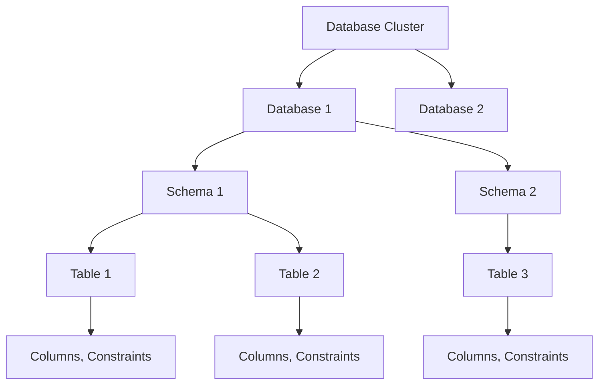

# PostgreSQL Databases

## Introduction

PostgreSQL (often shortened to "Postgres") is a powerful, open-source object-relational database system with over 30 years of active development. It's earned a strong reputation for reliability, feature robustness, and performance. This guide will introduce you to PostgreSQL databases - what they are, how they work, and why they might be the right choice for your next project.

## What is PostgreSQL?

PostgreSQL is an advanced, enterprise-class open-source relational database that supports both SQL (relational) and JSON (non-relational) querying. It's highly extensible, allowing you to define your own data types, build custom functions, and even write code in different programming languages without recompiling your database.

### Key Features

- **ACID Compliance**: Ensures transaction reliability (Atomicity, Consistency, Isolation, Durability)
- **Robust Data Types**: Supports primitive types, structured types, document types, and geometric types
- **Data Integrity**: Enforces unique, not null, primary keys, foreign keys, and complex constraints
- **Concurrency Control**: Enables multiple users to access the database simultaneously
- **Extensibility**: Allows custom functions, operators, data types, and index types
- **Multi-Version Concurrency Control (MVCC)**: Provides efficient handling of concurrent transactions
- **Full-Text Search**: Built-in capabilities for text search and indexing
- **JSON Support**: Store and query JSON data with specialized operators and functions

## Database Structure in PostgreSQL

PostgreSQL organizes its data in a hierarchical structure:



- **Database Cluster**: A collection of databases managed by a single PostgreSQL server instance
- **Database**: A named collection of schemas
- **Schema**: A namespace that contains named database objects like tables, views, indexes, data types, functions, and operators
- **Table**: Structure that stores data in rows and columns
- **Column**: Defines the data type of a particular piece of data within a row

## Getting Started with PostgreSQL

### Installation

PostgreSQL can be installed on all major operating systems. Here are the basic steps for different platforms:

**For Ubuntu/Debian:**

```bash
# Update package lists
sudo apt update

# Install PostgreSQL and the contrib package with additional features
sudo apt install postgresql postgresql-contrib
```

**For macOS (using Homebrew):**

```bash
# Install Homebrew if you don't have it
/bin/bash -c "$(curl -fsSL https://raw.githubusercontent.com/Homebrew/install/HEAD/install.sh)"

# Install PostgreSQL
brew install postgresql
```

**For Windows:**

Download the installer from the [official PostgreSQL website](https://www.postgresql.org/download/windows/) and follow the installation wizard.

### Connecting to PostgreSQL

After installation, you can connect to PostgreSQL using the command-line tool `psql`:

```bash
# Connect to the default 'postgres' database as the 'postgres' user
psql -U postgres
```

If you're prompted for a password, enter the one you set during installation.

### Creating Your First Database

Once connected to PostgreSQL, you can create a new database:

```sql
CREATE DATABASE my_first_database;
```

You can connect to your new database using:

```sql
\c my_first_database
```

## Working with Tables

Tables are the core structures for storing data in PostgreSQL.

### Creating a Table

Let's create a simple table to store information about books:

```sql
CREATE TABLE books (
    book_id SERIAL PRIMARY KEY,
    title VARCHAR(100) NOT NULL,
    author VARCHAR(100) NOT NULL,
    publication_date DATE,
    isbn VARCHAR(13) UNIQUE,
    price DECIMAL(10, 2),
    in_stock BOOLEAN DEFAULT TRUE
);
```

This creates a table with:
- A unique identifier (`book_id`) that automatically increments
- Text fields for the title and author (required)
- A date field for the publication date
- A unique ISBN field
- A decimal field for the price
- A boolean field that defaults to `TRUE`

### Inserting Data

You can add data to your table using the `INSERT` statement:

```sql
INSERT INTO books (title, author, publication_date, isbn, price)
VALUES ('The Great Gatsby', 'F. Scott Fitzgerald', '1925-04-10', '9780743273565', 14.99);

INSERT INTO books (title, author, publication_date, isbn, price, in_stock)
VALUES ('To Kill a Mockingbird', 'Harper Lee', '1960-07-11', '9780061120084', 12.99, TRUE);
```

### Querying Data

To retrieve data from your table, use the `SELECT` statement:

```sql
-- Get all books
SELECT * FROM books;

-- Get specific columns
SELECT title, author FROM books;

-- Filter results
SELECT title, author, price FROM books WHERE price < 15.00;
```

Example output for the first query:

```
 book_id |         title         |       author        | publication_date |      isbn       | price | in_stock 
---------+-----------------------+---------------------+------------------+-----------------+-------+----------
       1 | The Great Gatsby      | F. Scott Fitzgerald | 1925-04-10       | 9780743273565  | 14.99 | t
       2 | To Kill a Mockingbird | Harper Lee          | 1960-07-11       | 9780061120084  | 12.99 | t
```

### Updating Data

You can modify existing data using the `UPDATE` statement:

```sql
-- Update a single record
UPDATE books
SET price = 13.99
WHERE book_id = 1;

-- Update multiple records
UPDATE books
SET in_stock = FALSE
WHERE publication_date < '1950-01-01';
```

### Deleting Data

To remove data, use the `DELETE` statement:

```sql
-- Delete a specific book
DELETE FROM books
WHERE book_id = 2;

-- Delete all out-of-stock books
DELETE FROM books
WHERE in_stock = FALSE;
```

## Advanced PostgreSQL Features

### Data Types

PostgreSQL offers a rich set of native data types:

| Category | Types |
|----------|-------|
| Numeric | INTEGER, SMALLINT, BIGINT, DECIMAL, NUMERIC, REAL, DOUBLE PRECISION |
| Character | CHARACTER, VARCHAR, TEXT |
| Date/Time | DATE, TIME, TIMESTAMP, INTERVAL |
| Boolean | BOOLEAN |
| Geometric | POINT, LINE, LSEG, BOX, PATH, POLYGON, CIRCLE |
| JSON | JSON, JSONB |
| Arrays | Can create arrays of any data type |
| Network | CIDR, INET, MACADDR |
| UUID | For unique identifiers |

### Indexes

Indexes improve query performance but add overhead to data modification:

```sql
-- Create a B-tree index (default)
CREATE INDEX idx_books_author ON books(author);

-- Create a unique index
CREATE UNIQUE INDEX idx_books_isbn ON books(isbn);
```

### Transactions

Transactions ensure data integrity by grouping operations:

```sql
-- Start a transaction
BEGIN;

-- Perform operations
UPDATE accounts SET balance = balance - 100 WHERE account_id = 1;
UPDATE accounts SET balance = balance + 100 WHERE account_id = 2;

-- If everything is OK, commit the transaction
COMMIT;

-- If there's a problem, roll back
-- ROLLBACK;
```

### Views

Views provide a way to encapsulate complex queries:

```sql
CREATE VIEW available_books AS
SELECT title, author, price
FROM books
WHERE in_stock = TRUE
ORDER BY title;

-- Now you can query the view
SELECT * FROM available_books;
```

### Stored Procedures and Functions

PostgreSQL allows you to create custom functions:

```sql
CREATE FUNCTION discount_price(price DECIMAL, discount_percent INTEGER)
RETURNS DECIMAL AS $$
BEGIN
    RETURN price - (price * discount_percent / 100);
END;
$$ LANGUAGE plpgsql;

-- Use the function
SELECT title, price, discount_price(price, 10) AS discounted_price
FROM books;
```

## Practical Example: Building a Book Inventory System

Let's build a more complete example of a book inventory system with multiple related tables:

```sql
-- Authors table
CREATE TABLE authors (
    author_id SERIAL PRIMARY KEY,
    first_name VARCHAR(50) NOT NULL,
    last_name VARCHAR(50) NOT NULL,
    birth_date DATE,
    country VARCHAR(50)
);

-- Publishers table
CREATE TABLE publishers (
    publisher_id SERIAL PRIMARY KEY,
    name VARCHAR(100) NOT NULL,
    founded_year INTEGER,
    headquarters VARCHAR(100)
);

-- Categories table
CREATE TABLE categories (
    category_id SERIAL PRIMARY KEY,
    name VARCHAR(50) NOT NULL,
    description TEXT
);

-- Books table with relationships
CREATE TABLE books (
    book_id SERIAL PRIMARY KEY,
    title VARCHAR(100) NOT NULL,
    author_id INTEGER REFERENCES authors(author_id),
    publisher_id INTEGER REFERENCES publishers(publisher_id),
    publication_date DATE,
    isbn VARCHAR(13) UNIQUE,
    price DECIMAL(10, 2),
    in_stock BOOLEAN DEFAULT TRUE
);

-- Book-category relationship (many-to-many)
CREATE TABLE book_categories (
    book_id INTEGER REFERENCES books(book_id),
    category_id INTEGER REFERENCES categories(category_id),
    PRIMARY KEY (book_id, category_id)
);
```

Now we can add some sample data:

```sql
-- Add authors
INSERT INTO authors (first_name, last_name, birth_date, country)
VALUES 
    ('F. Scott', 'Fitzgerald', '1896-09-24', 'USA'),
    ('Harper', 'Lee', '1926-04-28', 'USA'),
    ('George', 'Orwell', '1903-06-25', 'United Kingdom');

-- Add publishers
INSERT INTO publishers (name, founded_year, headquarters)
VALUES 
    ('Scribner', 1846, 'New York, USA'),
    ('HarperCollins', 1989, 'New York, USA'),
    ('Secker & Warburg', 1935, 'London, UK');

-- Add categories
INSERT INTO categories (name, description)
VALUES 
    ('Fiction', 'Literary works created from imagination'),
    ('Classics', 'Books that have stood the test of time'),
    ('Dystopian', 'Fiction set in a dark, oppressive society');

-- Add books
INSERT INTO books (title, author_id, publisher_id, publication_date, isbn, price)
VALUES 
    ('The Great Gatsby', 1, 1, '1925-04-10', '9780743273565', 14.99),
    ('To Kill a Mockingbird', 2, 2, '1960-07-11', '9780061120084', 12.99),
    ('1984', 3, 3, '1949-06-08', '9780451524935', 11.99);

-- Connect books to categories
INSERT INTO book_categories (book_id, category_id)
VALUES 
    (1, 1), -- The Great Gatsby: Fiction
    (1, 2), -- The Great Gatsby: Classics
    (2, 1), -- To Kill a Mockingbird: Fiction
    (2, 2), -- To Kill a Mockingbird: Classics
    (3, 1), -- 1984: Fiction
    (3, 2), -- 1984: Classics
    (3, 3); -- 1984: Dystopian
```

Now we can perform more interesting queries:

```sql
-- Get books with author names and publisher information
SELECT b.title, a.first_name || ' ' || a.last_name AS author_name, 
       p.name AS publisher, b.publication_date, b.price
FROM books b
JOIN authors a ON b.author_id = a.author_id
JOIN publishers p ON b.publisher_id = p.publisher_id
ORDER BY b.publication_date;

-- Find all categories for a specific book
SELECT c.name
FROM categories c
JOIN book_categories bc ON c.category_id = bc.category_id
JOIN books b ON bc.book_id = b.book_id
WHERE b.title = '1984';

-- Get the number of books in each category
SELECT c.name, COUNT(bc.book_id) AS book_count
FROM categories c
LEFT JOIN book_categories bc ON c.category_id = bc.category_id
GROUP BY c.name
ORDER BY book_count DESC;
```

## Backup and Restore

PostgreSQL provides tools for backing up and restoring databases:

### Backup

```bash
# Create a full database backup
pg_dump -U postgres -F c -b -v -f my_database_backup.backup my_database

# Just the schema (structure without data)
pg_dump -U postgres -s my_database > schema_backup.sql

# Just the data
pg_dump -U postgres -a my_database > data_backup.sql
```

### Restore

```bash
# Restore from a backup file
pg_restore -U postgres -d my_database my_database_backup.backup

# Restore from SQL file
psql -U postgres -d my_database -f schema_backup.sql
```

## Best Practices

1. **Use Appropriate Data Types**: Choose the most specific data type for your columns to optimize storage and performance.

2. **Normalize Your Data**: Split data into related tables to minimize redundancy, but balance with performance needs.

3. **Use Constraints**: Implement constraints (primary keys, foreign keys, unique constraints) to maintain data integrity.

4. **Index Wisely**: Add indexes for frequently queried columns, but be aware of the overhead on writes.

5. **Regular Backups**: Implement a regular backup strategy appropriate for your application's needs.

6. **Keep PostgreSQL Updated**: Regularly update to take advantage of performance improvements and security patches.

7. **Monitor Performance**: Use tools like `EXPLAIN ANALYZE` to understand and optimize query performance.

8. **Connection Pooling**: For web applications, use connection pooling to manage database connections efficiently.

## Summary

PostgreSQL is a powerful, feature-rich database system suitable for a wide range of applications, from simple websites to complex data analysis systems. Its combination of SQL and NoSQL capabilities, robust data integrity features, and extensibility make it a popular choice for developers.

In this guide, we've covered:
- PostgreSQL's key features and database structure
- Setting up a PostgreSQL database
- Creating and managing tables
- Performing basic CRUD operations
- Using advanced features like transactions, views, and stored procedures
- Building a practical book inventory system with related tables
- Backing up and restoring databases
- Best practices for PostgreSQL usage

## Further Learning

To continue your PostgreSQL journey, consider exploring these topics:

1. **Advanced SQL**: Window functions, common table expressions (CTEs), and recursive queries
2. **PostgreSQL-specific features**: Like LISTEN/NOTIFY, full-text search, and table inheritance
3. **Performance tuning**: Query optimization, indexing strategies, and database configuration
4. **PL/pgSQL**: Writing stored procedures and triggers in PostgreSQL's procedural language
5. **PostgreSQL extensions**: Like PostGIS for geographical data or TimescaleDB for time-series data

## Exercises

1. Create a database for a simple e-commerce system with tables for products, customers, and orders.
2. Write queries to find the total value of all orders for each customer.
3. Create a view that shows products with their categories and current inventory levels.
4. Write a stored procedure that updates product prices by a percentage based on their category.
5. Implement a trigger that automatically updates the "last_modified" timestamp when a product is updated.