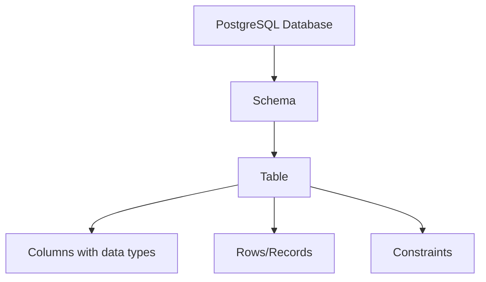

# PostgreSQL Tables

Tables are the fundamental building blocks of any relational database, including PostgreSQL. They organize data into rows and columns, similar to a spreadsheet, but with powerful features for data manipulation, integrity, and retrieval.

## What are Tables in PostgreSQL?

A table in PostgreSQL is a collection of related data stored in a structured format consisting of rows and columns. Each column has a specific data type that defines what kind of data it can hold, while each row represents a single record or entity.



## Creating Tables in PostgreSQL

### Basic Table Creation

To create a table in PostgreSQL, you use the `CREATE TABLE` statement followed by the table name and column definitions.

```sql
CREATE TABLE employees (
    employee_id SERIAL PRIMARY KEY,
    first_name VARCHAR(50) NOT NULL,
    last_name VARCHAR(50) NOT NULL,
    email VARCHAR(100) UNIQUE,
    hire_date DATE,
    salary NUMERIC(10, 2),
    department_id INTEGER
);
```

In this example:
- `SERIAL` is an auto-incrementing integer type
- `PRIMARY KEY` ensures each record has a unique identifier
- `VARCHAR` defines variable-length character strings
- `NOT NULL` ensures a column cannot contain null values
- `UNIQUE` ensures all values in a column are different
- `DATE` stores date values
- `NUMERIC(10, 2)` stores numbers with up to 10 digits, 2 of which are after the decimal point

### Viewing Table Structure

After creating a table, you can view its structure using the `\d` command in psql:

```
\d employees
```

Output:
```
                                Table "public.employees"
    Column     |         Type          | Collation | Nullable |                Default                
---------------+-----------------------+-----------+----------+---------------------------------------
 employee_id   | integer               |           | not null | nextval('employees_employee_id_seq'::regclass)
 first_name    | character varying(50) |           | not null | 
 last_name     | character varying(50) |           | not null | 
 email         | character varying(100)|           |          | 
 hire_date     | date                  |           |          | 
 salary        | numeric(10,2)         |           |          | 
 department_id | integer               |           |          | 
Indexes:
    "employees_pkey" PRIMARY KEY, btree (employee_id)
    "employees_email_key" UNIQUE CONSTRAINT, btree (email)
```

## Table Constraints

Constraints are rules enforced on data columns to ensure data integrity and accuracy. PostgreSQL supports several types of constraints:

### Primary Key Constraints

A primary key uniquely identifies each record in a table. It must contain unique values and cannot be null.

```sql
CREATE TABLE products (
    product_id INTEGER PRIMARY KEY,
    product_name VARCHAR(100) NOT NULL,
    price NUMERIC(10, 2)
);
```

### Foreign Key Constraints

Foreign keys establish relationships between tables by referencing the primary key of another table.

```sql
CREATE TABLE orders (
    order_id SERIAL PRIMARY KEY,
    order_date DATE NOT NULL,
    customer_id INTEGER REFERENCES customers(customer_id),
    product_id INTEGER REFERENCES products(product_id),
    quantity INTEGER NOT NULL
);
```

### CHECK Constraints

CHECK constraints ensure that values in a column meet specific conditions.

```sql
CREATE TABLE students (
    student_id SERIAL PRIMARY KEY,
    student_name VARCHAR(100) NOT NULL,
    age INTEGER CHECK (age >= 18),
    grade CHAR(1) CHECK (grade IN ('A', 'B', 'C', 'D', 'F'))
);
```

### DEFAULT Values

You can define default values for columns that will be used if no value is specified during insertion.

```sql
CREATE TABLE blog_posts (
    post_id SERIAL PRIMARY KEY,
    title VARCHAR(200) NOT NULL,
    content TEXT,
    published_date DATE DEFAULT CURRENT_DATE,
    views INTEGER DEFAULT 0
);
```

## Modifying Tables

PostgreSQL allows you to modify existing tables to adapt to changing requirements.

### Adding Columns

```sql
ALTER TABLE employees 
ADD COLUMN phone VARCHAR(15);
```

### Removing Columns

```sql
ALTER TABLE employees 
DROP COLUMN phone;
```

### Changing Column Data Types

```sql
ALTER TABLE employees 
ALTER COLUMN email TYPE VARCHAR(150);
```

### Adding Constraints

```sql
ALTER TABLE employees 
ADD CONSTRAINT salary_check CHECK (salary > 0);
```

## Common Table Operations

### Inserting Data

```sql
INSERT INTO employees (first_name, last_name, email, hire_date, salary, department_id)
VALUES ('John', 'Doe', 'john.doe@example.com', '2023-01-15', 60000.00, 1);
```

### Querying Data

```sql
SELECT first_name, last_name, salary
FROM employees
WHERE department_id = 1
ORDER BY salary DESC;
```

### Updating Data

```sql
UPDATE employees
SET salary = salary * 1.05
WHERE department_id = 1;
```

### Deleting Data

```sql
DELETE FROM employees
WHERE employee_id = 1;
```

## Table Inheritance

PostgreSQL supports table inheritance, allowing you to define parent-child table relationships. Child tables inherit columns from their parents.

```sql
CREATE TABLE vehicles (
    vehicle_id SERIAL PRIMARY KEY,
    manufacturer VARCHAR(100),
    model VARCHAR(100),
    year INTEGER
);

CREATE TABLE cars (
    doors INTEGER,
    body_style VARCHAR(50)
) INHERITS (vehicles);

CREATE TABLE trucks (
    cargo_capacity NUMERIC(10,2),
    towing_capacity NUMERIC(10,2)
) INHERITS (vehicles);
```

## Temporary Tables

Temporary tables exist only for the duration of a database session and are automatically dropped at the end of the session.

```sql
CREATE TEMPORARY TABLE temp_results (
    id SERIAL,
    result_data TEXT
);
```

## Practical Examples

### Example 1: Building a Simple Order Management System

Let's create a simple order management system with customers, products, and orders:

```sql
-- Create customers table
CREATE TABLE customers (
    customer_id SERIAL PRIMARY KEY,
    name VARCHAR(100) NOT NULL,
    email VARCHAR(100) UNIQUE,
    registration_date DATE DEFAULT CURRENT_DATE
);

-- Create products table
CREATE TABLE products (
    product_id SERIAL PRIMARY KEY,
    name VARCHAR(100) NOT NULL,
    description TEXT,
    price NUMERIC(10, 2) NOT NULL CHECK (price > 0),
    stock_quantity INTEGER NOT NULL DEFAULT 0
);

-- Create orders table
CREATE TABLE orders (
    order_id SERIAL PRIMARY KEY,
    customer_id INTEGER REFERENCES customers(customer_id),
    order_date TIMESTAMP DEFAULT CURRENT_TIMESTAMP,
    total_amount NUMERIC(12, 2)
);

-- Create order_items table for order details
CREATE TABLE order_items (
    item_id SERIAL PRIMARY KEY,
    order_id INTEGER REFERENCES orders(order_id),
    product_id INTEGER REFERENCES products(product_id),
    quantity INTEGER NOT NULL CHECK (quantity > 0),
    unit_price NUMERIC(10, 2) NOT NULL,
    UNIQUE (order_id, product_id)
);
```

This example demonstrates:
- Relationship between tables using foreign keys
- Constraints to ensure data integrity
- Default values for automatic timestamps
- Business logic enforced at the database level

### Example 2: Working with Complex Data Types

PostgreSQL supports various advanced data types:

```sql
CREATE TABLE user_profiles (
    profile_id SERIAL PRIMARY KEY,
    user_id INTEGER UNIQUE NOT NULL,
    preferences JSONB,
    location POINT,
    interests TEXT[],
    login_history TIMESTAMP[]
);

-- Insert data with complex types
INSERT INTO user_profiles (user_id, preferences, location, interests, login_history)
VALUES (
    1, 
    '{"theme": "dark", "notifications": true}'::JSONB, 
    point(40.7128, -74.0060), 
    ARRAY['programming', 'databases', 'hiking'], 
    ARRAY['2023-01-01 10:00:00'::TIMESTAMP, '2023-01-02 11:30:00'::TIMESTAMP]
);
```

## Performance Considerations

### Indexing Tables

Indexes improve query performance but add overhead to data modification operations.

```sql
-- Create an index on the email column of customers table
CREATE INDEX idx_customers_email ON customers(email);

-- Create a composite index on multiple columns
CREATE INDEX idx_order_items_order_product ON order_items(order_id, product_id);
```

### Partitioning Tables

For very large tables, partitioning splits a table into smaller, more manageable pieces.

```sql
-- Create a partitioned table by date range
CREATE TABLE logs (
    log_id SERIAL,
    log_date DATE NOT NULL,
    log_level VARCHAR(10),
    message TEXT
) PARTITION BY RANGE (log_date);

-- Create partitions
CREATE TABLE logs_2023 PARTITION OF logs
    FOR VALUES FROM ('2023-01-01') TO ('2024-01-01');
    
CREATE TABLE logs_2024 PARTITION OF logs
    FOR VALUES FROM ('2024-01-01') TO ('2025-01-01');
```

## Summary

PostgreSQL tables form the foundation of database design, allowing you to:
- Structure your data logically with columns and data types
- Ensure data integrity with constraints
- Establish relationships between different data entities
- Optimize performance through indexing and partitioning

When designing tables, consider:
- Proper normalization to reduce redundancy
- Appropriate data types for efficient storage
- Constraints to enforce business rules
- Indexes for query performance
- Potential future growth and scalability

## Exercises

1. Create a table for a library database that includes books, authors, and borrowing records.
2. Write queries to insert, update, and select data from your tables.
3. Add appropriate constraints and indexes to your tables.
4. Create a relationship between tables using foreign keys.
5. Modify an existing table to add new columns and constraints.

## Additional Resources

- [PostgreSQL Official Documentation on Tables](https://www.postgresql.org/docs/current/ddl-basics.html)
- [PostgreSQL Data Types](https://www.postgresql.org/docs/current/datatype.html)
- [PostgreSQL Table Partitioning](https://www.postgresql.org/docs/current/ddl-partitioning.html)
- [Indexing in PostgreSQL](https://www.postgresql.org/docs/current/indexes.html)