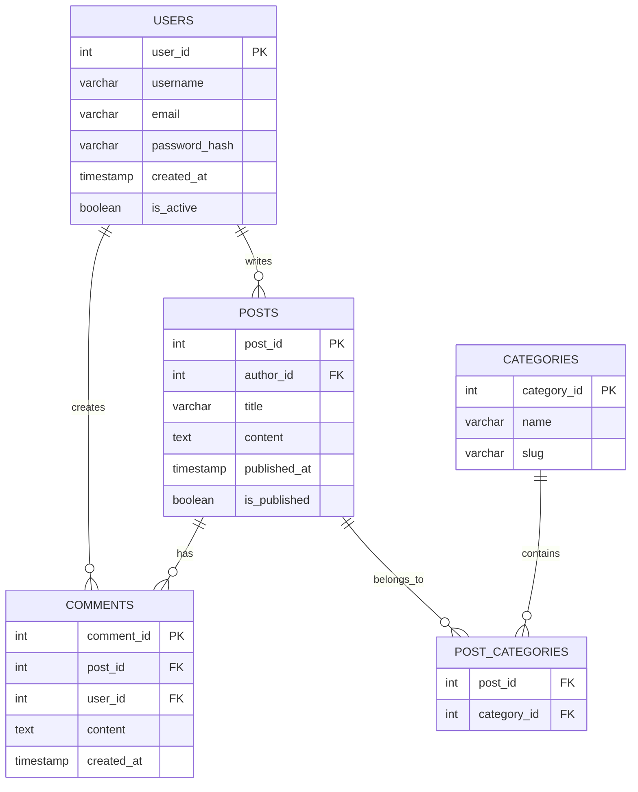

# PostgreSQL Syntax

## Introduction

PostgreSQL (often shortened to "Postgres") is a powerful, open-source relational database management system with over 30 years of active development. Understanding PostgreSQL syntax is essential for effectively communicating with your database. In this guide, we'll explore the fundamental syntax elements that form the building blocks of PostgreSQL queries and operations.

Whether you're creating tables, inserting data, or performing complex queries, mastering PostgreSQL syntax will enable you to harness the full power of this robust database system.

## Basic PostgreSQL Syntax Elements

PostgreSQL follows SQL (Structured Query Language) standards with some unique extensions. Let's look at the core syntax elements:

### Commands

PostgreSQL commands are keywords that tell the database what action to perform. Commands are typically written in uppercase (though PostgreSQL is not case-sensitive for keywords).

Common commands include:

- `SELECT` - Retrieve data
- `INSERT` - Add new data
- `UPDATE` - Modify existing data
- `DELETE` - Remove data
- `CREATE` - Make new database objects
- `ALTER` - Modify database objects
- `DROP` - Delete database objects

### Identifiers

Identifiers are names of database objects like tables, columns, and functions. PostgreSQL has the following rules for identifiers:

- Case-insensitive unless quoted (e.g., `"firstName"`)
- Must start with a letter or underscore
- Can contain letters, numbers, and underscores
- Have a maximum length of 63 bytes

```sql
-- Unquoted identifiers (case doesn't matter)
CREATE TABLE users (id INT);
SELECT * FROM users;
SELECT * FROM USERS; -- Same as above

-- Quoted identifiers (case sensitive)
CREATE TABLE "userProfiles" (
  "userId" INT,
  "firstName" TEXT
);
```

### Literals

Literals are fixed values used in queries:

- **String literals** are enclosed in single quotes: `'Hello, PostgreSQL!'`
- **Numeric literals** don't need quotes: `42`, `3.14`
- **Date/time literals** require specific formatting: `'2023-01-15'`, `'14:30:00'`
- **Boolean literals** are `TRUE` and `FALSE` (or `true` and `false`)

```sql
INSERT INTO messages (content, importance, sent_at)
VALUES ('Hello, world!', 5, '2023-10-15 08:30:00');
```

### Comments

Comments help document your SQL code:

- Single-line comments start with `--`
- Multi-line comments are enclosed in `/* */`

```sql
-- This is a single line comment

/* This is a
   multi-line comment
   spanning several lines */

SELECT * FROM users; -- Get all users
```

## Data Types

PostgreSQL offers a rich set of data types:

### Numeric Types

- `INTEGER` or `INT` - Whole numbers (-2147483648 to +2147483647)
- `BIGINT` - Large-range integers (-9223372036854775808 to +9223372036854775807)
- `SMALLINT` - Small-range integers (-32768 to +32767)
- `NUMERIC` or `DECIMAL` - Exact numeric with specified precision
- `REAL` - Single precision floating-point (6 decimal digits precision)
- `DOUBLE PRECISION` - Double precision floating-point (15 decimal digits precision)
- `SERIAL` - Auto-incrementing integer (often used for IDs)

### Character Types

- `CHAR(n)` - Fixed-length string, padded with spaces
- `VARCHAR(n)` - Variable-length string with limit
- `TEXT` - Variable-length string without limit

### Temporal Types

- `DATE` - Calendar date (year, month, day)
- `TIME` - Time of day
- `TIMESTAMP` - Date and time
- `INTERVAL` - Time period

### Boolean Type

- `BOOLEAN` - Can store `TRUE`, `FALSE`, or `NULL`

### Other Common Types

- `JSON` and `JSONB` - JSON data
- `UUID` - Universally unique identifiers
- `ARRAY` - Arrays of other data types
- `BYTEA` - Binary data

## Creating Database Objects

### Creating a Database

```sql
CREATE DATABASE blog_app
  WITH 
    OWNER = postgres
    ENCODING = 'UTF8'
    CONNECTION LIMIT = -1;
```

### Creating a Table

```sql
CREATE TABLE users (
  user_id SERIAL PRIMARY KEY,
  username VARCHAR(50) UNIQUE NOT NULL,
  email VARCHAR(100) UNIQUE NOT NULL,
  password_hash VARCHAR(255) NOT NULL,
  created_at TIMESTAMP DEFAULT CURRENT_TIMESTAMP,
  is_active BOOLEAN DEFAULT TRUE
);
```

### Creating an Index

```sql
-- Creating a B-tree index on the username column
CREATE INDEX idx_users_username ON users(username);

-- Creating a unique index
CREATE UNIQUE INDEX idx_users_email ON users(email);
```

## Data Manipulation

### Inserting Data

```sql
-- Insert a single row
INSERT INTO users (username, email, password_hash)
VALUES ('johndoe', 'john@example.com', 'hashed_password_here');

-- Insert multiple rows
INSERT INTO users (username, email, password_hash)
VALUES 
  ('janedoe', 'jane@example.com', 'hashed_password_here'),
  ('bobsmith', 'bob@example.com', 'hashed_password_here');
```

### Querying Data

```sql
-- Basic SELECT query
SELECT username, email FROM users;

-- Query with conditions
SELECT * FROM users WHERE is_active = TRUE;

-- Sorting results
SELECT * FROM users ORDER BY created_at DESC;

-- Limiting results
SELECT * FROM users LIMIT 10 OFFSET 20;
```

### Updating Data

```sql
-- Update a specific record
UPDATE users
SET is_active = FALSE
WHERE username = 'johndoe';

-- Update multiple columns
UPDATE users
SET 
  email = 'newemail@example.com',
  username = 'newusername'
WHERE user_id = 1;
```

### Deleting Data

```sql
-- Delete specific records
DELETE FROM users WHERE is_active = FALSE;

-- Delete all records from a table
DELETE FROM temporary_logs;
```

## Operators and Expressions

### Comparison Operators

- `=` - Equal
- `<>` or `!=` - Not equal
- `<` - Less than
- `>` - Greater than
- `<=` - Less than or equal
- `>=` - Greater than or equal
- `BETWEEN` - Between a range (inclusive)
- `IN` - Match any value in a list
- `LIKE` - Pattern matching with wildcards
- `ILIKE` - Case-insensitive pattern matching
- `IS NULL` - Is null check
- `IS NOT NULL` - Is not null check

```sql
-- Examples of comparison operators
SELECT * FROM products WHERE price > 100;
SELECT * FROM products WHERE price BETWEEN 10 AND 50;
SELECT * FROM users WHERE country IN ('USA', 'Canada', 'Mexico');
SELECT * FROM users WHERE email LIKE '%@gmail.com';
```

### Logical Operators

- `AND` - Logical and
- `OR` - Logical or
- `NOT` - Logical not

```sql
-- Combining conditions with logical operators
SELECT * FROM products 
WHERE (price > 100 OR featured = TRUE) 
AND stock_count > 0;
```

### Arithmetic Operators

- `+` - Addition
- `-` - Subtraction
- `*` - Multiplication
- `/` - Division
- `%` - Modulo (remainder)
- `^` - Exponentiation

```sql
-- Using arithmetic operators in queries
SELECT 
  product_name,
  price,
  quantity,
  price * quantity AS total_value
FROM inventory;
```

## Joins

PostgreSQL supports various types of joins to combine data from multiple tables:

### INNER JOIN

Returns rows when there is a match in both tables.

```sql
SELECT 
  users.username, 
  orders.order_date, 
  orders.total_amount
FROM users
INNER JOIN orders ON users.user_id = orders.user_id;
```

### LEFT JOIN (or LEFT OUTER JOIN)

Returns all rows from the left table and matching rows from the right table.

```sql
SELECT 
  users.username,
  orders.order_id
FROM users
LEFT JOIN orders ON users.user_id = orders.user_id;
```

### RIGHT JOIN (or RIGHT OUTER JOIN)

Returns all rows from the right table and matching rows from the left table.

```sql
SELECT 
  products.product_name,
  order_items.quantity
FROM order_items
RIGHT JOIN products ON order_items.product_id = products.product_id;
```

### FULL JOIN (or FULL OUTER JOIN)

Returns rows when there is a match in either of the tables.

```sql
SELECT 
  customers.customer_name,
  feedbacks.content
FROM customers
FULL JOIN feedbacks ON customers.customer_id = feedbacks.customer_id;
```

### CROSS JOIN

Produces a Cartesian product of two tables.

```sql
SELECT products.name, colors.color
FROM products
CROSS JOIN colors;
```

## Functions and Aggregations

PostgreSQL provides numerous built-in functions for data manipulation and analysis:

### String Functions

- `CONCAT(str1, str2, ...)` - Concatenate strings
- `LOWER(str)` - Convert to lowercase
- `UPPER(str)` - Convert to uppercase
- `LENGTH(str)` - String length
- `SUBSTRING(str, start, length)` - Extract substring

```sql
SELECT 
  username,
  UPPER(username) AS uppercase_name,
  LENGTH(email) AS email_length
FROM users;
```

### Date/Time Functions

- `NOW()` - Current date and time
- `CURRENT_DATE` - Current date
- `EXTRACT(part FROM date)` - Extract part from date
- `DATE_TRUNC('unit', timestamp)` - Truncate to specified precision

```sql
SELECT 
  order_id,
  order_date,
  EXTRACT(MONTH FROM order_date) AS month,
  EXTRACT(YEAR FROM order_date) AS year
FROM orders;
```

### Aggregate Functions

- `COUNT(*)` - Count rows
- `SUM(expression)` - Sum values
- `AVG(expression)` - Average of values
- `MIN(expression)` - Minimum value
- `MAX(expression)` - Maximum value

```sql
SELECT 
  product_category,
  COUNT(*) AS product_count,
  AVG(price) AS average_price,
  MIN(price) AS lowest_price,
  MAX(price) AS highest_price
FROM products
GROUP BY product_category;
```

## Transactions

Transactions ensure data integrity by grouping operations that should be executed as a unit:

```sql
-- Begin a transaction
BEGIN;

-- Operations within the transaction
UPDATE accounts SET balance = balance - 100 WHERE account_id = 123;
UPDATE accounts SET balance = balance + 100 WHERE account_id = 456;

-- If everything is OK, commit the transaction
COMMIT;

-- If there's a problem, roll back the transaction
-- ROLLBACK;
```

## Advanced Syntax Elements

### Common Table Expressions (CTEs)

CTEs provide a way to write auxiliary statements for use in a larger query:

```sql
WITH active_users AS (
  SELECT user_id, username
  FROM users
  WHERE is_active = TRUE
),
user_orders AS (
  SELECT user_id, COUNT(*) AS order_count
  FROM orders
  GROUP BY user_id
)
SELECT a.username, COALESCE(o.order_count, 0) AS orders
FROM active_users a
LEFT JOIN user_orders o ON a.user_id = o.user_id;
```

### Window Functions

Window functions perform calculations across sets of rows:

```sql
SELECT 
  product_name,
  category,
  price,
  AVG(price) OVER (PARTITION BY category) AS category_avg_price,
  price - AVG(price) OVER (PARTITION BY category) AS price_diff_from_avg,
  RANK() OVER (PARTITION BY category ORDER BY price DESC) AS price_rank
FROM products;
```

### Subqueries

Subqueries are queries nested inside another query:

```sql
-- Scalar subquery (returns a single value)
SELECT 
  product_name, 
  price,
  (SELECT AVG(price) FROM products) AS overall_avg_price
FROM products;

-- Row subquery (returns a single row)
SELECT *
FROM orders
WHERE (customer_id, order_date) = (
  SELECT customer_id, MAX(order_date)
  FROM orders
  WHERE customer_id = 123
);

-- Table subquery (returns a result set)
SELECT username
FROM users
WHERE user_id IN (
  SELECT DISTINCT user_id
  FROM orders
  WHERE total_amount > 1000
);
```

## Database Diagram

Here's a simplified diagram of a blog database schema showing relationships:



## Real-world Application: Blog Database

Let's put together what we've learned to build a simple blog application:

### Step 1: Create the schema

```sql
-- Create tables for our blog application
CREATE TABLE users (
  user_id SERIAL PRIMARY KEY,
  username VARCHAR(50) UNIQUE NOT NULL,
  email VARCHAR(100) UNIQUE NOT NULL,
  password_hash VARCHAR(255) NOT NULL,
  bio TEXT,
  created_at TIMESTAMP DEFAULT CURRENT_TIMESTAMP,
  is_active BOOLEAN DEFAULT TRUE
);

CREATE TABLE posts (
  post_id SERIAL PRIMARY KEY,
  author_id INTEGER REFERENCES users(user_id),
  title VARCHAR(255) NOT NULL,
  slug VARCHAR(255) UNIQUE NOT NULL,
  content TEXT NOT NULL,
  published_at TIMESTAMP,
  created_at TIMESTAMP DEFAULT CURRENT_TIMESTAMP,
  updated_at TIMESTAMP DEFAULT CURRENT_TIMESTAMP,
  is_published BOOLEAN DEFAULT FALSE
);

CREATE TABLE categories (
  category_id SERIAL PRIMARY KEY,
  name VARCHAR(50) UNIQUE NOT NULL,
  slug VARCHAR(50) UNIQUE NOT NULL
);

CREATE TABLE post_categories (
  post_id INTEGER REFERENCES posts(post_id) ON DELETE CASCADE,
  category_id INTEGER REFERENCES categories(category_id) ON DELETE CASCADE,
  PRIMARY KEY (post_id, category_id)
);

CREATE TABLE comments (
  comment_id SERIAL PRIMARY KEY,
  post_id INTEGER REFERENCES posts(post_id) ON DELETE CASCADE,
  user_id INTEGER REFERENCES users(user_id) ON DELETE SET NULL,
  content TEXT NOT NULL,
  created_at TIMESTAMP DEFAULT CURRENT_TIMESTAMP,
  is_approved BOOLEAN DEFAULT FALSE
);
```

### Step 2: Insert sample data

```sql
-- Insert test users
INSERT INTO users (username, email, password_hash, bio)
VALUES 
  ('admin', 'admin@blog.com', 'hashed_password_1', 'Blog administrator'),
  ('author1', 'author1@blog.com', 'hashed_password_2', 'Regular content creator'),
  ('reader1', 'reader1@example.com', 'hashed_password_3', 'Avid reader');

-- Insert categories
INSERT INTO categories (name, slug)
VALUES 
  ('Technology', 'technology'),
  ('Programming', 'programming'),
  ('PostgreSQL', 'postgresql'),
  ('Web Development', 'web-development');

-- Insert posts
INSERT INTO posts (author_id, title, slug, content, published_at, is_published)
VALUES 
  (1, 'Getting Started with PostgreSQL', 'getting-started-postgresql', 
   'PostgreSQL is a powerful open-source database system...', 
   CURRENT_TIMESTAMP, TRUE),
  (2, 'Advanced SQL Techniques', 'advanced-sql-techniques', 
   'In this post, we will explore some advanced SQL techniques...', 
   CURRENT_TIMESTAMP, TRUE),
  (1, 'Draft: Future of Databases', 'future-of-databases', 
   'This is a draft post about the future of database technologies...', 
   NULL, FALSE);

-- Associate posts with categories
INSERT INTO post_categories (post_id, category_id)
VALUES 
  (1, 1), -- Post 1 belongs to Technology
  (1, 3), -- Post 1 belongs to PostgreSQL
  (2, 2), -- Post 2 belongs to Programming
  (2, 3); -- Post 2 belongs to PostgreSQL

-- Add some comments
INSERT INTO comments (post_id, user_id, content, is_approved)
VALUES 
  (1, 3, 'Great introduction to PostgreSQL!', TRUE),
  (1, 2, 'I would add a section about indexing.', TRUE),
  (2, 3, 'These techniques helped me optimize my queries.', TRUE);
```

### Step 3: Create some useful queries

```sql
-- Get all published posts with author information
SELECT 
  p.post_id,
  p.title,
  p.published_at,
  u.username AS author,
  u.email AS author_email
FROM posts p
JOIN users u ON p.author_id = u.user_id
WHERE p.is_published = TRUE
ORDER BY p.published_at DESC;

-- Get posts with their categories
SELECT 
  p.post_id,
  p.title,
  string_agg(c.name, ', ') AS categories
FROM posts p
JOIN post_categories pc ON p.post_id = pc.post_id
JOIN categories c ON pc.category_id = c.category_id
GROUP BY p.post_id, p.title
ORDER BY p.post_id;

-- Get post details with comments count
SELECT 
  p.post_id,
  p.title,
  p.published_at,
  u.username AS author,
  COUNT(c.comment_id) AS comment_count
FROM posts p
JOIN users u ON p.author_id = u.user_id
LEFT JOIN comments c ON p.post_id = c.post_id AND c.is_approved = TRUE
WHERE p.is_published = TRUE
GROUP BY p.post_id, p.title, p.published_at, u.username
ORDER BY p.published_at DESC;

-- Find posts by category
SELECT p.*
FROM posts p
JOIN post_categories pc ON p.post_id = pc.post_id
JOIN categories c ON pc.category_id = c.category_id
WHERE c.slug = 'postgresql' AND p.is_published = TRUE;
```

## Summary

PostgreSQL syntax follows standard SQL conventions with some Postgres-specific extensions. In this guide, we've covered:

- Basic syntax elements including commands, identifiers, literals, and comments
- Data types for storing different kinds of information
- Creating database objects like databases, tables, and indexes
- Data manipulation with INSERT, SELECT, UPDATE, and DELETE
- Operators and expressions for filtering and transforming data
- Joining tables to combine related data
- Functions and aggregations for data analysis
- Transactions for ensuring data integrity
- Advanced features like CTEs, window functions, and subqueries
- A practical example of building a blog application database

Understanding PostgreSQL syntax is the foundation for effectively working with PostgreSQL databases. These concepts will allow you to build robust, efficient, and maintainable database applications.

## Practice Exercises

1. Create a table to store information about books including ID, title, author, publication date, and genre.
2. Write a query to find all books published after 2020 by a specific author.
3. Create a relationship between the books table and a new authors table.
4. Write a query that joins the books and authors tables to show each book with its author's details.
5. Use aggregate functions to find the author with the most books in the database.

## Additional Resources

- [PostgreSQL Official Documentation](https://www.postgresql.org/docs/)
- [PostgreSQL Tutorial](https://www.postgresqltutorial.com/)
- [SQL Style Guide](https://www.sqlstyle.guide/)
- [PostgreSQL Exercises](https://pgexercises.com/)

Remember that mastering PostgreSQL syntax is an ongoing journey. Start with these basics, practice regularly, and gradually explore more advanced features as you become comfortable with the fundamentals.