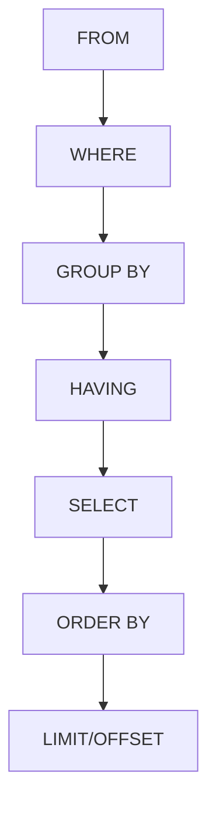

# PostgreSQL SELECT

The SELECT statement is the most fundamental query in PostgreSQL and SQL in general. It allows you to retrieve data from one or more tables in your database.

## Introduction

When working with databases, retrieving data is one of the most common operations. The SELECT statement is used to fetch data from a database table, which returns data in the form of result sets. As a beginner, mastering the SELECT statement is your first step toward becoming proficient in database querying.

## Basic Syntax

The basic syntax of a SELECT statement is:

```sql
SELECT column1, column2, ...
FROM table_name;
```

Let's break down what each part means:

- `SELECT`: The keyword that indicates you want to retrieve data
- `column1, column2, ...`: The names of the columns you want to retrieve
- `FROM`: Keyword that specifies which table to query
- `table_name`: The name of the table containing the data

## Retrieving All Columns

To retrieve all columns from a table, you can use the asterisk (`*`) wildcard:

```sql
SELECT * FROM table_name;
```

### Example

Imagine we have a table called `employees` with the following data:

```
id | first_name | last_name | hire_date  | salary
---+------------+-----------+------------+--------
1  | John       | Smith     | 2020-01-15 | 55000
2  | Mary       | Johnson   | 2019-10-20 | 60000
3  | James      | Williams  | 2021-03-10 | 52000
```

To retrieve all data from this table:

```sql
SELECT * FROM employees;
```

Output:
```
id | first_name | last_name | hire_date  | salary
---+------------+-----------+------------+--------
1  | John       | Smith     | 2020-01-15 | 55000
2  | Mary       | Johnson   | 2019-10-20 | 60000
3  | James      | Williams  | 2021-03-10 | 52000
```

## Selecting Specific Columns

Often, you only need certain columns from a table. Specifying exactly which columns you need is more efficient:

```sql
SELECT first_name, last_name FROM employees;
```

Output:
```
first_name | last_name
-----------+----------
John       | Smith
Mary       | Johnson
James      | Williams
```

## Column Aliases

You can rename columns in your result set using aliases with the `AS` keyword:

```sql
SELECT 
    first_name AS "First Name",
    last_name AS "Last Name"
FROM employees;
```

Output:
```
First Name | Last Name
-----------+----------
John       | Smith
Mary       | Johnson
James      | Williams
```

The `AS` keyword is optional, but it makes your queries more readable:

```sql
SELECT first_name "First Name", last_name "Last Name" FROM employees;
```

## Filtering Data with WHERE

The `WHERE` clause allows you to filter results based on specified conditions:

```sql
SELECT * FROM employees WHERE salary > 55000;
```

Output:
```
id | first_name | last_name | hire_date  | salary
---+------------+-----------+------------+--------
2  | Mary       | Johnson   | 2019-10-20 | 60000
```

## Sorting Results with ORDER BY

The `ORDER BY` clause sorts your results based on one or more columns:

```sql
SELECT * FROM employees ORDER BY salary DESC;
```

Output:
```
id | first_name | last_name | hire_date  | salary
---+------------+-----------+------------+--------
2  | Mary       | Johnson   | 2019-10-20 | 60000
1  | John       | Smith     | 2020-01-15 | 55000
3  | James      | Williams  | 2021-03-10 | 52000
```

You can sort by multiple columns:

```sql
SELECT * FROM employees ORDER BY salary DESC, last_name ASC;
```

## Removing Duplicates with DISTINCT

The `DISTINCT` keyword removes duplicate values from your results:

```sql
SELECT DISTINCT department FROM employees;
```

If our employees table had a department column with values like:
```
department
-----------
Sales
Marketing
Sales
IT
Marketing
```

The query would return:
```
department
-----------
Sales
Marketing
IT
```

## Limiting Results

The `LIMIT` clause restricts the number of rows returned:

```sql
SELECT * FROM employees LIMIT 2;
```

Output:
```
id | first_name | last_name | hire_date  | salary
---+------------+-----------+------------+--------
1  | John       | Smith     | 2020-01-15 | 55000
2  | Mary       | Johnson   | 2019-10-20 | 60000
```

You can also use `OFFSET` to skip a certain number of rows:

```sql
SELECT * FROM employees LIMIT 2 OFFSET 1;
```

Output:
```
id | first_name | last_name | hire_date  | salary
---+------------+-----------+------------+--------
2  | Mary       | Johnson   | 2019-10-20 | 60000
3  | James      | Williams  | 2021-03-10 | 52000
```

## Using Expressions and Functions

You can use expressions and functions in your SELECT statements:

```sql
SELECT 
    first_name,
    last_name,
    salary,
    salary * 1.1 AS increased_salary,
    EXTRACT(YEAR FROM hire_date) AS hire_year
FROM employees;
```

Output:
```
first_name | last_name | salary | increased_salary | hire_year
-----------+-----------+--------+------------------+----------
John       | Smith     | 55000  | 60500           | 2020
Mary       | Johnson   | 60000  | 66000           | 2019
James      | Williams  | 52000  | 57200           | 2021
```

## Conditional Logic with CASE

The `CASE` expression adds conditional logic to your queries:

```sql
SELECT 
    first_name,
    last_name,
    salary,
    CASE
        WHEN salary < 55000 THEN 'Low'
        WHEN salary BETWEEN 55000 AND 65000 THEN 'Medium'
        ELSE 'High'
    END AS salary_category
FROM employees;
```

Output:
```
first_name | last_name | salary | salary_category
-----------+-----------+--------+----------------
John       | Smith     | 55000  | Medium
Mary       | Johnson   | 60000  | Medium
James      | Williams  | 52000  | Low
```

## The Query Execution Flow

Understanding the order in which PostgreSQL processes a query helps with writing effective queries:



Remember that PostgreSQL evaluates these clauses in this order, not in the order you write them.

## Real-World Examples

### Example 1: Customer Analysis

Imagine we have a `customers` table in an e-commerce database:

```sql
SELECT 
    customer_id,
    first_name,
    last_name,
    EXTRACT(YEAR FROM AGE(CURRENT_DATE, birth_date)) AS age,
    CASE
        WHEN (CURRENT_DATE - last_purchase_date) <= 30 THEN 'Active'
        WHEN (CURRENT_DATE - last_purchase_date) <= 90 THEN 'Recent'
        ELSE 'Inactive'
    END AS customer_status
FROM customers
WHERE country = 'USA'
ORDER BY last_purchase_date DESC
LIMIT 100;
```

This query:
1. Calculates each customer's age using the `AGE` function
2. Categorizes customers based on their last purchase date
3. Filters for US customers only
4. Orders by most recent purchases
5. Limits to 100 records

### Example 2: Product Performance Analysis

```sql
SELECT 
    c.category_name,
    COUNT(p.product_id) AS product_count,
    ROUND(AVG(p.price), 2) AS avg_price,
    MIN(p.price) AS min_price,
    MAX(p.price) AS max_price
FROM products p
JOIN categories c ON p.category_id = c.category_id
WHERE p.is_active = TRUE
GROUP BY c.category_name
ORDER BY product_count DESC;
```

This query:
1. Joins the `products` and `categories` tables
2. Filters for active products only
3. Groups the results by category
4. Calculates statistics for each category
5. Orders the results by product count

## Common Mistakes to Avoid

1. **Selecting unnecessary columns**: Always select only the columns you need, not `*` in production code
2. **Missing WHERE clauses**: Always include a WHERE clause for large tables to avoid retrieving too many rows
3. **Forgetting table aliases**: When querying multiple tables, use meaningful aliases for readability
4. **Ignoring indexes**: Queries run faster when you filter and sort by indexed columns

## Summary

The PostgreSQL SELECT statement is the foundation of database querying. In this lesson, you've learned:

- The basic syntax for retrieving data
- How to select specific columns and use aliases
- Filtering data with WHERE
- Sorting with ORDER BY
- Removing duplicates with DISTINCT
- Limiting results with LIMIT and OFFSET
- Using expressions, functions, and conditional logic
- Real-world applications of SELECT queries

Mastering the SELECT statement is your first step to becoming proficient in SQL and database manipulation.

## Exercises

1. Create a table called `products` with columns for `id`, `name`, `price`, and `category`.
2. Insert at least 10 sample products.
3. Write a SELECT query to find:
   - All products costing more than $50
   - The most expensive product in each category
   - Products with "phone" in their name, regardless of case
   - The average price of all products

## Additional Resources

- [PostgreSQL Official Documentation on SELECT](https://www.postgresql.org/docs/current/sql-select.html)
- [PostgreSQL Tutorial](https://www.postgresqltutorial.com/postgresql-select/)
- [PostgreSQL Exercises](https://pgexercises.com/)

Remember that practice is key to mastering SQL queries. Try these concepts in a test database to reinforce your learning!