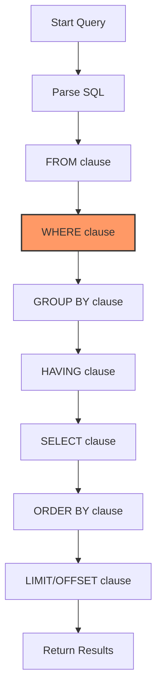

# PostgreSQL WHERE

The WHERE clause is a fundamental component of PostgreSQL queries that allows you to filter results based on specific conditions. Think of it as a way to tell the database, "I only want to see rows that meet these criteria."

## Introduction

When working with databases, you often need to retrieve only a subset of data that matches certain conditions. The WHERE clause serves exactly this purpose by providing a powerful mechanism to filter query results. Without the WHERE clause, your queries would return all rows from a table, which isn't practical in real-world applications.

## Basic Syntax

The basic syntax of the WHERE clause is:

```sql
SELECT column1, column2, ...
FROM table_name
WHERE condition;
```

The condition is a boolean expression that evaluates to TRUE, FALSE, or NULL for each row in the table. Only rows for which the condition evaluates to TRUE are included in the result set.

## Simple Comparisons

Let's start with simple comparisons using the following operators:

- Equal to: `=`
- Not equal to: `<>` or `!=`
- Greater than: `>`
- Less than: `<`
- Greater than or equal to: `>=`
- Less than or equal to: `<=`

### Example: Basic Filtering

Consider we have a `products` table with the following data:

```sql
CREATE TABLE products (
    product_id SERIAL PRIMARY KEY,
    product_name VARCHAR(100) NOT NULL,
    category VARCHAR(50),
    price DECIMAL(10, 2),
    stock_quantity INTEGER
);

INSERT INTO products (product_name, category, price, stock_quantity) VALUES
('Laptop', 'Electronics', 1200.00, 15),
('Smartphone', 'Electronics', 800.00, 25),
('Desk Chair', 'Furniture', 120.00, 10),
('Coffee Table', 'Furniture', 250.00, 5),
('Headphones', 'Electronics', 150.00, 30),
('Notebook', 'Stationery', 4.99, 100),
('Pen Set', 'Stationery', 12.50, 50);
```

To find all products in the 'Electronics' category:

```sql
SELECT product_name, price
FROM products
WHERE category = 'Electronics';
```

Result:

```
 product_name | price
--------------+--------
 Laptop       | 1200.00
 Smartphone   | 800.00
 Headphones   | 150.00
```

To find products that cost more than $200:

```sql
SELECT product_name, category, price
FROM products
WHERE price > 200;
```

Result:

```
 product_name | category    | price
--------------+-------------+--------
 Laptop       | Electronics | 1200.00
 Smartphone   | Electronics | 800.00
 Coffee Table | Furniture   | 250.00
```

## Logical Operators

You can combine multiple conditions using logical operators:

- AND: Both conditions must be true
- OR: At least one condition must be true
- NOT: Negates a condition

### Example: Using AND, OR, and NOT

Find electronics products that cost less than $200:

```sql
SELECT product_name, price
FROM products
WHERE category = 'Electronics' AND price < 200;
```

Result:

```
 product_name | price
--------------+--------
 Headphones   | 150.00
```

Find products that are either electronics or cost more than $200:

```sql
SELECT product_name, category, price
FROM products
WHERE category = 'Electronics' OR price > 200;
```

Result:

```
 product_name | category    | price
--------------+-------------+--------
 Laptop       | Electronics | 1200.00
 Smartphone   | Electronics | 800.00
 Coffee Table | Furniture   | 250.00
 Headphones   | Electronics | 150.00
```

Find all products except those in the 'Stationery' category:

```sql
SELECT product_name, category
FROM products
WHERE NOT category = 'Stationery';
```

Result:

```
 product_name | category
--------------+-------------
 Laptop       | Electronics
 Smartphone   | Electronics
 Desk Chair   | Furniture
 Coffee Table | Furniture
 Headphones   | Electronics
```

## Between Operator

The BETWEEN operator selects values within a given range (inclusive).

```sql
SELECT product_name, price
FROM products
WHERE price BETWEEN 100 AND 300;
```

Result:

```
 product_name | price
--------------+--------
 Desk Chair   | 120.00
 Coffee Table | 250.00
 Headphones   | 150.00
```

## IN Operator

The IN operator allows you to specify multiple values in a WHERE clause.

```sql
SELECT product_name, category
FROM products
WHERE category IN ('Electronics', 'Furniture');
```

Result:

```
 product_name | category
--------------+-------------
 Laptop       | Electronics
 Smartphone   | Electronics
 Desk Chair   | Furniture
 Coffee Table | Furniture
 Headphones   | Electronics
```

## LIKE Operator for Pattern Matching

The LIKE operator is used for pattern matching with wildcard characters:
- `%` represents zero, one, or multiple characters
- `_` represents a single character

Find products whose names start with 'L':

```sql
SELECT product_name
FROM products
WHERE product_name LIKE 'L%';
```

Result:

```
 product_name
--------------
 Laptop
```

Find products with 'Table' in their name:

```sql
SELECT product_name
FROM products
WHERE product_name LIKE '%Table%';
```

Result:

```
 product_name
--------------
 Coffee Table
```

## IS NULL and IS NOT NULL

To find rows where a column value is NULL or NOT NULL:

```sql
-- Assuming some products might have NULL categories
SELECT product_name
FROM products
WHERE category IS NULL;

SELECT product_name
FROM products
WHERE category IS NOT NULL;
```

## Working with Dates

PostgreSQL provides powerful date filtering capabilities:

```sql
-- Assuming we have an orders table with order_date column
CREATE TABLE orders (
    order_id SERIAL PRIMARY KEY,
    product_id INTEGER REFERENCES products(product_id),
    order_date DATE NOT NULL,
    quantity INTEGER,
    total_amount DECIMAL(10, 2)
);

INSERT INTO orders (product_id, order_date, quantity, total_amount) VALUES
(1, '2023-09-01', 1, 1200.00),
(2, '2023-09-05', 2, 1600.00),
(3, '2023-09-10', 1, 120.00),
(5, '2023-10-01', 3, 450.00),
(6, '2023-10-05', 10, 49.90);

-- Find orders from September 2023
SELECT order_id, order_date, total_amount
FROM orders
WHERE order_date BETWEEN '2023-09-01' AND '2023-09-30';
```

Result:

```
 order_id | order_date | total_amount
----------+------------+--------------
        1 | 2023-09-01 |      1200.00
        2 | 2023-09-05 |      1600.00
        3 | 2023-09-10 |       120.00
```

## Real-world Application Examples

### Example 1: E-commerce Product Filtering

Imagine an e-commerce platform where users can filter products by various criteria:

```sql
-- Find affordable electronics with sufficient stock
SELECT product_name, price, stock_quantity
FROM products
WHERE category = 'Electronics'
  AND price < 500
  AND stock_quantity > 10
ORDER BY price;
```

Result:

```
 product_name | price  | stock_quantity
--------------+--------+----------------
 Headphones   | 150.00 |             30
```

### Example 2: Order Analysis

```sql
-- Find high-value orders placed in October 2023
SELECT o.order_id, p.product_name, o.order_date, o.total_amount
FROM orders o
JOIN products p ON o.product_id = p.product_id
WHERE o.order_date >= '2023-10-01'
  AND o.order_date < '2023-11-01'
  AND o.total_amount > 100
ORDER BY o.total_amount DESC;
```

Result:

```
 order_id | product_name | order_date | total_amount
----------+--------------+------------+--------------
        4 | Headphones   | 2023-10-01 |       450.00
```

### Example 3: Inventory Management

```sql
-- Find products that need restocking (low inventory)
SELECT product_name, category, stock_quantity
FROM products
WHERE stock_quantity < 10
ORDER BY stock_quantity;
```

Result:

```
 product_name | category  | stock_quantity
--------------+-----------+----------------
 Coffee Table | Furniture |              5
```

## Performance Considerations

The WHERE clause directly impacts query performance. Here are some best practices:

1. **Use indexes**: Columns used in WHERE conditions should typically be indexed.
2. **Avoid functions on indexed columns**: Using functions on indexed columns in WHERE clauses can prevent index usage.
3. **Use appropriate data types**: Comparing columns with values of the correct data type avoids implicit conversions.

For example, if `product_name` is frequently used in WHERE clauses:

```sql
-- Create an index to improve performance
CREATE INDEX idx_products_name ON products(product_name);
```

## Common Mistakes to Avoid

1. **Using = with NULL**: Always use `IS NULL` or `IS NOT NULL` instead of `= NULL`.
2. **Forgetting quotes around string values**: String literals must be enclosed in quotes.
3. **Case sensitivity**: String comparisons in PostgreSQL are case-sensitive by default.

## Flow Diagram of Query Execution



The diagram shows that the WHERE clause is applied early in the query execution process, which helps eliminate rows before other operations take place, improving efficiency.

## Summary

The WHERE clause is essential for filtering data in PostgreSQL queries. Key points to remember:

- Use comparison operators (`=`, `<>`, `>`, `<`, `>=`, `<=`) for basic filtering
- Combine conditions with logical operators (`AND`, `OR`, `NOT`)
- Use `BETWEEN` for range checks, `IN` for multiple values, and `LIKE` for pattern matching
- Remember `IS NULL` and `IS NOT NULL` for checking NULL values
- Consider indexing columns frequently used in WHERE clauses for better performance

## Exercises

1. Create a table of `employees` with columns for `employee_id`, `name`, `department`, `salary`, and `hire_date`.
2. Insert at least 10 sample records with varied data.
3. Write a query to find all employees in the 'IT' department.
4. Write a query to find employees hired between '2022-01-01' and '2022-06-30'.
5. Write a query to find employees with a salary greater than $60,000 who are NOT in the 'Management' department.
6. Write a query to find employees whose names start with 'J' or 'M'.
7. Write a complex query combining at least three different conditions using AND and OR operators.

## Additional Resources

- [PostgreSQL Official Documentation on WHERE Clause](https://www.postgresql.org/docs/current/sql-select.html#SQL-WHERE)
- [PostgreSQL Pattern Matching](https://www.postgresql.org/docs/current/functions-matching.html)
- [PostgreSQL Performance Optimization](https://www.postgresql.org/docs/current/performance-tips.html)