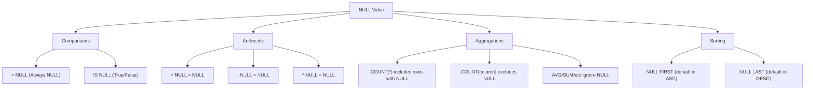

# PostgreSQL NULL Values

## Introduction

In database systems, including PostgreSQL, we often encounter situations where data is unknown, missing, or not applicable. This is where the concept of `NULL` comes in. Unlike zero, an empty string, or any other value, `NULL` represents the absence of a value. Understanding how `NULL` values work in PostgreSQL is fundamental to writing effective queries and managing your data properly.

In this tutorial, we'll explore:
- What `NULL` values are and why they're important
- How `NULL` behaves in different operations and comparisons
- Practical ways to handle `NULL` values in your queries
- Best practices for dealing with `NULL` in database design

## What is NULL?

`NULL` in PostgreSQL is a special marker that represents:
- An unknown value
- A missing value
- A value that is not applicable

It's important to understand that `NULL` is not zero, an empty string, or any other value - it's the absence of a value altogether.

## Key Properties of NULL Values

### NULL is not equal to anything, even itself

One of the most confusing aspects of `NULL` for beginners is that it doesn't follow the normal rules of equality:

```sql
SELECT NULL = NULL;
```

**Output:**
```
 ?column? 
----------
 
(1 row)
```

The result is neither true nor false - it's `NULL`! This demonstrates an important principle: when we compare `NULL` to any value (even another `NULL`), the result is `NULL`, not true or false.

### NULL in Boolean Logic

PostgreSQL uses three-valued logic when dealing with `NULL`:
- True
- False
- Unknown (NULL)

Consider these examples:

```sql
SELECT TRUE AND NULL;
SELECT FALSE AND NULL;
SELECT TRUE OR NULL;
SELECT FALSE OR NULL;
```

**Output:**
```
 ?column? 
----------
 
(1 row)

 ?column? 
----------
 f
(1 row)

 ?column? 
----------
 t
(1 row)

 ?column? 
----------
 
(1 row)
```

This logic can sometimes lead to unexpected results in queries.

## Checking for NULL Values

Since we can't use the standard equality operator (`=`) to check for `NULL`, PostgreSQL provides special operators:

```sql
-- Incorrect way to check for NULL
SELECT * FROM users WHERE email = NULL;

-- Correct ways to check for NULL
SELECT * FROM users WHERE email IS NULL;
SELECT * FROM users WHERE email IS NOT NULL;
```

Let's see this in practice with a sample `users` table:

```sql
CREATE TABLE users (
    id SERIAL PRIMARY KEY,
    name VARCHAR(100) NOT NULL,
    email VARCHAR(100),
    signup_date DATE
);

INSERT INTO users (name, email, signup_date) VALUES
('John Doe', 'john@example.com', '2023-01-15'),
('Jane Smith', NULL, '2023-02-10'),
('Bob Johnson', 'bob@example.com', NULL),
('Alice Brown', NULL, NULL);

-- Find all users with missing email
SELECT id, name FROM users WHERE email IS NULL;
```

**Output:**
```
 id |    name     
----+-------------
  2 | Jane Smith
  4 | Alice Brown
(2 rows)
```

## NULL in Arithmetic Operations

When any value is combined with `NULL` in an arithmetic operation, the result is `NULL`:

```sql
SELECT 5 + NULL;
SELECT NULL * 10;
SELECT 100 / NULL;
```

**Output:**
```
 ?column? 
----------
 
(1 row)

 ?column? 
----------
 
(1 row)

 ?column? 
----------
 
(1 row)
```

This behavior has important implications when performing calculations on columns that might contain `NULL` values.

## Handling NULL Values in Queries

### The COALESCE Function

`COALESCE` returns the first non-NULL value from a list of expressions. It's extremely useful for providing default values:

```sql
-- Calculate total users and users with email
SELECT 
    COUNT(*) AS total_users,
    COUNT(email) AS users_with_email,
    COUNT(*) - COUNT(email) AS users_without_email
FROM users;

-- Use COALESCE to replace NULL emails with 'Not Provided'
SELECT 
    name, 
    COALESCE(email, 'Not Provided') AS contact_email
FROM users;
```

**Output of the second query:**
```
    name     |    contact_email    
-------------+--------------------
 John Doe    | john@example.com
 Jane Smith  | Not Provided
 Bob Johnson | bob@example.com
 Alice Brown | Not Provided
(4 rows)
```

### The NULLIF Function

`NULLIF` compares two expressions and returns `NULL` if they're equal, otherwise returns the first expression. This is useful for avoiding division by zero errors:

```sql
-- Without NULLIF (would cause division by zero error)
-- SELECT 100 / 0;

-- With NULLIF (returns NULL instead of error)
SELECT 100 / NULLIF(0, 0);
```

**Output:**
```
 ?column? 
----------
 
(1 row)
```

### The IS DISTINCT FROM Operator

When you need to compare values and treat `NULL` values as equal to each other, use `IS DISTINCT FROM`:

```sql
-- Standard equality
SELECT 
    CASE WHEN NULL = NULL THEN 'Equal' ELSE 'Not Equal' END AS standard_equality;

-- Using IS DISTINCT FROM
SELECT 
    CASE WHEN NULL IS NOT DISTINCT FROM NULL THEN 'Equal' ELSE 'Not Equal' END AS nulls_compared;
```

**Output:**
```
 standard_equality 
------------------
 Not Equal
(1 row)

 nulls_compared 
---------------
 Equal
(1 row)
```

## NULL in Aggregate Functions

Most aggregate functions in PostgreSQL ignore `NULL` values:

```sql
CREATE TABLE products (
    id SERIAL PRIMARY KEY,
    name VARCHAR(100),
    price DECIMAL(10, 2)
);

INSERT INTO products (name, price) VALUES
('Laptop', 999.99),
('Phone', 499.99),
('Tablet', NULL),
('Headphones', 89.99),
('Smartwatch', NULL);

-- COUNT with and without NULL values
SELECT 
    COUNT(*) AS total_products,
    COUNT(price) AS products_with_price,
    AVG(price) AS average_price
FROM products;
```

**Output:**
```
 total_products | products_with_price | average_price 
----------------+---------------------+---------------
              5 |                   3 |       529.99
(1 row)
```

Notice that:
- `COUNT(*)` counts all rows (5)
- `COUNT(price)` counts only non-NULL prices (3)
- `AVG(price)` calculates the average of only non-NULL prices

## NULL in Sorting (ORDER BY)

In PostgreSQL, `NULL` values are treated as "higher" than any non-NULL value by default when sorting in ascending order:

```sql
-- Default NULL handling in ORDER BY
SELECT name, signup_date FROM users ORDER BY signup_date;

-- Controlling NULL position
SELECT name, signup_date FROM users ORDER BY signup_date NULLS FIRST;
SELECT name, signup_date FROM users ORDER BY signup_date NULLS LAST;
```

**Output of the first query:**
```
    name     | signup_date 
-------------+-------------
 John Doe    | 2023-01-15
 Jane Smith  | 2023-02-10
 Bob Johnson | 
 Alice Brown | 
(4 rows)
```

## Real-World Examples

### Example 1: User Activity Report

Imagine we need to create a report of user activity, handling missing data appropriately:

```sql
CREATE TABLE user_activity (
    user_id INT,
    last_login TIMESTAMP,
    total_logins INT,
    premium_member BOOLEAN
);

INSERT INTO user_activity VALUES
(1, '2023-03-15 10:30:00', 45, TRUE),
(2, '2023-03-10 08:15:00', 12, FALSE),
(3, NULL, 0, FALSE),
(4, '2023-03-01 14:20:00', NULL, TRUE),
(5, NULL, NULL, NULL);

-- Comprehensive report with NULL handling
SELECT 
    user_id,
    COALESCE(TO_CHAR(last_login, 'YYYY-MM-DD'), 'Never logged in') AS last_login_date,
    COALESCE(total_logins, 0) AS login_count,
    CASE 
        WHEN premium_member IS NULL THEN 'Unknown status'
        WHEN premium_member = TRUE THEN 'Premium'
        ELSE 'Basic'
    END AS membership
FROM user_activity
ORDER BY 
    last_login IS NULL, 
    last_login DESC;
```

**Output:**
```
 user_id |  last_login_date  | login_count |  membership  
---------+-------------------+-------------+--------------
       1 | 2023-03-15        |          45 | Premium
       2 | 2023-03-10        |          12 | Basic
       4 | 2023-03-01        |           0 | Premium
       3 | Never logged in   |           0 | Basic
       5 | Never logged in   |           0 | Unknown status
(5 rows)
```

### Example 2: Finding Incomplete Records

```sql
CREATE TABLE customer_orders (
    order_id INT PRIMARY KEY,
    customer_id INT,
    product_id INT,
    quantity INT,
    order_date DATE,
    shipping_date DATE
);

INSERT INTO customer_orders VALUES
(1, 101, 201, 2, '2023-03-01', '2023-03-03'),
(2, 102, 202, 1, '2023-03-02', NULL),
(3, 103, NULL, 3, '2023-03-02', NULL),
(4, NULL, 204, 1, '2023-03-03', '2023-03-05'),
(5, 105, 205, NULL, '2023-03-04', NULL);

-- Find orders with missing information
SELECT 
    order_id,
    CASE
        WHEN customer_id IS NULL THEN 'Missing customer'
        WHEN product_id IS NULL THEN 'Missing product'
        WHEN quantity IS NULL THEN 'Missing quantity'
        WHEN shipping_date IS NULL THEN 'Not shipped yet'
        ELSE 'Complete'
    END AS order_status
FROM customer_orders;
```

**Output:**
```
 order_id |   order_status   
----------+------------------
        1 | Complete
        2 | Not shipped yet
        3 | Missing product
        4 | Missing customer
        5 | Missing quantity
(5 rows)
```

## Best Practices for Working with NULL Values

1. **Be Explicit About NULL Handling**: Always use the proper operators (`IS NULL`, `IS NOT NULL`) when checking for NULL values.

2. **Use COALESCE for Default Values**: When displaying or calculating with potentially NULL columns, use `COALESCE` to provide sensible defaults.

3. **Consider NOT NULL Constraints**: For columns that should always have a value, use the `NOT NULL` constraint in your table definitions.

4. **Be Careful with Joins**: NULL values in join columns can lead to unexpected results. Consider using `COALESCE` or `IS NOT DISTINCT FROM` in join conditions if NULL handling is important.

5. **Think About NULL Semantics**: Decide what NULL really means in your context - is it "unknown," "not applicable," or "not yet provided"? This can inform your handling strategy.

```sql
-- Example of NOT NULL constraint
CREATE TABLE contacts (
    id SERIAL PRIMARY KEY,
    name VARCHAR(100) NOT NULL,  -- name must be provided
    email VARCHAR(100),          -- email can be NULL
    phone VARCHAR(20)            -- phone can be NULL
);

-- Ensure at least one contact method exists
ALTER TABLE contacts ADD CONSTRAINT check_contact 
CHECK (email IS NOT NULL OR phone IS NOT NULL);
```

## Visualizing NULL in Database Operations

Here's a diagram showing how NULL values affect different operations:



## Summary

Understanding and properly handling `NULL` values in PostgreSQL is crucial for:
- Writing accurate queries that handle missing data properly
- Avoiding unexpected results in comparisons and calculations
- Creating robust database designs

Key points to remember:
- `NULL` represents unknown or missing data
- `NULL` is not equal to anything, not even another `NULL`
- Use `IS NULL` and `IS NOT NULL` to check for `NULL` values
- Functions like `COALESCE` help provide defaults for `NULL` values
- Most aggregate functions ignore `NULL` values
- `NULL` is sorted differently and can be controlled with `NULLS FIRST`/`NULLS LAST`

## Exercises for Practice

1. Create a table with columns that allow `NULL` values and practice inserting and querying rows with `NULL`s.
2. Write a query that uses `COALESCE` to replace `NULL` values with meaningful defaults.
3. Experiment with filtering data using both `WHERE column = NULL` and `WHERE column IS NULL` to see the difference.
4. Create a report that handles `NULL` values appropriately using techniques from this tutorial.
5. Implement a constraint that enforces business rules about when `NULL` is or isn't acceptable in certain columns.

## Additional Resources

- [PostgreSQL Documentation on NULL Values](https://www.postgresql.org/docs/current/functions-comparison.html)
- [Three-Valued Logic in SQL](https://en.wikipedia.org/wiki/Three-valued_logic)
- [PostgreSQL COALESCE Function](https://www.postgresql.org/docs/current/functions-conditional.html#FUNCTIONS-COALESCE-NVL-IFNULL)