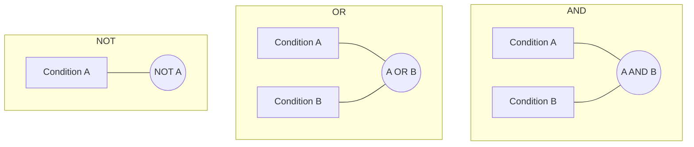

# PostgreSQL AND OR NOT

## Introduction

When querying a database with PostgreSQL, you often need to filter data based on multiple conditions. The logical operators `AND`, `OR`, and `NOT` are essential tools that allow you to combine and modify conditions within your `WHERE` clause to create precise filters for your queries.

- **AND**: Returns rows that satisfy all specified conditions
- **OR**: Returns rows that satisfy at least one of the specified conditions
- **NOT**: Negates a condition, returning rows that do not satisfy it

In this guide, we'll explore how to use these logical operators to create more powerful and flexible queries in PostgreSQL.

## The AND Operator

The `AND` operator is used when you want to retrieve rows that satisfy multiple conditions simultaneously. It returns `TRUE` only when all conditions evaluate to `TRUE`.

### Syntax

```sql
SELECT column1, column2, ...
FROM table_name
WHERE condition1 AND condition2 AND condition3 ...;
```

### Example: Finding Specific Products

Let's say we have a `products` table with information about items in an online store:

```sql
CREATE TABLE products (
    product_id SERIAL PRIMARY KEY,
    product_name VARCHAR(100),
    category VARCHAR(50),
    price DECIMAL(10, 2),
    in_stock BOOLEAN,
    rating DECIMAL(3, 1)
);

INSERT INTO products (product_name, category, price, in_stock, rating)
VALUES 
    ('Laptop Pro', 'Electronics', 1299.99, true, 4.5),
    ('Wireless Mouse', 'Electronics', 24.99, true, 4.2),
    ('Coffee Maker', 'Home', 89.99, true, 4.7),
    ('Desk Lamp', 'Home', 34.99, false, 3.9),
    ('Bluetooth Speaker', 'Electronics', 59.99, true, 4.0),
    ('Yoga Mat', 'Fitness', 29.99, true, 4.8),
    ('Protein Powder', 'Fitness', 54.99, false, 4.3);
```

To find all electronic products that are in stock and cost less than $100:

```sql
SELECT product_name, price
FROM products
WHERE category = 'Electronics' AND price < 100 AND in_stock = true;
```

Result:

```
   product_name    | price 
------------------+-------
 Wireless Mouse   | 24.99
 Bluetooth Speaker | 59.99
```

This query returns only products that satisfy all three conditions: they must be in the 'Electronics' category, cost less than $100, and be in stock.

## The OR Operator

The `OR` operator retrieves rows that satisfy at least one of the specified conditions. It returns `TRUE` if any of the conditions evaluate to `TRUE`.

### Syntax

```sql
SELECT column1, column2, ...
FROM table_name
WHERE condition1 OR condition2 OR condition3 ...;
```

### Example: Finding Products in Multiple Categories

Using our `products` table from the previous example, to find all products that are either in the 'Home' or 'Fitness' category:

```sql
SELECT product_name, category, price
FROM products
WHERE category = 'Home' OR category = 'Fitness';
```

Result:

```
   product_name   | category | price 
-----------------+----------+-------
 Coffee Maker    | Home     | 89.99
 Desk Lamp       | Home     | 34.99
 Yoga Mat        | Fitness  | 29.99
 Protein Powder  | Fitness  | 54.99
```

This query returns products that are in either the 'Home' category OR the 'Fitness' category.

## The NOT Operator

The `NOT` operator negates a condition, returning rows that do not satisfy the specified condition.

### Syntax

```sql
SELECT column1, column2, ...
FROM table_name
WHERE NOT condition;
```

### Example: Finding Products Not in Stock

To find all products that are not in stock:

```sql
SELECT product_name, category, price
FROM products
WHERE NOT in_stock;
```

Result:

```
   product_name   | category | price 
-----------------+----------+-------
 Desk Lamp       | Home     | 34.99
 Protein Powder  | Fitness  | 54.99
```

This query returns products where the `in_stock` value is not `true`.

An alternative syntax for this query is:

```sql
SELECT product_name, category, price
FROM products
WHERE in_stock = false;
```

## Combining Logical Operators

You can combine multiple logical operators to create complex conditions. When combining operators, you should use parentheses to ensure the correct order of evaluation.

### Precedence of Operators

In PostgreSQL, the logical operators have the following precedence (from highest to lowest):
1. `NOT`
2. `AND`
3. `OR`

Using parentheses can help make your queries more readable and ensure they work as intended.

### Example: Complex Query with Multiple Operators

Let's find all products that are either:
- Electronic products with a price less than $100, or
- Non-electronic products that are in stock with a rating above 4.5

```sql
SELECT product_name, category, price, rating
FROM products
WHERE (category = 'Electronics' AND price < 100) 
      OR 
      (category != 'Electronics' AND in_stock = true AND rating > 4.5);
```

Result:

```
   product_name   | category  | price  | rating 
-----------------+-----------+--------+--------
 Wireless Mouse  | Electronics| 24.99  | 4.2
 Bluetooth Speaker| Electronics| 59.99  | 4.0
 Coffee Maker    | Home      | 89.99  | 4.7
 Yoga Mat        | Fitness   | 29.99  | 4.8
```

In this example, parentheses clarify which conditions should be evaluated together.

## Practical Examples

### Example 1: Filtering Customer Data

Let's say you have a `customers` table and want to find all customers who live in New York or California and have made a purchase in the last 30 days:

```sql
SELECT customer_name, state, last_purchase_date
FROM customers
WHERE (state = 'NY' OR state = 'CA') 
      AND 
      last_purchase_date >= CURRENT_DATE - INTERVAL '30 days';
```

### Example 2: Finding Products for a Promotion

A store wants to run a clearance sale on expensive electronics that aren't selling well:

```sql
SELECT product_name, price, stock_quantity
FROM products
WHERE category = 'Electronics' 
      AND 
      price > 500 
      AND 
      (stock_quantity > 20 OR NOT featured_item);
```

### Example 3: Filtering Orders with Complex Conditions

Find all orders that are either high-value or were placed by VIP customers but have not been shipped yet:

```sql
SELECT order_id, customer_id, order_amount, order_status
FROM orders
WHERE (order_amount > 1000 OR customer_type = 'VIP') 
      AND 
      NOT order_status = 'Shipped';
```

## Visual Representation of Logical Operators

Here's a visual representation of how logical operators work with sets:



## Common Mistakes and Best Practices

### Mistake 1: Forgetting Parentheses

Without proper parentheses, the query might not behave as expected:

```sql
-- This might not give the intended results
SELECT * FROM products
WHERE category = 'Electronics' OR category = 'Home' AND price < 50;
```

In this case, due to operator precedence, the `AND` operation is performed first, then the `OR`. This returns all electronics products (regardless of price) plus home products under $50.

The correct way to get all products in either category that are under $50:

```sql
-- Correct with parentheses
SELECT * FROM products
WHERE (category = 'Electronics' OR category = 'Home') AND price < 50;
```

### Mistake 2: Double Negatives

Double negatives can be confusing and error-prone:

```sql
-- Avoid
SELECT * FROM products
WHERE NOT price NOT BETWEEN 10 AND 50;
```

Instead, rewrite as:

```sql
-- Better
SELECT * FROM products
WHERE price BETWEEN 10 AND 50;
```

### Best Practice 1: Use IN for Multiple OR Conditions

When checking a column against multiple values, use the `IN` operator instead of multiple `OR` conditions:

```sql
-- Instead of this
SELECT * FROM products
WHERE category = 'Electronics' OR category = 'Home' OR category = 'Fitness';

-- Use this
SELECT * FROM products
WHERE category IN ('Electronics', 'Home', 'Fitness');
```

### Best Practice 2: Use BETWEEN for Range Checks

For checking if a value falls within a range:

```sql
-- Instead of this
SELECT * FROM products
WHERE price >= 100 AND price <= 500;

-- Use this
SELECT * FROM products
WHERE price BETWEEN 100 AND 500;
```

## Summary

The logical operators `AND`, `OR`, and `NOT` are powerful tools in PostgreSQL that allow you to create complex conditions in your queries:

- **AND**: Use to find rows that match all specified conditions
- **OR**: Use to find rows that match at least one of the specified conditions
- **NOT**: Use to negate a condition and find rows that don't match

Remember to use parentheses to control the order of evaluation when combining multiple logical operators, and consider using shorthand alternatives like `IN` and `BETWEEN` when appropriate.

## Exercises

To practice using logical operators in PostgreSQL:

1. Write a query to find all products that cost between $25 and $100 and are either in the 'Electronics' or 'Home' category.

2. Write a query to find customers who have not made a purchase in the last 90 days and live in a state that is not 'NY', 'CA', or 'TX'.

3. Write a query to find all orders that were placed either by VIP customers with a total amount less than $100 or by regular customers with a total amount greater than $200.

4. For a given `employees` table, find all employees who are either in the 'Sales' department with more than 5 years of experience or in any other department with more than 10 years of experience.

5. Create a complex query using all three logical operators (`AND`, `OR`, `NOT`) to filter data from a database table of your choice.

## Additional Resources

- [PostgreSQL Documentation on Logical Operators](https://www.postgresql.org/docs/current/functions-logical.html)
- [PostgreSQL WHERE Clause](https://www.postgresql.org/docs/current/sql-select.html#SQL-WHERE)
- [Boolean Data Type in PostgreSQL](https://www.postgresql.org/docs/current/datatype-boolean.html)