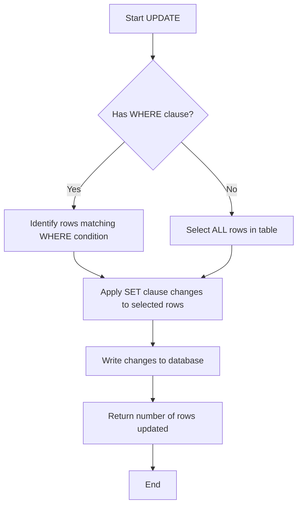

# PostgreSQL UPDATE

## Introduction

The `UPDATE` statement is one of the fundamental data manipulation language (DML) commands in PostgreSQL. It allows you to modify existing data in your database tables. Whether you need to correct errors, refresh values, or implement business logic changes, mastering the `UPDATE` statement is essential for effective database management.

In this tutorial, you'll learn how to:
- Understand the basic syntax of the `UPDATE` statement
- Modify data in single and multiple columns
- Use conditions to target specific rows
- Apply more advanced update techniques
- Follow best practices to avoid common pitfalls

## Basic UPDATE Syntax

The basic syntax of the PostgreSQL `UPDATE` statement is:

```sql
UPDATE table_name
SET column1 = value1, column2 = value2, ...
WHERE condition;
```

Let's break down each component:

- `UPDATE table_name`: Specifies which table you want to modify
- `SET column = value`: Defines which columns to update and their new values
- `WHERE condition`: Optional clause that determines which rows to update

> ⚠️ **Important**: If you omit the `WHERE` clause, the update will affect ALL rows in the table!

## Simple UPDATE Examples

### Example 1: Update a Single Column

Let's say we have a `customers` table and we need to update a customer's email address:

```sql
-- Before the update
SELECT * FROM customers WHERE customer_id = 101;
```

Output:
```
 customer_id |    name    |        email        | signup_date
-------------+------------+---------------------+------------
         101 | John Smith | john.s@example.com  | 2022-03-15
```

Now let's update the email:

```sql
UPDATE customers
SET email = 'john.smith@newdomain.com'
WHERE customer_id = 101;
```

Output:
```
UPDATE 1
```

Checking the result:

```sql
SELECT * FROM customers WHERE customer_id = 101;
```

Output:
```
 customer_id |    name    |           email           | signup_date
-------------+------------+---------------------------+------------
         101 | John Smith | john.smith@newdomain.com  | 2022-03-15
```

### Example 2: Update Multiple Columns

We can update multiple columns in a single UPDATE statement:

```sql
UPDATE customers
SET 
    name = 'John A. Smith',
    email = 'john.a.smith@newdomain.com'
WHERE customer_id = 101;
```

Output:
```
UPDATE 1
```

Result:

```sql
SELECT * FROM customers WHERE customer_id = 101;
```

Output:
```
 customer_id |     name     |            email            | signup_date
-------------+--------------+-----------------------------+------------
         101 | John A. Smith | john.a.smith@newdomain.com | 2022-03-15
```

## Using Conditions with UPDATE

The `WHERE` clause is crucial for targeting specific rows. You can use various comparison operators and logical operators to create precise conditions.

### Example 3: Update Based on Multiple Conditions

```sql
-- Update all products that are both low in stock and in a specific category
UPDATE products
SET price = price * 1.10  -- Increase price by 10%
WHERE 
    stock_quantity < 20 
    AND category = 'Electronics';
```

Output:
```
UPDATE 5  -- 5 rows were updated
```

### Example 4: Using IN Operator

You can update multiple rows that match a list of values:

```sql
-- Update status for multiple orders
UPDATE orders
SET status = 'Shipped'
WHERE order_id IN (1001, 1008, 1013);
```

Output:
```
UPDATE 3
```

## Using Expressions and Functions in UPDATE

You can use expressions, calculations, and PostgreSQL functions within your updates.

### Example 5: Using Arithmetic Operations

```sql
-- Increase all product prices by 5%
UPDATE products
SET price = price * 1.05;
```

### Example 6: Using PostgreSQL Functions

```sql
-- Capitalize all customer names
UPDATE customers
SET name = UPPER(name);
```

### Example 7: Using Current Date/Time Functions

```sql
-- Update the last_updated timestamp for a record
UPDATE inventory
SET last_updated = CURRENT_TIMESTAMP
WHERE product_id = 5001;
```

## Updating with Subqueries

You can use subqueries within your `UPDATE` statements to make more dynamic updates.

### Example 8: UPDATE with Subquery in SET Clause

```sql
-- Update product prices based on their category's average price
UPDATE products p
SET price = (
    SELECT AVG(price) * 1.1  -- 10% above average
    FROM products
    WHERE category = p.category
)
WHERE p.price < 20;
```

### Example 9: UPDATE with Subquery in WHERE Clause

```sql
-- Update customers who have placed orders in the last month
UPDATE customers
SET status = 'Active'
WHERE customer_id IN (
    SELECT DISTINCT customer_id 
    FROM orders 
    WHERE order_date >= (CURRENT_DATE - INTERVAL '30 days')
);
```

## Returning Updated Data

PostgreSQL provides a handy `RETURNING` clause that allows you to see the updated rows without having to run a separate `SELECT` query.

### Example 10: Using the RETURNING Clause

```sql
UPDATE employees
SET salary = salary * 1.05
WHERE department = 'Engineering'
RETURNING employee_id, name, salary AS new_salary;
```

Output:
```
 employee_id |     name      | new_salary
-------------+---------------+------------
         201 | Alice Johnson |     105000
         205 | Bob Williams  |      94500
         208 | Carol Davis   |      99750
```

## Updating Table Data from Another Table

You can update values in one table based on values from another table.

### Example 11: UPDATE with Data from Another Table

```sql
-- Update customer information from a temporary import table
UPDATE customers c
SET 
    email = i.email,
    phone = i.phone
FROM imported_data i
WHERE c.customer_id = i.customer_id;
```

## Best Practices for PostgreSQL UPDATE

1. **Always use a WHERE clause** unless you genuinely want to update all rows.
2. **Test with SELECT first**: Convert your UPDATE to a SELECT with the same WHERE condition to preview which rows will be affected.
3. **Use transactions**: Wrap important updates in transactions to allow rollback if needed.
4. **Consider locks**: Be aware that UPDATE locks rows, which may affect concurrent operations.
5. **Limit batch size**: For large tables, consider updating in smaller batches to reduce lock times.

### Testing with SELECT First

```sql
-- First, check which rows will be affected
SELECT * FROM customers WHERE last_purchase_date < '2022-01-01';

-- Then perform the update if the results look correct
UPDATE customers
SET status = 'Inactive'
WHERE last_purchase_date < '2022-01-01';
```

### Using Transactions

```sql
-- Start a transaction
BEGIN;

-- Perform update
UPDATE products
SET price = price * 1.25
WHERE category = 'Luxury';

-- Check results
SELECT * FROM products WHERE category = 'Luxury';

-- If everything looks good
COMMIT;
-- Or if there's a problem
-- ROLLBACK;
```

## Real-World Applications

### Example 12: E-commerce Inventory Management

```sql
-- After a purchase, update inventory levels
UPDATE inventory
SET 
    stock_quantity = stock_quantity - 2,
    last_updated = CURRENT_TIMESTAMP
WHERE product_id = 1042;
```

### Example 13: Customer Reward Program

```sql
-- Update customer tier based on total purchases
UPDATE customers
SET 
    membership_tier = CASE 
        WHEN total_spent >= 10000 THEN 'Platinum'
        WHEN total_spent >= 5000 THEN 'Gold'
        WHEN total_spent >= 1000 THEN 'Silver'
        ELSE 'Bronze'
    END
WHERE active = true;
```

### Example 14: Data Cleanup Operation

```sql
-- Standardize phone number formats
UPDATE customers
SET phone = REGEXP_REPLACE(phone, '[^0-9]', '', 'g')
WHERE phone IS NOT NULL;
```

## Common Errors and How to Avoid Them

### Error: Column Reference in SET Clause

One common issue is trying to reference a column that's being updated in the same statement:

```sql
-- This may not work as expected
UPDATE employees
SET 
    bonus = salary * 0.1,
    total_comp = salary + bonus  -- Problem: bonus is being updated
```

Solution: Use a subquery or update in steps.

### Error: Missing WHERE Clause

Forgetting a WHERE clause will update all rows:

```sql
-- Accidentally updating all prices
UPDATE products
SET price = 9.99;
-- Oops! All products now have the same price
```

Solution: Always double-check your WHERE clause and test with SELECT first.

## UPDATE Visualization

Here's a diagram showing how an UPDATE statement works:



## Summary

The PostgreSQL `UPDATE` statement is a powerful tool for modifying existing data in your database. Key points to remember:

- The basic syntax is `UPDATE table SET column = value WHERE condition`
- The WHERE clause is critical for targeting specific rows
- You can update multiple columns in a single statement
- Expressions, functions, and subqueries can be used for dynamic updates
- Always test your updates with a SELECT first and consider using transactions
- The RETURNING clause provides immediate feedback about modified rows

By mastering the UPDATE statement, you'll have greater control over your PostgreSQL database and be able to efficiently maintain your data's accuracy and relevance.

## Exercises

1. Create a table called `products` with columns for `product_id`, `name`, `price`, and `category`, then practice updating different rows based on conditions.
   
2. Write an UPDATE statement that increases the price of all products in a specific category by 10%.

3. Create an UPDATE statement that uses a subquery to set prices based on the average price of products in the same category.

4. Write an UPDATE statement using the CASE expression to assign different discount rates based on product categories.

5. Practice using the RETURNING clause to see the before and after values of updated rows.

## Additional Resources

- [PostgreSQL Official Documentation on UPDATE](https://www.postgresql.org/docs/current/sql-update.html)
- [PostgreSQL Transactions](https://www.postgresql.org/docs/current/tutorial-transactions.html)
- [PostgreSQL Data Manipulation](https://www.postgresql.org/docs/current/dml.html)